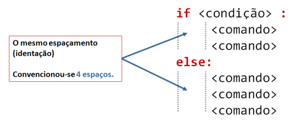
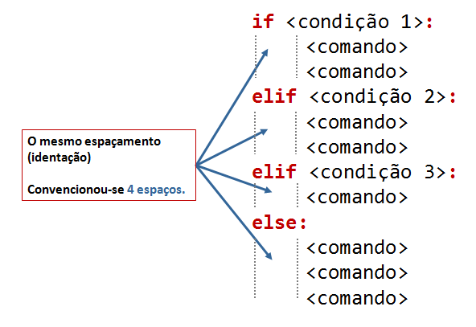

---
jupytext:
  cell_metadata_filter: -all
  formats: md:myst
  text_representation:
    extension: .md
    format_name: myst
    format_version: 0.13
    jupytext_version: 1.10.3
kernelspec:
  display_name: Python 3 (ipykernel)
  language: python
  name: python3
---

# Conceitos básicos

## Programas como textos

Um programa é simplesmente um texto escrito numa linguagem de programação, por exemplo na linguagem Python.

Na linguagem Python, esse texto é interpretável por um computador como um conjunto de "comandos" de "ordens" para serem executados.


Quando "corremos" ou "executamos" um programa essas ordens são executadas (a grande velocidade, diga-se) e o programa produz um resultado.


Os comandos são executados um a um à medida que aparecem no texto ("de cima para baixo"), embora esta ordem possa ser alterada por indicações especiais capazes de **repetir comandos** ou executar **comandos em alternativa**, como veremos mais tarde.

## Objetos e nomes

### Objetos fundamentais: números e *strings*

Para as primeiras impressões sobre a linguagem Python começaremos não por escrever
e executar pequenos programas mas por usar um modo interativo chamado a *Python Shell*.

Neste modo interativo, escrevem-se comandos que são executados imediatamente originando um resultado.

Tendo uma distribuição da linguagem Python instalada, podemos iniciar uma *Python shell* numa
janela de terminal ("linha de comando", "shell").

No sistema Windows, por exemplo, usando a Anaconda Prompt da distribuição Anaconda escrevemos

    python

para iniciar uma *Python shell*.


Como alternativa, podemos iniciar uma aplicação que contem uma *Python shell* chamada *Idle*,
escrevendo

    idle


Reconhece-se a *Python shell* por apresentar

```{code-cell} pycon
>>>
```

a indicar que podemos escrever um comando do Python.
Ao terminar o comando com `Enter` obtemos imediatamente uma resposta.

Vamos experimentar alguns comandos.

Muitas vezes, os comandos da linguagem Python consistem na manipulação daquilo que se designa genericamente por **objetos** (virtuais, claro).

Estes *objetos* são valores que estão representados na memória do computador, num determinado momento durante a execução do programa.

#### Números

Números são uns dos objetos mais fundamentais da linguagem Python. Podemos usar a *Python Shell* como uma calculadora. Experimente estes comandos:


```{code-cell} pycon
:tags: [remove-output]
>>> 45 + 32
77
>>> 3.27 * 0.18
0.5886
>>> (1 + 5**0.5) / 2
1.618033988749895
>>>
```

Numa expressão envolvendo números, podemos usar (vários níveis de) parêntesis curvos `()` e as cinco operações:

`+` adição

`-` subtração

`*` multiplicação

`/` divisão

`**` potenciação

As regras de prioridade são: `**` tem maior prioridade do que `*` `/` que têm maior prioridade do que `+ -`. Em caso de “empate” e sem parêntesis, os cálculos são feitos da esquerda para a direita.

Também útil é o operador `%`, que significa "o resto da divisão por". Por exemplo, `5 % 3` tem como
resultado `2`.

Naturalmente, podemos trabalhar com números com casas decimais, designados genericamente como *números em vírgula flutuante*. 

Na gíria é muitas vezes usada a designação *floats*.


```{code-cell} pycon
:tags: [remove-output]
>>> 4.2 * 0.01
0.042
>>> 4.2 * 1e-2
0.042
>>> 4.2e3 - 2e2
4000.0
```


Note a utilização da representação “de engenharia”, por exemplo `4.2e3`, equivalente a 4.2 x 10<sup>3</sup>.

```{admonition} "Atenção"
:class: warning
Nos números em Python usa-se sempre um ponto decimal `.` (e não uma vírgula)
```

#### *Strings*

Um outro tipo de objetos fundamentais num programa são as *strings*.

Estas são pequenos textos entre `""` ou `''`.

São sequências de caracteres (além das letras, os espaços e pontuação, desde que estejam entre as aspas,
contam como caracteres).

```{code-cell} pycon
:tags: [remove-output]
>>> "Hoje fiquei em casa"
'Hoje fiquei em casa'
>>> 'Mas fiz uns programas'
'Mas fiz uns programas'
>>> "Com muita determinação"
'Com muita determinação'
>>>
```

É indiferente usar `"` ou `'`. Se precisarmos de usar um tipo de aspas "no interior" de uma *string*
podemos usar o outro tipo para delimitar a *string*:


```{code-cell} pycon
:tags: [remove-output]
>>> "Hoje não fui p'rá FCUL"
"Hoje não fui p'rá FCUL"
>>>
```

Podemos "somar" *strings* e multiplicar *strings* por um número inteiro:

```{code-cell} pycon
:tags: [remove-output]
>>> 'Hoje vai' + " chover"
'Hoje vai chover'
>>> "Blá" * 4
'BláBláBláBlá'
>>>
```


Mas não podemos fazer certo tipo de operações entre números e strings:

```{code-cell} pycon
---
tags: [raises-exception, remove-output]
---
>>> 2 + "muito"
Traceback (most recent call last):
  File "<stdin>", line 1, in <module>
    2 + "muito"
TypeError: unsupported operand type(s) for +: 'int' and 'str'
>>>
```


Nem mesmo quando um número é, realmente, uma *string*:

```{code-cell} pycon
---
tags: [raises-exception, remove-output]
---
>>> 4 / "2"
Traceback (most recent call last):
  File "<stdin>", line 1, in <module>
TypeError: unsupported operand type(s) for /: 'int' and 'str'
>>>
```

#### Números complexos

Finalmente, o Python permite usar números complexos.

Usando a letra `j` no fim de um número indicamos a parte imaginária de um número complexo:

```{code-cell} pycon
:tags: [remove-output]
>>> 1j * 1j
(-1+0j)
>>> 2 + 3j + 4 + 7j
(6+10j)
>>> (3 + 2j) * (5 + 1j)
(13+13j)
>>>
```

### Atribuição de nomes a "objetos"

```{admonition} "Nota"
:class: note
Este é um dos mais fundamentais comandos em programação!
```

A forma geral é

    <nome> = <expressão>

Vejamos um exemplo:

```{code-cell} pycon
:tags: [remove-output]
>>> a = 4
>>> b = 3.2
>>> c = a + b
>>> d = c ** 0.5
>>> a
4
>>> b
3.2
>>> c
7.2
>>> d
2.6832815729997477
>>>
```

Numa *Python shell* ou num programa, a atribuição de um nome ao resultado
de uma expressão não produz imediatamente um resultado mas permite dar um nome a um valor
para utilizar mais à frente.

Depois de uma atribuição, **o nome pode ser usado em vez do valor do
objeto (ou resultado de uma expressão)**. Mesmo em atribuições seguintes.

No exemplo anterior, os valores com os nomes `a`e `b` (respetivamente 4 e 3.2) foram
usados no cálculo de uma expressão `a + b` ao qual foi dado o nome `c`.

Um exemplo com *strings*:


```{code-cell} pycon
:tags: [remove-output]
>>> hoje = "Hoje é quinta feira"
>>> mês = "Março"
>>> tudo = hoje + ' e estamos em ' + mês
>>> tudo
'Hoje é quinta feira e estamos em Março'
>>>
```

**Que nomes podemos usar?**

As regras são:

1.  Um nome é uma combinação de letras minúsculas ou maiúsculas (podendo
    ser acentuadas) ou dígitos (0 to 9) ou o *underscore*. Nomes como
    `x`, `Km_1` ou `velocidade_da_reaccao` são exemplos válidos.
    
    

2.  Um nome não pode começar com um dígito. `1x` é inválido, mas `x1` é
    aceitável.
3.  Palavras usadas como comandos da linguagem (*keywords*) não são
    permitidas (por exemplo, `for`). Na documentação do Python pode-se
    encontrar uma [lista](https://docs.python.org/3/reference/lexical_analysis.html#keywords)
    com estas palavras "reservadas".
4.  Não são permitidos espaços ou símbolos como `!, @, #, %` nos nomes.

### Programas e `print()`

Um programa em Python é, como foi dito, uma sequência de comandos
que são executados um a um, a grande velocidade, quando o programa é
executado.

Os exemplos seguintes são baseados em programas e não numa *Python shell*.

Aconselha-se a familiarização com uma aplicação de edição e execução de programas,
por exemplo o *Visual Studio Code*.

Ao contrário de uma *Python shell*, durante a execução de um programa os comandos
**não produzem resultados imediatamente**. Por exemplo, executando este programa:


``` python3
a = 4
b = 3.2
c = a + b
d = c ** 0.5
```

O resultado é o seguinte:

```
 
```

Num programa, podemos **apresentar** o valor que um objeto tem com a
função `print()`.

Um exemplo:

```{code-cell} ipython3
a = 4
b = 3.2
c = a + b
d = c ** 0.5
print(a)
print(b)
print(c, d)
```

Embora este programa faça vários cálculos e atribuições de nome, o resultado visível da execução do programa
resulta das funções `print()`.

Como se viu com a última linha (`print(c,d)`) numa só função `print()` podemos apresentar vários objetos, ou valores associados a nomes ou expressões **separado-os por vírgulas**. No resultado de um programa é inserido um espaço entre as várias partes.

Usando `print()` com *strings*, as aspas são eliminadas.


```{code-cell} ipython3
hoje = "Hoje é quinta feira"
mês = "Março"
tudo = hoje + ' e estamos em ' + mês

print(hoje)
print(mês)
print(tudo)
```

### Alteração dos objetos associados a um nome

Durante a execução de um programa, os objetos associados a um mesmo nome
podem variar:


```{code-cell} ipython3
a = 2
b = 3
c = 'Olá'

b = a + b
a = a + 1
c = a + b

print("a =", a)
print("b =", b)
print("c =", c)
```

Para melhor compreender as mudanças que ocorrem nos valores atribuídos
aos nomes de `a`, `b` e `c` no programa anterior, podemos modifica-lo,
mostrando, com `print()`, os valores atualizados desses nomes, após cada
atribuição. Associe cada `print()` a cada linha do resultado do programa
e compreenda as diferentes alterações dos valores associados a cada nome:


```{code-cell} ipython3
a = 2
b = 3
c = 'Olá'
print("a =", a, "b =", b, "c =", c)

b = a + b
print("a =", a, "b =", b, "c =", c)
a = a + 1
print("a =", a, "b =", b, "c =", c)
c = a + b
print("a =", a, "b =", b, "c =", c)
```

É claro que estas variações de nomes e valores ocorrem muito depressa.

````{admonition} A assimetria de uma atribuição de nome
:class: note
Note-se que um comando de atribuição de nome é compeltamente **assimétrico**.
Do lado esquerdo do `=` fica apenas um nome. Do lado direito fica uma expressão
a calcular, seja ela qual for.

Repare que, em programação, é perfeitamente possível escrever a "falsidade matemática"

```
a = a + 1
```

Não se trata de dizer que o lado esquerdo é igual ao lado direito. Trata-se de calcular
o lado direito e dar o nome que está do lado esquerdo. Estamos a dar uma ordem *usa o valor
de `a`, acrescenta 1 e dá o nome `a` ao resultado*.

Mas, no Python, dá um erro escrever uma coisa como

```
2 * a + 4 = a
```

Resumo: à direita uma expressão,à esquerda o nome a dar ao resultado
````

### Interpolação de valores em *strings* (_"Strings f"_)

As *strings* podem ter valores "interpolados", usando os nomes desses
valores ou expressões. Para isso, usam-se `{}` para identificar em que
sítio da *string* deve ficar cada valor e a *string* deve ter a letra
`f` como prefixo. Um exemplo:


```{code-cell} ipython3
a = 4.8
b = 3.2
c = a + b

print(f'a é igual a {a}, mas b = {b}, enquanto que c = {c}')
```

## Atribuições "múltiplas"

Podemos atribuir vários nomes a vários valores de uma só vez.

Para isso, usamos vários nomes do lado esquerdo do `=` **separados por `,`** e 
várias expressões do lado direito **separadas por `,`**:


```{code-cell} ipython3
# Comentários começam por #

# Podemos dar nomes a vários objetos
# de uma só vez:
a, b  =  3, "experiência"

print(f"a = {a} b = {b}")
```

Mais tarde veremos uma generalização desta técnica muito útil.

Já agora, linhas começadas por `#` são *comentários*.

Comentários são linhas completamente ignoradas durante a execução de um programa.
Servem como notas importantes deixadas para que o autor do programa ou outras pessoas
possam mais tarde, ao ler o programa, melhor comprender o que um programa está a fazer.


```{code-cell} ipython3
a, b  =  3, "experiência"

print(f"a = {a} b = {b}")

# print() deixa uma linha de intervalo
print()

a, b = 3, 4
print(f"a = {a} b = {b}\n")

# Podemos trocar dois nomes desta maneira
a, b = b, a
print('Depois de trocar a e b...')
print(f"a = {a} b = {b}")
```

Nota: quando numa *string* aparece o caractere "especial" `\n`, este
provoca uma linha suplementar quando a *string* é apresentada com a
função `print()`.

## Funções e módulos

### Funções "integradas" na linguagem

#### `abs`, `int`

Além da função `print()`, as funções `int()`, que calcula a parte inteira de 
um número e `abs()`, que calcula o valor absoluto (módulo) de um número, fazem parte
integrante da linguagem Python.


```{code-cell} ipython3
numero = -3.8
x = int(numero)
y = abs(numero)

print(numero, '\n')
print(x)
print(y)
```

Podemos encontrar a lista destas funções na documentação oficial da
linguagem Pyhton:

[Python Built-in functions](https://docs.python.org/3/library/functions.html)

### Conversão entre tipos de objetos

#### `int`, `float`, `complex` e `str`

As funções `int()`, `float()`, `complex()` e `str()` fazem conversões
para os vários **tipos** de objetos:

-   **inteiros**
-   *floats*
-   **complexos** (em que `j` é a unidade imaginária)
-   *strings*

```{code-cell} ipython3
x = 3.8

print(x,'\n')
print(int(x))
print(complex(x))
print(str(x))
```

```{code-cell} ipython3
s = '3.4e4'
f = float(s)
c = complex(s)

print(s, '\n')
print(f)
print(c)
```

As conversões nem sempre são possíveis...

```{code-cell} ipython3
---
tags: [raises-exception]
---
s = 'Vamos ver...'
print(s, '\n')

print(float(s))
```

## Módulos: funções adicionais

Além das funções integradas, existem muitos **módulos** contendo funções
adicionais.

Estes módulos têm de ser *importados* para que as funções fiquem
disponíveis.

Um exemplo é o módulo **math** que contem muitas funções (e algumas
constantes) matemáticas:

```{code-cell} ipython3
import math

x = 2.0

y = math.log(x)
print('ln(2.0) =', y)

y = math.log10(x * 5)
print('ln10(2.0 * 5) =', y)

y = math.exp(x)
print('exp(2.0) =', y)

y = math.sin(x)
print('sin(2.0) =', y)
```

```{code-cell} ipython3
y = math.sin(math.radians(90))
print('sin(90°) =', y)

print('pi =', math.pi)

print('e =', math.e)

y = math.sin(math.pi / 2.0)
print('sin(π / 2) =', y)
```

```{code-cell} ipython3
y = math.factorial(100)
print('100! =', y)
```

[Leitura interessate sobre o módulo `math`](https://realpython.com/python-math-module/)

Um outro exemplo é o módulo **calendar** que contem muitas funções
relacionadas com datas e calendário.

Um exemplo é a função `weekday()`, que, ao ser dado um ano, mês e dia,
calcula um número que representa o dia da semana. (0 - seg, 1 - ter, 2 -
qua, 3 - qui, 4 - sex, 5 - sab, 6 - dom)

```{code-cell} ipython3
import calendar

print(calendar.weekday(2017, 3, 30))
#nota: 0:seg 1:ter 2:qua 3:qui 4:sex 5:sab 6:dom
```

Outro exemplo é a função `calendar()`, que constrói uma *string* com um
calendário de um determinado ano:


```{code-cell} ipython3
import calendar
print(calendar.calendar(2022))
```

## Exemplo: Raízes da equação do 2º grau

Calcular as soluções da equação do 2º grau

$a x^2 + b x + c = 0$

ou seja

Dados $a, b$ e $c$, calcular

$x_1 = \frac{-b + \sqrt{b^2 -4 a c}}{2 a}$ e
$x_2 = \frac{-b - \sqrt{b^2 -4 a c}}{2 a}$

```{code-cell} ipython3
print('Este programa calcula x tal que a x2 + b x + c = 0')
# testar com os seguintes valores (1,4,1) , (1,2,1) , (1,1,1)

a = 1
b = 4
c = 1

rdelta = (b**2.0 - 4.0 * a * c) ** 0.5

x1 = (- b + rdelta) / (2.0*a)
x2 = (- b - rdelta) / (2.0*a)

print(f"Para a = {a}, b = {b}, c = {c}\n")
print("x1 =", x1)
print("x2 =", x2)
```

Da matemática, sabemos que uma equação do segundo grau pode ter 2
soluções reais, uma solução real "dupla", ou duas soluções complexas,
que neste caso serão complexos conjugados.

Podemos correr o programa várias vezes, para diferentes valores de $a$,
$b$, $c$, tentando obter as três situações. Ao fazer isto estamos a
**testar** o programa.

Para fazer estes testes, basta modificar as linhas que definem os
valores para `a`, `b` e `c` e voltar a executar o program.

Com a = 1, b = 4, c = 1:

    x1 = -0.2679491924311228
    x2 = -3.732050807568877

Com a = 1, b = 2, c = 1:

    x1 = -1.0
    x2 = -1.0

Com a = 1, b = 1, c = 1:

    x1 = (-0.49999999999999994+0.8660254037844386j)
    x2 = (-0.5-0.8660254037844386j)

O programa funciona e parece dar resultados corretos para as três
situações pretendidas (embora se note um pequeno erro no caso das duas
soluções complexas que deveriam ser, exatamente, dois complexos
conjugados).

No entanto, seria mais adequado se o programa pudesse apresentar uma
pequena mensagem que indicasse em qual das três situações está o
resultado (2 soluções reais ou uma solução real dupla ou duas soluções
complexas).

(Podemos também tentar corrigir o pequeno erro).

Para isto, o programa deve ter um **comportamento diferente**, consoante
o tipo de resultado.

Da matemática, sabemos que o que define o tipo de resultado é o valor do
"discriminante", $\Delta = b^2 - 4 a c$.

-   quando $\Delta > 0$ temos duas soluções reais.
-   quando $\Delta = 0$ temos uma solução real (solução dupla).
-   quando $\Delta < 0$ temos duas uma soluções complexas (complexos
    conjugados).

Podemos reescrever o programa de modo a realizar o cálculo das soluções
e apresentar uma mensagem de um modo diferente, consoante o valor de
$\Delta$ ?

## Execução alternativa

### Alternativa `if...else`

A linguagem Python permite a execução **alternativa** de blocos de
comandos.

Continuando com o exemplo anterior, vamos primeiro distinguir o caso das
soluções reais ($\Delta \geqslant 0$) do caso das soluções complexas
($\Delta < 0$).

```{code-cell} ipython3
# Este programa calcula x tal que a x2 + b x + c = 0
# testar com os seguintes valores (1,4,1) , (1,2,1) , (1,1,1)

a, b, c = 1, 1, 1
print(f"Para a = {a}, b = {b}, c = {c}\n")

# cálculo do discriminante
delta = b**2 - 4.0 * a * c

# separar soluções reais das complexas
if delta < 0.0:
    r_delta = (-delta)**0.5 * 1j
    print('Soluções complexas:')
else:
    r_delta = (delta)**0.5
    print('Soluções reais:')

x1 = (- b + r_delta) / (2.0 * a)
x2 = (- b - r_delta) / (2.0 * a)

print("x1 =", x1, ", x2 =", x2)
```

Testando agora o programa para as três situações possíveis:

$\Delta > 0$:

    a = 1 b = 4 c = 1 

    Soluções reais:
    x1 = -0.2679491924311228 , x2 = -3.732050807568877

$\Delta = 0$:

    a = 1 b = 2 c = 1 

    Soluções reais:
    x1 = -1.0 , x2 = -1.0

$\Delta < 0$:

    a = 1 b = 1 c = 1 

    Soluções complexas:
    x1 = (-0.5+0.8660254037844386j) , x2 = (-0.5-0.8660254037844386j)

O programa funciona, agora, sem problemas.

É feito um teste ao valor de `delta` à frente do comando `if` e é
executado **um** de dois blocos alternativos:

-   as linhas entre `if` e `else:`, caso `delta` seja negativo, ou
-   as duas linhas depois de `else:`, caso `delta` seja positivo.

A forma geral de incluir **blocos alternativos** com `if...else` é:

    if <condição> :
        <comandos para condição verdadeira>
    else:
        <comandos para condição falsa>

Podemos ter várias linhas no bloco `if` e no bloco `else`.

É o **alinhamento** das linhas do programa (também chamada identação)
que define define os dois blocos:



Note-se que, no programa anterior, as linhas

    x1 = (- b + r_delta) / (2.0 * a)
    x2 = (- b - r_delta) / (2.0 * a)

já **não pertencem** ao bloco `else`. Isto porque o seu alinhamento é
(de novo) igual ao de todas as outras linhas fora dos blocos `if...else`
(e estão alinhadas com as próprias linhas dos comandos `if` e `else`)

NOTA: no teste da condição podemos usar os operadores seguintes:

|operador |significado|
|---------|-----------|
|`>`      | maior     |
|`<`      | menor     |
|`>=`     | maior ou igual|
|`<=`     | menor ou igual|
|`==`     | igual a (Nota: **são dois sinais de igual consecutivos**)|
|`!=`     | diferente de|

E podemos combinar condições com operações lógicas:

NOTA: no teste da condição podemos usar:

|operador |significado|
|---------|-----------|
|`and`    | conjunção (*e*)      |
|`or`     | disjunção (*ou*)     |
|`not`    | negação   (*não*)    |


Existem também em Python duas "constantes" booleanas:

|Constante |significado|
|----------|-----------|
|`True`    | Verdade     |
|`False`   | Falsidade   |

(note-se que `True` e `False` começam por maiúsculas)

O programa está bem melhor na maneira de apresentar os resultados,
separando o caso real do complexo.

Mas, perfeito, perfeito, seria tratar o caso em que $\Delta = 0$ de uma
forma diferente, tendo o cuidado de apresentar **um único valor, no caso
de uma raíz dupla**.

Precisamos, para isso, que o programa possa se adaptar a cada uma das
**três alternativas**.

### Alternativas `if...elif...else`

Usando o comando `elif` podemos testar **mais do que uma condição** e
executar em alternativa e, consequentemente, **mais do que dois blocos**
de comandos.

Seguindo o exemplo da resolução de uma equação do segundo grau, podemos
separar os três casos associados ao valor de $\Delta$ da seguinte forma:

```{code-cell} ipython3
# Este programa calcula x tal que a x2 + b x + c = 0
# testar com os seguintes valores (1,4,1) , (1,2,1) , (1,1,1)

a, b, c = 1, 4, 1
print(f"Para a = {a}, b = {b}, c = {c}\n")

# cálculo do discriminante
delta = b**2 - 4.0 * a * c

if delta < 0.0:
    print('Soluções complexas:')
    r_delta = (-delta)**0.5 * 1j
    x1 = (- b + r_delta) / (2.0 * a)
    x2 = (- b - r_delta) / (2.0 * a)    
    print("x1 =", x1, ", x2 =", x2)
elif delta > 0:
    print('Soluções reais:')
    r_delta = (delta)**0.5
    x1 = (- b + r_delta) / (2.0 * a)
    x2 = (- b - r_delta) / (2.0 * a)    
    print("x1 =", x1, ", x2 =", x2)
else:
    print('Solução real (dupla):')
    x = -b / (2.0 * a)
    print("x =", x)
```

O comando `elif` é uma abreviatura de *else* + *if* e possibilita o
teste de uma nova condição para além daquela já usada no comando `if`.

Podem ser usados **vários comandos** `elif`.

E note-se que, mais uma vez, podemos ter várias linhas em cada bloco : o
**alinhamento** (*identação*) define os blocos:



Testando agora o programa para as três situações possíveis:

$\Delta > 0$:

    a = 1 b = 4 c = 1 

    Soluções reais:
    x1 = -0.2679491924311228 , x2 = -3.732050807568877

$\Delta = 0$:

    a = 1 b = 2 c = 1 

    Solução real (dupla):
    x = -1.0

$\Delta < 0$:

    a = 1 b = 1 c = 1 

    Soluções complexas:
    x1 = (-0.5+0.8660254037844386j) , x2 = (-0.5-0.8660254037844386j)

Pode ser usado todo um conjunto de blocos `if...else...` **"dentro"** de
um bloco `if` ou `elif` ou `else`.

Por exemplo, o o programa também poderia ser escrito da seguinte forma:

```{code-cell} ipython3
# Este programa calcula x tal que a x2 + b x + c = 0
# testar com os seguintes valores (1,4,1) , (1,2,1) , (1,1,1)

a, b, c = 1, 4, 1
print(f"Para a = {a}, b = {b}, c = {c}\n")

# cálculo do discriminante
delta = b**2 - 4.0 * a * c

if delta == 0.0:
    print('Solução real (dupla):')
    x = -b / (2.0 * a)
    print("x =", x)
else:
    if delta < 0:
        print('Soluções complexas:')
        r_delta = (-delta)**0.5 * 1j
    else:
        print('Soluções reais:')
        r_delta = (delta)**0.5

    x1 = (- b + r_delta) / (2.0 * a)
    x2 = (- b - r_delta) / (2.0 * a)    
    print("x1 =", x1, ", x2 =", x2)
```

Algumas notas:

NOTA: o bloco `else` não é obrigatório. Se não fizer sentido a
existência de uma condição alternativa ao `if`, este bloco pode ser
omitido.

Vejamos agora um outro exemplo da utilização de blocos alternativos.

**Exemplo: Regra dos anos bissextos**

-   Se o ano é divisível por 4, então é bissexto

Regra em vigor até 1582 (calendário Juliano, de Júlio César)

```{code-cell} ipython3
# Este programa determina de um ano é bissexto
# Testar com 2015 N, 2012 S, 1900 N, 2000 S

a = 2015

if a % 4 == 0:
    print(a , "é bissexto")
else: 
    print(a, "não é bissexto")
```

Correndo o programa com diferentes valores de a:

    2015 nao é bissexto

    2012 é bissexto

    1900 é bissexto

    2000 é bissexto

Este programa parece falhar para 1900. Isto acontece porque, na
realidade, a regra actual dos anos bissextos é um pouco mais complexa.

**Exemplo: Regra dos anos bissextos (calendário moderno)**

-   Se o ano é divisível por 4, então é bissexto
-   Excepto os que são divisíveis por 100: não são bissextos
-   Excepto os divisíveis por 100 que sejam exactamente divisíveis por
    400: são bissextos.

Esta regra entrou em vigor após 1582 (calendário Gregoriano, do papa
Gregorio XIII)

Da aplicação desta regra resulta que alguns anos de mudança de século
(sempre divisíveis por 4) não sejam bissextos. É o caso de 1900. E
alguns anos de mudança de século, por exemplo os anos 1600; 2000; 2400,
sejam bissextos.

Podemos adaptar o programa anterior para incluir as duas últimas regras:

```{code-cell} ipython3
a = 2015

if a % 4 == 0 and not (a % 100 == 0 and not a % 400 == 0):
    print(a , "é bissexto")
else: 
    print(a, "não é bissexto")
```

Correndo o programa com diferentes valores:

    2015 nao é bissexto

    2012 é bissexto

    1900 nao é bissexto

Reparar que o resultado é diferente para 1900.

    1900 não é bissexto

Os interessados na história da introdução do calendário gregoriano podem
consultar o artigo

<http://en.wikipedia.org/wiki/Gregorian_calendar>

É desaconselhável escrever uma condição tão complicada num comando `if`:
prejudica muito a legibilidade do programa.

Um programa equivalente, combinando vários blocos de `if...else...` e a
negação lógica `not` que será (possivelmente) mais fácil de perceber é:

```{code-cell} ipython3
a = 2015

if not a % 4 == 0:
    print(a, "não é bissexto")
else:
    if not a % 100 == 0:
        print(a , "é bissexto")
    else:
        if a % 400 == 0:
            print(a , "é bissexto")
        else:
            print(a , "não é bissexto")
```

Correndo o programa com diferentes valores de a:

    2015 não é bissexto
    2012 é bissexto
    1900 não é bissexto
    2000 é bissexto

## Função `input()`


Até agora, nos exemplos foram apresentados, são incluídos no programa os
valores a partir dos quais se fazem os cálculos (tradicionalmente
chamados o *input* do programa).

Por exemplo, nos exemplos da resolução de uma equação do segundo grau
incluímos no princípio do programa os valores dos coeficientes:

    a, b, c = 1, 4, 1

Os programas partem destes valores, realizam cálculos e apresentam
resultados.

A linguagem Python suporta também um outro mecanismo: **o pedido de
valores ao** *utilizador* durante a execução do programa.

A função `input()` tem este papel: durante a execução de um programa, ao
passar por uma função `input()` o programa pára esperando que seja
introduzido uma *string*. A função permite também seja apresentada uma
mensagem de indicação do que está a ser pedido.

Vejamos com um exemplo:

```{code-cell} ipython3
:tags: [raises-exception, remove-stderr, remove-output]
a = input('Valor de a? ')
b = input('Valor de b? ')
c = input('Valor de c? ')

a = float(a)
b = float(b)
c = float(c)

# cálculo do discriminante
delta = b**2 - 4.0 * a * c

if delta == 0.0:
    print('Solução real (dupla):')
    x = -b / (2.0 * a)
    print("x =", x)
else:
    if delta < 0:
        print('Soluções complexas:')
        r_delta = (-delta)**0.5 * 1j
    else:
        print('Soluções reais:')
        r_delta = (delta)**0.5

    x1 = (- b + r_delta) / (2.0 * a)
    x2 = (- b - r_delta) / (2.0 * a)    
    print("x1 =", x1, ", x2 =", x2)
```

Executando este programa várias vezes, testando com os diferentes
casos, agora os valores dos coeficientes são "pedidos" pelo programa:

```
Valor de a? 1
Valor de b? 4
Valor de c? 1
Soluções reais:
x1 = -0.2679491924311228 , x2 = -3.732050807568877
```

```
Valor de a? 1
Valor de b? 2
Valor de c? 1
Solução real (dupla):
x = -1.0
```

```
Valor de a? 1
Valor de b? 1
Valor de c? 1
Soluções complexas:
x1 = (-0.5+0.8660254037844386j) , x2 = (-0.5-0.8660254037844386j)
```
