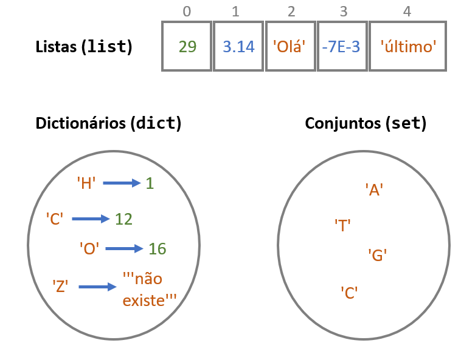
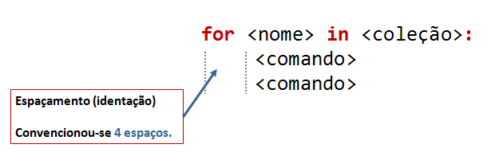

---
jupytext:
  cell_metadata_filter: -all
  formats: md:myst
  text_representation:
    extension: .md
    format_name: myst
    format_version: 0.13
    jupytext_version: 1.10.3
kernelspec:
  display_name: Python 3 (ipykernel)
  language: python
  name: python3
---

# Coleções e iterações

## Revisão sobre objetos

No capítulo anterior vimos que uma parte importante de um programa
consiste na criação e modificação dos valores de "objetos".

Estes objetos são, na verdade, representados na memória do computador. O
acesso a estes objetos é feito à custa de um *nome*.

A linguagem Python suporta uma variedade de tipos de objetos, dos quais
já vimos os números e as *strings*.

```{code-cell} ipython3
n_aminoácidos = 20 # número inteiro
bases = 'AUCG' # string

print(f'Existem {n_aminoácidos} e as bases do mRNA são {bases}')
```

## Coleções

Este capítulo diz respeito a objetos designados genericamente por
"coleções".

```{admonition} Definição
:class: info
Coleções são objetos que contêm mais do que um valor.
```

As principais coleções usadas em Python são:

- **listas**
- **dicionários**
- **conjuntos**

Mas convém também englobar as *strings*, vistas no capítulo anterior, neste universo das coleções, uma vez
que partilham muitas das propriedades com as coleções acima referidas:

- **strings**

Uma definição muito breve e simples destas 3 coleções:



Uma lista (em inglês, *list*) é uma coleção de elementos em que cada um deles tem, implicitamente, uma *posição*.
Estas posições estão numeradas a partir de zero. A posição de um elemento chama-se *índice*.

Um dicionário (em inglês, *dictionary*) é uma coleção obtida pela associação de "chaves" a "valores". Cada elemento de um dicionário tem uma chave e um valor. Não existe uma ordenação implícita num dicionário, mas as chaves, que não se repetem,
têm um papel análogo aos índices das listas.

Um conjunto (em inglês, *set*) é apenas uma coleção de elementos que não se repetem, sem posições ou chaves. E, para já, não há mais nada a dizer sobre os conjuntos.

A criação explícita destas coleções num programa é feita desta maneira:

```{code-cell} ipython3
uma_lista = [2, 4, 3.1415, 'eu aqui', 1j, "fim da lista"] # lista

um_dict = {'H': 1 , 'Li': 3, 'Na': 11, 'K': 19}  # dicionário

um_set = {'A', 'T', 'C', 'G'}  # conjunto

s = 'Eu sou uma pequena string' # string
```

Vejamos particularmente cada tipo diferente de coleções.

### Listas

As listas são uma das coleções da linguagem Python mais usadas.

Vejamos como definir listas.

São usados `[]` para definir, de uma forma literal, uma lista, separando os elementos por `,`.

```{code-cell} ipython3
vários = [2, 4, 3.1415, 'eu aqui', "fim da lista"]

print(vários)
```

As listas são objetos e, por isso, podemos atribuír-lhes nomes. Como se pode ver no exemplo, foi atribuído o nome
`vários` a **toda a lista**. Este é um facto importante: um único nome serve para nos referirmos a toda a lista na sua globalidade.

As listas podem ter elementos de vários tipos, (números, *strings*, números complexos) e estes elementos podem
até ser o resultado de expressões:

```{code-cell} python3
a = [19, 14/2, 5.0**3, 'Bom dia']
b = 1
c = [b, b+1, (b+2)**3]

print('a =', a)
print('c =', c)
```

Neste exemplo, a lista `a` contem 3 números e uma *string*. O valor de
dois dos números é o resultado de uma expressão.

Note-se, também, que na lista `c` os valores dos elementos são
calculados usando o valor atribuído ao nome `b` para calcular os
elementos da lista.

### Função `list()`

Além da criação literal e explícita de uma lista, a função `list()` permite transformar objetos de outros tipos em listas, se fôr possível:

```{code-cell} python3
# transformação de uma string numa lista
seql = list('ATGGTCAAACTTGTT')

print(seql)
```

### Indexação de listas

Uma propriedade fundamental das listas é que a ordem dos elementos tem
significado e cada um deles tem, implicitamente, uma posição, o seu *índice*.

Num programa podemos nos referir a **um só elemento** da lista a partir da sua posição,
fazendo uma "**indexação**" da lista com um número inteiro.

Um exemplo:

```{code-cell} ipython3
a = [19, 14/2, 5.0**3, 'Bom dia']
#    0    1      2        3

print(a[0])
print(a[1])
print(a[2])
print(a[3])
```

Neste exemplo, cada `print()` mostra um elemento diferente da lista.

Com uma indexação, obtemos o elemento que está na posição *i* de uma lista escrevendo

    <nome da lista>[i]

Isto é, usamos também aqui `[]` para indexar a lista, mas à frente do nome da lista.

Até podemos nem dar nome a uma lista. Podemos indexar logo a seguir à definição:

```{code-cell} ipython3
dias_abril = [31, 28, 31, 30, 31][3]

print(dias_abril)
```

Nota: os primeiros `[]` estão a definir a lista e os segundos `[]` a indexar a lista, obtendo o elemento que está na posição 3.

```{admonition} As posições variam em que intervalo?
:class: hint
As posições **começam de zero** e vão até $n-1$ em que $n$ é o número de elementos da lista.

São sempre números inteiros.
```

### Dicionários

```{admonition} Definição
:class: info
Dicionários são **associações** entre _chaves_ e _valores_.
```

``` python3
d = {'H': 1, 'Li': 3, 'Na': 11, 'K': 19}
```

Neste exemplo,

`'H'`,`'Li'`,`'Na'`,`'K'`, são as **chaves** do dicionário

`1`, `3`, `11`, `19`, são os respetivos **valores**

Na definição de um dicionário

- são usadas `{}` para delimitar o dicionário
- são usadas `,` para separar cada par *chave: valor*
- são usados `:` para separar a *chave* do *valor* dentro de cada par.

### Indexação de dicionários

Ao contrário das listas, os elementos não têm posições, mas um dicionário pode ser
"**indexável**" utilizando as *chaves* para obter os respetivos valores:

```{code-cell} ipython3
d = {'H':1, 'Li':3, 'Na':11, 'K':19}

print('d =', d)

print(d['K'])
print(d['Li'])
```

Para indexar um dicionário, obtemos o elemento que tem a chave *k* escrevendo

    <nome do dicionário>[k]

Isto é, usamos também aqui `[]` para indexar os dicionários.

Podemos até indexar logo a seguir a definir o dicionário:

```{code-cell} ipython3
n_K = {'H':1, 'Li':3, 'Na':11, 'K':19} ['K']

print('Número atómico do potássio é', n_K)
```

### Strings e indexação de strings

Vimos as *strings* no capítulo anterior. Porquê introduzir aqui, num capítulo dedicado às coleções, as *strings* de novo?

```{admonition} Definição
:class: info
As _strings_ podem ser entendidas como uma **coleções de caracteres** (letras, símbolos, pontuação, espaços, números)
```

As *strings* são aparentadas com as listas: as _strings_ também têm uma numeração das posições dos caracteres, a contar do zero, e também são "indexáveis", isto é, podemos obter o caracter que está numa determinada posição, usando `[]`.

```{code-cell} ipython3
s = 'Eu sou uma pequena string'
#    0123456789

print(s[0])
print(s[3])
print(s[8])
```

Note-se que os espaços contam como caracteres.

### Conjuntos

Um conjunto (*set*) é uma coleção com características simples: é uma coleção de elementos sem chaves e sem posições.

```{code-cell} ipython3
aminoácidos = {'I', 'Y', 'P', 'W', 'C', 'M', 'R', 
               'L', 'K', 'H', 'V', 'D', 'F', 'N', 
               'S', 'T', 'A', 'G', 'Q', 'E'}

print(aminoácidos)
```

Ao definir um conjunto usamos `{}` para delimitar e separamos os elementos por `,`

A utilidade dos conjuntos torna-se mais clara sabendo que eles suportam operações típicas dos conjuntos da matemática, por exemplo a interseção e a reunião. Mais tarde veremos alguns exemplos.

Os conjuntos **não** são indexáveis.

Mas, uma curiosidade, não aceitam elementos repetidos:

```{code-cell} ipython3
bases = {'A', 'A', 'C', 'C', 'U', 'G'}

print(bases)
```

### `len()` e operador `in`

Apesar da especificidade de cada tipo de coleção, há três funcionalidades que são comuns a todas as
coleções:

-   determinar o número de elementos de uma coleção, com a função
    `len()`
-   testar se um valor faz parte de uma coleção, com o operador `in`
-   aplicar um conjunto de comandos a todos os elementos de uma coleção,
    uma a um, com o comando `for`

Comecemos pelas duas primeiras:

A função `len()` (abreviatura da palavra inglesa *length*) pode ser **aplicada a qualquer coleção**, tendo como resultado o 
**número de elementos** contidos nessa coleção.

```{code-cell} python3
a = [2,4,6,8,10, 'viria o 12', 'e depois o 14'] # lista
s = 'Eu sou uma pequena string' # string
d = {'H':1, 'Li':3, 'Na':11, 'K':19} # dicionário

print(len(a))
print(len(s))
print(len(d))
```

Repare-se que, no caso das *strings* todos os caracteres entram para a contagem como elementos da *string*. No caso dos dicionários, contamos o número de pares *chave: valor*.

Para objetos que definimos explicitamente a função `len()` não parece ter muita utilidade.

Imagine um programa maior, capaz de processar um número elevado de sequências de proteínas. O comprimento de uma proteína é uma característica importante. A função `len()` seria uma ferramenta importante num programa desses.

```{code-cell} python3
seq = 'MSSLVTLNNGLKMPLVGLGCWKIDKKVCANQIYEAIKLGYRLFDGACDYGNEKEVGEGIR'

print(f'A proteína\n{seq}')
print('tem', len(seq), 'aminoácidos')
```

O "operador" `in` funciona como teste de inclusão: resulta `True`ou `False` consoante um
elemento está ou não contido numa coleção. Funciona com qualquer tipo de coleção.

```{code-cell} ipython3
nums = [1,2,3,4,5,6,7,8,9,10]
if 4 in nums:
    print(4, 'existe')
else:
    print(4, 'não existe')
```

Um exemplo com *strings*:

```{code-cell} ipython3
seq = 'ATGGTCAAACTTGTTGACTGCAAATGCGTACGT'

if 'U' in seq:
    print('Existe', 'U')
else:
    print('Não existe', 'U')

if 'TGT' in seq:
    print('Existe', 'TGT')
else:
    print('Não existe', 'TGT')
```
Repare-se no segundo exemplo: posso testar se existe uma *string* com mais do que um caracter.

Com dicionários, é verificado se um elemento está **nas chaves** ( e não nos valores):

```{code-cell} python3
grupo1 = {'H':1, 'Li':3, 'Na':11, 'K':19}

print('Mg' in grupo1)
```

### Funções de listas, dicionários e conjuntos

Nos próximos dois capítulos serão apresentadas funções "associadas" a cada um destes tipos de coleções.
São estas funções que tornam a utilização de coleções muito poderosas.

Estas funções têm a forma geral

    coleção.função(argumentos)

Vejamos, desde já, um pequeno exemplo: a função `.count()`, que pode ser usada com listas e *strings*, conta número de elementos (ou caracteres).

```{code-cell} ipython3
# Quantas glicinas existem nesta sequência?
seq = 'MSSLVTLNNGLKMPLVGLGCWKIDKKVCANQIYEAIKLGYRLFDGACDYGNEKEVGEGIR'
nG = seq.count('G')
print(nG, 'glicinas')

# Quantos meses do ano têm 30 dias?
n_dias = [31, 28, 31, 30, 31, 30, 31, 31, 30, 31, 30, 31]
n30 = n_dias.count(30)
print(n30, 'meses têm 30 dias')
```

As restantes funções serão o foco dos dois próximos capítulos (não todas) mas aqui vai a referência para as funções disponíveis na documentação do Python, em <docs.pyhton.org>:

[Funções de listas](https://docs.python.org/3/tutorial/datastructures.html#more-on-lists)

[Funções de *strings*](https://docs.python.org/3/library/stdtypes.html#string-methods)

[Funções de dicionários](https://docs.python.org/3/library/stdtypes.html#mapping-types-dict)

[Funções de conjuntos](https://docs.python.org/3/library/stdtypes.html#set)

As funções de *strings* são, de longe, as mais numerosas.

Algo trivial é comum a todas as coleções: a possibilidade de criarmos "coleções vazias"

## Coleções vazias

Coleções vazias são simplesmente coleções sem nenhum elemento. Podemos criá-las explicitamente
desta forma:

```{code-cell} ipython3
# lista vazia
a = []

# string vazia
s = ''

# dicionário vazio
d = {}

# conjunto vazio
c = set()

print(a)
print(s)
print(d)
print(c)
```

````{admonition} Nota
:class: note
O que aconteceu à *string* vazia?

A função `print()` tira as aspas quando apresenta *strings*, logo, aparentemente não
apareceu a *string* (embora haja uma mudança de linha)

Porque temos de usar `set()` para o conjunto vazio?

Porque `{}` já está reservado para os dicionários vazios. Mas, recorde-se que
para definir explicitamente um conjunto usamos `{}` para delimitar o conjunto:

```python3
c = {6, 9, 'A', 'T'}
```

Mas não usamos pares chave:valôr entre `{}`. Isso seria um dicionário.

````

A utilidade destas versões vazias é clara: muitas vezes num programa precisamos de começar por
com um coleção vazia para depois, ao longo do programa, ir acrescentando elementos.

## Listas em compreensão

Existe uma outra forma muito conveniente e compacta de construír listas num programa,
as **listas em compreensão**.

Esta forma assemelha-se à notação matemática de descrever um conjunto através do seu
"termo geral".

A ideia é obter uma lista pela transformação de uma outra lista de partida,
indicando uma expressão para essa transformação. Essa expressão indica a operação a efectuar a cada elemento da lista de partida.

Um exemplo mostra a notação a usar:

```{code-cell} ipython3
# Potências de 2 numa lista:
potências2 = [2**n for n in [0, 1, 2, 3, 4 ,5, 6, 7, 8]]

print(potências2)
```

Um outro exemplo

```{code-cell} ipython3
# Iniciais de palavras
palavras = ['Hoje', 'é', 'quarta', 'e', 'estamos', 'em', 'Abril']

iniciais = [p[0] for p in palavras]

iniciais
```

## `range()`

```{admonition} Problema
:class: hint
Somar todos os números de 1 a 1000
```

Poderíamos adaptar o programa anterior. Mas teríamos de 
criar uma lista com 1000 números consecutivos, explicitamente
(e manualmente).

Tem de haver uma solução melhor.

Usamos para o efeito a função `range()` que gera números inteiros
consecutivos e pode ser utilizada em vez de uma coleção no comando `for`:

```{code-cell} ipython3
s = 0

for i in range(1, 1001):
    s = s + i

print('a soma dos números de 1 a 1000 é', s)
```

A função `range()`, que pode ter até 3 argumentos,
`range(início, fim, passo)`, e gera uma sequência de **números inteiros**, desde um número inteiro inicial (o
*início*) até um número inteiro final **exclusivé** (o *fim*), com um
determinado espaçamento (o *passo*).

```{admonition} Notas
:class: note
O número inicial e o "passo" são opcionais.

Se forem omitidos,

- o início é 0
- o passo é 1

Não esquecer que o valor do `fim` **é excluído**
```

Para melhor compreender estas regras, podemos mostrar os
resultados da função `range()` não num ciclo `for`, mas transformando
os resultados do `range()` numa lista.

Como fazê-lo? O Python tem uma outra função, `list()`, que tenta transformar
o seu argumento numa lista, se possível.

Um pequeno exemplo da função `list()` em ação:

```{code-cell} python3
seq = 'ATGGTCAAACTTGTT'
seql = list(seq)
print(seql)
```

Voltando agora às várias modalidades da função `range()`:


```{code-cell} python3
print('-- range(12) ----------')
# começa em 0, acaba em 12 (exclusivé),  e salta de 1 em 1.

nums = list(range(12))
print(nums)
```

```{code-cell} ipython3
print('-- range(5, 12) ----------')
# começa em 5, acaba em 12 (exclusivé).

nums = list(range(5, 12))
print(nums)
```

```{code-cell} ipython3
print('-- range(5, 12, 2) ----------')
# começa em 5, acaba em 12 (exclusivé) e salta de 2 em 2.

nums = list(range(5, 12, 2))
print(nums)
```

Continuando com os exemplos das listas em compreensão:

```{admonition} Problema
:class: example
Obter uma lista com numeros ímpares (os primeiros 10)

```

```{code-cell} ipython3
ímpares = [2*i+1 for i in range(10)]

print(ímpares)
```

Em resumo, entre`[]` indica-se, em primeiro lugar, um "termo geral", neste caso `2*i+1`. De seguida e um comando `for` para passar pelos elementos do `range()` ou da lista de partida. À frente do `for`, o nome `i` tem o mesmo papel que nos comandos `for` "normais", é o nome a dar a cada elemento de partida, um a um.

Tudo está entre `[]`, para indicar que estamos a construír uma lista.

Esta maneira pode também ser vista como uma substituição da construção de listas novas com `append()`,
começando a partir de uma lista vazia. A lista em compreensão que acabámos de ver é equivalente
a fazer o seguinte:

```{code-cell} ipython3
ímpares = []
for i in range(10):
    ímpares.append(2 * i + 1)
```

Um outro exemplo:

```{admonition} Problema
:class: example
Obter uma lista com os quadrados perfeitos entre 400 e 800.
```

Este exemplo mostra que podemos, numa lista em compreensão, impôr condições (com `if`) aos valores
da lista, "filtrando" certos elementos.

```{code-cell} ipython3
quads = [i**2 for i in range(30) if i**2 > 400 and i**2 < 800]

print(quads)
```

Revisitando um exemplo anterior, mas agora usando listas em compreensão:

```{admonition} Problema
:class: example
Obter uma lista com as diferenças sucessivas entre quadrados perfeitos, para mostrar que são os números ímpares

```

```{code-cell} ipython3
q = [i**2 for i in range(20)]
difs = [q[i] - q[i-1] for i in range(1, len(q))]

print('Quadrados: ', q)
print('\nDiferenças:', difs)
```

Note-se a maneira muito compacta de resolver o problema. Duas lista em compreensão foram suficientes.

Note-se a analogia com a notação matemática de indicar um conjunto "em compreensão"

```{code-cell} ipython3
q = [i**2 for i in range(20)]
```

e

$q = \{i^2 : i=0, 1, 2, ... ,20 \}$

Mais um exemplo. A função `.remove()` retira a primeira ocorrência de um 
elemento numa lista. Qual a maneira simples de retirar todas as ocorrências
desse elemento de uma só vez?

Usando uma lista em compreensão.

```{admonition} Exemplo:
:class: example
Retirar todas as ocorrências de um elemento de uma lista

```

```{code-cell} ipython3
# Remover todas as ocorrências de "Bad"
a = ['Good','Nice','OK','Bad','Cool','Bad','OK']
a_clean = [x for x in a if x != 'Bad']

print(a)
print(a_clean)
```

Neste exemplo a condição `if` é muito mais importante do que o "termo geral", daí
a estranha construção `[x for x in ...]`. Se a lista em compreensão fosse apenas
`a_clean = [x for x in a]` então copiaríamos a lista `a` para a lista `a_clean` sem filtrar os elementos. O `if` está a fazer o trabalho de filtrar os elementos `"Bad"`

```{admonition} Exemplo:
:class: example
Problema: retirar todas as ocorrências dos elemento pertencentes a uma "lista negra"

```

```{code-cell} ipython3
black_list = ['Bad', 'So so']
a = ['Good','So so','OK','Bad','Cool','Bad','OK']
a_clean = [x for x in a if x not in black_list]

print(a)
print(a_clean)
```

```{admonition} Exemplo:
:class: example
Obter uma lista de numeros até 300 que sejam múltiplos de 3 e de 7
```

Como testar se um número $n$ é múltiplo de outro $p$? basta que o resto da divisão de
$n$ por $p$ seja 0. O resto da divisão pode ser obtido na linguagem Python pelo
operador `%`:

```{code-cell} ipython3
mult_3_7 = [x for x in range(301) if x%7==0 and x%3==0]

print(mult_3_7)
```

Leitura interessante:

[Comprehensions in Python the Jedi
way](https://gist.github.com/bearfrieze/a746c6f12d8bada03589)


## Iterações: comando `for`

Um dos conceitos que pode ser aplicado a qualquer coleção, sendo, já agora, um dos mais poderosos conceitos da
linguagem Python (e de muitas outras linguagens de programação) consiste em aplicar um conjunto de
instruções ou comandos a **cada um dos elementos de uma coleção**, um a um.

**Iteração** é termo técnico muitas vezes utilizado para designar estas *repetições* de comandos elemento a elemento.

Em Python é usado o comado `for` para esse efeito.

É melhor começar com um exemplo:

```{admonition} Problema
:class: hint
Mostrar uma tabela de raízes quadradas de 1 a 10
```

```{code-cell} ipython3
print('tabela de raízes quadradas')

nums = [1,2,3,4,5,6,7,8,9,10]

for n in nums:
    root = n**0.5
    print(n, root)
```

O que se passou durante a execução deste programa?

O comando `for` provoca a repetição de um conjunto de comandos aplicando esses
comandos a todos os elementos de uma coleção, um a um.

(O número de repetições é igual ao número de elementos da coleção, uma vez que os comandos são aplicados a
todos os elementos mas à vez, um a um)

A estrutura geral do comando `for` é:



Vamos ao pormenor:

Os comandos que são repetidos são aqueles que estão nas linhas a seguir à linha do comando `for`
e "alinhadas" um pouco mais para o interior do texto do programa. No exemplo, essas linhas são
:::{code-block} python3
    root = n**0.5
    print(n, root)
:::

Esse alinhamento interior (*indentação*), que, por convenção, são 4 espaços, define as linhas que contêm os
comando a repetir. Podemos por quaisquer comandos válidos nessas linhas.

Esta é uma regra geral da linguagem Python: **o alinhamento do começo
das linhas define blocos**. Já tínhamos visto a propósito dos
blocos `if...elif...else`.

As linhas a repetir fazem um cálculo de `root`, como a raíz quadrada de `n` (e print() de `n`e `root`).

O que é o `n`? De onde apareceu? Qual o seu valôr?

O comando `for` define o `n`: `n`é o nome que é dado a **cada elemento** da lista `nums`, um a um.

**Cada vez que os comandos são repetidos, `n` toma um valor diferente**: da primeira vez é igual a 1, da segunda vez é igual a 2 e assim sucessivamente. `n` toma todos os valores da lista `nums`!

Porquê a lista `nums`? A coleção à qual vão ser aplicados os comandos a repetir é aquela que estiver à frente
de `in` e antes de `:` (não esquecer os `:`, eles são obrigatórios, tal como o `for` e o `in`)

Recapitulando:


Em linguagem mais "humana" o comando `for` indica o seguinte procedimento:

> Para cada elemento da lista `nums`, e chamando esse elemento `n`, repita-se as duas linhas seguintes, `root = n**0.5` e `print(n, root)`.

Vamos ver alguns exemplos da utilização de um comando `for`.

```{admonition} Problema
:class: hint
Procurar um conjunto de números numa lista maior de números
```

```{code-cell} ipython3
nums = [1,2,3,4,5,6,7,8,9,10,11,15,27, 30, 40]
a_procurar = [1, 4, 7, 20, 40]

for n in a_procurar:
    if n in nums:
        print(n, 'existe na lista')
    else:
        print(n, 'não existe na lista')
```

Usando um exemplo do capítulo anterior,

```{admonition} Problema
:class: hint
Indicar quais os anos bissextos dentro de uma lista
```

```{code-cell} ipython3
# Anos bissextos (sem input())

anos = [2015, 2014, 2013, 2012, 2000, 1900, 1800]

for a in anos:
    if a % 4 == 0 and not (a % 100 == 0 and not a % 400 == 0):
        print(a , "é bissexto")
    else: 
        print(a, "nao é bissexto")
```

A iteração de uma *string* com o comando `for` "percorre" todos os **caracteres** da `string`, incluíndo os espaços
e a pontuação:

```{code-cell} ipython3
:tags: [output_scroll]
seq = 'ATGGT CAAAC TTGTT'

for b in seq:
    print(b)
```

Um outro exemplo de `for` com uma *string*:

```{admonition} Problema
:class: hint
Dada a sequência de uma proteína, indicar a presença de lisinas (K)
```

Passar por todos os aminoácidos da sequência é simples, usamos um comando
`for`. Para testar se estamos na presença de um **K**, usamos um `if`:

```{code-cell} ipython3
seq = 'ADKHLILTAVGGCWFHVAFWEVEKAGAHKWE'

for aa in seq:
    if aa == 'K':
        print(aa)
```

Vamos agora supor que temos uma pequena extensão deste problema:

```{admonition} Problema
:class: hint
Dada a sequência de uma proteína, indicar a presença de lisinas (K) e leucinas (L)
```

Mais uma vez, percorremos os aminoácidos da sequência com `for`. Para
testar se estamos na presença de um K ou um L, usamos `in`para testar se o aminoácido pertence à *string* "KL".

```{code-cell} python3
seq = 'ADKHLILTAVGGCWFHVAFWEVEKAGAHKWE'

for aa in seq:
    if aa in 'KL':
        print(aa)
```

Ou, para visualizar bem a posição das lisinas e leucinas:

```{code-cell} python3
seq = 'ADKHLILTAVGGCWFHVAFWEVEKAGAHKWE'
print(seq)

for aa in seq:
    if aa in 'KL':
        print(aa, end='')
    else:
        print('-', end='')
```

```{admonition} print(, end=)
:class: info
O argumento `end=` é usado na função `print()` para que não haja uma mudança de linha
no final daquilo que é apresentado por esta função. A mudança de linha é substituída
por qualquer outra *string*, indicada por `end=`.

No caso deste exemplo é indicado `end=''` ou seja,
absolutamente nada no final do `print()`. Isto faz com que os caracteres da segunda 
linha apareçam consecutivamente e não em linhas separadas.
```

Finalmente, a iteração de um dicionário com o comando `for` "percorre" as **chaves** do dicionário (apenas as chaves).

```{code-cell} ipython3
grupo1 = {'H':1, 'Li':3, 'Na':11, 'K':19}

print('elementos do grupo 1')

for e in grupo1:
    print(e)
```

Mas é fácil usar as chaves para obter uma tabela de chaves-valores, usando a indexação
do dicionário com cada uma das chaves. Compare-se este exemplo com o anterior:

```{code-cell} ipython3
grupo1 = {'H':1, 'Li':3, 'Na':11, 'K':19}

print('elementos do grupo 1')

for e in grupo1:
    print(e, grupo1[e])
```

## Acumulações

```{admonition} Problema
:class: hint
Somar todos os numeros de 1 a 10
```

```{code-cell} ipython3
nums = [1,2,3,4,5,6,7,8,9,10]

s = 0
for i in nums:
    s = s + i

print('a soma de', nums, 'é', s)
```

A novidade neste exemplo é o uso de um "acumulador" de resultados parciais de uma operação.

Neste caso, o papel de `s` é o de "acumular" a soma de sucessivos
valores obtidos da iteração dos elementos da lista `nums`.

Inicialmente, antes do programa entrar no comando `for`, `s` tem o valor 0.
Cada vez que "passamos" a um novo valor `i`, isto é, a um novo valor da lista `nums`,
este é somado ao valor **anterior** de `s`, fazendo `s = s + i`. Assim, conseguimos
acumular a soma de todos os `i` e, no final das repetições do comando `for`, `s` é igual
à soma de todos os números.

É interessante mostrar os valores que estão associados a `s` ao longo
das repetições. Adaptando o programa anterior com algumas utilizações
adicionais da função `print()` podemos ver esses valores a mudar para
cada `i`:

```{code-cell} ipython3
:tags: [output_scroll]
nums = [1,2,3,4,5,6,7,8,9,10]

s = 0
for i in nums:
    print('i =', i)
    print('  s antes da soma', s)
    s = s + i
    print('  s depois da soma', s)

print(f'a soma é {s}')
```

```{admonition} Problema
:class: hint
Calcular o factorial de 1000
```

```{code-cell} python3
:tags: [output_scroll]
fact = 1
for i in range(1, 1001):
    fact = fact * i

print('o factorial de 1000 é', fact)
```

Mais uma vez, temos de "acumular" os produtos parciais sucessivos. `fact` tem esse
papel. É análogo a `s` nos exemplos anteriores. Aqui a diferença é que
estamos a acumular produtos e, por isso, `fact` tem de ter o valor
inicial de 1 antes de começarem as repetições do comando `for`. Por outro
lado, `fact` deve multiplicar por cada valor novo de `i`, com `fact = fact * i`.

Agora um problema análogo, mas envolvendo *strings*:

```{admonition} Problema
:class: hint
Obter a sequência da cadeia complementar de uma sequência de DNA
```

Se num programa tivermos uma *string* contendo uma sequência de um ácido
nucleico, então podemos percorrer todas as "bases" da sequência:

```{code-cell} python3
seq = 'ATGGTCAAACTTGTTGACTGCAAATGCGTACGT'

for b in seq:
    print(b, end=' ')
```

Note-se o `end=' '` para deixar apenas um espaço no final de `print()`e não uma mudança de linha.

Agora podemos resolver o problema do cálculo da sequência complementar.

Parte da estratégia consiste em ir "adicionando" os símbolos das bases complementares a
uma *string* que, inicialmente, está vazia, isto é, é igual a `''` e, no fim das repetições,
"acumulou" todos os símbolos.

Temos também de "programar" o cálculo da base complementar. Para isso podemos seguir uma das quatro alternativas
para as quatro bases possíveis:

```{code-cell} ipython3
seq = 'ATGGTCAAACTTGTTGACTGCAAATGCGTACGT'

seqcomp = ''

for b in seq:
    if b == 'A':
        bcomp = 'T'
    elif b == 'T':
        bcomp = 'A'
    elif b == 'G':
        bcomp = 'C'
    else:
        bcomp = 'G'
    seqcomp = seqcomp + bcomp

print('sequência:   ', seq)
print('complementar:', seqcomp)
```

Neste exemplo, as letras das bases complementares foram adicionadas, uma
a uma, à *string* `seqcomp`.

Antes da iteração com `for`, `seqcomp` é criada como uma "*string*
vazia". As duas aspas consecutivas na atribuição `seqcomp = ''` definem,
precisamente, uma uma "*string* vazia".

Em cada repetição adicionamos uma base complementar nova fazendo `seqcomp = seqcomp + bcomp`.

Convém relembrar que podemos "adicionar" *strings*.

O programa pode ser modificado (melhorado) eliminando os `if...elif...elif...else`.

A ideia é usar um dicionário que associe cada símbolo de uma base ao símbolo da sua base
complementar:

```{code-cell} ipython3
seq = 'ATGGTCAAACTTGTTGACTGCAAATGCGTACGT'

seqcomp = ''

complementares = {'A': 'T', 'T': 'A', 'C': 'G', 'G': 'C'}

for b in seq:
    seqcomp = seqcomp + complementares[b]

print('sequência:   ', seq)
print('complementar:', seqcomp)
```

Nesta versão, vamos adicionando a `seqcomp` aquilo que obtemos indexando o dicionário com
cada uma das bases `b` da sequência. Ao indexarmos o dicionário, usando essa base `b` como chave (que é apenas uma letra), obtemos o símbolo da base complementar, como valor: `seqcomp = seqcomp + complementares[b]`.

Repare que, neste exemplo, misturamos:

- a iteração de *strings*, letra a letra
- a indexação (com `[]`) de um dicionário, que funciona como tabela para a transformação base &rarr; base complementar.
- a soma de *strings* e o truque de acumulação de resultados parciais.

Sem muito esforço, podemos formatar um pouco a apresentação das duas
cadeias, na vertical e pondo em evidência a correspondência entre as
bases, desenhando uma *escada da dupla hélice* :

```{code-cell} ipython3
:tags: [output_scroll]
seq = 'ATGGTCAAACTT'

complementares = {'A': 'T', 'T': 'A', 'C': 'G', 'G': 'C'}

for b in seq:
    print(f'{b}-{complementares[b]}')
```

Agora um problema mais elaborado:

```{admonition} Problema
:class: hint
Converter uma sequência com códigos de uma letra de aminoácidos para
códigos de 3 letras, usando um dicionário para a conversão.
```

```{code-cell} ipython3
trans = {'A': 'Ala', 'C': 'Cys', 'E': 'Glu', 'D': 'Asp',
         'G': 'Gly', 'F': 'Phe', 'I': 'Ile', 'H': 'His',
         'K': 'Lys', 'M': 'Met', 'L': 'Leu', 'N': 'Asn',
         'Q': 'Gln', 'P': 'Pro', 'S': 'Ser', 'R': 'Arg',
         'T': 'Thr', 'W': 'Trp', 'V': 'Val', 'Y': 'Tyr'}

# Problema: transformar seq1 numa string com os códigos de 3 letras dos aa
seq1 = 'ADKLITCWFHHWE'

seq3 = ''
for aa in seq1:
    seq3 = seq3 + trans[aa] + '-'

print(seq1, 'é o mesmo que ', seq3)
```

### Somas e fatoriais: a maneira simples

Os exemplos de acumulações numéricas, somas e fatorial foram resolvidos com acumuladores de
forma a mostrar o conceito subjacente a todas as acumulações.

No entanto, o Python tem funções para calcular somas e fatoriais. Naturalmente, é muito mais simples utilizar estas funções.

Para somas existe a função `sum()`:

```{code-cell} ipython3
s = sum(range(1, 1001))

print('a soma dos números de 1 a 1000 é', s)
```

Para fatoriais existe a função `factorial()`, mas pertence ao módulo `math`:

```{code-cell} ipython3
:tags: [output_scroll]
import math
f = math.factorial(100)

print('100! =', f)
```

## `enumerate()`

Voltando agora ao problema da pesquisa de certos aminoácidos numa sequência,
poderá ser útil indicar não só a presença de um aminoácido mas também
a posição em que eles são encontrados:

```{admonition} Problema
:class: hint
Dada a sequência de uma proteína, indicar a presença de 
lisinas (K) e leucinas (L), construíndo uma tabela com posições e
códigos K ou L
```

Podemos usar um **contador** das posições dos aminoácidos,
"acumulando" a soma de 1 por aminoácido:

```{code-cell} ipython3
seq = 'ADKHLILTAVGWFHVAFKAGAHKWE'

i = 0
for aa in seq:
    if aa in 'KL':
        print(i, ':', aa)
    i = i + 1
```

O "acumulador" é o `i`: cada vez que se processa um aminoácido novo, a
atribuição `i = i + 1` aumenta uma unidade ao valor de `i` , fazendo com que `i` vá
"contando" os aminoácidos.

É tão frequente a necessidade de percorrer os elementos de uma coleção
e, simultaneamente, aceder às posições desses elementos, que a linguagem
Python tem uma função para combinar os dois "aos pares", a função `enumerate()`.

Vejamos o que resulta da aplicação da função `enumerate()` a uma *string*:

```{code-cell} ipython3
:tags: [output_scroll]
seq = 'ADKHLILTAVGWFHVAFKAGAHKWE'

for x in enumerate(seq):
    print(x)
```

ou seja, conseguimos percorrer a *string*, mas obtemos pares do tipo
*(posição, elemento)*.

O mais interessante é que, no comando `for` com a função
`enumerate()`podemos usar um **par de nomes** para nos referirmos
simultaneamente à posição e ao elemento. Isto é chamado *desdobramento*.

```{code-cell} ipython3
:tags: [output_scroll]
seq = 'ADKHLILTAVGWFHVAFKAGAHKWE'

for (i, a) in enumerate(seq):
    print(i, ':', a)
```

Na linguagem Python há várias situações em que podemos fazer
desdobramentos de nomes. Um caso que vimos anteriormente é nos comandos
de atribuição de nomes a valores, em que podemos escrever, por exemplo,

    a, b, c = 1, 4, 1

Este comando desdobra os nomes para os respetivos valores, resultando daqui
que várias atribuições de nomes podem ser escritas na mesma linha.

Usando a função `enumerate()`, o problema de tabelar as posições das
leucinas e argininas pode ser escrito de uma forma mais compacta, sem
usar explicitamente um "contador da posição":

```{code-cell} ipython3
:tags: [output_scroll]
seq = 'ADKHLILTAVGWFHVAFKAGAHKWE'

for i, aa in enumerate(seq):
    if aa in 'KL':
        print(i, ':', aa)
```
A função `enumerate()`não se aplica só a *strings*. Ela funciona com qualquer tipo de coleção.

Com listas, obtemos as posições de cada elemento da lista, como seria de esperar,
mas com dicionários e conjuntos a função `enumerate()` também funciona, embora as posições que
se vão obtendo não correspondam necessariamente a nenhuma ordem lógica dos elementos, que não existe neste tipo de coleções.

## Comados `for` encaixados.

Podemos "encaixar" comandos `for` dentro de outros comandos `for`. O
efeito é que, para cada iteração de um ciclo `for` mais "exterior"
percorremos todos os elementos da coleção num comando `for` mais
"interior".

O melhor será ilustrar com um exemplo clássico, com três níveis de
comandos `for`:

```{admonition} Problema
:class: hint
Gerar os 64 codões do código genético
```

```{code-cell} ipython3
bases = 'AUGC'

for b1 in bases:
    for b2 in bases:
        for b3 in bases:
            c = b1 + b2 + b3
            print(c, end=' ')
```

## Comando `break`

O comando `break` permite uma *saída prematura* de uma iteração: podemos
não chegar ao fim de todos os elementos da coleção que está a ser
iterada se passarmos por um comando `break`.

Tem utilidade desde que seja utilizado com um `if` para testar uma
condição.

```{admonition} Problema
:class: hint
Obter um esquema das correspondências entre uma sequência de
DNA e a sequência complementar, mas parar assim que for encontrado um
par C - G.
```

```{code-cell} ipython3
seq = 'ATGGTTAAACTTGTTGACTGCAAATGCGTACGT'

complementares = {'A': 'T', 'T': 'A', 'C': 'G', 'G': 'C'}

for b in seq:
    print(b, '-', complementares[b])
    if b == 'C':
        break
```

## Comando `continue`

Muito semelhante ao comando `break` é o comando `continue`.

Este não força uma *saída prematura* de uma iteração: o seu efeito é
**passar imediatamente para a iteração seguinte**, como se voltassemos à
linha imediatamente a seguir ao comando `for`, mas já para o elemento
seguinte da coleção.

Vejamos com um exemplo:

```{admonition} Problema
:class: hint
Obter um esquema das correspondências entre uma sequência de
DNA e a sequência complementar. Saltar todos as ligações A - T.
```

```{code-cell} ipython3
seq = 'ATGGTTAAACTTGTTGACTGCAAATGCGTACGT'

complementares = {'A': 'T', 'T': 'A', 'C': 'G', 'G': 'C'}

for b in seq:
    if b in 'AT':
        continue
    print(b, '-', complementares[b])
```

## Comando `while`

O comando `while` é uma outra forma de repetirmos algumas linhas dentro
de um programa. Nisto é semelhante a um comando `for`.

No entanto, o comando `while` está associado ao facto de uma condição
permanecer verdadeira ou não. Enquanto que num comando `for` percorremos
os elementos de uma coleção, o comando `while` pode não ter nada a ver
com os elementos de uma coleção.

O comando `while` é escrito como um bloco de linhas que é executado
enquanto uma condição for verdadeira:

```{code-cell} ipython3
:tags: [output_scroll]
#contagem decrescente
count = 10
while count > 0:
    print(count)
    count = count - 1
print('kabum!')
```

O comando `while` é pouco usado na linguagem Python. É mais frequente
repetirmos operações enquanto percorremos os elementos de uma coleção.
Por isso, o comando `for` é mais usado do que o comando `while`.
