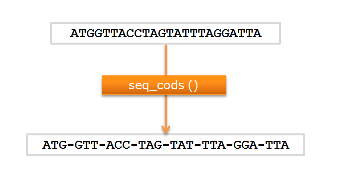

---
jupytext:
  cell_metadata_filter: -all
  formats: md:myst
  text_representation:
    extension: .md
    format_name: myst
    format_version: 0.13
    jupytext_version: 1.10.3
kernelspec:
  display_name: Python 3 (ipykernel)
  language: python
  name: python3
---

# Funções e módulos

## Introdução

No programa seguinte, dada uma sequência de uma cadeia de DNA pretende-se mostrar a **sequência**,
a **sequência complementar** e o **complemento reverso** na forma de codões separados
por um hífen.

Sendo óbvio o que é a sequência complementar, chamamos *complemento reverso* à sequência complementar
mas mostrada no "sentido da transcrição", isto é, a sequência complementar por ordem reversa. Isto porque, escrevendo a sequência bde uma cadeia no sentido 5' -> 3', faz sentido mostrar a outra cadeia também no sentido 5' -> 3', uma vez que esse é sempre o sentido da transcrição.

Este programa é realmente uma pequena extensão do que já foi visto anteriormente.

```{code-cell} ipython3
---
lineno-start: 1
emphasize-lines: 17, 18
---
# sequência de uma cadeia (string)
seq = "AGCTGGATCCTGAACGCATAGACTAGCATGGGACTAAAGGTCCATTACTGA"

# dicionário de bases complementares
trans = {'A':'T', 'T':'A', 'C':'G', 'G':'C'}

# cálculo da sequência complementar, fazendo join
# a uma lista de bases complementares (o resultado é uma string)
comp = ''.join([trans[b] for b in seq])

# cálculo da complemento reverso, fazendo join da bases complementares
# por ordem reversa, obtida pela função reverse()
comp_rev = ''.join(reversed(comp))

# finalmente, mostrar as 3 sequências com os codões separados
# por - (e, já agora, mostrar 5' e 3')
seq_cods = [seq[i:i+3] for i in range(0, len(seq), 3)]
chain_seq = '-'.join(seq_cods)
print("5'-" + chain_seq +"-3'")

comp_cods = [comp[i:i+3] for i in range(0, len(comp), 3)]
chain_comp = '-'.join(comp_cods)
print("3'-" + chain_comp + "-5'")

comp_rev_cods = [comp_rev[i:i+3] for i in range(0, len(comp_rev), 3)]
chain_comp_rev = '-'.join(comp_rev_cods)
print('Complemento reverso')
print("5'-" + chain_comp_rev + "-3'")
```

A parte do programa nas linhas 17 e 18

    seq_cods = [seq[i:i+3] for i in range(0, len(seq), 3)]
    chain_seq = '-'.join(seq_cods)

repete-se de uma forma análoga para a sequência complementar e para o
complemento reverso nas linhas 21 e 22 e também nas linhas 25 e 26. O que 
muda é a sequência sobre a qual estão a ser aplicadas (`seq` nas linhas 17 e 18, 
`comp` nas linhas 21 e 22 e `comp_rev` nas linhas 25 e 26).

O objetivo de cada grupo destas duas linhas é muito claro: separar uma sequência (_string_) numa lista
de codões e depois construír uma _string_ juntando os codões mas separando-os por um hífen.

Mas temos de repetir 3 vezes, apenas mudando a sequência de partida?

E se houvesse uma função capaz de transformar uma *string* noutra *string* em que grupos de 3 letras
eram separados por um hífen?

Não seria uma função de aplicação muito genérica, uma vez que só interessaria a programadores
que trabalham com sequências biológicas. No entanto, seria altamente conveniente se existisse uma função
chamada, por exemplo, `seqcods()`, que pudesse ser usada desta maneira:

```{code-cell} ipython3
:tags: ["remove-cell"]
def seqcods(x):
    cods = [x[i:i+3] for i in range(0,len(x),3)]
    comhifen = '-'.join(cods)
    return comhifen
```

```{code-cell} ipython3
# .....

# finalmente, mostrar as 3 sequências com os codões separados
# por - (e, já agora, mostrar 5' e 3')

chain_seq = seqcods(seq)
print("5'-" + chain_seq +"-3'")

chain_comp = seqcods(comp)
print("3'-" + chain_comp + "-5'")

chain_comp_rev = seqcods(comp_rev)
print('Complemento reverso')
print("5'-" + chain_comp_rev + "-3'")
```

Isto é, se esta função existisse, então ela seria aplicada a diferentes sequências mas a
tarefa que ela iria realizar era sempre a mesma:

1. agrupar 3 letras consecutivas numa lista e
2. juntar estes grupos com um hífen.


## Funções

As funções (também conhecidas como *subprogramas*, *subrotinas*, isto é,
mini-programas dentro de programas) são a solução para estes casos.

Python e muitas outras linguagens permitem a definição de novas funções pelo *programador*, aumentando
livremente o arsenal de funções disponíveis na construção de programas.

Desde há muitas décadas que esta prática é encorajada: tarefas específicas e bem determinadas devem
ser escritas na forma de funções.

As funções funcionam como unidades lógicas dentro de um programa que

1. se podem usar com diferentes argumentos em diferentes partes do programa, eliminando repetição.
2. se podem combinar com outras funções aumentando a flexibilidade lógica da construção de programas.


Anteriormente já vimos várias funções em ação. Usámos funções que:

- estão sempre disponíveis e fazem parte integrante da linguagem
- ficam acessíveis por importação de um módulo
- estão *associadas* a objetos e usam-se da forma `objeto.função()`.


```{code-cell} ipython3
a = 'Uma pequena string'

# len() e int() são funções sempre disponíveis
n = len(a)

f = int(4.2)

# A função .count() está associada a strings e listas
nA = a.count('A')

# A função append() está associada a listas e modifica a lista
a = []
a.append(33)

# a função log (logaritmo base e) está disponível após
# importar o módulo math

import math
l = math.log(2.0)
```


## Definição de funções (`def`)

As criação (ou *definição*) de novas funções é feita com o comando
`def`.

Uma função típica é sob o ponto de vista lógico, em tudo análoga
ao conceito matemático de função.

Como primeiro exemplo para ilustrar a definição de funções, vamos supor que estaríamos interessados em clacular a seguinte expressão em vários pontos de um programa:

$x^2 - 3 x$

Poderíamos definir uma função para realizar esse cálculo da seguinte forma:

```{code-cell} ipython3
def f(x):
    res = x**2 - 3 * x
    return res
```

Depois desta definição, a função `f` fica disponível e, quando aplicada a um um argumento `x` concreto, dá como resultado aquela expressão. Pode ser usada várias vezes.

```{code-cell} ipython3
y = f(10.2)

print(y)

print(1, '→', f(1))
print(0, '→', f(0))
print(2, '→', f(2))
```

Podemos traçar a função numa "tabela"

```{code-cell} ipython3
def f(x):
    return x**2 - 3 * x

# 10 pontos entre -3 e 3
abcissas = [-3.0 + 6.0 * i / 10 for i in range(11)]

# usando a função f
ordenadas = [f(x) for x in abcissas]

for x, y in zip(abcissas, ordenadas):
    print(f'{x:5.2f} → {y:5.2f}')
```

Ou mesmo usar a função para traçar o seu gráfico, aplicando-a a muitos pontos próximos uns dos outros para ser quase contínua:

```{code-cell} ipython3
:tags: ["remove-cell"]
%matplotlib inline
```

```{code-cell} ipython3
def f(x):
    return x**3 - 3 * x

abcissas = [-3.0 + 6.0 * i / 1000 for i in range(1001)]
ordenadas = [f(x) for x in abcissas]

from matplotlib import pyplot as plt
plt.plot(abcissas, ordenadas, '-', c='navy')
plt.grid()
plt.show()
```

vejamos mais ao pormenor em que consiste a definição de uma função.

Vamos supor que a função `seqcods()` foi criada.

Tal como na matemática, as funções transformam objetos noutros objetos:



Mas, tal como na matemática, as funções são escritas para atuar sobre
objetos genéricos (`x`):


Vejamos, finalmente, como criar a função `seqcods()`:

```{code-cell} ipython3
def seqcods(x):
    cods = [x[i:i+3] for i in range(0,len(x),3)]
    comhifen = '-'.join(cods)
    return comhifen
```

## Anatomia de uma função

Qauis são os vários elementos que compões esta definição?


Após o comando `def` segue-se o nome da função. Este nome deve seguir as mesmas
regras que os nomes de objetos da linguagem Python. Por exemplo, não podem começar por
um número, não podem ter espaços e `.`

Ainda na mesma linha segue-se uma indicação dos argumentos da função entre `()`. Podem ser zero, um
ou vários argumentos. Mas, muito importante

```{admonition} Importante
:class: important
Os nomes usados nesta lista de argumentos são genéricos, tal como
no conceito matemático de função. Não são nenhuma referência a objetos concretos existentes no programa.

Mas, **quando a função for usada**, estes nomes irão ser substituídos por
valores concretos, como iremos ver a seguir.

```

Segue-se a definição daquilo que a função executa quando for chamada, a tarefa da função propriamente dita. Esta função pode *atuar* sobre os seus argumentos, executando comandos arbitrariamente complicados. A liberdade em relação ao que podemos incluír numa função é quase total. Atribuições de nome, comandos `for`, comandos `if...else`, outras funções, são exemplos do que pode ser incluído
na definição de uma função.

Finalmente, uma linha da definição da função contem o comando `return`. O papel
deste comando é simples: assinala o resultado da função.

Qualquer expressão, por mais complicada que seja, à frente do comando `return` é
o resultado da função.

Tipicamente, o comando `return` é a última linha da definição da função. Mas é perfeitamente
possível escrever funções que, testando condições com `if` podem executar `return`s "prematuros"
em linhas que não são a última. Podem haver vários comandos `return` numa definição da função.

Claro, à semelhança do que se passa com `for`, `if...else`, `with`, é o **alinhamento interior** das
linhas que indica onde começa e acaba a definição de uma função. No exemplo acima, as linhas

    cods = [x[i:i+3] for i in range(0,len(x),3)]
    comhifen = '-'.join(cods)
    return comhifen

estão alinhadas "mais dentro", usando alguns espaços (convencionou-se 4 espaços). Havendo, por exemplo,
um comando `for`, teríamos de alinhar algumas linhas ainda mais "para dentro".

Mas, para que serve a definição de uma função nova?

A definição de uma função (`def`) não executa nada imediatamente.

É necessário *chamar* (ou "*invocar*") a função para esta ser usada:

```{code-cell} ipython3
def seqcods(x):
    cods = [x[i:i+3] for i in range(0,len(x),3)]
    comhifen = '-'.join(cods)
    return comhifen

a = "ATGGTTACCTAGTATTTAGGATTA"
print(a)

# A função é chamada aqui:
s = seqcods(a)

print(s)
```


Chamar uma função é simples: escrevemos o nome da função, seguida do valôr/objeto/expressão ao qual queremos aplicar a função entre `()`.

Havendo um resultado, é muito comum atribuír um nome ao resultado:

    s = seqcods(seq)

```{admonition} Nota
:class: note
O comando `return` pode "devolver" uma expressão complicada
(não só o nome de um objeto)

```

Poderíamos condensar toda a tarefa da função `seqcods()` numa expressão à frente do comando `return`.
Uma outra versão seria:

```{code-cell} ipython3
def seqcods(x):
    return '-'.join( [x[i:i+3] for i in range(0,len(x),3)])

a = "ATGGTTACCTAGTATTTAGGATTA"
print(a)

# A função é chamada aqui:
s = seqcods(a)

print(s)
```


**Em resumo:**

A linha

`def seqcods(x):`

"regista" uma nova função, chamada `seqcods`, que pode ser usada em
qualquer ponto do programa, da forma seguinte:

`s = seqcods(a)`

Na realidade há uma regra:

```{admonition} Nota
:class: note
O uso de uma função só pode figurar no texto de um programa **após**
o programa "passar" pelo comando `def` durante a sua execução.

A funções tendem a ser criadas qause no início de um programa. Mas
a prática corrente é incluí-las em módulos que possam ser importados
pelo programa, como iremos ver a seguir.

```

## Entrada e saída de valores

Qaundo invocamos uma função para ela ser executada, ela atua sobre valores 
concretos, geralmente com um nome, e ela produz um resultado concreto, ao qual
podemos atribuír um nome. Esta figura ilustra o mecanismo de passagem de valores
"para dentro" e "para fora" da função, usando outra vez a função `seqcods()` como exemplo:


Vejamos mais um exemplo de uma função, que agora contem um comando `for`.

A função para calcular fatoriais já existe em módulos que podemos importar, mas se a tivessemos
de definir, seria algo como:

Exemplo: função `factorial()`:

```{code-cell} ipython3
def factorial(n):
    res = 1
    for k in range(2,n+1):
        res = res * k
    return res

print(factorial(200))
```


## Vários tipos de funções

As funções podem ser "atípicas" quanto ao número de argumentos e resultados.

Vejamos a variedade possível, usando funções já conhecidas:

```{code-cell} ipython3
a = 'Uma pequena string'

# 1 argumento, 1 resultado
print( len(a) )

# 1 arg, 1 res, associada a um objeto (string a)
print( a.count('a') )

# 0 arg, 1 res, associada a um objeto (string a)
print( a.upper() )
```


```{code-cell} ipython3
# 1 arg, 0 res, associada a um objeto (lista b)
# modifica o objeto (a lista b)
b = [12, 24]

print( b.append(36) )
print(b)
```


Portanto, podemos perfeitamente ter funções **sem argumentos**. Neste caso a função
é invocada com `()` vazios.

Por outro lado, uma função pode não produzir nenhum resultado. Ela executa uma tarefa e modifica
um objeto , mas não existe nenhum resultado formal. Estas funções **não têm** um comando `return`.

O caso mais paradigmático é a função `append()`: ela acrescenta um objeto ao fim de uma lista mas
não produz um resultado concreto ao qual se pode dar um nome.

Além da função `.append()`, recordar que **as listas** têm outras duas
funções deste tipo, que modificam a lista sem produzir nenhum resultado
(o resultado é a constante `None`): `.reverse()` e `.sort()`.

```{code-cell} ipython3
b = [12, 24, 36]
print(b)

b.reverse()
print(b)

b.sort()
print(b)
```


As funções podem ter mais de um argumento (ou zero ou um).
O número pode até ser variável, havendo argumentos que são opcionais.

É o caso da função `log()`, que, pode ter um segundo argumento opcional que
indica a base do logaritmo. Se não existir, a base é o número `e`.

Mas **também o resultado** de uma função pode ser mais
complicado do que apenas um número ou uma *string*: as funções
podem devolver uma lista inteira, um dicionário ou outros objetos mais
complexos.

Tudo depende do que estiver à frente do comando `return`.

Por exemplo, a função `localtime()`do módulo `time` produz um
objeto composto e vários elementos (que são necessários para definir um instante no tempo):

```{code-cell} ipython3
import math
print( math.log(64, 2) )

import time
x = time.localtime(time.time())
print(x)
```


Vejamos como podemos escrever funções simples para executar algumas tarefas
já vistas anteriormente.

```{admonition} Problema
:class: example
Eliminar valores de uma lista que pertençam a uma outra "lista negra"

```

Escrevemos a função aceitando 2 argumentos: a lista a "limpar" e a lista "negra".

Na função usamos uma lista em compreensão com `if` como vimos num capítulo anterior:

```{code-cell} ipython3
def elimin_black(uma_lista, black_list):
    res = [i for i in uma_lista if i not in black_list]
    return res

a = [1, 2, 4, 'um', 'dois', 3, 42, 'quatro']
black = [1, 2, 'um', 'dois']
clean = elimin_black(a, black)

print(a)
print ('\nA eliminar:', black)
print(clean)
```


```{admonition} Problema
:class: example
Dado um **nome** de um ficheiro de texto, escrever uma função para
ler o conteúdo do ficheiro, separar as linhas para uma lista, sem o
`\n` no final, e excluir as linhas vazias.

```

```{code-cell} ipython3
from pathlib import Path
def ler_fich(nome):
    tudo = Path(nome).read_text()

    linhas = []
    for linha in tudo.splitlines(): # o \n é retirado por splitlines()
        if len(linha) > 0: # só ficam as que não estão vazias
            linhas.append(linha)
    return linhas

linhas = ler_fich('gre3.txt')

for linha in linhas:
    print(linha)
```


Outra versão, usando listas em compreensão:

```{code-cell} ipython3
def ler_fich(nome):
    return [linha for linha in Path(nome).read_text().splitlines() if len(linha) > 0]

linhas = ler_fich('gre3.txt')

for linha in linhas:
    print(linha)
```


```{admonition} Problema
:class: example
Eliminar valores repetidos numa lista (criando uma lista nova)

```

```{code-cell} ipython3
def elimin_reps(uma_lista):
    res = []
    for i in uma_lista:
        if i not in res: # o append() só é feito se ainda não existir
            res.append(i)  
    return res

uma_lista = [1, 2, 4, 7, 7, 5, 8, 8, 9, 10]
print(uma_lista)

clean = elimin_reps(uma_lista)
print(clean)
```


Se as funções tiverem resultados é possível usá-las em composição de funções:

```{code-cell} ipython3
def elimin_reps(uma_lista):
    res = []
    for i in uma_lista:
        if i not in res:
            res.append(i)
    return res
def elimin_black(uma_lista, black_list):
    return [i for i in uma_lista if i not in black_list]

a = [1, 2, 4, 'um', 'dois', 3, 3, 37, 42, 42, 'quatro']
black = [1, 2, 'um', 'dois']

clean = elimin_reps(elimin_black(a, black))
print(clean)
```


## Âmbito dos nomes

Vejamos um exemplo de uma função que mostra os seus argumentos com `print()`:

```{code-cell} ipython3
def recta(m, b, x):
    print('Para x =', x)
    print('com m =', m)
    print('com b =', b)
    g1 = m * x
    g0 = b
    return(g1 + g0)

# 3 atribuições de nome numa única linha
x, m, b = 2.0, 3.0, 2.0

res = recta(m, b, x)

print('Resultado:', res)
```


Este programa corre sem problemas.

Vejamos agora um exemplo com `print()`fora da função
em que até procuramos mostrar os valores de `g1`e `g0`:

```{code-cell} ipython3
:tags: ["raises-exception"]
def recta(m, b, x):
    g1 = m * x
    g0 = b
    return(g1 + g0)

m, b, x = 2.0, 3.0, 2.0

res = recta(m, b, x)

print('Para x =', x, 'm =', m, 'b =', b)
print('m*x =', g1, 'b =', g0)
print('Resultado:', res)
```


O que se passou aqui?
O programa dá um erro na linha

    print('m*x =', g1, 'b =', g0)

Os nomes usados dentro da função `g1` e `g0` são **locais** à função:
pertencem ao **âmbito** da função e só são válidos duarnte a execução da
função.

A linha `print('m*x =', g1, 'b =', g0)` está "fora" da função e procura usar um nome, `g1` que
está dentro do âmbito da função.

Qualquer parte do programa "exterior" à função não consegue "ver" os nomes do âmbito local
da função. Daí o erro durante a execução.

O mesmo acontece aos próprios nomes locais dos **argumentos** da função:

```{code-cell} ipython3
:tags: ["raises-exception"]
def recta(m, b, x):
    g1 = m * x
    g0 = b
    return(g1 + g0)

# agora dando nomes diferentes fora da função:
p, q, r = 2.0, 3.0, 2.0
res = recta(q, r, p)

print('Para x =', x, 'm =', m, 'b =', b)
print('Resultado:', res)
```


Para tornar bem claro que os nomes dentro da função podem ter valores
diferentes dos nomes fora da função:

```{code-cell} ipython3
def recta(m, b, x):
    print('Dentro da função --------')
    print('m =', m, 'b =', b, 'x =', x)
    print('-------------------------')
    x = m * x + b
    return x

m = 2
b = 2
x = 4

# usando a função com expressões...
res = recta(m + 3, b + 3, x * x)

print('Fora da função -----')
print('m =', m, 'b =', b, 'x =', x)
print('\nResultado:', res)
```


Este programa corre sem problemas!

Mas cada um dos nomes `m`, `b`, `x` é usado em dois contextos e tem
valores diferentes:

-   O contexto local, quando estão "dentro" da função.
-   O contexto global, quando estão "fora da função".

Fora da função, os valores globais são:

    m = 2
    b = 2
    x = 4

Estes valores não são modificados fora da função e são apresentados pela
função `print()` no final.

Dentro da função estes nomes são, em primeiro lugar, usados como os
argumentos da função.

Pela **maneira como a função é chamada**, estes valores são:

    m = 5
    b = 5
    x = 16

O nome `x` é modificado dentro da função (`x = m * x + b`) ficando com o
valor final 85 e é este valor que é o resultado da função (`return x`).

Quando a função termina e estamos de novo "de fora" da função, o valor
de `x` volta a ser 4, uma vez que voltamos a um contexto "global".

## Argumentos opcionais

Na lista de argumentos da função podemos usar argumentos opcionais (ou do tipo *palavra-chave*, em inglês *keywork arguments*)

Para isso, na lista de argumentos, indicamos os nomes desses argumentos com um valôr atribuído (com `=`)

O efeito dessa atribuição é triplo:

1. Um argumento com uma atribuição fica marcado como opcional, isto é, pode ser omitido.
2. Se esse argumento for omitido, o seu valôr é automaticamente aquele que está
atribuído na definição da função
3. Quando a função é usada podemos-nos referir a esse argumento na forma de uma atribuição, usando o seu nome.

O melhor é mostrar uma função com dois argumentos, `a` e `b` que são opcionais por terem valores 
atribuídos na definição da função. No interior da função, `print()` mostra quais são
os valores que os argumentos têm cada vez que a função é usada.

A função é usada de várias maneiras diferentes e torna-se óbvio que os parâmetros são
opcionais e qual o papel dos valores atribuídos.

```{code-cell} ipython3
def mix(a=1, b=0):
    c = a + b
    print('a =', a, 'b =', b, '--> return =', c)
    return c

x = mix() # omitindo os dois argumentos

x = mix(b=3) # omitindo a, dando valôr a b

x = mix(a=2, b=3) # dando valôr a e b

x = mix(2,3) # dando valôr aos dois sem usar os nomes
```


Os argumentos opcionais têm muito interesse e são muito usados.

De entre muitas aplicações, eles podem ser usados em funções que podem
funcionar de uma maneira direta e simples, calculando o seu resultado ou de uma forma em que são
apresentados os cálculos intermédios envolvidos no cálculo.

No seguinte exemplo, o argumento opcional `trace` controla,
com `False` ou `True` se a função fatorial  é "silenciosa" ou se mostra
a evolução do cálculo do fatorial.

Usnado primeiro a função com o argumento  `trace` omitido, isto é, igual a `False`:

```{code-cell} ipython3
def factorial(n, trace=False):
    p = 1
    for i in range(2,n+1):
        p = p * i
        if trace:
            print(i, p)
    return p

f20 = factorial(20) # argumento omitido
print('O factorial de 20 é', f20)
```


Agora usando com `trace=True`:

```{code-cell} ipython3
def factorial(n, trace=False):
    p = 1
    for i in range(2,n+1):
        p = p * i
        if trace:
            print(i, p)
    return p

f20 = factorial(20, trace=True) # trace = True
print('O factorial de 20 é', f20)
```

## Módulos e `import`

Como vimos, muitas funções estão imediatamente disponíveis quando
começamos a escrever um programa.

Estas funções podem ser "livres" (por exemplo a função `len()`) ou
associadas a objetos (por exemplo, `s.split()` que está associada à
*string* `s`).

A linguagem Python permite a organização dos programas em **módulos**.

Módulos são **ficheiros** `.py` que contêm
coleções de funções úteis e relacionadas entre si, podendo também conter
alguns outros objetos que não são funções, mas que contêm informação de
suporte.

Um programador pode e deve organizar um projeto grande em vários módulos,
muitos dos quais são coleções de funções reunidas num único ficheiro.

Estas funções ficam disponíveis pelo mecanismo de importação, como veremos.

Os módulos são também essenciais no aumento da funcionalidade da própria
linguagem Python: com a distribuição oficial do Python e em algumas
distribuições de "Python científico" são tipicamente disponibilizados
**centenas** de módulos, em que cada módulo reúne a funcionalidade
adicional relacionada com um propósito particular.

Por exemplo, o módulo `math` reúne funções associadas a cálculos
matemáticos (e as constantes $\pi$ e *e*, que não são funções).

O módulo `time` reúne funções e constantes relacionadas com a utilização
da data e hora.

A documentação sobre a coleção de módulos que são são disponibilizados
em todas as distribuições da linguagem Python (a chamada *Biblioteca
padrão* (em inglês *Standard Library*) pode ser encontrada na
[documentação oficial](https://docs.python.org/3/library/). São centenas.

Por outro lado, quem escreve módulos novos pode submetê-los ao Python
Package Index, conhecido como [PyPi](https://pypi.python.org/pypi).
Trata-se de um imenso depósito de módulos com contribuições de milhares
de autores e em permanente crescimento.

## Exemplo da construção de um módulo

Vamos supor que  é útil ter uma função que lê ficheiros com
um sequência no formato FASTA e desdobra o conteúdo no cabeçalho (`header`)
e na sequência, na forma de duas *strings*.

```{code-cell} ipython3
def readFASTA(filename):
    """This function reads a FASTA format file and
    returns a pair of strings with the header and the sequence
    """
    with open(filename) as a:
        lines = a.read().splitlines()
    
    # remove empty lines
    lines = [line for line in lines if len(line) > 0]

    # split header and sequence
    # the header may be absent
    if lines[0].startswith('>'):
        return lines[0], ''.join(lines[1:])
    else:
        return '', ''.join(lines)

h, s = readFASTA("gre3.txt")

print(f'Header:\n{h}')
print(f'\nSequence:\n{s}')
```


Uma pequena explicação sobre dois pormenores:

- a função tem como resultado **um par de valores** (as duas *strings*). Isso é conseguido pelo
facto de o comando `return`ter à sua frente dois valores separados por `,`.
- Aquela *string* que aparece logo após a linha `def` e que ocupa duas linhas (daí as `"""`)
tem uma descrição do que a função faz (está em inglês, mas é uma *string*, pode estar em qualquer língua). O nome dessa *string* especial é "string de documentação", mas é universalmente conhecida
como *docstring*.

Vamos supor que esta função `readFASTA()` seria a primeira de uma coleção de funções
relacionadas com o processamento de ficheiros de texto contendo
sequências usados em bioinformática (uma sequência em FASTA é apenas
um exemplo).

Podemos criar um ficheiro **biosequences.py** contendo essa função:


Este ficheiro constitui um módulo que pode ser usado num programa.

Supondo que este módulo está disponível na mesma pasta em que estou a criar um
programa `.py` novo, como usar a função `readFASTA()` que se encontra no módulo?

Através do comando `import`:

```{code-cell} ipython3
import biosequences

h, s = biosequences.readFASTA("gre3.txt")

print(f'Header:\n{h}')
print(f'\nSequence:\n{s}')
```


Há outras duas maneiras de utilizar o comando `import`.

A primeira é indicar apenas as funções que estamos interessados em utilizar.

Neste caso, depois do `import` a função
fica disponível como `readFASTA()` e não é necessário usar `biosequences.readFASTA()`:

```{code-cell} ipython3
from biosequences import readFASTA

h, s = readFASTA("gre3.txt")

print(f'Header:\n{h}\n\nSequence:\n{s}')
```


A outra maneira é fazer uma importação em tudo semelhante à anterior
mas indicando com `*` que queremos importar todas as funções e outros objetos
do módulo:

```{code-cell} ipython3
from biosequences import *

h, s = readFASTA("gre3.txt")

print(f'Header:\n{h}\n\nSequence:\n{s}')
```


Esta última maneira é desaconselhada: um módulo pode conter centenas de
funções e, por isso, podem ser importados centenas de novos *nomes* para
um programa, que podem **entrar em conflito** com outros nomes iguais
utilizados no programa.

Um módulo pode conter outros objetos para além de funções.

A pensar em algumas operações que poderiam ser realizadas com sequências
biológicas, o ficheiro **biosequences.py** poderia ser **ampliado** com
as seguintes atribuições:

```{code-block} ipython3
# .....

basesDNA = 'ATGC'
basesRNA = 'AUGC'

aa_residues   = "ACDEFGHIKLMNPQRSTVWY"

complement = { 'A':'T', 'T':'A', 'G':'C', 'C':'G'}
complementRNA = { 'A':'U', 'U':'A', 'G':'C', 'C':'G'}

gencode = {
        'TTT': 'F', 'TTC': 'F', 'TTA': 'L', 'TTG': 'L', 'TCT': 'S',
        'TCC': 'S', 'TCA': 'S', 'TCG': 'S', 'TAT': 'Y', 'TAC': 'Y',
        'TGT': 'C', 'TGC': 'C', 'TGG': 'W', 'CTT': 'L', 'CTC': 'L',
        'CTA': 'L', 'CTG': 'L', 'CCT': 'P', 'CCC': 'P', 'CCA': 'P',
        'CCG': 'P', 'CAT': 'H', 'CAC': 'H', 'CAA': 'Q', 'CAG': 'Q',
        'CGT': 'R', 'CGC': 'R', 'CGA': 'R', 'CGG': 'R', 'ATT': 'I',
        'ATC': 'I', 'ATA': 'I', 'ATG': 'M', 'ACT': 'T', 'ACC': 'T',
        'ACA': 'T', 'ACG': 'T', 'AAT': 'N', 'AAC': 'N', 'AAA': 'K',
        'AAG': 'K', 'AGT': 'S', 'AGC': 'S', 'AGA': 'R', 'AGG': 'R',
        'GTT': 'V', 'GTC': 'V', 'GTA': 'V', 'GTG': 'V', 'GCT': 'A',
        'GCC': 'A', 'GCA': 'A', 'GCG': 'A', 'GAT': 'D', 'GAC': 'D',
        'GAA': 'E', 'GAG': 'E', 'GGT': 'G', 'GGC': 'G', 'GGA': 'G',
        'GGG': 'G', 'TAA': 'STOP', 'TAG': 'STOP', 'TGA': 'STOP'}

```

E ficaríamos com algumas *strings* e dicionários
úteis que poderíamos usar no contexto da construção de um programa
de processa sequências de macromoléculas biológicas.

Uma pequena aplicação do código genético (no dicionário `genecode`):

```{admonition} Problema
:class: example
Criar (e experimentar para ver se está bem) uma função que
traduz uma sequência de uma cadeia de DNA para a sequência da proteína correspondente

```

Sabemos que o módulo `biosequences` tem um dicionário chamado `gencode`.

```{code-cell} ipython3
from biosequences import gencode

def translation(seq):
    # create a list with codons
    cods = [seq[i:i+3] for i in range(0, len(seq), 3)]
    # translate codons
    prot = []
    for c in cods:
        # translate codon c using dict 
        aa = gencode[c]
        if aa == 'STOP': # if the aminoacid is STOP then break the for loop
            break
        prot.append(aa)
    return ''.join(prot)

# Sequência de teste
seq = 'AGCTGGATCCTGAACGATGCATAAGCATAGCCATAGACTAGCATGGGACTAAAGGTCCATTACTGA'

print(seq)
print(translation(seq))
```


Claro que a função `translation()` seria uma boa adição ao nosso módulo
`biosequences`...

O projeto [BioPython](https://biopython.org/) foi
precisamente criado como uma coleção de funções e objetos que suportam a
representação e transformação de sequências biológicas. Hoje é muito mais do que isso, mas a parte central deste pacote de módulos continua a ser a funcionalidade relacionada com sequências
biológicas.

Finalmente, se usarmos a primeira forma do comando `import` (`import biosequences`), é possível **mudar o nome do módulo** (para uma forma mais abreviada), um *alias*, da seguinte forma:

```{code-cell} ipython3
import biosequences as bs

h, s = bs.readFASTA("gre3.txt")

print(f'Header:\n{h}\n\nSequence:\n{s}')
```

