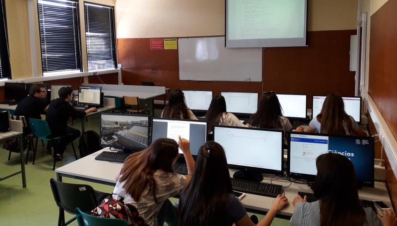

# Prefácio

## Acerca deste *e-book*

Este site disponibiliza as aulas teóricas da disciplina de Bioquímica Computacional da licenciatura em Bioquímica, FCUL.

Este curso está, genericamente, dividido em 3 partes principais:

- Conceitos introdutórios da programação em Python
- Processamento e extração de informação de "textos estruturados". Como exemplos são usados, principalmente,"textos estruturados" da área de Bioinformática.
- Introdução aos módulos em Python para computação científica.

## Autor

[António Ferreira](http://webpages.fc.ul.pt/~aeferreira/) 

## Licença

Este curso está disponível segundo a licença [Creative Commons BY-SA](http://creativecommons.org/licenses/by-sa/3.0/).

## Fonte

O código necessário à geração deste site está disponível no repositório https://github.com/aeferreira/classes_Python_Bq_computacional.
