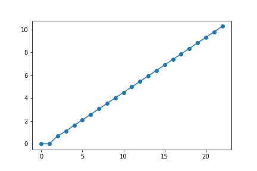

---
jupytext:
  cell_metadata_filter: -all
  formats: md:myst
  text_representation:
    extension: .md
    format_name: myst
    format_version: 0.13
    jupytext_version: 1.10.3
kernelspec:
  display_name: Python 3 (ipykernel)
  language: python
  name: python3
---

# Exercícios de treino, 2

## Objetivo

Estes exercícios ilustram o uso dos módulos `math`, `numpy` e `matplotlib`.

**Nos programas seguintes, preencha os `'??????'` com expressões apropriadas de forma a garantir que o resultado da execução do programa seja aquele que está exibido**

## Numéricos, sobre comandos for, listas em compreensão e numpy


### Programa 1

```{code-block} ipython3
import math
from matplotlib import pyplot as plt

fibs = [0, 1, 1, 2, 3, 5, 8, 13, 21, 34, 55, 89, 144, 233, 377, 610, 987, 1597, 2584, 4181, 6765, 10946, 17711, 28657]

# logaritmos dos números com math.log()
# mas não pode dar erro...
logfibs = '??????'

plt.plot(range(len(logfibs)), logfibs, 'o-')
plt.show()
```



**Solução**

```{code-cell} ipython3
:tags: ["hide-cell"]
import math
from matplotlib import pyplot as plt

fibs = [0, 1, 1, 2, 3, 5, 8, 13, 21, 34, 55, 89, 144, 233, 377, 610, 987, 1597, 2584, 4181, 6765, 10946, 17711, 28657]

# logaritmos dos números com math.log()
# mas não pode dar erro...
logfibs = [math.log(x) for x in fibs if x != 0]

plt.plot(range(len(logfibs)), logfibs, 'o-')
plt.show()
```

### Programa 2

```{code-block} ipython3
import numpy as np
from matplotlib import pyplot as plt

fibs = [0, 1, 1, 2, 3, 5, 8, 13, 21, 34, 55, 89, 144, 233, 377, 610, 987, 1597, 2584, 4181, 6765, 10946, 17711, 28657]
fibs = np.array(fibs)

# logaritmos dos números com np.log()
# mas não pode dar erro...
logfibs = '???????'

plt.plot(np.arange(len(logfibs)), logfibs, 'o-')
plt.show()
```


**Solução**

```{code-cell} ipython3
:tags: ["hide-cell"]
import numpy as np
from matplotlib import pyplot as plt

fibs = [0, 1, 1, 2, 3, 5, 8, 13, 21, 34, 55, 89, 144, 233, 377, 610, 987, 1597, 2584, 4181, 6765, 10946, 17711, 28657]
fibs = np.array(fibs)

# logaritmos dos números com np.log()
# mas não pode dar erro...
logfibs = np.log(fibs[fibs!=0])

plt.plot(np.arange(len(logfibs)), logfibs, 'o-')
plt.show()
```


### Programa 3

Sugestão: use a função `np.log10()` e a função `np.trunc()`

```{code-block} ipython3
fibs = [1, 1, 2, 3, 5, 8, 13, 21, 34, 55, 89, 144, 233, 377, 610, 987, 1597, 2584, 4181, 6765, 10946, 17711, 28657]
fibs = np.array(fibs)

ndigits = '??????'

print('numero de dígitos:')
print(ndigits)
```

    numero de dígitos:
    [1. 1. 1. 1. 1. 1. 2. 2. 2. 2. 2. 3. 3. 3. 3. 3. 4. 4. 4. 4. 5. 5. 5.]
    

**Solução**

```{code-cell} ipython3
:tags: ["hide-cell"]
fibs = [1, 1, 2, 3, 5, 8, 13, 21, 34, 55, 89, 144, 233, 377, 610, 987, 1597, 2584, 4181, 6765, 10946, 17711, 28657]
fibs = np.array(fibs)

ndigits = np.trunc(1 + np.log10(fibs))

print('numero de dígitos:')
print(ndigits)
```


## Sobre processamento de ficheiros de texto estruturados

### Preparação

Obtenha do moodle o ficheiro `proteins.fasta` e coloque na mesma pasta que o "programa 4".

### Programa 4


```{code-block} ipython3
with open('proteins.fasta') as f:
    records = f.read().split('>')
# clean empty records
records = [p for p in records if len(p) > 0]

print(len(records))

headers = '??????'

descriptions = []
accs = []

# header example:
# sp|Q08641|AB140_YEAST tRNA(Thr) (cytosine(32)-N(3))-methyltransferase OS=Saccharomyces cerevisiae (strain ATCC 204508 / S288c) ...

for header in headers:
    sp, acc, rest = header.split('|')
    description = rest.split('??????')[0]
    
    accs.append(acc)
    descriptions.append(description)

for h, d in zip(accs, descriptions):
    print(h, d)
```


    4
    P38090 AGP2_YEAST General amino acid permease AGP2 
    Q12001 ALG6_YEAST Dolichyl pyrophosphate Man9GlcNAc2 alpha-1,3-glucosyltransferase 
    P53309 AP18B_YEAST Clathrin coat assembly protein AP180B 
    P40467 ASG1_YEAST Activator of stress genes 1 

**Solução**

```{code-cell} ipython3
:tags: ["hide-cell"]
with open('proteins.fasta') as f:
    records = f.read().split('>')
# clean empty records
records = [p for p in records if p]

print(len(records))

headers = [record.splitlines()[0] for record in records]

descriptions = []
accs = []

# header example:
# sp|Q08641|AB140_YEAST tRNA(Thr) (cytosine(32)-N(3))-methyltransferase OS=Saccharomyces cerevisiae ...

for header in headers:
    sp, acc, rest = header.split('|')
    description = rest.split('OS=')[0]
    
    accs.append(acc)
    descriptions.append(description)

for h, d in zip(accs, descriptions):
    print(h, d)
```


