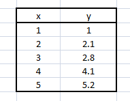
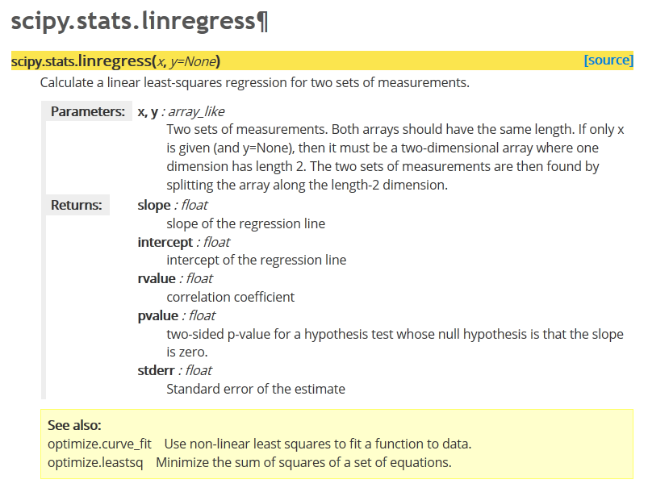

---
jupytext:
  cell_metadata_filter: -all
  formats: md:myst
  text_representation:
    extension: .md
    format_name: myst
    format_version: 0.13
    jupytext_version: 1.10.3
kernelspec:
  display_name: Python 3 (ipykernel)
  language: python
  name: python3
---

# Exemplo: regressão linear

```{code-cell} ipython3
import numpy as np
%matplotlib inline
from matplotlib import pyplot as plt
```



```{code-cell} ipython3
x = np.array([1.0, 2.0, 3.0, 4.0, 5.0])
y = np.array([1.0, 2.1, 2.8, 4.1, 5.2])
```

```{code-cell} ipython3
p = plt.plot(x,y, 'o')
```




```{code-cell} ipython3
from scipy.stats import linregress
```

```{code-cell} ipython3
m, b, R, p, SEm = linregress(x, y)
```

-   `m`: declive
-   `b`: ordenada na origem
-   `R`: coeficiente de correlação (de Pearson)
-   `p`: p-value do teste F em que H0: y = const, independente de x
-   `SEm`: erro padrão do declive

Falta calcular o SE da ordenada na origem.

```{code-cell} ipython3
def lin_regression(x, y):
    """Simple linear regression (y = m * x + b + error)."""
    m, b, R, p, SEm = linregress(x, y)

    # need to compute SEb, linregress only computes SEm
    n = len(x)
    SSx = np.var(x, ddof=1) * (n-1)  # this is sum( (x - mean(x))**2 )
    SEb2 = SEm**2 * (SSx/n + np.mean(x)**2)
    SEb = SEb2**0.5

    return m, b, SEm, SEb, R, p
```

```{code-cell} ipython3
m, b, Sm, Sb, R, p = lin_regression(x, y)
```

```{code-cell} ipython3
plt.plot(x,y, 'o')
plt.xlim(0,None)
plt.ylim(0, None)

# desenho da recta, dados 2 pontos extremos
# escolhemos a origem e o max(x)
x2 = np.array([0, max(x)])

plt.plot(x2, m * x2 + b, '-')

# Anotação sobre o gráfico:
ptxt = 'm = {:>.4g} ± {:6.4f}\nb = {:>.4g} ± {:6.4f}\nR2 = {:7.5f}'

t = plt.text(0.5, 4, ptxt.format(m, Sm, b, Sb, R**2), fontsize=14)
plt.show()
```
