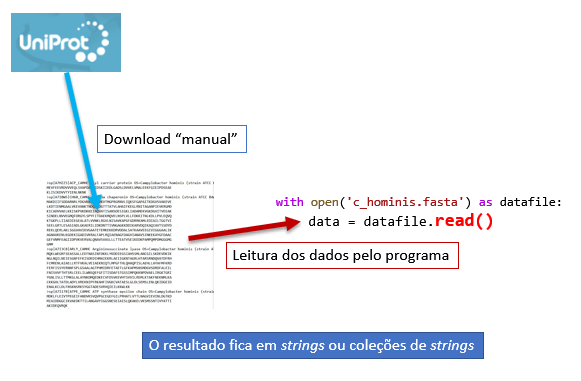
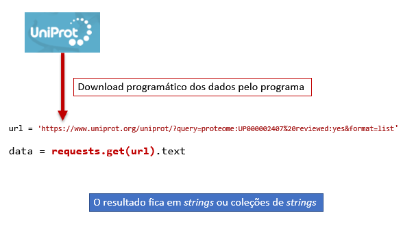

---
jupytext:
  cell_metadata_filter: -all
  formats: md:myst
  text_representation:
    extension: .md
    format_name: myst
    format_version: 0.13
    jupytext_version: 1.10.3
kernelspec:
  display_name: Python 3 (ipykernel)
  language: python
  name: python3
---

#  _Strings_ e textos

## Strings e textos estruturados

As *strings* e objetos coletivos que incluam *strings* são fundamentais nas aplicações da programação à análise de informação de natureza biológica e molecular. Isto porque essa informação é muitas vezes representável numa forma textual e, num programa, as *strings* são a maneira natural de represntar textos.

Os portais de bioinformática, por exemplo a [UniProt](https://www.uniprot.org/)
oferecem, muitas vezes, a possibilidade de transferir a informação contida em
bases de dados na forma de textos. Esses textos são estruturados, seguindo formatos
e regras específicos.

Um exemplo é a representação de sequências de macromoléculas biológicas (ácidos nucleicos e proteínas)
num formato designado por FASTA. Um pequena parte da informação sobre sequências do organismo *Campylobacter hominis*, obtido da UniProt, tem este aspeto:

    >sp|A7HZZ5|ACP_CAMHC Acyl carrier protein OS=Campylobacter hominis (strain ATCC BAA-381 / LMG 19568 / NCTC 13146 / CH001A) OX=360107 GN=acpP PE=3 SV=1
    MEVFEEVRDVVVEQLSVAPDAVKIDSKIIEDLGADSLDVVELVMALEEKFGIEIPDSEAE
    KLISIKDVVTYIENLNKNK
    >sp|A7I0W5|CH60_CAMHC 60 kDa chaperonin OS=Campylobacter hominis (strain ATCC BAA-381 / LMG 19568 / NCTC 13146 / CH001A) OX=360107 GN=groL PE=3 SV=1
    MAKDIIFSDDARNRLYDGVKKLNDTVKVTMGPRGRNVLIQKSFGAPAITKDGVSVAKEVE
    LKDTIENMGAALVKEVANKTNDQAGDGTTTATVLAHAIFKEGLRNITAGANPIEVKRGMD
    KICADVVAELKKISKPVKDKKEIAQVATISANSDESIGKLIADAMEKVGKDGVITVEEAK
    SINDELNVVEGMQFDRGYLSPYFITDAEKMQVELNSPLVLLFDKKITNLKDLLPVLEQVQ
    KTGKPLLIIAEDIEGEALATLVVNKLRGVLNISAVKAPGFGDRRKAMLEDIAILTGGTVI
    SEELGRTLESASIADLGKAERILIDKDNTTIVNGAGKKDDIKARVDQIKAQIAVTSSDYD
    REKLQERLAKLSGGVAVIKVGAATETEMKEKKDRVDDALSATKAAVEEGIVIGGGAALIK
    AGNAVKENLKGDEKIGADIVKRALFAPLRQIAENAGFDAGVIANAVSINKEKAYGFDAAC
    GEFVNMFEAGIIDPVKVERVALQNAVSVASLLLTTEATVSEIKEDKPAMPQMPDMGGGMG
    GMM

    ...
    muitas outras sequências ...
    ...

    >sp|A7I1M8|LGT_CAMHC Phosphatidylglycerol--prolipoprotein diacylglyceryl transferase OS=Campylobacter hominis (strain ATCC BAA-381 / LMG 19568 / NCTC 13146 / CH001A) OX=360107 GN=lgt PE=3 SV=1
    MTFWNEIYAHFDPVAFSIFGLKVHWYGLMYVLALLVALYMAKFFVKKDRLKFSNQVLENY
    FIWVEIGVILGARFGYILIYSNAQIFYLTHPWEIFNPFYNGKFVGISGMSYHGAVIGFII
    ATILFCRKKRQNLWSLLDLCALSIPLGYFFGRIGNFLNQELFGRITDVSWGILVNGELRH
    PSQLYEACLEGITIFLILYFYRKYKKFDGELICVYVILYAIFRFLTEFLREADVQIGYFS
    FGLSLGQILSVFMLILGFSAYIKLLKNSQTEQKFNQNKS

Neste "formato" um ficheiro pode ter milhares de sequências. Cada uma delas tem uma linha de cabeçalho
começada por `>` e várias linhas seguintes contendo a sequência. O cabeçalho tem alguma informação sobre a macromolécula em questão (essa informação e a maneira como está estruturada depende do portal
de bioinformática que foi usado para obter a informação)

Um outro exemplo, também da UniPort, é o formato "Tab delimited" de representar tabelas contendo o resultado de buscas sobre proteínas existentes na "UniProt Knowledgebase":

    Entry	Entry name	Status	Protein names	Gene names	Organism	Length
    A7HZZ5	ACP_CAMHC	reviewed	Acyl carrier protein (ACP)	acpP CHAB381_0230	Campylobacter hominis (strain ATCC BAA-381 / LMG 19568 / NCTC 13146 / CH001A)	79
    A7I0W5	CH60_CAMHC	reviewed	60 kDa chaperonin (GroEL protein) (Protein Cpn60)	groL groEL CHAB381_0568	Campylobacter hominis (strain ATCC BAA-381 / LMG 19568 / NCTC 13146 / CH001A)	543
    A7I3C8	ARLY_CAMHC	reviewed	Argininosuccinate lyase (ASAL) (EC 4.3.2.1) (Arginosuccinase)	argH CHAB381_1484	Campylobacter hominis (strain ATCC BAA-381 / LMG 19568 / NCTC 13146 / CH001A)	460
    A7I178	ATPE_CAMHC	reviewed	ATP synthase epsilon chain (ATP synthase F1 sector epsilon subunit) (F-ATPase epsilon subunit)	atpC CHAB381_0688	Campylobacter hominis (strain ATCC BAA-381 / LMG 19568 / NCTC 13146 / CH001A)	130
    A7I261	APT_CAMHC	reviewed	Adenine phosphoribosyltransferase (APRT) (EC 2.4.2.7)	apt CHAB381_1044	Campylobacter hominis (strain ATCC BAA-381 / LMG 19568 / NCTC 13146 / CH001A)	182
    A7I232	CMOA_CAMHC	reviewed	Carboxy-S-adenosyl-L-methionine synthase (Cx-SAM synthase) (EC 2.1.3.-)	cmoA CHAB381_1013	Campylobacter hominis (strain ATCC BAA-381 / LMG 19568 / NCTC 13146 / CH001A)	234

Neste "formato", cada linha diz respeito a uma proteína e, em cada uma delas, existe uma divisão da
informação em colunas utilizando o caractere "tab" (que não se vê no exemplo acima). A primeira linha é um cabeçalho com os nomes das várias colunas (também separados por "tabs").

Outros exemplos de informação de caráter textual usados em bioinformática:

- Representação de alinhamentos múltiplos em formatos CLUSTAL, PIR, HSSP
- Representação de estruturas 3D de macromoléculas no formato *pdb* do Protein Data Bank
- Muitos exemplos de informação estruturada em [*XML*](https://pt.wikipedia.org/wiki/XML) (*Extensible Markup Language*)

Um dos cenários de aplicação da programação é justamente a extração e organização de informação relevante contida "ficheiros" de caráter textual.

Para este objetivo é fundamental saber reconhecer o formato.

Neste capítulo será abordado muito brevemente o processamento do formato FASAT como exemplo de aplicação das funções de *strings*. Mas note-se que existem módulos da linguagem Python que disponibilizam muitas funções de leitura de muitos formatos usados em Bioinformática. Neste contexto, dois projetos que podem ser dados como exemplo são o [Biopython](https://biopython.org/) e o
[scikit-bio](http://scikit-bio.org/).

## Transferência da informaçao e seu uso num programa

As bases de dados de Bioinofrmática disponibilizam modos de acesso à informação de uma
forma "programática", em que um programa pode solicitar informação "filtrada" ao sistema computacional
de infraestrutura da base de dados. Neste capítulo, no entanto, começamos por uma maneira mais primitiva e simples de aceder à informação: obter o texto extruturado da base de dados, e depois processa-lo por um programa.

Desde que a informação tenha um tamanho não muito grande, algo que depende da sua natureza, especificidade e formato, existem dois modos muito simples de usar a informação por um programa.

Num primiro modo pode ser feito o acesso "manual" ao portal e, depois de realizar uma busca de interesse, ode srr obtido um ficheiro de texto contendo toda a infoemaçao não processada. Depois, um programa pode "ler" esse ficheiro e representar o seu conteúdo numa *string*.



Uma outra possibilidade é fazer através do programa, um acesso à base de dados e **o resultado** desse acesso ser representado numa *string*.



Um dos populares módulos da linguagem Python para acesso programático a recursos existentes na Internet é o módulo [requests](https://requests.readthedocs.io/en/master/)


## Leitura do conteúdo de um ficheiro

No caso em que obtemos a informação que queremos processar na forma de um ficheiro de texto estruturado
temos de, num programa, ler o seu conteúdo e "carrega-lo" numa *string* para que possamos, por programação, processar, transformar e extraír informação desse texto.

Vamos supor que, por busca na UniProt, obtive um ficheiro chamado `c_hominis.fasta` contendo as sequências das proteínas do organismo em formato FASTA. Para simplificar, vamos supor que este ficheiro foi **colocado na mesma pasta** onde se escrevem programas destinados a usar essa informação.

Um pequeno programa que lê esse ficheiro para uma *string* chamada `seqs` é o seguinte:


```{code-cell} ipython3
:tags: [output_scroll]
with open('c_hominis.fasta') as datafile:
    seqs = datafile.read()

print(seqs)
```

Como se pode ver pelo resultado da função `print()`, todo o ficheiro foi lido e transferido para a *string*  `seqs`.

Embora haja muitos pormenores subjacentes a este programa, pode-se dar uma explicação muito sumária do que se está a passar:

O comando `with` assinala que o programa faz o acesso a um recurso computacional de uma forma temporária, neste caso concreto, o "recurso" é umm ficheiro de texto.

O acesso ocorre durante a execução das linhas que estão "alinhadas mais interiormente" a seguir ao `with`. Depois disso, o programa já não necessita de ter acesso ao ficheiro.

A função `open()` que tem como argumento o nome do ficheiro de texto, "abre" o ficheiro para leitura pelo programa.

É dado um nome ao ficheiro aberto dentro do programa (o nome que está a seguir ao `as`): `datafile`.

Como resultado da função `open()`, `datafile` é um objeto criado para ser um canal de comunicação com o ficheiro de texto. Este "canal" tem a funcionalidade necessária para transferir (ler) a informação do ficheiro.

Neste  programa usa-se a função `datafile.read()`. Esta função, lê **todo** o conteúdo de um ficheiro  e tem como resultado uma *string*.

A esta *string* geralmente damos um nome, para posteriormente utilizar (neste caso foi dado o nome `seqs`).

A função que realmente lê o conteúdo do ficheiro e o transforma numa *string* é a função `.read()`. Existem outras funções de leitura, como veremos mais tarde.

Agora que existe uma maneira de ler um ficheiro de texto existente num computador para "dentro" de umm programa, vejamos o que podemos fazer com a *string* resultante.

Está na altura de nos focarmos na funcionalidade da linguagem Python em relação a *strings*.

## _Strings_

### Definição literal, iteração e indexação


As *strings* são um dos tipos de objetos mais usados na linguagem
Python. É comum um programa lidar com texto, seja porque o objetivo do
programa é precisamente o processamento de informação na forma textual,
seja simplesmente para que os resultados de um programa sejam
apresentados com pequenos textos destinados a descrever esses
resultados.

```{admonition} Conceito básico
:class: info
Como vimos anteriormente, uma _string_ é uma coleção de caracteres.

```

Uma maneira de criarmos _strings_ num programa é defini-las
literalmente, como um **texto entre aspas**.

Na **definição literal** de *strings* podemos delimita-las usando
**3 tipos diferentes de aspas**: 

`"` ou `'` ou `"""`

Se usarmos *três aspas* seguidas(`"""`), isso é uma indicação de que a *string* pode conter várias
linhas.

```{code-cell} ipython3
a = "O Neo tomou o comprimido vermelho"

b ='What is the matrix?'

c ="There's no spoon"

d = """ Um pequeno texto que até
ocupa várias linhas

algumas das linhas estão em branco"""
```

Repare-se no exemplo `c`: usando `"` para delimitar a *string*, podemos usar `'`no seu interior.

Repare-se no exemplo `d`: é uma *string* que ocupa várias linhas.

### operadores `+` e `*`.

A soma `+` serve para "juntar" várias *strings*, uma operação
designada por *concatenação*. A multiplicação `*` por um **número inteiro** repete uma *string*.

```{code-cell} ipython3
c = "There's no spoon"

print('c =', c)

s = c + ', really, ' + 'none' + '.'

print('s =', s)

a = 'Blá' * 3

print('\na =', a)
```


### Função `len()`

A função `len()` é uma função universal que calcula o número de elementos de qualquer coleção.
No caso das *strings*, o resultado é o **número de caracteres** (os espaçoes e a pontuação contam).

```{code-cell} ipython3
c = "There's no spoon"

print(f'"{c}" tem {len(c)} caracteres')
```

Aliás, as _strings_ têm muitas funções em comum com as listas:

-   `len()`, `count()`, `in`, `not in`
-   Indexação: `a[i]`
-   Iteração: `for i in a:`

Isto acontece porque as *strings* se comportam como uma **sequência de
caracteres**, tal como uma lista é uma sequência de quaisquer objetos.

### Iteração e indexação.

Na iteração de uma _string_ com `for` passamos pelos caracteres da _string_, um a um.

Um pequeno exemplo, em que aquilo que é repetido com o `for`é um `print()`de cada caractere três vezes:

```{code-cell} ipython3
frase = "There's no spoon"

for c in frase:
    print(c, c, c)
```

```{admonition} Nota
:class: note
Um caractere também é uma *string*
```

```{code-cell} ipython3
print('-' * 20)
print(' ' * 20) # são 20 espaços em branco
print('+' * 20)
print('\n' * 5) # são 5 mudanças de linha
print('=' * 20)
```

Na indexação de strings, cada caractere tem uma posição (a começar do zero). Não esquecer que números negativos significam posições a partir do fim (-1 é o último caractere, -2 o penúltimo, etc).

```{code-cell} ipython3
frase = "There's no spoon"
#        0123456789......

print(frase[0])
print(frase[5])
print(frase[-1])
``` 

## Funções associadas a *strings*

Além desta forte semelhança entre as *strings* e a listas, existem muitas funções associadas a *strings* que são específicas destas.

Uma lista delas pode ser consultada na documentação oficial da linguagem Python em
[docs.python.org](https://docs.python.org/3/library/stdtypes.html#string-methods)


Nesta lista estão cerca de cerca de **40** funções. Neste capítulo não vamos vê-las todas.

Numa seleção inteiramente pessoal, ditada principalmente pela experiência da utilização destas funções, vamos ver (apenas) as seguintes:

- `in`, `.startswith()`, `.endswith()`
- `.strip()`
- `.count()`, `.replace()`
- `.upper()`, `.lower()`
- `.split()`, `.splitlines()`, `.join()`

Muito, mas mesmo muito se consegue fazer com estas funções.

###  `in`, `.startswith()` , `.endswith()`.

`in` não é uma função, é um operador que testa se uma "substring" existe numa *string* maior. O resultado é `True` ou `False`, e, por isso, este operador costuma ser usado em `if...elif...else`:

```{code-cell} ipython3
seq = "AUGUUCAAGGAGUAAUGCCCCCGACUA"

if 'AGU' in seq:
    print('"AGU" existe na sequência')
else:
    print('"AGU" não existe na sequência')    
```

As funções `.startswith()` e `.endswith()` testam se uma `string` começa ou acaba com uma dada *substring*, respetivamente.

```{code-cell} ipython3
seq = "AUGUUCAAGGAGUAAUGCCCCCGACUA"

if seq.startswith('AUG'):
    print('O primeiro codão é de iniciação')

if seq.endswith('UAG') or seq.endswith('UAA') or seq.endswith('UGA'):
    print('O último codão é um codão stop')
```

(Não, o último não é um codão STOP)

### `.strip()`.

Uma função aparentemente não muito útil: a *string* é transformada noutra *string* em que **espaços**,
**tabs** e **mudanças de linha** são eliminados do princípio e do fim da *string*:

```{code-cell} ipython3
c = """

    Esta é uma linha no meio de várias linhas em branco


"""

s = c.strip()

# Neste print() s já não tem linhas em branco
# nem os espaços no princípio da linha
print(s)
```


Em inglês é usada a expressão *white space* para designar estes caracteres "em branco", os **espaços**,
**tabs** e **mudanças de linha**.

### `.upper()`, `.lower()`.

Funções óbvias: transformam em maiúsculas e minúsculas, respetivamente

```{code-cell} ipython3
c = "    There's no spoon      "

c_upper = c.upper()
print('c.upper():',c_upper)

c_lower = c.lower()
print('c.lower():',c_lower)
```


### `.count()`.

Muito útil, a função `.count()`, dá como resultado o número de ocorrências de uma *substring*
numa *string* maior (o reusltado é um número inteiro e pode ser 0):

```{code-cell} ipython3
seq = "ATGTTCAAGGAGTAATGCCCCCGACTA"

nG = seq.count('G')
nA = seq.count('A')
nC = seq.count('C')
nT = seq.count('T')

print(f'A razão (G+C) / (A+T) é {(nG + nC)/(nA + nT)}')
```

### `.replace()`.

Como o próprio nome indica, esta função cria uma *string* nova em que todas as ocorrências de uma *substring* são substituídas por outra.
Um exemplo em que, na sequência `seq` susbstituímos todos os `U` por `T`:

```{code-cell} ipython3
seq = "AUGUUCAAGGAGUAAUGCCCCCGACUA"

seq2 = seq.replace('U', 'T')

print(seq)
print(seq2)
```


Com esta função podemos, por exemplo, eliminar todos os espaços de uma *string*. Basta substituí-los pela *string vazia*:

```{code-cell} ipython3
frase = "There's no spoon"

frase2 = frase.replace(' ', '')

print(frase)
print(frase2)
```

### `.split()`, `splitlines()` e `.join()`

Estas funções são complicadas mas muito úteis e poderosas. Aconselha-se o estudo cuidado desta secção.

A partir de uma _string_, a função `.split()` **gera uma lista de partes**,
encontrando um separador que divida a _string_ em várias partes.

O separador a encontrar é o argumento da função.

Se não se usar um argumento, considera-se que as partes são separadas
por espaços, tabs ou mudanças de linha (no inglês genericamente
designados por *white space*).

```{admonition} Nota
:class: important
A função `.split()` transforma uma *string* numa lista

```

Alguns exemplos:

```{code-cell} ipython3
frase = "There's no spoon"

x = frase.split()

print(x)
```

```{code-cell} ipython3
frase = "There's no spoon"

x = frase.split('s')

print(x)
```

```{code-cell} ipython3
frase = "There's no spoon"

x = frase.split('o')

print(x)
```

```{code-cell} ipython3
frase = "There's no spoon"

x = frase.split('n')

print(x)
```

A função `.join()` é uma espécie de inversa de `.split()`: transforma
**uma lista** de *strings* **numa única** *string*, interpondo um
separador:

```{code-cell} ipython3
aas = ['Arg', 'Tyr', 'Gly', 'Asp']

print(" ".join(aas))
print("-".join(aas))
print("".join(aas))
print("+".join(aas))
print("-CONH-".join(aas))
```

```{admonition} Nota
:class: important
A função `.join()` transforma uma lista numa *string*

```

Um problema um pouco complicado, em que vemos '.join()' em ação.

```{admonition} Problema
:class: example
Transformar, por exemplo, `AUGUUCAAGGAGUAAUGCCCCCGACUA` em
`AUG-UUC-AAG-GAG-UAA-UGC-CCC-CGA-CUA`.

Ou seja, dada uma *string* com uma sequência de nucleótidos, construír
uma outra *string* em que os codões aparecem separados por `-`.

```

A ideia é separar os codões da sequência, usando indexação para extraír 3 letras consecutivas,
juntar os codões numa lista e usar `join()` para os juntar intercalados com `-` numa *string* final.

```{code-cell} ipython3
seq = "AUGUUCAAGGAGUAAUGCCCCCGACUA"
print(seq)

starts = range(0, len(seq), 3)

codoes = []
for i in starts:
    # i é o início de cada codão (c)
    c = seq[i] + seq[i+1] + seq[i+2]
    codoes.append(c)

# Só para mostrar que codoes é, de facto, uma lista
print(codoes)

final = "-".join(codoes)
print(final)
```


Convém explicar como se conseguiu separar os codões da sequência.

O truque foi usar indexação para obter as letras da sequência. Indexação requer o uso de posições. Cada codão são 3 letras consecutivas. Então a ideia foi primeiro encontrar as posições em que começa cada codão. Essa posições são calculadas por

    range(0, len(seq), 3) # isto dá 0...3...6... até ao comprimento da sequência

Passando por esats posições, com `for`, indexamos a sequência nas posições i, i+1 e i+2, juntamos
essas 3 letras (com `+`) e colocamos no fim de uma lista, chamada `codoes`, que vai "acumular" os codões.

No final, com a lista de codões construída, juntamos tudo com `.join()`.

Claro que podemos usar uma *lista em compreensão* para abreviar um pouco a construção da lista
de codões:

```{code-cell} ipython3
seq = "AUGUUCAAGGAGUAAUGCCCCCGACUA"

cods = [seq[i] + seq[i+1] + seq[i+2] for i in range(0, len(seq), 3)]

print(seq)

print( "-".join(cods) )
```


Tem de haver uma maneira mais sucinta de de juntar vários caracteres
consecutivos.

Um pouco mais à frente!

Finalmente, a função `.splitlines()` é equivalente a `.split('\n')`, isto é, separa uma *string*
nas respetivas linhas.

Dada uma sequência no formato FASTA, podemos facilamente separar as linhas numa **lista de linhas**:

```{code-cell} ipython3
seq = """>sp|A7I178|ATPE_CAMHC ATP synthase epsilon chain
MDKLFLEIVTPEGEIFANDVKSVQVPGCEGEFGILPRHATLVTTLNAGVIEVINLDGTKD
MIAIDDGGCIKVAEDKTTILANGAVYIGGSNESEIAISLQKAKELVKSMSSNTIVYATTI
AKIDEQVRQK"""

lines = seq.splitlines()

print(lines)
```
  
Repare-se que obtivemos uma lista.

## _Slices_ 

Já vimos que podemos indexar listas e *strings*, usando `[]` e a posição
do elemento.

Os `[]` podem ser usados para um outro tipo de indexação de listas ou
_strings_: os **slices** (em português: "fatias"). os *slices* saõ uma generalização
de indexação, em que, em vez de obtermos um único elemento obtemos vários elelmentos pelas suas posições.

A forma mais vulgar de utilização de *slices* é a extração de elementos consecutivos.

Escrevemos desta forma:

    string[início : fim]

e obtemos todos os caracteres deste a posição `início` até à posição `fim`, **exclusivé**.

```{admonition} Nota
:class: note
A *slice* de uma *string* dá uma *substring* nova

A *slice* de uma lista dá uma "sublista" nova

```

```{code-cell} ipython3
a = "O Neo tomou o comprimido vermelho"
#    012345678901234567890123456789012

print(a[2:5])
print(a[0:5])
print(a[6:-1])
```

Repare como a última posição é "exclusivé".

```{admonition} Importante
:class: importante
Podemos omitir o número **antes** dos `:`. isto significa que a *slice* começa **do princípio**

Podemos omitir o número **depois** dos `:`. isto significa que a *slice* vai até **ao fim** , inclusivé o último elemento.

```

```{code-cell} ipython3
a = "O Neo tomou o comprimido vermelho"
#    012345678901234567890123456789012

print(a[ :5])
print(a[6: ])
print(a[ : ])
```

Repare-se como um dos exemplos resulta na cópia integral da *string*

Mais um exemplo, como obter o primeiro e o último codão:

```{code-cell} ipython3
seq = "AUGUUCAAGGAGUAAUGCCCCCGACUA"

c = seq[  :3]
d = seq[-3: ]

print('O primeiro codão é', c)
print('O último codão é', d)
```

Na realidade, a forma geral de uma *slice* é 

    string[início : fim(exclusivé) : passo]

Isto é, opcionalmente pode ser indicado um `passo` que faz com que a *slice* "salte" de `passo` em `passo letras.

No programa seguinte, obtêm-se os caracteres da *string* desde a posição 0 até à posição 12, exclusivé,
saltando de 2 em 2:

```{code-cell} ipython3
a = "O Neo tomou o comprimido vermelho"
#    012345678901234567890123456789012

print(a[0:12:2])
```


Podemos reformular um pouco o problema da lista de codões usando *slices* para obter as 3
letras consecutivas de cada codão:

```{admonition} Problema
:class: example
Transformar, por exemplo, `AUGUUCAAGGAGUAAUGCCCCCGACUA` em
`AUG-UUC-AAG-GAG-UAA-UGC-CCC-CGA-CUA`.

Ou seja, dada uma *string* com uma sequência de nucleótidos, construír
uma outra *string* em que os codões aparecem separados por `-`.

```

```{code-cell} ipython3
s = "AUGUUCAAGGAGUAAUGCCCCCGACUA"
starts = range(0, len(s), 3)

# na versão anterior tínhamos:
# cods = [s[i] + s[i+1] + s[i+2] for i in starts]

# usando slice
cods = [s[i:i+3] for i in starts]

print(s)

print( "-".join(cods) )

```


Pondo a lista em compreensão como argumento da função `.join()` o
programa pode ficar ainda mais compacto:

```{code-cell} ipython3
s = "AUGTTCAAGGAGUAAUGCCCCCGACUA"
sf = "-".join([s[i:i+3] for i in range(0,len(s),3)])

print(s)
print(sf)
```


Isto já é exagerar: não devemos compactar tanto um programa de modo a ficar quase ilegível e incompreensível. No Python, como em outras linguagens, é possível recorrer a estas formas muito sucintas de programação. O custo é a legibilidade lógica da linguagem.

Só para recordar, *slices* também funcionam com listas:

```{code-cell} ipython3
aas = ['Arg', 'Tyr', 'Gly', 'Asp']

s1 = aas[ :2]
s2 = aas[-2: ]
s3 = aas[ : :2]

print(s1)
print(s2)
print(s3)
```


No caso de uma **lista** (não de uma *string*), podemos atribuír valores a uma *slice* da
lista, mudando alguns elementos de uma só vez. Para isso usamos um comando de atribuição:

```{code-cell} ipython3
nums = [1, 2, 2, 3, 3, 3, 4, 4, 4, 4]
#       0  1  2  3  4  5  6  7  8  9

print(nums)

nums[3:8] = range(10, 15)

print(nums)
```
  
Como se pode ver, a lista nas posições de 3 a 8 (exclusivé) foi mudada para os
inteiros gerados por `range(10, 15)`.

Revisitando um problema, mas melhorando o aspeto do resultado com `.join()`:

```{admonition} Problema
:class: example
Converter uma sequência com códigos de uma letra de
aminoácidos para códigos de 3 letras, usando um
dicionário para a conversão.

```

```{code-cell} ipython3
trans = {'A': 'Ala', 'C': 'Cys', 'E': 'Glu', 'D': 'Asp', 'G': 'Gly',
         'F': 'Phe', 'I': 'Ile', 'H': 'His', 'K': 'Lys', 'M': 'Met',
         'L': 'Leu', 'N': 'Asn', 'Q': 'Gln', 'P': 'Pro', 'S': 'Ser',
         'R': 'Arg', 'T': 'Thr', 'W': 'Trp', 'V': 'Val', 'Y': 'Tyr'}

s1 = 'ADKLITCWFHHWE'

s3 = '-'.join([trans[aa] for aa in s1])

print(s1, 'é o mesmo que', s3)
```


Agora um problema mais elaborado:

```{admonition} Problema
:class: example
Calcular o **complemento reverso** de uma sequência.

O **complemento reverso** de uma sequência de nucleótidos é a
sequência complementar apresentada no sentido da leitura da transcrição
que é o reverso do sentido da sequência dada.

Resumidamente, temos de apresentar a sequência complementar do fim para o princípio.

Apresentar a sequência de partida e o complemento reverso no formato
em que os codões são separados por um hífen.

```

Para resolver este problema podemos usar a função `reversed()`. Esta função
aplica-se a qualquer coleção e "gera" os elementos da coleção pela ordem inversa.

Aplicando depois, ao resultado da função `reversed()`, a função `''.join()`, com o **separador "vazio"** podemos inverter uma *string*. Usando `''.join(lista)`, isto é, um separador vazio, é uma maneira simples de juntar uma lista de *strings* numa só *string*.

O seguinte programa usa este pequeno truque duas vezes:

```{code-cell} ipython3
trans = {'A':'T', 'T':'A', 'C':'G', 'G':'C'}

seq = "ATGGTTACCTAGTATTTAGGATTA"

# inverter a sequência
seq_rev = ''.join(reversed(seq))

# traduzir para a sequência complementar
comp = ''.join([trans[b] for b in seq_rev])

# Apresentar com os codões separados por hífen
print("Seq:")
print('-'.join([seq[i:i+3] for i in range(0,len(seq),3)]))

print("\nComplemento reverso:")
print('-'.join([comp[i:i+3] for i in range(0,len(comp),3)]))
```


Finalmente, mais uma aplicação de `.split()`/`.splitlines()`, *slices* e `.join()`:

```{admonition} Problema
:class: example
Separar uma sequência em FASTA que está numa string em 2 strings: o "header" e a sequência.

```

```{code-cell} ipython3
seqFASTA = """>sp|A7I178|ATPE_CAMHC ATP synthase epsilon chain
MDKLFLEIVTPEGEIFANDVKSVQVPGCEGEFGILPRHATLVTTLNAGVIEVINLDGTKD
MIAIDDGGCIKVAEDKTTILANGAVYIGGSNESEIAISLQKAKELVKSMSSNTIVYATTI
AKIDEQVRQK"""

lines = seqFASTA.splitlines()

header = lines[0]

seq = ''.join(lines[1:]) # junta todas as linhas menos a primeira

print('header -----------------------------------')
print(header)
print('seq --------------------------------------')
print(seq)
```


## Exemplo mais elaborado: ficheiros FASTA

Um dos tipos de texto estruturado mais populares quando estamos interessados
em sequências de macromoléculas biológicas são os ficheiros de tipo FASTA.

Os próximos exemplos ilustram a extração de informação a partir deste tipo de ficheiros.

Para estes exemplos funcionarem, na mesma pasta que os programas deve estar um
ficheiro com todas as sequências de proteínas da levedura _S. cerevisiae_ (o "proteoma previsto"
para este organismo).

A partir da UniProt e procurando por _S. cerevisiae_ em proteomas de referência,
deve ser feito o _download_ do proteoma de _S. cerevisiae_ **estruturado em FASTA**.

```{admonition} Importante:
:class: info
Para os exemplos seguintes, o ficheiro obtido da UniProt deve chamar-se `uniprot_scerevisiae_reviewed.fasta`

```

Um exemplo de uma pequena fração deste ficheiro é o seguinte:

```
>sp|Q08641|AB140_YEAST tRNA(Thr) (cytosine(32)-N(3))-methyltransferase OS=Saccharomyces cerevisiae (strain ATCC 204508 / S288c) OX=559292 GN=ABP140 PE=1 SV=3
MGVADLIKKFESISKEEGDATVDTNSSSKPLKSNDETKELHQQESTAVPQEVDVNEEFEN
EPETINSSRTAEKPLETNLPKPETNEEDEEEGSMSENKIYSKGENADINVNDFQEYKEME
NTGAEVLASSVEESDAIQEGVAEETEGIATPKQKENEKNDESEEESANNASEPAEEYSQS
EEDADIEQSNGKETENAENASQQANDGSTSTTTSKNKKKKNKKKNKKKRNGNVNTNANVD
DSTKTGENDDTTGDTTSSTTSAIQEVNDLEVVDDSCLGIDQQHNREHLKALTQDVKEETL
ENIAHEGRGDNTGDQNAVEKSDFEKSDTEGSRIGRDLPFEFGKRNLTEESDVWDHNAWDN
VEWGEEQVQQAEEKIKEQFKHPVPEFDKKLYNENPARYWDIFYKNNKENFFKDRKWLQIE
FPILYASTRKDAEPVTIFEIGCGAGNTFFPILKDNENENLRIIAADFAPRAVELVKNSEQ
FNPKYGHATVWDLANPDGNLPDGVEPHSVDIAVMIFVFSALAPNQWDQAMDNLHKILKPG
GKIIFRDYGAYDLTQVRFKKNRILEENFYVRGDGTRVYFFSEEKLREIFTKKYFLENKIG
TDRRLLVNRKRQLKMYRCWVQAVFDVPQ
>sp|P28240|ACEA_YEAST Isocitrate lyase OS=Saccharomyces cerevisiae (strain ATCC 204508 / S288c) OX=559292 GN=ICL1 PE=1 SV=1
MPIPVGNTKNDFAALQAKLDADAAEIEKWWSDSRWSKTKRNYSARDIAVRRGTFPPIEYP
SSVMARKLFKVLEKHHNEGTVSKTFGALDPVQISQMAKYLDTIYISGWQCSSTASTSNEP
GPDLADYPMDTVPNKVEHLFKAQLFHDRKQLEARSKAKSQEELDEMGAPIDYLTPIVADA
DAGHGGLTAVFKLTKMFIERGAAGIHMEDQTSTNKKCGHMAGRCVIPVQEHVNRLVTIRM
CADIMHSDLIVVARTDSEAATLISSTIDTRDHYFIVGATNPNIEPFAEVLNDAIMSGASG
QELADIEQKWCRDAGLKLFHEAVIDEIERSALSNKQELIKKFTSKVGPLTETSHREAKKL
AKEILGHEIFFDWELPRVREGLYRYRGGTQCSIMRARAFAPYADLVWMESNYPDFQQAKE
FAEGVKEKFPDQWLAYNLSPSFNWPKAMSVDEQHTFIQRLGDLGYIWQFITLAGLHTNAL
AVHNFSRDFAKDGMKAYAQNVQQREMDDGVDVLKHQKWSGAEYIDGLLKLAQGGVSATAA
MGTGVTEDQFKENGVKK
>sp|Q07622|ACK1_YEAST Activator of C kinase protein 1 OS=Saccharomyces cerevisiae (strain ATCC 204508 / S288c) OX=559292 GN=ACK1 PE=1 SV=1
MVNQGQPQPNLYDKHINMFPPARARESSHKLGNANSDRHGLPAQNIVPAPYPVDDSIVEL
TPAIPFTSPSSSSSLSLPLSALNFTDGNADGGQLGTPVTINSNNGMDIFNSKPTGEIGYA
NNGTNSTGSRYELPFNFSSTKESLGSPAVQDASISSGNRISESVRDNSAPPPYEESESRI
LQEKVYRTEEKAPIRPLNNNPVPPQKINQPPTGSAKTDDNGSSGGEDKLSSYSPEALAFY
QVYKKTITDSSKFTPEIQMQWCETLLTYAFNEDFISQYNINAEKLKRSLKPEEMLKNQKV
ILEHSFKVLTKLITLKWPPAMYLMGTLYSHQPYLPIKNKNIVIKNDEKALEYYCKAAKLN
NSDACYRAGVCFEYQRGTSSLDP
....
....
```

Como se pode ver, cada sequência, que pode ocupar várias linhas, é precedida de um _header_
(em português "cabeçalho") que ocupa uma única linha começada por `>`. Esta linha
contem algumas anotações sobre a proteína, em particular o **Número UniProt de Acesso** que
está contido entre dois `|` em cada *header*.

    >sp|A7HZZ5|ACP_CAMHC Acyl carrier protein OS=Campylobacter hominis
    

```{admonition} Problema
:class: example
**Contar** as sequências contidas num ficheiro FASTA

```

A estratégia é simples: as linhas começadas por `>` são os _headers_ e o
número de sequências é igual ao número de _headers_.

```{code-cell} ipython3
# ler o ficheiro para uma grande string
with open('uniprot_scerevisiae_reviewed.fasta') as datafile:
    tudo = datafile.read()

# "tudo" tem, agora, todas as sequências!

# dividir em linhas criando uma lista de linhas
lines = tudo.splitlines()

# filtrar as linhas começadas por >
headers = []
for line in lines:
    if line.startswith('>'):
        headers.append(line)

print(f'O proteoma tem {len(headers)} proteínas')
```

Usando uma lista em compreensão:

```{code-cell} ipython3
with open('uniprot_scerevisiae_reviewed.fasta') as datafile:
    tudo = datafile.read()

headers = [line for line in tudo.splitlines() if line.startswith('>')]

print(f'O proteoma tem {len(headers)} proteínas')
```   

```{admonition} Problema
:class: example
Construír uma lista de headers e uma lista de sequências contidos num ficheiro FASTA.

```

Este problema já não é tão simples, mas a estratégia geral é:

1. Ler todo o ficheiro
2. Separar por `>`, obtendo-se blocos de header + seq para cada proteína
3. Processar cada bloco, separando o _hearder_ da _seq_ como num exemplo já visto
4. Acrescentar a informação no fim de duas listas, uma para os _headers_ outra para as _seqs_

Repare-se no formato do ficheiro, com os headers destacados:

```{code-block}
---
emphasize-lines: 1, 4
---
>sp|A7HZZ5|ACP_CAMHC Acyl carrier protein OS=Campylobacter hominis
MEVFEEVRDVVVEQLSVAPDAVKIDSKIIEDLGADSLDVVELVMALEEKFGIEIPDSEAE
KLISIKDVVTYIENLNKNK
>sp|A7I0W5|CH60_CAMHC 60 kDa chaperonin OS=Campylobacter hominis
MAKDIIFSDDARNRLYDGVKKLNDTVKVTMGPRGRNVLIQKSFGAPAITKDGVSVAKEVE
LKDTIENMGAALVKEVANKTNDQAGDGTTTATVLAHAIFKEGLRNITAGANPIEVKRGMD
KICADVVAELKKISKPVKDKKEIAQVATIS

....
....
```

O programa que implementa esta estratégia poderá ser

```{code-cell} ipython3
with open('uniprot_scerevisiae_reviewed.fasta') as datafile:
    tudo = datafile.read()

blocks = tudo.split('>')

headers = []
seqs = []

for b in blocks:
    if b != '':
        lines = b.splitlines()
        headers.append(lines[0])
        seqs.append(''.join(lines[1:]))

print(f'O proteoma tem {len(headers)} proteínas')

print('\nA última proteína no ficheiro: ---------------')
print(headers[-1])
print(seqs[-1])
```

Para teste, é mostrada a última proteína contida no ficheiro.

Há uma linha no prgrama que não parece necessária. Porque temos de fazer o teste

    if b != '':


que parece desnecessário?

Devido ao ficheiro começar por `>`, o efeito da função `.split('>')` é criar uma lista de blocos,
mas o primeiro bloco é uma _string_ vazia! Devemos ignorar estes blocos vazios!

```{admonition} Problema
:class: example
Construír um dicionário qua faça corresponder o _Número de acesso UniProt_ a cada sequência

```

Melhorando o programa anterior, podemos processar os _headers_ par extraír cada _Número UniProt de Acesso_.

Recorde-se que o _Número UniProt de Acesso_ está entre `|` em cada _header_

Dseta vez, toda a informação processada fica num dicionário

```{code-cell} ipython3
with open('uniprot_scerevisiae_reviewed.fasta') as datafile:
    tudo = datafile.read()

blocks = tudo.split('>')

dictseqs = {}

for b in blocks:
    if b != '':
        lines = b.splitlines()
        header = lines[0]
        seq = ''.join(lines[1:])
        # retirar o Uniprot Id do header
        parts = header.split('|')
        # separando por | um header, o ac está na posição 1
        ac = parts[1]

        # finalmente, por o resultado no dicionário
        dictseqs[ac] = seq


# Ver algumas proteínas...
for ac in ['P28240','P38832','P36084']:
    print(f'{ac}: {dictseqs[ac]}\n')
```

Podemos criar uma versão mais compacta deste programa juntando
vários passos de aplicação de funções de lista num único passo:

```{code-cell} ipython3
dictseqs = {}

with open('uniprot_scerevisiae_reviewed.fasta') as datafile:
    blocks = datafile.read().split('>')

for b in blocks:
    if b == '':
        continue
    lines = b.splitlines()
    ac = lines[0].split('|')[1]
    seq = ''.join(lines[1:])
    
    dictseqs[ac] = seq

for ac in ['P28240','P38832','P36084']:
    print(f'{ac}: {dictseqs[ac]}\n')
```
## "Imutabilidade" das _strings_

As *strings* são **imutáveis**. Esta propriedade torna-as diferentes das listas, dicionários e conjuntos.

Isto significa que **não existem funções para modificar** uma *string*. 

**Não existe**, por exemplo, `s.append('a')`, para acrescentar um letra no final de uma *string*.

**Todas as operações com** *strings* resultam numa *string*
**nova**, à qual é, geralmente, atribuído um nome (mesmo que seja o mesmo nome da *string* original)

Podemos, por isso, usar `s = s + 'a'` para acrescentar uma letra no final:  `s + 'a'` cria uma *string* nova.

Um outro exemplo: podemos substituír letra por outra numa *string* desta forma:

    seq2 = seq.replace('U', 'T')

em que `seq2` é uma *string* nova.

Mas não vale a pena escrever num programa

    seq.replace('U', 'T')

esperando que a *string* seja modificada. Uma linha destas num programa cria uma *string* nova mas se não for dado nenhum nome, essa *string* nova "perde-se". A *string* `seq` **não é modificada**!

