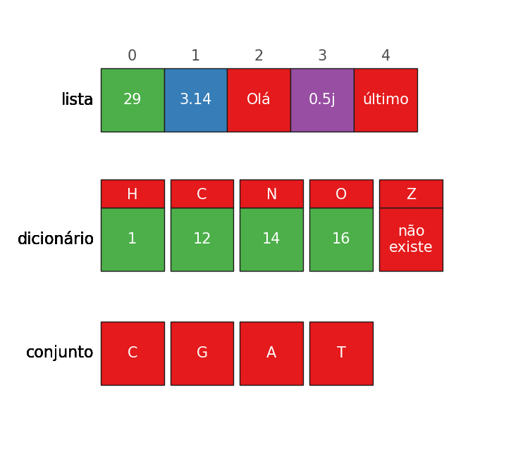

Coleções e iterações
====================

Revisão sobre objetos
---------------------

No capítulo anterior vimos que uma parte importante de um programa
consiste na criação e modificação dos valores de "objetos".

Estes objetos são, na verdade, representados na memória do computador. O
acesso a estes objetos é feito à custa de um *nome*.

A linguagem Python suporta uma variedade de tipos de objetos, dos quais
já vimos os números e as *strings*.

<div class="python_box">
``` python3
n_aminoácidos = 20 # número inteiro
bases = 'AUCG' # string

print(f'Existem {n_aminoácidos} e as bases do mRNA são {bases}')
```
</div>

```
Existem 20 e as bases do mRNA são AUCG
```

Objetos booleanos
-----------------

No Python existem mais dois objetos que representam os conceitos de *verdadeiro* e *falso*.
São eles `True` e `False` (começam por maiúscula).

Os resultados das condições, que muitas vezes usamos em `if...elif...else` são estes objetos.
Podemos obtê-los diretamente fazendo `print()` de condições lógicas, ou mesmo usando-os explicitamente:

<div class="python_box">
``` python3
a = 3.14
print(a > 2)
print(a > 5)
print(a > 2 and a < 5)
print(True and False)
print(True or False)
print(not True)
```
</div>

```
True
False
True
False
True
False
```

Coleções
--------

Este capítulo diz respeito a objetos designados genericamente por
"coleções".

!!! info "Definição"
    Coleções são objetos que contêm mais do que um valor.

As principais coleções usadas em Python são:

- **listas**
- **dicionários**
- **conjuntos**

Mas convém também englobar as *strings*, vistas no capítulo anterior, neste universo das coleções, uma vez
que partilham muitas das propriedades com as coleções acima referidas:

- *strings*

Uma definição muito breve e simples destas 3 coleções:



Uma lista (em inglês, *list*) é uma coleção de elementos em que cada um deles tem, implicitamente, uma *posição*.
Estas posições estão numeradas a partir de zero. A posição de um elemento chama-se *índice*.

Um dicionário (em inglês, *dictionary*) é uma coleção obtida pela associação de "chaves" a "valores". Cada elemento de um dicionário tem uma chave e um valor. Não existe uma ordenação implícita num dicionário, mas as chaves, que não se repetem,
têm um papel análogo aos índices das listas.

Um conjunto (em inglês, *set*) é apenas uma coleção de elementos que não se repetem, sem posições ou chaves. E, para já, não há mais nada a dizer sobre os conjuntos.

### Listas

As listas são uma das coleções da linguagem Python mais usadas.

Vejamos como definir listas.

São usados `[]` para definir, de uma forma literal, uma lista, separando os elementos por `,`.

<div class="python_box">
``` python3
vários = [2, 4, 3.1415, 'eu aqui', "fim da lista"]

print(vários)
```
</div>

```
[2, 4, 3.1415, 'eu aqui', 'fim da lista']
```

As listas são objetos e, por isso, podemos atribuír-lhes nomes. Como se pode ver no exemplo, foi atribuído o nome
`vários` a **toda a lista**. Este é um facto importante: um único nome serve para nos referirmos a toda a lista na sua globalidade.

As listas podem ter elementos de vários tipos, (números, *strings*, números complexos) e estes elementos podem
até ser o resultado de expressões:

<div class="python_box">
``` python3
a = [19, 14/2, 5.0**3, 'Bom dia']
b = 1
c = [b, b+1, (b+2)**3]

print('a =', a)
print('c =', c)
```
</div>

```
a = [19, 7.0, 125.0, 'Bom dia']
c = [1, 2, 27]
```

Neste exemplo, a lista `a` contem 3 números e uma *string*. O valor de
dois dos números é o resultado de uma expressão.

Note-se, também, que na lista `c` os valores dos elementos são
calculados usando o valor atribuído ao nome `b` para calcular os
elementos da lista.

### Indexação de listas

Uma propriedade fundamental das listas é que a ordem dos elementos tem
significado e cada um deles tem, implicitamente, uma posição, o seu *índice*.

Num programa podemos nos referir a **um só elemento** da lista a partir da sua posição,
fazendo uma "**indexação**" da lista com um número inteiro.

Um exemplo:

<div class="python_box">
``` python3
a = [19, 14/2, 5.0**3, 'Bom dia']
#    0    1      2        3

print(a[0])
print(a[1])
print(a[2])
print(a[3])
```
</div>

```
19
7.0
125.0
Bom dia
```

Neste exemplo, cada `print()` mostra um elemento diferente da lista.

Com uma indexação, obtemos o elemento que está na posição *i* de uma lista escrevendo

    <nome da lista>[i]

Isto é, usamos também aqui `[]` para indexar a lista, mas à frente do nome da lista.

Até podemos nem dar nome a uma lista. Podemos indexar logo a seguir à definição:

<div class="python_box">
``` python3
dias_abril = [31, 28, 31, 30, 31][3]

print(dias_abril)
```
</div>

```
30
```

Nota: os primeiros `[]` estão a definir a lista e os segundos `[]` a indexar a lista, obtendo o elemento que está na posição 3.

!!! question "As posições variam em que intervalo?"
    As posições **começam de zero** e vão até $n-1$ em que $n$ é o número de elementos da lista.

    São sempre números inteiros.

### Dicionários

!!! info "Definição"
    Dicionários são **associações** entre _chaves_ e _valores_.

<div class="python_box">
``` python3
d = {'H': 1, 'Li': 3, 'Na': 11, 'K': 19}
```
</div>

Neste exemplo,

`'H'`,`'Li'`,`'Na'`,`'K'`, são as **chaves** do dicionário

`1`, `3`, `11`, `19`, são os respetivos **valores**

Na definição de um dicionário

- são usadas `{}` para delimitar o dicionário
- são usadas `,` para separar cada par *chave: valor*
- são usados `:` para separar a *chave* do *valor* dentro de cada par.

### Indexação de dicionários

Ao contrário das listas, os elementos não têm posições, mas um dicionário pode ser
"**indexável**" utilizando as *chaves* para obter os respetivos valores:

<div class="python_box">
``` python3
d = {'H':1, 'Li':3, 'Na':11, 'K':19}

print('d =', d)

print(d['K'])
print(d['Li'])
```
</div>

```
d = {'H': 1, 'Li': 3, 'Na': 11, 'K': 19}
19
3
```

Para indexar um dicionário, obtemos o elemento que tem a chave *k* escrevendo

    <nome do dicionário>[k]

Isto é, usamos também aqui `[]` para indexar os dicionários.

Podemos até indexar logo a seguir a definir o dicionário:

<div class="python_box">
``` python3
n_K = {'H':1, 'Li':3, 'Na':11, 'K':19} ['K']

print('Número atómico do potássio é', n_K)
```
</div>

```
Número atómico do potássio é 19
```

### Strings e indexação de strings

Vimos as *strings* no capítulo anterior. Porquê introduzir aqui, num capítulo dedicado às coleções, as *strings* de novo?

!!! info "Definição"
    As _strings_ podem ser entendidas como uma **coleções de caracteres** (letras, símbolos, pontuação, espaços, números)

As *strings* são aparentadas com as listas: as _strings_ também têm uma numeração das posições dos caracteres, a contar do zero, e também são "indexáveis", isto é, podemos obter o caracter que está numa determinada posição, usando `[]`.

<div class="python_box">
``` python3
s = 'Eu sou uma pequena string'
#    0123456789

print(s[0])
print(s[3])
print(s[8])
```
</div>

```
E
s
m
```

Note-se que os espaços contam como caracteres.

### Conjuntos

Um conjunto (*set*) é uma coleção com características simples: é uma coleção de elementos sem chaves e sem posições.

<div class="python_box">
``` python3
aminoácidos = {'I', 'Y', 'P', 'W', 'C', 'M', 'R', 
               'L', 'K', 'H', 'V', 'D', 'F', 'N', 
               'S', 'T', 'A', 'G', 'Q', 'E'}

print(aminoácidos)
```
</div>

```
{'L', 'H', 'E', 'S', 'A', 'M', 'T', 'Y', 'R', 'C', 'V', 'D', 'G', 'N', 'F', 'K', 'Q', 'I', 'W', 'P'}
```

Ao definir um conjunto usamos `{}` para delimitar e separamos os elementos por `,`

A utilidade dos conjuntos torna-se mais clara sabendo que eles suportam operações típicas dos conjuntos da matemática, por exemplo a interseção e a reunião. Mais tarde veremos alguns exemplos.

Os conjuntos **não** são indexáveis.

Mas, uma curiosidade, não aceitam elementos repetidos:

<div class="python_box">
``` python3
bases = {'A', 'A', 'C', 'C', 'U', 'G'}

print(bases)
```
</div>

```
{'U', 'C', 'A', 'G'}
```

### Funções de listas, dicionários e conjuntos

Nos próximos dois capítulos serão apresentadas funções "associadas" a cada um destes tipos de coleções.
São estas funções que tornam a utilização de coleções muito poderosas.

Estas funções têm a forma geral

    coleção.função(argumentos)

Vejamos, desde já, um pequeno exemplo: a função `.count()`, que pode ser usada com listas e *strings*, conta número de elementos (ou caracteres).

<div class="python_box">
``` python3
# Quantas glicinas existem nesta sequência?
seq = 'MSSLVTLNNGLKMPLVGLGCWKIDKKVCANQIYEAIKLGYRLFDGACDYGNEKEVGEGIR'
nG = seq.count('G')
print(nG, 'glicinas')

# Quantos meses do ano têm 30 dias?
n_dias = [31, 28, 31, 30, 31, 30, 31, 31, 30, 31, 30, 31]
n30 = n_dias.count(30)
print(n30, 'meses têm 30 dias')
```
</div>

```
8 glicinas
4 meses têm 30 dias
```

As restantes funções serão o foco dos dois próximos capítulos (não todas) mas aqui vai a referência para as funções disponíveis na documentação do Python, em <docs.pyhton.org>:

[Funções de listas](https://docs.python.org/3/tutorial/datastructures.html#more-on-lists)

[Funções de *strings*](https://docs.python.org/3/library/stdtypes.html#string-methods)

[Funções de dicionários](https://docs.python.org/3/library/stdtypes.html#mapping-types-dict)

[Funções de conjuntos](https://docs.python.org/3/library/stdtypes.html#set)

As funções de *strings* são, de longe, as mais numerosas.

## `len()` e operador `in`

Apesar da especificidade de cada tipo de coleção, há três funcionalidades que são comuns a todas as
coleções:

-   determinar o número de elementos de uma coleção, com a função
    `len()`
-   testar se um valor faz parte de uma coleção, com o operador `in`
-   aplicar um conjunto de comandos a todos os elementos de uma coleção,
    uma a um, com o comando `for`

Comecemos pelas duas primeiras:

#### `len()` : número de elementos de uma coleção.

A função `len()` (abreviatura da palavra inglesa *length*) pode ser **aplicada a qualquer coleção**, tendo como resultado o 
**número de elementos** contidos nessa coleção.

<div class="python_box">
``` python3
a = [2,4,6,8,10, 'viria o 12', 'e depois o 14'] # lista
s = 'Eu sou uma pequena string' # string
d = {'H':1, 'Li':3, 'Na':11, 'K':19} # dicionário

print(len(a))
print(len(s))
print(len(d))
```
</div>

```
7
25
4
```

Repare-se que, no caso das *strings* todos os caracteres entram para a contagem como elementos da *string*. No caso dos dicionários, contamos o número de pares *chave: valor*.

Para objetos que definimos explicitamente a função `len()` não parece ter muita utilidade.

Imagine um programa maior, capaz de processar um número elevado de sequências de proteínas. O comprimento de uma proteína é uma característica importante. A função `len()` seria uma ferramenta importante num programa desses.

<div class="python_box">
``` python3
seq = 'MSSLVTLNNGLKMPLVGLGCWKIDKKVCANQIYEAIKLGYRLFDGACDYGNEKEVGEGIR'

print(f'A proteína\n{seq}')
print('tem', len(seq), 'aminoácidos')
```
</div>

```
A proteína
MSSLVTLNNGLKMPLVGLGCWKIDKKVCANQIYEAIKLGYRLFDGACDYGNEKEVGEGIR
tem 60 aminoácidos
```

### `in`: teste de inclusão

O "operador" `in` funciona como teste de inclusão: resulta `True`ou `False` consoante um
elemento está ou não contido numa coleção. Funciona com qualquer tipo de coleção.

<div class="python_box">
``` python3
nums = [1,2,3,4,5,6,7,8,9,10]
if 4 in nums:
    print(4, 'existe')
else:
    print(4, 'não existe')
```
</div>

```
4 existe
```

Um exemplo com *strings*:

<div class="python_box">
``` python3
seq = 'ATGGTCAAACTTGTTGACTGCAAATGCGTACGT'

if 'U' in seq:
    print('Existe', 'U')
else:
    print('Não existe', 'U')

if 'TGT' in seq:
    print('Existe', 'TGT')
else:
    print('Não existe', 'TGT')
```
</div>

```
Não existe U
Existe TGT
```
Repare-se no segundo exemplo: posso testar se existe uma *string* com mais do que um caracter.

Com dicionários, é verificado se um elemento está **nas chaves** ( e não nos valores):

<div class="python_box">
``` python3
grupo1 = {'H':1, 'Li':3, 'Na':11, 'K':19}

print('Mg' in grupo1)
```
</div>

```
False
```

Iterações: comando `for`
-----------------------

Um dos conceitos que pode ser aplicado a qualquer coleção, sendo, já agora, um dos mais poderosos conceitos da
linguagem Python (e de muitas outras linguagens de programação) consiste em aplicar um conjunto de
instruções ou comandos a **cada um dos elementos de uma coleção**, um a um.

**Iteração** é termo técnico muitas vezes utilizado para designar estas *repetições* de comandos elemento a elemento.

Em Python é usado o comado `for` para esse efeito.

É melhor começar com um exemplo:

!!! question "Problema"
    Mostrar uma tabela de raízes quadradas de 1 a 10

<div class="python_box">
``` python3
print('tabela de raízes quadradas')

nums = [1,2,3,4,5,6,7,8,9,10]

for n in nums:
    root = n**0.5
    print(n, root)
```
</div>

```
tabela de raízes quadradas
1 1.0
2 1.4142135623730951
3 1.7320508075688772
4 2.0
5 2.23606797749979
6 2.449489742783178
7 2.6457513110645907
8 2.8284271247461903
9 3.0
10 3.1622776601683795
```

O que se passou durante a execução deste programa?

O comando `for` provoca a repetição de um conjunto de comandos aplicando esses
comandos a todos os elementos de uma coleção, um a um.

(O número de repetições é igual ao número de elementos da coleção, uma vez que os comandos são aplicados a
todos os elementos mas à vez, um a um)

A estrutura geral do comando `for` é:


Vamos ao pormenor:

Os comandos que são repetidos são aqueles que estão nas linhas a seguir à linha do comando `for`
e "alinhadas" um pouco mais para o interior do texto do programa. No exemplo, essas linhas são

    root = n**0.5
    print(n, root)

Esse alinhamento interior (*indentação*), que, por convenção, são 4 espaços, define as linhas que contêm os
comando a repetir. Podemos por quaisquer comandos válidos nessas linhas.

Esta é uma regra geral da linguagem Python: **o alinhamento do começo
das linhas define blocos**. Já tínhamos visto a propósito dos
blocos `if...elif...else`.

As linhas a repetir fazem um cálculo de `root`, como a raíz quadrada de `n` (e print() de `n`e `root`).

O que é o `n`? De onde apareceu? Qual o seu valor?

O comando `for` define o `n`: `n`é o nome que é dado a **cada elemento** da lista `nums`, um a um.

**Cada vez que os comandos são repetidos, `n` toma um valor diferente**: da primeira vez é igual a 1, da segunda vez é igual a 2 e assim sucessivamente. `n` toma todos os valores da lista `nums`!

Porquê a lista `nums`? A coleção à qual vão ser aplicados os comandos a repetir é aquela que estiver à frente
de `in` e antes de `:` (naão esquecer os `:`, eles são obrigatórios, tal como o `for` e o `in`)

Recapitulando:


Em linguagem mais "humana" o comando `for` indica o seguinte procedimento:

> Para cada elemento da lista `nums`, e chamando esse elemento `n`, repita-se as duas linhas seguintes, `root = n**0.5` e `print(n, root)`.

Vamos ver alguns exemplos da utilização de um comando `for`.

!!! question "problema"
    Procurar um conjunto de números numa lista maior de números

<div class="python_box">
``` python3
nums = [1,2,3,4,5,6,7,8,9,10,11,15,27, 30, 40]
a_procurar = [1, 4, 7, 20, 40]

for n in a_procurar:
    if n in nums:
        print(n, 'existe na lista')
    else:
        print(n, 'não existe na lista')
```
</div>

```
4 existe na lista
7 existe na lista
20 não existe na lista
40 existe na lista
```

Usando um exemplo do capítulo anterior,

!!! question "Problema"
    Indicar quais os anos bissextos dentro de uma lista

<div class="python_box">
``` python3
# Anos bissextos (sem input())

anos = [2015, 2014, 2013, 2012, 2000, 1900, 1800]

for a in anos:
    if a % 4 == 0 and not (a % 100 == 0 and not a % 400 == 0):
        print(a , "é bissexto")
    else: 
        print(a, "nao é bissexto")
```
</div>

```
2015 nao é bissexto
2014 nao é bissexto
2013 nao é bissexto
2012 é bissexto
2000 é bissexto
1900 nao é bissexto
1800 nao é bissexto
```

A iteração de uma *string* com o comando `for` "percorre" todos os **caracteres** da `string`, incluíndo os espaços
e a pontuação:

<div class="python_box">
``` python3
seq = 'ATGGT CAAAC TTGTT'

for b in seq:
    print(b)
```
</div>

```
A
T
G
G
T

C
A
A
A
C

T
T
G
T
T
```

Um outro exemplo de `for` com uma *string*:

!!! question "Problema"
    Dada a sequência de uma proteína, indicar a presença de lisinas (K)

Passar por todos os aminoácidos da sequência é simples, usamos um comando
`for`. Para testar se estamos na presença de um **K**, usamos um `if`:

<div class="python_box">
``` python3
seq = 'ADKHLILTAVGGCWFHVAFWEVEKAGAHKWE'

for aa in seq:
    if aa == 'K':
        print(aa)
```
</div>

```
K
K
K
```

Vamos agora supor que temos uma pequena extensão deste problema:

!!! question "Problema"
    Dada a sequência de uma proteína, indicar a presença de lisinas (K) e leucinas (L)

Mais uma vez, percorremos os aminoácidos da sequência com `for`. Para
testar se estamos na presença de um K ou um L, usamos `in`para testar se o aminoácido pertence à *string* "KL".

<div class="python_box">
``` python3
seq = 'ADKHLILTAVGGCWFHVAFWEVEKAGAHKWE'

for aa in seq:
    if aa in 'KL':
        print(aa)
```
</div>

```
K
L
L
K
K
```

Ou, para visualizar bem a posição das lisinas e leucinas:

<div class="python_box">
``` python3
seq = 'ADKHLILTAVGGCWFHVAFWEVEKAGAHKWE'
print(seq)

for aa in seq:
    if aa in 'KL':
        print(aa, end='')
    else:
        print('-', end='')
```
</div>

```
ADKHLILTAVGGCWFHVAFWEVEKAGAHKWE
--K-L-L----------------K----K--
```

!!! info "print(, end=)"
    O argumento `end=` é usado na função `print()` para que não haja uma mudança de linha
    no final daquilo que é apresentado por esta função. A mudança de linha é substituída
    por qualquer outra *string*, indicada por `end=`.
    
    No caso deste exemplo é indicado `end=''` ou seja,
    absolutamente nada no final do `print()`. Isto faz com que os caracteres da segunda 
    linha apareçam consecutivamente e não em linhas separadas.

Finalmente, a iteração de um dicionário com o comando `for` "percorre" as **chaves** do dicionário
(apenas as chaves).

<div class="python_box">
``` python3
grupo1 = {'H':1, 'Li':3, 'Na':11, 'K':19}

print('elementos do grupo 1')

for e in grupo1:
    print(e)
```
</div>

```
H
Li
Na
K
```

Mas é fácil usar as chaves para obter uma tabela de chaves-valores, usando a indexação
do dicionário com cada uma das chaves. Compare-se este exemplo com o anterior:

<div class="python_box">
``` python3
grupo1 = {'H':1, 'Li':3, 'Na':11, 'K':19}

print('elementos do grupo 1')

for e in grupo1:
    print(e, grupo1[e])
```
</div>

```
elementos do grupo 1
H 1
Li 3
Na 11
K 19
```

## "Acumulações"


!!! question "Problema"
    Somar todos os numeros de 1 a 10

<div class="python_box">
``` python3
nums = [1,2,3,4,5,6,7,8,9,10]

s = 0
for i in nums:
    s = s + i

print('a soma de', nums, 'é', s)
```
</div>

```
a soma de [1, 2, 3, 4, 5, 6, 7, 8, 9, 10] é 55
```

A novidade neste exemplo é o uso de um "acumulador" de resultados parciais de uma operação.

Neste caso, o papel de `s` é o de "acumular" a soma de sucessivos
valores obtidos da iteração dos elementos da lista `nums`.

Inicialmente, antes do programa entrar no comando `for`, `s` tem o valor 0.
Cada vez que "passamos" a um novo valor `i`, isto é, a um novo valor da lista `nums`,
este é somado ao valor **anterior** de `s`, fazendo `s = s + i`. Assim, conseguimos
acumular a soma de todos os `i` e, no final das repetições do comando `for`, `s` é igual
à soma de todos os números.

É interessante mostrar os valores que estão associados a `s` ao longo
das repetições. Adaptando o programa anterior com algumas utilizações
adicionais da função `print()` podemos ver esses valores a mudar para
cada `i`:

<div class="python_box">
``` python3
nums = [1,2,3,4,5,6,7,8,9,10]

s = 0
for i in nums:
    print('i =', i)
    print('  s antes da soma', s)
    s = s + i
    print('  s depois da soma', s)

print(f'a soma é {s}')
```
</div>

```
i = 1
  s antes da soma 0
  s depois da soma 1
i = 2
  s antes da soma 1
  s depois da soma 3
i = 3
  s antes da soma 3
  s depois da soma 6
i = 4
  s antes da soma 6
  s depois da soma 10
i = 5
  s antes da soma 10
  s depois da soma 15
i = 6
  s antes da soma 15
  s depois da soma 21
i = 7
  s antes da soma 21
  s depois da soma 28
i = 8
  s antes da soma 28
  s depois da soma 36
i = 9
  s antes da soma 36
  s depois da soma 45
i = 10
  s antes da soma 45
  s depois da soma 55
a soma é 55
```

`range()`: gerador de números inteiros
--------------------------------------

!!! question "Problema"
    Somar todos os números de 1 a 1000

Poderíamos adaptar o programa anterior. Mas teríamos de 
criar uma lista com 1000 números consecutivos, explicitamente
(e manualmente).

Tem de haver uma solução melhor.

Usamos para o efeito a função `range()` que gera números inteiros
consecutivos e pode ser utilizada em vez de uma coleção no comando `for`:

<div class="python_box">
``` python3
s = 0

for i in range(1, 1001):
    s = s + i

print('a soma dos números de 1 a 1000 é', s)
```
</div>

```
a soma dos números de 1 a 1000 é 500500
```

A função `range()`, que pode ter até 3 argumentos,
`range(início, fim, passo)`, e gera uma sequência de **números inteiros**, desde um número inteiro inicial (o
*início*) até um número inteiro final **exclusivé** (o *fim*), com um
determinado espaçamento (o *passo*).

!!! note ""
    O número inicial e o "passo" são opcionais.

    Se forem omitidos,

    - o início é 0
    - o passo é 1

    Não esquecer que o valor do `fim` **é excluído**

Para melhor compreender estas regras, podemos mostrar os
resultados da função `range()`não num ciclo `for`, mas transformando
os resultados do `range()`numa lista.

Como fazê-lo? O Python tem uma outra função, `list()`, que tenta transformar
o seu argumento numa lista, se possível.

Um pequeno exemplo da função `list()` em ação:

<div class="python_box">
``` python3
seq = 'ATGGTCAAACTTGTT'
seql = list(seq)
print(seql)
```
</div>

```
['A', 'T', 'G', 'G', 'T', 'C', 'A', 'A', 'A', 'C', 'T', 'T', 'G', 'T', 'T']
```

Voltando agora às várias modalidades da função `range()`:


<div class="python_box">
``` python3
print('-- range(12) ----------')
# começa em 0, acaba em 12 (exclusivé),  e salta de 1 em 1.

nums = list(range(12))
print(nums)
```
</div>

```
-- range(12) ----------
[0, 1, 2, 3, 4, 5, 6, 7, 8, 9, 10, 11]
```

<div class="python_box">
``` python3
print('-- range(5, 12) ----------')
# começa em 5, acaba em 12 (exclusivé).

nums = list(range(5, 12))
print(nums)
```
</div>

```
-- range(5, 12) ----------
[5, 6, 7, 8, 9, 10, 11]
```

<div class="python_box">
``` python3
print('-- range(5, 12, 2) ----------')
# começa em 5, acaba em 12 (exclusivé) e salta de 2 em 2.

nums = list(range(5, 12, 2))
print(nums)
```
</div>

```
-- range(5, 12, 2) ----------
[5, 7, 9, 11]
```

!!! question "Problema"
    Calcular o factorial de 1000

<div class="python_box">
``` python3
fact = 1
for i in range(1, 1001):
    fact = fact * i

print('o factorial de 1000 é', fact)
```
</div>

```
o factorial de 1000 é 402387260077093773543702433923003985719374864210714632543799910429938512398629020592044208486969404800479988610197196058631666872994808558901323829669944590997424504087073759918823627727188732519779505950995276120874975462497043601418278094646496291056393887437886487337119181045825783647849977012476632889835955735432513185323958463075557409114262417474349347553428646576611667797396668820291207379143853719588249808126867838374559731746136085379534524221586593201928090878297308431392844403281231558611036976801357304216168747609675871348312025478589320767169132448426236131412508780208000261683151027341827977704784635868170164365024153691398281264810213092761244896359928705114964975419909342221566832572080821333186116811553615836546984046708975602900950537616475847728421889679646244945160765353408198901385442487984959953319101723355556602139450399736280750137837615307127761926849034352625200015888535147331611702103968175921510907788019393178114194545257223865541461062892187960223838971476088506276862967146674697562911234082439208160153780889893964518263243671616762179168909779911903754031274622289988005195444414282012187361745992642956581746628302955570299024324153181617210465832036786906117260158783520751516284225540265170483304226143974286933061690897968482590125458327168226458066526769958652682272807075781391858178889652208164348344825993266043367660176999612831860788386150279465955131156552036093988180612138558600301435694527224206344631797460594682573103790084024432438465657245014402821885252470935190620929023136493273497565513958720559654228749774011413346962715422845862377387538230483865688976461927383814900140767310446640259899490222221765904339901886018566526485061799702356193897017860040811889729918311021171229845901641921068884387121855646124960798722908519296819372388642614839657382291123125024186649353143970137428531926649875337218940694281434118520158014123344828015051399694290153483077644569099073152433278288269864602789864321139083506217095002597389863554277196742822248757586765752344220207573630569498825087968928162753848863396909959826280956121450994871701244516461260379029309120889086942028510640182154399457156805941872748998094254742173582401063677404595741785160829230135358081840096996372524230560855903700624271243416909004153690105933983835777939410970027753472000000000000000000000000000000000000000000000000000000000000000000000000000000000000000000000000000000000000000000000000000000000000000000000000000000000000000000000000000000000000000000000000000000000000000000000000000000000000000000000000000000000
```

Mais uma vez, temos de "acumular" os produtos parciais sucessivos. `fact` tem esse
papel. É análogo a `s` nos exemplos anteriores. Aqui a diferença é que
estamos a acumular produtos e, por isso, `fact` tem de ter o valor
inicial de 1 antes de começarem as repetições do comando `for`. Por outro
lado, `fact`deve multiplicar por cada valor novo de `i`, com `fact = fact * i`.

Agora um problema análogo, mas envolvendo *strings*:

!!! question "Problema"
    Obter a sequência da cadeia complementar de uma sequência de DNA

Se num programa tivermos uma *string* contendo uma sequência de um ácido
nucleico, então podemos percorrer todas as "bases" da sequência:

<div class="python_box">
``` python3
seq = 'ATGGTCAAACTTGTTGACTGCAAATGCGTACGT'

for b in seq:
    print(b, end=' ')
```
</div>

```
A T G G T C A A A C T T G T T G A C T G C A A A T G C G T A C G T 
```

Note-se o `end=' '` para deixar apenas um espaço no final de `print()`e não uma mudança de linha.

Agora podemos resolver o problema do cálculo da sequência complementar.

Parte da estratégia consiste em ir "adicionando" os símbolos das bases complementares a
uma *string* que, inicialmente, está vazia, isto é, é igual a `''` e, no fim das repetições,
"acumulou" todos os símbolos.

Temos também de "programar" o cálculo da base complementar. Para isso podemos seguir uma das quatro alternativas
para as quatro bases possíveis:

<div class="python_box">
``` python3
seq = 'ATGGTCAAACTTGTTGACTGCAAATGCGTACGT'

seqcomp = ''

for b in seq:
    if b == 'A':
        bcomp = 'T'
    elif b == 'T':
        bcomp = 'A'
    elif b == 'G':
        bcomp = 'C'
    else:
        bcomp = 'G'
    seqcomp = seqcomp + bcomp

print('sequência:   ', seq)
print('complementar:', seqcomp)
```
</div>

```
sequência:    ATGGTCAAACTTGTTGACTGCAAATGCGTACGT
complementar: TACCAGTTTGAACAACTGACGTTTACGCATGCA
```

Neste exemplo, as letras das bases complementares foram adicionadas, uma
a uma, à *string* `seqcomp`.

Antes da iteração com `for`, `seqcomp` é criada como uma "*string*
vazia". As duas aspas consecutivas na atribuição `seqcomp = ''` definem,
precisamente, uma uma "*string* vazia".

Em cada repetição adicionamos uma base complementar nova fazendo `seqcomp = seqcomp + bcomp`.

Convém relembrar que podemos "adicionar" *strings*.

O programa pode ser modificado (melhorado) eliminando os `if...elif...elif...else`.

A ideia é usar um dicionário que associe cada símbolo de uma base ao símbolo da sua base
complementar:

<div class="python_box">
``` python3
seq = 'ATGGTCAAACTTGTTGACTGCAAATGCGTACGT'

seqcomp = ''

complementares = {'A': 'T', 'T': 'A', 'C': 'G', 'G': 'C'}

for b in seq:
    seqcomp = seqcomp + complementares[b]

print('sequência:   ', seq)
print('complementar:', seqcomp)
```
</div>

```
sequência:    ATGGTCAAACTTGTTGACTGCAAATGCGTACGT
complementar: TACCAGTTTGAACAACTGACGTTTACGCATGCA
```

Nesta versão, vamos adicionando a `seqcomp` aquilo que obtemos indexando o dicionário com
cada uma das bases `b` da sequência. Ao indexarmos o dicionário, usando essa base `b` como chave (que é apenas uma letra), obtemos o símbolo da base complementar, como valor: `seqcomp = seqcomp + complementares[b]`.

Isto começa a complicar um pouco. Repare que, neste exemplo, misturamos:

- a iteração de *strings*, letra a letra
- a indexação (com `[]`) de um dicionário, que funciona como tabela para a transformação base &rarr; base complementar.
- a soma de *strings* e o truque de acumulação de resultados parciais.

Sem muito esforço, podemos formatar um pouco a apresentação das duas
cadeias, na vertical e pondo em evidência a correspondência entre as
bases, desenhando uma *escada da dupla hélice* :

<div class="python_box">
``` python3
seq = 'ATGGTCAAACTTGTTGACTGCAAATGCGTACGT'

complementares = {'A': 'T', 'T': 'A', 'C': 'G', 'G': 'C'}

for b in seq:
    print(b, '-', complementares[b])
```
</div>

```
A - T
T - A
G - C
G - C
T - A
C - G
A - T
A - T
A - T
C - G
T - A
T - A
G - C
T - A
T - A
G - C
A - T
C - G
T - A
G - C
C - G
A - T
A - T
A - T
T - A
G - C
C - G
G - C
T - A
A - T
C - G
G - C
T - A
```

Agora um problema mais elaborado:

!!! question "Problema"
    Converter uma sequência com códigos de uma letra de aminoácidos para
    códigos de 3 letras, usando um dicionário para a conversão.

<div class="python_box">
``` python3
trans = {'A': 'Ala', 'C': 'Cys', 'E': 'Glu', 'D': 'Asp',
         'G': 'Gly', 'F': 'Phe', 'I': 'Ile', 'H': 'His',
         'K': 'Lys', 'M': 'Met', 'L': 'Leu', 'N': 'Asn',
         'Q': 'Gln', 'P': 'Pro', 'S': 'Ser', 'R': 'Arg',
         'T': 'Thr', 'W': 'Trp', 'V': 'Val', 'Y': 'Tyr'}

# Problema: transformar seq1 numa string com os códigos de 3 letras dos aa
seq1 = 'ADKLITCWFHHWE'

seq3 = ''
for aa in seq1:
    seq3 = seq3 + trans[aa] + '-'

print(seq1, 'é o mesmo que ', seq3)
```
</div>

```
ADKLITCWFHHWE é o mesmo que  Ala-Asp-Lys-Leu-Ile-Thr-Cys-Trp-Phe-His-His-Trp-Glu-
```

## Somas e fatoriais: a maneira simples

Os exemplos de acumulações numéricas, somas e fatorial foram resolvidos com acumuladores de
forma a mostrar o conceito subjacente a todas as acumulações.

No entanto, o Python tem funções para calcular somas e fatoriais. Naturalmente, é muito mais simples utilizar estas funções.

Para somas existe a função `sum()`:

<div class="python_box">
``` python3
s = sum(range(1, 1001))

print('a soma dos números de 1 a 1000 é', s)
```
</div>

```
a soma dos números de 1 a 1000 é 500500
```

Para fatoriais existe a função `factorial()`, mas pertence ao módulo `math`:

<div class="python_box">
``` python3
import math
f = math.factorial(100)

print('100! =', f)
```
</div>

```
100! = 93326215443944152681699238856266700490715968264381621468592963895217599993229915608941463976156518286253697920827223758251185210916864000000000000000000000000
```

## Função `enumerate()`

Voltando agora ao problema da pesquisa de certos aminoácidos numa sequência,
poderá ser útil indicar não só a presença de um aminoácido mas também
a posição em que eles são encontrados:

!!! question "Problema"
    Dada a sequência de uma proteína, indicar a presença de 
    lisinas (K) e leucinas (L), construíndo uma tabela com posições e
    códigos K ou L

Podemos usar um **contador** das posições dos aminoácidos,
"acumulando" a soma de 1 por aminoácido:

<div class="python_box">
``` python3
seq = 'ADKHLILTAVGGCWFHVAFWEVEKAGAHKWE'

i = 0
for aa in seq:
    if aa in 'KL':
        print(i, ':', aa)
    i = i + 1
```
</div>

```
2 : K
4 : L
6 : L
23 : K
28 : K
```

O "acumulador" é o `i`: cada vez que se processa um aminoácido novo, a
atribuição `i = i + 1` aumenta uma unidade ao valor de `i` , fazendo com que `i` vá
"contando" os aminoácidos.

É tão frequente a necessidade de percorrer os elementos de uma coleção
e, simultaneamente, aceder às posições desses elementos, que a linguagem
Python tem uma função para combinar os dois "aos pares", a função `enumerate()`.

Vejamos o que resulta da aplicação da função `enumerate()` a uma *string*:

<div class="python_box">
``` python3
seq = 'ADKHLILTAVGGCWFHVAFWEVEKAGAHKWE'

for x in enumerate(seq):
    print(x)
```
</div>

```
(0, 'A')
(1, 'D')
(2, 'K')
(3, 'H')
(4, 'L')
(5, 'I')
(6, 'L')
(7, 'T')
(8, 'A')
(9, 'V')
(10, 'G')
(11, 'G')
(12, 'C')
(13, 'W')
(14, 'F')
(15, 'H')
(16, 'V')
(17, 'A')
(18, 'F')
(19, 'W')
(20, 'E')
(21, 'V')
(22, 'E')
(23, 'K')
(24, 'A')
(25, 'G')
(26, 'A')
(27, 'H')
(28, 'K')
(29, 'W')
(30, 'E')
```

ou seja, conseguimos percorrer a *string*, mas obtemos pares do tipo
*(posição, elemento)*.

O mais interessante é que, no comando `for` com a função
`enumerate()`podemos usar um **par de nomes** para nos referirmos
simultaneamente à posição e ao elemento. Isto é chamado *desdobramento*.

<div class="python_box">
``` python3
seq = 'ADKHLILTAVGGCWFHVAFWEVEKAGAHKWE'

for (i, a) in enumerate(seq):
    print(i, ':', a)
```
</div>

```
0 : A
1 : D
2 : K
3 : H
4 : L
5 : I
6 : L
7 : T
8 : A
9 : V
10 : G
11 : G
12 : C
13 : W
14 : F
15 : H
16 : V
17 : A
18 : F
19 : W
20 : E
21 : V
22 : E
23 : K
24 : A
25 : G
26 : A
27 : H
28 : K
29 : W
30 : E
```

Na linguagem Python há várias situações em que podemos fazer
desdobramentos de nomes. Um caso que vimos anteriormente é nos comandos
de atribuição de nomes a valores, em que podemos escrever, por exemplo,

    a, b, c = 1, 4, 1

Este comando desdobra os nomes para os respetivos valores, resultando daqui
que várias atribuições de nomes podem ser escritas na mesma linha.

Usando a função `enumerate()`, o problema de tabelar as posições das
leucinas e argininas pode ser escrito de uma forma mais compacta, sem
usar explicitamente um "contador da posição":

<div class="python_box">
``` python3
seq = 'ADKHLILTAVGGCWFHVAFWEVEKAGAHKWE'

for i, aa in enumerate(seq):
    if aa in 'KL':
        print(i, ':', aa)
```
</div>

```
2 : K
4 : L
6 : L
23 : K
28 : K
```
A função `enumerate()`não se aplica só a *strings*. Ela funciona com qualquer tipo de coleção.

Com listas, obtemos as posições de cada elemento da lista, como seria de esperar,
mas com dicionários e conjuntos a função `enumerate()` também funciona, embora as posições que
se vão obtendo não correspondam necessariamente a nenhuma ordem lógica dos elementos, que não existe neste tipo de coleções.

## Comados `for` encaixados.

Podemos "encaixar" comandos `for` dentro de outros comandos `for`. O
efeito é que, para cada iteração de um ciclo `for` mais "exterior"
percorremos todos os elementos da coleção num comando `for` mais
"interior".

O melhor será ilustrar com um exemplo clássico, com três níveis de
comandos `for`:

!!! question "Problema"
    Gerar os 64 codões do código genético

<div class="python_box">
``` python3
bases = 'AUGC'

for b1 in bases:
    for b2 in bases:
        for b3 in bases:
            c = b1 + b2 + b3
            print(c, end=' ')
```
</div>

```
AAA AAU AAG AAC AUA AUU AUG AUC AGA AGU AGG AGC ACA ACU ACG ACC UAA UAU UAG UAC UUA UUU UUG UUC UGA UGU UGG UGC UCA UCU UCG UCC GAA GAU GAG GAC GUA GUU GUG GUC GGA GGU GGG GGC GCA GCU GCG GCC CAA CAU CAG CAC CUA CUU CUG CUC CGA CGU CGG CGC CCA CCU CCG CCC
```

## Comando `break`

O comando `break` permite uma *saída prematura* de uma iteração: podemos
não chegar ao fim de todos os elementos da coleção que está a ser
iterada se passarmos por um comando `break`.

Tem utilidade desde que seja utilizado com um `if` para testar uma
condição.

**Problema: obter um esquema das correspondências entre uma sequência de
DNA e a sequência complementar, mas parar assim que for encontrado um
par C - G.**

<div class="python_box">
``` python3
seq = 'ATGGTTAAACTTGTTGACTGCAAATGCGTACGT'

complementares = {'A': 'T', 'T': 'A', 'C': 'G', 'G': 'C'}

for b in seq:
    print(b, '-', complementares[b])
    if b == 'C':
        break
```
</div>

```
A - T
T - A
G - C
G - C
T - A
T - A
A - T
A - T
A - T
C - G
```

## Comando `continue`


Muito semelhante ao comando `break` é o comando `continue`.

Este não força uma *saída prematura* de uma iteração: o seu efeito é
**passar imediatamente para a iteração seguinte**, como se voltassemos à
linha imediatamente a seguir ao comando `for`, mas já para o elemento
seguinte da coleção.

Vejamos com um exemplo:

**Problema: obter um esquema das correspondências entre uma sequência de
DNA e a sequência complementar. Saltar todos as ligações A - T.**

<div class="python_box">
``` python3
seq = 'ATGGTTAAACTTGTTGACTGCAAATGCGTACGT'

complementares = {'A': 'T', 'T': 'A', 'C': 'G', 'G': 'C'}

for b in seq:
    if b in 'AT':
        continue
    print(b, '-', complementares[b])
```
</div>

```
G - C
G - C
C - G
G - C
G - C
C - G
G - C
C - G
G - C
C - G
G - C
C - G
G - C
```

Comando `while`
---------------

O comando `while` é uma outra forma de repetirmos algumas linhas dentro
de um programa. Nisto é semelhante a um comando `for`.

No entanto, o comando `while` está associado ao facto de uma condição
permanecer verdadeira ou não. Enquanto que num comando `for` percorremos
os elementos de uma coleção, o comando `while` pode não ter nada a ver
com os elementos de uma coleção.

O comando `while` é escrito como um bloco de linhas que é executado
enquanto uma condição for verdadeira:

<div class="python_box">
``` python3
#contagem decrescente
count = 10
while count > 0:
    print(count)
    count = count - 1
print('kabum!')
```
</div>

```
10
9
8
7
6
5
4
3
2
1
kabum!
```

O comando `while` é pouco usado na linguagem Python. É mais frequente
repetirmos operações enquanto percorremos os elementos de uma coleção.
Por isso, o comando `for` é mais usado do que o comando `while`.
