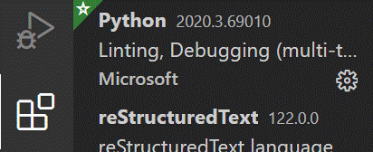

# Exercícios sobre conceitos fundamentais

## Software

- *Python Shell* ou *Idle com Python Shell*
- *Visual Studio Code*.

## Exercício 1 (Números, *strings*, números complexos)

1. Abra uma Python Shell ou uma Python Shell no Idle.
1. Corra todos os comandos da secção 1.1 do livro.
2. Familiarize-se com
    - Números
    - Números em vírgula flutuante (com casas decimais)
    - *Strings*
    - Números complexos
    - Dar nomes a objetos

## Exercício 2 (cálculos simples)

Ainda na *Python Shell*, calcule

1. O número de codões no código genético (4<sup>3</sup>)
2. O número de diferentes sequências possíveis num péptido com 50 aminoácidos (20<sup>50</sup>)
3. A **percentagem** de vitórias de uma equipa que conseguiu vencer 30 jogos em 46 disputados.

## Exercício 3 (VSCode e "número de ouro")

- Crie uma pasta de trabalho onde irá criar uma série de programas em Python

!!! Note "Nota"
    Um programa em Python deve ter um nome acabado em `.py`

Os programas vão ser criados como ficheiros de texto editados com o VSCode.

- Abra o editor de texto *Visual Studio Code*. Para isso, use o botão direito sobre a pasta e selecione "Open with Code":
- 
- Verifique que a extensão Python está instalada:
- 
- Inicie um ficheiro novo, com *File – New File*.
- Escreva um programa que calcule e mostre, com `print()`, a "proporção de ouro", isto é, o número

    phi = (1+√5)/2 e também o seu quadrado e seu inverso.

!!! warning "Importante"
    Logo que começar a escrever o programa deve salvá-lo o mais depressa
    possível com *File – Save As…*!
    
    Deve-lhe dar um nome acabado em `.py`, por exemplo `phi.py`.

!!! note "Nota"
    Se o VSCode indicar que falta selecionar um “Python interpreter”, deve escolher o interpretador instalado do Anaconda, clicando no canto inferior esquedo onde diz “No Interpreter”. Depois de escolher, deve ver o seguinte no canto inferior esquerdo do VSCode:

    

- Familiarize-se com a edição de um programa no *VSCode*. Use alguns *shortcuts* do teclado: `Home` e `End`. `Ctrl-C (copy)`, `Ctrl-V (paste)`. Selecione com o rato e com o teclado. 
- Execute (corra) o programa. Para isso utilize o botão no canto superior direito
    
- Observe o resultado do programa. Corra o programa outra vez. 
- Note as propriedades $\phi^2 = \phi +1$ e $1 / \phi = \phi  - 1$

## Exercício 4 (&deg;C para &deg;F)

Escreva um outro programa (faça *File – New File* para criar um novo programa) que calcula os graus Farenheit correspondentes a 36.5 graus Celsius. Não se esqueça de salvar o programa com um nome acabado em `.py`. A fórmula de conversão é:

&deg;F = 32 + (9/5) * &deg;C

Use a função `print()` com *strings* para apresentar mensagens explicativas sobre o resultado (tipo *36.5 graus Celsius são ....*)

## Exercício 5 (`import` e função `input()`)

Escreva o seguinte programa novo (sugestão: copy-paste).

Note que há muita coisa neste programa um pouco avançada,
mas o objetivo é ilustrar a função `input()`:

<div class="python_box">
``` python3
from datetime import datetime
import locale
locale.setlocale(locale.LC_ALL, "pt_PT.utf8")

print('Programa: tempo até agora')

name = input('Qual o seu nome? ')
day = input('Em que dia nasceu? ')
month = input('Em que mês nasceu (1-12)? ')
year = input('Em que ano nasceu? ')

year = int(year)
month = int(month)
day = int(day)

birth = datetime(year, month, day)
now = datetime.now()

dif = now - birth

print(f'\n{name}, o seu tempo de vida é')
print(dif)
print('ou seja,', int(dif.total_seconds()), 'segundos')
print('Nasceu em', birth.strftime("%d %B %Y, %A"))
```
</div>

Este programa usa o módulo `datetime` para realizar cálculos com datas e tempos. Para isso é necessário fazer `from datetime import datetime` no início do programa.

Corra o programa e observe que, no terminal de resultados, o programa pára em cada função `input()`, “pedindo” a introdução de um valor:


O programa só continua fazendo `Enter`, após a introdução de cada valor.

!!! note "Nota"
    Para correr o programa do princípio pode sempre “destruír” os resultados anteriores de um programa usando o botão
    
    

## Exercício 6 (Acesso programático à UniProt)

- Escreva e corra o seguinte programa (novo, com outro nome, outro ficheiro .py):

<div class="python_box">
``` python3
import requests

proteína = 'P00924'
link = f'http://www.uniprot.org/uniprot/{proteína}.fasta'

página = requests.get(link).text

print('Sequência da proteína', proteína, 'é')
print(página)
```
</div>

- Escreva um novo programa semelhante mudando `.fasta` para  `.txt`.

## Exercício 7 (Solução de equação 1º grau)

- Escreva o seguinte programa:

<div class="python_box">
``` python3
"""Cálculo da solução de uma equação do 1º grau 0 = mx + b."""

m = input('declive (m) = ')
b = input('ordenada na origem (b) = ')

m = float(m)
b = float(b)

r = -b / m
print(f'raíz = {r}')
```
</div>

- Corra o programa e observe os resultados. Experimente correr várias vezes, com diferentes valores de m e b para teste. Inclua um teste com m = 0.

- Corrija o programa de forma a não dar erro com m = 0. Para isso modifique o programa da seguinte maneira:

<div class="python_box">
``` python3
"""Cálculo da raíz de uma equação do 1º grau 0 = mx + b."""

m = input('declive (m) = ')
b = input('ordenada na origem (b) = ')

m = float(m)
b = float(b)

if m == 0:
    print('Reta horizontal: não há raízes')
else:
    r = -b / m
    print(f'raíz = {r}')
```
</div>

Explicação: a parte `if... else ...` faz com que o programa execute **em alternativa** certas partes, consoante o valor de uma condição. Neste exemplo, a condição é m == 0.

## Exercício 8 (Solução equação do 2º grau)

- Escreva um programa que calcule as duas soluções de uma equação do segundo grau

$a \cdot x^2 + b \cdot x + c = 0$

- Para testar o programa, corra com diferentes valores para a, b e c:
    - a = 1, b = 4, c = 2 dá duas soluções reais.
    - a = 1, b = 2, c = 1 dá uma solução dupla: -1
    - a = 1, b = 1, c = 1 dá duas soluções complexas. 

## Exercício 9 (Conversão entre F e ω)

- Escreva um programa que converta a velocidade angular de rotação (ω em 10<sup>3</sup> rpm) em força centrípeta (F, em *g*), dado o raio de um rotor de centrifugação (r, em mm). 

A fórmula (**usando aquelas unidades**)  é:

$F = 1.12 \cdot r \cdot \omega^2$

- Teste o programa com r = 108 mm, ω = 10 x 10<sup>3</sup> rpm F = 12 096 *g*

- Escreva outro programa que faça a conversão contrária (de *g* para rpm).
