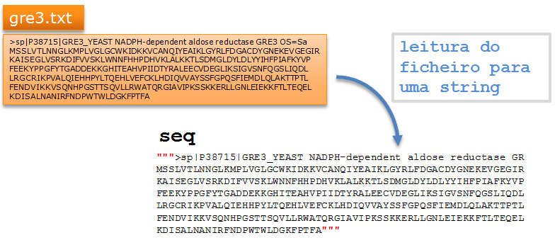

Ficheiros de texto
==================

Leitura
-------

O modelo mais simples é ler todo o conteúdo de um ficheiro para uma
*string*:



A leitura de um ficheiro segundo este modelo é feito através da função
`.read()`.

Mas o processo é um pouco mais complicado do que o uso simples de uma
função.

O acesso (programático) a um ficheiro existente num computador requer
que num programa se indique que esse acesso vai começar, a *abertura* de
um ficheiro e que o acesso vai terminar, o *fecho* de um ficheiro.

### `.read()`, com `open()` e `close()` explícitos

<div class="python_box">
``` python3
a = open('eno1.fasta')
seq = a.read()
a.close()

print(type(seq))

print('A sequência, em FASTA é')
print(seq)
```
</div>

```
<class 'str'>
A sequência, em FASTA é
>gi|398366315|ref|NP_011770.3| Eno1p [Saccharomyces cerevisiae S288c]
MAVSKVYARSVYDSRGNPTVEVELTTEKGVFRSIVPSGASTGVHEALEMRDGDKSKWMGKGVLHAVKNVN
DVIAPAFVKANIDVKDQKAVDDFLISLDGTANKSKLGANAILGVSLAASRAAAAEKNVPLYKHLADLSKS
KTSPYVLPVPFLNVLNGGSHAGGALALQEFMIAPTGAKTFAEALRIGSEVYHNLKSLTKKRYGASAGNVG
DEGGVAPNIQTAEEALDLIVDAIKAAGHDGKIKIGLDCASSEFFKDGKYDLDFKNPNSDKSKWLTGPQLA
DLYHSLMKRYPIVSIEDPFAEDDWEAWSHFFKTAGIQIVADDLTVTNPKRIATAIEKKAADALLLKVNQI
GTLSESIKAAQDSFAAGWGVMVSHRSGETEDTFIADLVVGLRTGQIKTGAPARSERLAKLNQLLRIEEEL
GDNAVFAGENFHHGDKL
```

### `.read()`, dentro do bloco de um comando `with`

Numa versão mais "moderna" podemos abrir e **automaticamente fechar** o
ficheiro é utilizar o comando `with`:

<div class="python_box">
``` python3
with open('eno1.fasta') as a:
    seq = a.read()

print('A sequência, em FASTA é')
print(seq)
```
</div>

```
A sequência, em FASTA é
>gi|398366315|ref|NP_011770.3| Eno1p [Saccharomyces cerevisiae S288c]
MAVSKVYARSVYDSRGNPTVEVELTTEKGVFRSIVPSGASTGVHEALEMRDGDKSKWMGKGVLHAVKNVN
DVIAPAFVKANIDVKDQKAVDDFLISLDGTANKSKLGANAILGVSLAASRAAAAEKNVPLYKHLADLSKS
KTSPYVLPVPFLNVLNGGSHAGGALALQEFMIAPTGAKTFAEALRIGSEVYHNLKSLTKKRYGASAGNVG
DEGGVAPNIQTAEEALDLIVDAIKAAGHDGKIKIGLDCASSEFFKDGKYDLDFKNPNSDKSKWLTGPQLA
DLYHSLMKRYPIVSIEDPFAEDDWEAWSHFFKTAGIQIVADDLTVTNPKRIATAIEKKAADALLLKVNQI
GTLSESIKAAQDSFAAGWGVMVSHRSGETEDTFIADLVVGLRTGQIKTGAPARSERLAKLNQLLRIEEEL
GDNAVFAGENFHHGDKL
```

O comando `with` faz o ficheiro permanecer *aberto* até ao fim do
"bloco", (também aqui) indicado pelo alinhamento mais à direita de um ou
mais comandos a seguir à linha em que se encontra o `with`. Quando
termina o bloco o ficheiro é fechado sem usar a função `close()`.

Além de `read()`, em que todo o conteúdo de um ficheiro é lido para uma
*string*, existem outras maneiras de ler um ficheiro.

### `.readlines()`

A função `readlines()` lê e separa **as linhas** de um ficheiro para uma
lista:

<div class="python_box">
``` python3
with open('eno1.fasta') as a:
    seq = a.readlines()

print(seq)
```
</div>

```
['>gi|398366315|ref|NP_011770.3| Eno1p [Saccharomyces cerevisiae S288c]\n', 'MAVSKVYARSVYDSRGNPTVEVELTTEKGVFRSIVPSGASTGVHEALEMRDGDKSKWMGKGVLHAVKNVN\n', 'DVIAPAFVKANIDVKDQKAVDDFLISLDGTANKSKLGANAILGVSLAASRAAAAEKNVPLYKHLADLSKS\n', 'KTSPYVLPVPFLNVLNGGSHAGGALALQEFMIAPTGAKTFAEALRIGSEVYHNLKSLTKKRYGASAGNVG\n', 'DEGGVAPNIQTAEEALDLIVDAIKAAGHDGKIKIGLDCASSEFFKDGKYDLDFKNPNSDKSKWLTGPQLA\n', 'DLYHSLMKRYPIVSIEDPFAEDDWEAWSHFFKTAGIQIVADDLTVTNPKRIATAIEKKAADALLLKVNQI\n', 'GTLSESIKAAQDSFAAGWGVMVSHRSGETEDTFIADLVVGLRTGQIKTGAPARSERLAKLNQLLRIEEEL\n', 'GDNAVFAGENFHHGDKL\n', '\n']
```

O que são os `\n` no fim das *strings*?

**Numa string,** `\n` **indica a mudança de linha**. (Conta como apenas
**1** caractere).

Neste caso eles aparecem porque no ficheiro original há mudanças de
linha.

Muitas vezes, é necessário elimina-los. Para isso podemos usar a função
`.strip()`:

<div class="python_box">
``` python3
with open('eno1.fasta') as a:
    seq = a.readlines()

seq = [linha.strip() for linha in seq]
print(seq)
```
</div>

```
['>gi|398366315|ref|NP_011770.3| Eno1p [Saccharomyces cerevisiae S288c]', 'MAVSKVYARSVYDSRGNPTVEVELTTEKGVFRSIVPSGASTGVHEALEMRDGDKSKWMGKGVLHAVKNVN', 'DVIAPAFVKANIDVKDQKAVDDFLISLDGTANKSKLGANAILGVSLAASRAAAAEKNVPLYKHLADLSKS', 'KTSPYVLPVPFLNVLNGGSHAGGALALQEFMIAPTGAKTFAEALRIGSEVYHNLKSLTKKRYGASAGNVG', 'DEGGVAPNIQTAEEALDLIVDAIKAAGHDGKIKIGLDCASSEFFKDGKYDLDFKNPNSDKSKWLTGPQLA', 'DLYHSLMKRYPIVSIEDPFAEDDWEAWSHFFKTAGIQIVADDLTVTNPKRIATAIEKKAADALLLKVNQI', 'GTLSESIKAAQDSFAAGWGVMVSHRSGETEDTFIADLVVGLRTGQIKTGAPARSERLAKLNQLLRIEEEL', 'GDNAVFAGENFHHGDKL', '']
```

Ou, de uma forma sucinta, usando uma lista em compreensão:

<div class="python_box">
``` python3
with open('eno1.fasta') as a:
    seq = [linha.strip() for linha in a.readlines()]
print(seq)
```
</div>

```
['>gi|398366315|ref|NP_011770.3| Eno1p [Saccharomyces cerevisiae S288c]', 'MAVSKVYARSVYDSRGNPTVEVELTTEKGVFRSIVPSGASTGVHEALEMRDGDKSKWMGKGVLHAVKNVN', 'DVIAPAFVKANIDVKDQKAVDDFLISLDGTANKSKLGANAILGVSLAASRAAAAEKNVPLYKHLADLSKS', 'KTSPYVLPVPFLNVLNGGSHAGGALALQEFMIAPTGAKTFAEALRIGSEVYHNLKSLTKKRYGASAGNVG', 'DEGGVAPNIQTAEEALDLIVDAIKAAGHDGKIKIGLDCASSEFFKDGKYDLDFKNPNSDKSKWLTGPQLA', 'DLYHSLMKRYPIVSIEDPFAEDDWEAWSHFFKTAGIQIVADDLTVTNPKRIATAIEKKAADALLLKVNQI', 'GTLSESIKAAQDSFAAGWGVMVSHRSGETEDTFIADLVVGLRTGQIKTGAPARSERLAKLNQLLRIEEEL', 'GDNAVFAGENFHHGDKL', '']
```

Com ficheiros muito grandes, a leitura pelas funções `.read()` e
`.readlines()` pode esgotar a memória de um computador e "congelar" um
programa.

Existe uma terceira maneira de ler um ficheiro (que não traz problemas
com ficheiros grandes):

### Iteração de ficheiros com `for`.

**A iteração de um ficheiro "percorre" as linhas do ficheiro**

<div class="python_box">
``` python3
with open('eno1.fasta') as a:
    for linha in a:
        linha = linha.strip()
        print('Linha:', linha)
```
</div>

```
Linha: >gi|398366315|ref|NP_011770.3| Eno1p [Saccharomyces cerevisiae S288c]
Linha: MAVSKVYARSVYDSRGNPTVEVELTTEKGVFRSIVPSGASTGVHEALEMRDGDKSKWMGKGVLHAVKNVN
Linha: DVIAPAFVKANIDVKDQKAVDDFLISLDGTANKSKLGANAILGVSLAASRAAAAEKNVPLYKHLADLSKS
Linha: KTSPYVLPVPFLNVLNGGSHAGGALALQEFMIAPTGAKTFAEALRIGSEVYHNLKSLTKKRYGASAGNVG
Linha: DEGGVAPNIQTAEEALDLIVDAIKAAGHDGKIKIGLDCASSEFFKDGKYDLDFKNPNSDKSKWLTGPQLA
Linha: DLYHSLMKRYPIVSIEDPFAEDDWEAWSHFFKTAGIQIVADDLTVTNPKRIATAIEKKAADALLLKVNQI
Linha: GTLSESIKAAQDSFAAGWGVMVSHRSGETEDTFIADLVVGLRTGQIKTGAPARSERLAKLNQLLRIEEEL
Linha: GDNAVFAGENFHHGDKL
Linha: 
```

Podemos até usar a função `enumerate()` com um ficheiro. São gerados os
pares de valores

`(num linha, linha)`.

<div class="python_box">
``` python3
with open('eno1.fasta') as a:
    for i, linha in enumerate(a):
        linha = linha.strip()
        print('linha', i, ':', linha)
```
</div>

```
linha 0 : >gi|398366315|ref|NP_011770.3| Eno1p [Saccharomyces cerevisiae S288c]
linha 1 : MAVSKVYARSVYDSRGNPTVEVELTTEKGVFRSIVPSGASTGVHEALEMRDGDKSKWMGKGVLHAVKNVN
linha 2 : DVIAPAFVKANIDVKDQKAVDDFLISLDGTANKSKLGANAILGVSLAASRAAAAEKNVPLYKHLADLSKS
linha 3 : KTSPYVLPVPFLNVLNGGSHAGGALALQEFMIAPTGAKTFAEALRIGSEVYHNLKSLTKKRYGASAGNVG
linha 4 : DEGGVAPNIQTAEEALDLIVDAIKAAGHDGKIKIGLDCASSEFFKDGKYDLDFKNPNSDKSKWLTGPQLA
linha 5 : DLYHSLMKRYPIVSIEDPFAEDDWEAWSHFFKTAGIQIVADDLTVTNPKRIATAIEKKAADALLLKVNQI
linha 6 : GTLSESIKAAQDSFAAGWGVMVSHRSGETEDTFIADLVVGLRTGQIKTGAPARSERLAKLNQLLRIEEEL
linha 7 : GDNAVFAGENFHHGDKL
linha 8 : 
```

**Problema: ler uma ficheiro FASTA e separar o cabeçalho da sequência em
duas strings (juntando toda a sequência numa só string)**

<div class="python_box">
``` python3
with open('eno1.fasta') as a:
    linhas = [k.strip() for k in a.readlines()]

header = linhas[0]
# usamos um slice de uma lista de 1 até ao fim
outras = linhas[1:]
# e a funçao .join() com separador vazio para
# juntá-las
seq = ''.join(outras)

print("cabeçalho:", header)
print('sequência, com', len(seq), 'aminoácidos:')
print(seq)
```
</div>

```
cabeçalho: >gi|398366315|ref|NP_011770.3| Eno1p [Saccharomyces cerevisiae S288c]
sequência, com 437 aminoácidos:
MAVSKVYARSVYDSRGNPTVEVELTTEKGVFRSIVPSGASTGVHEALEMRDGDKSKWMGKGVLHAVKNVNDVIAPAFVKANIDVKDQKAVDDFLISLDGTANKSKLGANAILGVSLAASRAAAAEKNVPLYKHLADLSKSKTSPYVLPVPFLNVLNGGSHAGGALALQEFMIAPTGAKTFAEALRIGSEVYHNLKSLTKKRYGASAGNVGDEGGVAPNIQTAEEALDLIVDAIKAAGHDGKIKIGLDCASSEFFKDGKYDLDFKNPNSDKSKWLTGPQLADLYHSLMKRYPIVSIEDPFAEDDWEAWSHFFKTAGIQIVADDLTVTNPKRIATAIEKKAADALLLKVNQIGTLSESIKAAQDSFAAGWGVMVSHRSGETEDTFIADLVVGLRTGQIKTGAPARSERLAKLNQLLRIEEELGDNAVFAGENFHHGDKL
```

Às vezes os ficheiros não têm cabeçalho! É melhor testar se a primeira
linha começa por "&gt;" !

<div class="python_box">
``` python3
with open('eno1.fasta') as a:
    linhas = [k.strip() for k in a]

if linhas[0].startswith('>'):
    header = linhas[0]
    seq = ''.join(linhas[1:])
else:
    header = ""
    seq = ''.join(linhas)

print("cabeçalho:", header)
print('sequência, com', len(seq), 'aminoácidos:')
print(seq)
```
</div>

```
cabeçalho: >gi|398366315|ref|NP_011770.3| Eno1p [Saccharomyces cerevisiae S288c]
sequência, com 437 aminoácidos:
MAVSKVYARSVYDSRGNPTVEVELTTEKGVFRSIVPSGASTGVHEALEMRDGDKSKWMGKGVLHAVKNVNDVIAPAFVKANIDVKDQKAVDDFLISLDGTANKSKLGANAILGVSLAASRAAAAEKNVPLYKHLADLSKSKTSPYVLPVPFLNVLNGGSHAGGALALQEFMIAPTGAKTFAEALRIGSEVYHNLKSLTKKRYGASAGNVGDEGGVAPNIQTAEEALDLIVDAIKAAGHDGKIKIGLDCASSEFFKDGKYDLDFKNPNSDKSKWLTGPQLADLYHSLMKRYPIVSIEDPFAEDDWEAWSHFFKTAGIQIVADDLTVTNPKRIATAIEKKAADALLLKVNQIGTLSESIKAAQDSFAAGWGVMVSHRSGETEDTFIADLVVGLRTGQIKTGAPARSERLAKLNQLLRIEEELGDNAVFAGENFHHGDKL
```

As linhas em branco podem por vezes causar alguns problemas. Mas é fácil
"ignora-las".

Vamos supor que o ficheiro **gre3.txt** tem o seguinte conteúdo:

------------------------------------------------------------------------

:

    >sp|P38715|GRE3_YEAST NADPH-dependent aldose reductase GRE3 OS=Saccharomyces cerevisiae (strain ATCC 204508 / S288c) GN=GRE3 PE=1 SV=1

    MSSLVTLNNGLKMPLVGLGCWKIDKKVCANQIYEAIKLGYRLFDGACDYGNEKEVGEGIR
    KAISEGLVSRKDIFVVSKLWNNFHHPDHVKLALKKTLSDMGLDYLDLYYIHFPIAFKYVP
    FEEKYPPGFYTGADDEKKGHITEAHVPIIDTYRALEECVDEGLIKSIGVSNFQGSLIQDL
    LRGCRIKPVALQIEHHPYLTQEHLVEFCKLHDIQVVAYSSFGPQSFIEMDLQLAKTTPTL
    FENDVIKKVSQNHPGSTTSQVLLRWATQRGIAVIPKSSKKERLLGNLEIEKKFTLTEQEL
    KDISALNANIRFNDPWTWLDGKFPTFA

------------------------------------------------------------------------

Como separar o cabeçalho da sequência?

<div class="python_box">
``` python3
with open('gre3.txt') as a:
    linhas = [k.strip() for k in a]

linhas = [k for k in linhas if len(k) > 0]

if linhas[0].startswith('>'):
    header = linhas[0]
    seq = ''.join(linhas[1:])
else:
    header = ""
    seq = ''.join(linhas)

print("cabeçalho:")
print(header)
print('sequência, com', len(seq), 'aminoácidos:')
print(seq)
```
</div>

```
cabeçalho:
>sp|P38715|GRE3_YEAST NADPH-dependent aldose reductase GRE3 OS=Saccharomyces cerevisiae (strain ATCC 204508 / S288c) GN=GRE3 PE=1 SV=1
sequência, com 327 aminoácidos:
MSSLVTLNNGLKMPLVGLGCWKIDKKVCANQIYEAIKLGYRLFDGACDYGNEKEVGEGIRKAISEGLVSRKDIFVVSKLWNNFHHPDHVKLALKKTLSDMGLDYLDLYYIHFPIAFKYVPFEEKYPPGFYTGADDEKKGHITEAHVPIIDTYRALEECVDEGLIKSIGVSNFQGSLIQDLLRGCRIKPVALQIEHHPYLTQEHLVEFCKLHDIQVVAYSSFGPQSFIEMDLQLAKTTPTLFENDVIKKVSQNHPGSTTSQVLLRWATQRGIAVIPKSSKKERLLGNLEIEKKFTLTEQELKDISALNANIRFNDPWTWLDGKFPTFA
```

Exemplo: Extração de informação de um ficheiro FASTA múltiplo.
--------------------------------------------------------------

**Problema: extraír os cabeçalhos e as sequências de um ficheiro FASTA
múltiplo. Mostrar o comprimento das proteínas e o número de triptofanos
(W)**

<div class="python_box">
``` python3
with open('proteins.fasta') as a:
    tudo = a.read()
prots = tudo.split('>')

for p in prots:
    print(len(p))
```
</div>

```
0
1121
1151
374
551
549
551
351
556
```

<div class="python_box">
``` python3
with open('proteins.fasta') as a:
    tudo = a.read()
prots = tudo.split('>')
prots = [p for p in prots if len(p) > 0]

for p in prots:
    print(len(p))
    print(p[:30])
```
</div>

```
1121
sp|P16862|PFKA2_YEAST ATP-depe
1151
sp|P16861|PFKA1_YEAST ATP-depe
374
sp|P00950|PMG1_YEAST Phosphogl
551
sp|P00924|ENO1_YEAST Enolase 1
549
sp|P30575|ENO1_CANAL Enolase 1
551
sp|P00925|ENO2_YEAST Enolase 2
351
sp|P32626|ENOPH_YEAST Enolase-
556
sp|P40370|ENO11_SCHPO Enolase 
```

<div class="python_box">
``` python3
with open('proteins.fasta') as a:
    tudo = a.read()
prots = tudo.split('>')
prots = [p for p in prots if len(p) > 0]

headers = []
seqs = []
for p in prots:
    linhas = [k.strip() for k in p.split('\n')]
    headers.append(linhas[0])
    seqs.append(''.join(linhas[1:]))

for h in headers:
    print(h)
```
</div>

```
sp|P16862|PFKA2_YEAST ATP-dependent 6-phosphofructokinase subunit beta OS=Saccharomyces cerevisiae (strain ATCC 204508 / S288c) GN=PFK2 PE=1 SV=4
sp|P16861|PFKA1_YEAST ATP-dependent 6-phosphofructokinase subunit alpha OS=Saccharomyces cerevisiae (strain ATCC 204508 / S288c) GN=PFK1 PE=1 SV=1
sp|P00950|PMG1_YEAST Phosphoglycerate mutase 1 OS=Saccharomyces cerevisiae (strain ATCC 204508 / S288c) GN=GPM1 PE=1 SV=3
sp|P00924|ENO1_YEAST Enolase 1 OS=Saccharomyces cerevisiae (strain ATCC 204508 / S288c) GN=ENO1 PE=1 SV=3
sp|P30575|ENO1_CANAL Enolase 1 OS=Candida albicans (strain SC5314 / ATCC MYA-2876) GN=ENO1 PE=2 SV=1
sp|P00925|ENO2_YEAST Enolase 2 OS=Saccharomyces cerevisiae (strain ATCC 204508 / S288c) GN=ENO2 PE=1 SV=2
sp|P32626|ENOPH_YEAST Enolase-phosphatase E1 OS=Saccharomyces cerevisiae (strain ATCC 204508 / S288c) GN=UTR4 PE=1 SV=2
sp|P40370|ENO11_SCHPO Enolase 1-1 OS=Schizosaccharomyces pombe (strain 972 / ATCC 24843) GN=eno101 PE=1 SV=2
```

<div class="python_box">
``` python3
with open('proteins.fasta') as a:
    tudo = a.read()
prots = tudo.split('>')
prots = [p for p in prots if len(p) > 0]

headers = []
seqs = []
for p in prots:
    linhas = [k.strip() for k in p.split('\n')]
    headers.append(linhas[0])
    seqs.append(''.join(linhas[1:]))

ids = []
for h in headers:
    separados = h.split('|')
    ids.append(separados[1])

for i, s  in zip(ids, seqs):
    print(i, 'tem', len(s), 'aminoácidos,', s.count('W'), 'são triptofanos')
```
</div>

```
P16862 tem 959 aminoácidos, 10 são triptofanos
P16861 tem 987 aminoácidos, 12 são triptofanos
P00950 tem 247 aminoácidos, 5 são triptofanos
P00924 tem 437 aminoácidos, 5 são triptofanos
P30575 tem 440 aminoácidos, 5 são triptofanos
P00925 tem 437 aminoácidos, 5 são triptofanos
P32626 tem 227 aminoácidos, 1 são triptofanos
P40370 tem 439 aminoácidos, 7 são triptofanos
```

Escrita
-------

### Função `print()` para ficheiros

Basta abrir o ficheiro em *modo de escrita* usando o argumento `w` na
função `open()`. Depois, modificar a função `print()`, com o argumento
`file`, indicando que o resultado da escrita deve ser *enviado* para o
ficheiro.

<div class="python_box">
``` python3
with open('exp.txt', 'w') as a:
    print('1, 2, 3, experiência, som, som', file=a)
    for i in range(30):
        print(i, i**0.5, file=a)
```
</div>

Aparentemente não aconteceu nada, mas um ficheiro novo foi criado

Vamos ler o ficheiro:

<div class="python_box">
``` python3
with open('exp.txt') as a:
    print(a.read())
```
</div>

```
1, 2, 3, experiência, som, som
0 0.0
1 1.0
2 1.4142135623730951
3 1.7320508075688772
4 2.0
5 2.23606797749979
6 2.449489742783178
7 2.6457513110645907
8 2.8284271247461903
9 3.0
10 3.1622776601683795
11 3.3166247903554
12 3.4641016151377544
13 3.605551275463989
14 3.7416573867739413
15 3.872983346207417
16 4.0
17 4.123105625617661
18 4.242640687119285
19 4.358898943540674
20 4.47213595499958
21 4.58257569495584
22 4.69041575982343
23 4.795831523312719
24 4.898979485566356
25 5.0
26 5.0990195135927845
27 5.196152422706632
28 5.291502622129181
29 5.385164807134504
```

### Função `.write()`

Também existe a função `.write()` que funciona como o contrário de
`.read()`:

<div class="python_box">
``` python3
tudo = """
Um texto que ocupa
1 linha
2 linhas
3 linhas
"""

with open('exp2.txt', 'w') as a:
    a.write(tudo)
with open('exp2.txt') as a:
    print(a.read())
```
</div>

```
Um texto que ocupa
1 linha
2 linhas
3 linhas
```

**Problema: ler uma ficheiro com dados numéricos e converter o ponto
decimal em vírgula decimal**

No ficheiro `exp.txt`, recentemente criado, podemos, de uma form
sucinta, passar os `.` a `,` ?

<div class="python_box">
``` python3
with open('exp.txt') as a:
    tudo = a.read().replace('.', ',')

with open('exp.txt', 'w') as a:
    a.write(tudo)

with open('exp.txt') as a:
    print(a.read())
```
</div>

```
1, 2, 3, experiência, som, som
0 0,0
1 1,0
2 1,4142135623730951
3 1,7320508075688772
4 2,0
5 2,23606797749979
6 2,449489742783178
7 2,6457513110645907
8 2,8284271247461903
9 3,0
10 3,1622776601683795
11 3,3166247903554
12 3,4641016151377544
13 3,605551275463989
14 3,7416573867739413
15 3,872983346207417
16 4,0
17 4,123105625617661
18 4,242640687119285
19 4,358898943540674
20 4,47213595499958
21 4,58257569495584
22 4,69041575982343
23 4,795831523312719
24 4,898979485566356
25 5,0
26 5,0990195135927845
27 5,196152422706632
28 5,291502622129181
29 5,385164807134504
```

Exemplo: Extração de informação de ficheiros de resultados de metabolómica.
---------------------------------------------------------------------------

[MassTRIX](http://www.masstrix.org), (*Mass TRanslator into Pathways*)
\[1\] é um serviço online de tratamento de dados de metabolómica.

A funcionalidade primária é a identificação de compostos a partir de
listas de massas e intensidades obtidas por análise de amostras
biológics por Espectrometria de Massa.

O resultado da identificação é disponibilizado em vários ficheiros de
texto. Num dos formatos, cada linha do ficheiro diz respeito a um pico
de massa e apresenta, de entre outros, os compostos identificados com
aquela massa, bem como as anotações das vias celulares em que esses
compostos podem estar envolvidos.

Pretende-se ilustrar o uso programático da leitura de ficheiros e as
operações com *strings* com um exemplo da **extração da informação
contida num desses ficheiros**.

\[1\] K. Suhre and P. Schmitt-Kopplin (2008) MassTRIX: Mass TRanslator
Into Pathways, *Nucleic Acids Research*, **36**, Web Server issue,
W481-W484.

### Exploração do formato

Vamos ler o ficheiro `masses.annotated.reformat.tsv`, separar todas as
linhas para uma lista e mostrar a primeira e a última:

<div class="python_box">
``` python3
name = 'masses.annotated.reformat.tsv'
with open(name) as a:
    all_lines = [line.strip() for line in a]

print('FIRST line ----------------------------')
print(all_lines[0])
print('LAST line -----------------------------')
print(all_lines[-1])
```
</div>

```
FIRST line ----------------------------
154.97517   7.25775e+06 120.005768420091    4   154.975098039829#154.975098039829#154.975274805989  0.464333550973771#0.464333550973771#-0.676276005999922  C00988#HMDB00816#C02287 C2H5O6P#C2H5O6P#C3H4O5  2-Phosphoglycolate;Phosphoglycolic acid ([M-H]-)#Phosphoglycolic acid (see KEGG C00988); 2-phosphonooxyacetic acid [carboxylic acid] ([M-H]-)#Hydroxymalonate;Tartronic acid;Hydroxymalonic acid;2-Hydroxymalonate;2-Hydroxymalonic acid;2-Tartronic acid ([M+Cl35]-)                                                   ko00630;ko01100#null#null   ;Glyoxylate and dicarboxylate metabolism;Metabolic pathways#null#null   null#null#null
LAST line -----------------------------
raw_mass    peak_height corrected_mass  npossible   KEGG_mass   ppm KEGG_cid    KEGG_formula    KEGG_name   uniqueID    C13 O18 N15 S34 Mg25    Mg26    Fe54    Fe57    Ca44    Cl37    K41 KEGG Pathways   KEGG Pathways descriptions  Compound in Organism(X)
```

Nas linhas deste ficheiro, os vários campos com informação estão
separados por **tabs** (o caractere `\t`).

A última linha tem como informação os nomes de cada um destes campos
(`raw_mass peak_height` etc)

Vamos dividir a linha 0 em várias partes, pelo separador `\t`. As partes
obtidas são os vários campos de informação reltiva a um pico de MS.

Já agora, vamos obter os nomes de cada campo, fazendo o mesmo à última
linha:

<div class="python_box">
``` python3
name = 'masses.annotated.reformat.tsv'
with open(name) as a:
    all_lines = [line.strip() for line in a]

headers = all_lines[-1].split('\t')
for h in headers:
    print(h)
```
</div>

```
raw_mass
peak_height
corrected_mass
npossible
KEGG_mass
ppm
KEGG_cid
KEGG_formula
KEGG_name
uniqueID
C13
O18
N15
S34
Mg25
Mg26
Fe54
Fe57
Ca44
Cl37
K41
KEGG Pathways
KEGG Pathways descriptions
Compound in Organism(X)
```

<div class="python_box">
``` python3
name = 'masses.annotated.reformat.tsv'
with open(name) as a:
    all_lines = [line.strip() for line in a]

headers = all_lines[-1].split('\t')
line0 = all_lines[0].split('\t')

info = dict(zip(headers, line0))

for h in headers:
    print(h, ':', info[h])
```
</div>

```
raw_mass : 154.97517
peak_height : 7.25775e+06
corrected_mass : 120.005768420091
npossible : 4
KEGG_mass : 154.975098039829#154.975098039829#154.975274805989
ppm : 0.464333550973771#0.464333550973771#-0.676276005999922
KEGG_cid : C00988#HMDB00816#C02287
KEGG_formula : C2H5O6P#C2H5O6P#C3H4O5
KEGG_name : 2-Phosphoglycolate;Phosphoglycolic acid ([M-H]-)#Phosphoglycolic acid (see KEGG C00988); 2-phosphonooxyacetic acid [carboxylic acid] ([M-H]-)#Hydroxymalonate;Tartronic acid;Hydroxymalonic acid;2-Hydroxymalonate;2-Hydroxymalonic acid;2-Tartronic acid ([M+Cl35]-)
uniqueID : 
C13 : 
O18 : 
N15 : 
S34 : 
Mg25 : 
Mg26 : 
Fe54 : 
Fe57 : 
Ca44 : 
Cl37 : 
K41 : 
KEGG Pathways : ko00630;ko01100#null#null
KEGG Pathways descriptions : ;Glyoxylate and dicarboxylate metabolism;Metabolic pathways#null#null
Compound in Organism(X) : null#null#null
```

Vamos extraír da linha 0

-   a massa do pico "*raw mass*", (campo 0)
-   a intensidade do pico, (campo 1)
-   os IDs dos compostos, (campo 6)
-   os nomes dos compostos (campo 8)
-   os IDs das vias (campo 21)
-   as descrições das vias (campo 22)

Havendo vários compostos possíveis em cada pico, é usado como separador
o caractere `#`.

Podemos já separar a informação por composto.

<div class="python_box">
``` python3
name = 'masses.annotated.reformat.tsv'
use_only = ['raw_mass', 'peak_height', 'KEGG_cid', 'KEGG_name', 'KEGG Pathways', 'KEGG Pathways descriptions']
needs_split = ['KEGG_cid', 'KEGG_name', 'KEGG Pathways', 'KEGG Pathways descriptions']

with open(name) as a:
    all_lines = [line.strip() for line in a]

headers = all_lines[-1].split('\t')
line0 = all_lines[0].split('\t')
info = {}
for h, i in zip(headers, line0):
    if h in use_only:
        info[h] = i

for n in needs_split:
    info[n] = info[n].split('#')

for h in use_only:
    print(h, ':', info[h])
```
</div>

```
raw_mass : 154.97517
peak_height : 7.25775e+06
KEGG_cid : ['C00988', 'HMDB00816', 'C02287']
KEGG_name : ['2-Phosphoglycolate;Phosphoglycolic acid ([M-H]-)', 'Phosphoglycolic acid (see KEGG C00988); 2-phosphonooxyacetic acid [carboxylic acid] ([M-H]-)', 'Hydroxymalonate;Tartronic acid;Hydroxymalonic acid;2-Hydroxymalonate;2-Hydroxymalonic acid;2-Tartronic acid ([M+Cl35]-)']
KEGG Pathways : ['ko00630;ko01100', 'null', 'null']
KEGG Pathways descriptions : [';Glyoxylate and dicarboxylate metabolism;Metabolic pathways', 'null', 'null']
```

Quanto à informação relativa às vias em que cada composto pode estar
envolvido, podemos reparar que:

1.  Um composto pde ter várias vias, separadas por `;`.
2.  Um composto pode não ter nenhuma via. neste caso, aparece a anotação
    "null".

Finalmente, vamos transformar a informação relativa às vias (quer os IDs
quer as descrições) em **listas**.

Repare-se que ainda são *strings* e que usam como separador o `;` para
delimitar várias vias.

<div class="python_box">
``` python3
name = 'masses.annotated.reformat.tsv'
use_only = ['raw_mass', 'peak_height', 'KEGG_cid', 'KEGG_name', 'KEGG Pathways', 'KEGG Pathways descriptions']
needs_split = ['KEGG_cid', 'KEGG_name', 'KEGG Pathways', 'KEGG Pathways descriptions']
needs_more_split = ['KEGG Pathways', 'KEGG Pathways descriptions']

with open(name) as a:
    all_lines = [line.strip() for line in a]

headers = all_lines[-1].split('\t')
line0 = all_lines[0].split('\t')
info = {}
for h, i in zip(headers, line0):
    if h in use_only:
        info[h] = i

for n in needs_split:
    info[n] = info[n].split('#')

for n in needs_more_split:
    info[n] = [p.split(';') for p in info[n]]

for h in use_only:
    print(h, ':', info[h])
```
</div>

```
raw_mass : 154.97517
peak_height : 7.25775e+06
KEGG_cid : ['C00988', 'HMDB00816', 'C02287']
KEGG_name : ['2-Phosphoglycolate;Phosphoglycolic acid ([M-H]-)', 'Phosphoglycolic acid (see KEGG C00988); 2-phosphonooxyacetic acid [carboxylic acid] ([M-H]-)', 'Hydroxymalonate;Tartronic acid;Hydroxymalonic acid;2-Hydroxymalonate;2-Hydroxymalonic acid;2-Tartronic acid ([M+Cl35]-)']
KEGG Pathways : [['ko00630', 'ko01100'], ['null'], ['null']]
KEGG Pathways descriptions : [['', 'Glyoxylate and dicarboxylate metabolism', 'Metabolic pathways'], ['null'], ['null']]
```

Agora **tudo junto, aplicando ao ficheiro inteiro**. Para controlo,
podemos contar os compostos obtidos.

<div class="python_box">
``` python3
name = 'masses.annotated.reformat.tsv'
use_only = ['raw_mass', 'peak_height', 'KEGG_cid', 'KEGG_name', 'KEGG Pathways', 'KEGG Pathways descriptions']
needs_split = ['KEGG_cid', 'KEGG_name', 'KEGG Pathways', 'KEGG Pathways descriptions']
needs_more_split = ['KEGG Pathways', 'KEGG Pathways descriptions']

with open(name) as a:
    all_lines = [line.strip() for line in a]

headers = all_lines[-1].split('\t')

peaks = []
for line in all_lines[:-1]:
    info = {}
    line_parts = line.split('\t')

    for h, i in zip(headers, line_parts):
        if h in use_only:
            info[h] = i

    for n in needs_split:
        info[n] = info[n].split('#')

    for n in needs_more_split:
        info[n] = [p.strip(';').split(';') for p in info[n]]

    peaks.append(info)

print('São', len(peaks), 'massas')
print('\n---- Massa 0 -----')
for h in use_only:
    print(h, ':', peaks[0][h])
```
</div>

```
São 482 massas

---- Massa 0 -----
raw_mass : 154.97517
peak_height : 7.25775e+06
KEGG_cid : ['C00988', 'HMDB00816', 'C02287']
KEGG_name : ['2-Phosphoglycolate;Phosphoglycolic acid ([M-H]-)', 'Phosphoglycolic acid (see KEGG C00988); 2-phosphonooxyacetic acid [carboxylic acid] ([M-H]-)', 'Hydroxymalonate;Tartronic acid;Hydroxymalonic acid;2-Hydroxymalonate;2-Hydroxymalonic acid;2-Tartronic acid ([M+Cl35]-)']
KEGG Pathways : [['ko00630', 'ko01100'], ['null'], ['null']]
KEGG Pathways descriptions : [['Glyoxylate and dicarboxylate metabolism', 'Metabolic pathways'], ['null'], ['null']]
```

#### Correspondência compostos - vias

Agora com esta **lista de dicionários** chamada `peaks` disponível
podemos centrar a informação em torrno dos compostos associados a vias.

Para isso vamos criar dois dicionários:

-   um chamado `pathways` que associa cada **Id de um composto** a uma
    **lista de Ids de vias** e
-   outro chamado `descriptions`, que associa cada Id de via à sua
    descrição.

<div class="python_box">
``` python3
paths = {}
descriptions = {}

for k in peaks:
    for c, p, d in zip(k['KEGG_cid'], k['KEGG Pathways'], k['KEGG Pathways descriptions']):
        if p[0] == 'null':
            continue
        paths[c] = p
        for pId, desc in zip(p, d):
            descriptions[pId] = desc

print('São', len(paths), 'compostos com anotações de vias')

print('\n---------Alguns compostos:\n')

for (i, c) in enumerate(paths):
    if i > 10:
        break
    print(c, '-->', paths[c])

print('\n---------Alguns compostos:\n')

for (i, c) in enumerate(paths):
    if i > 10:
        break
    p_desc = [descriptions[p] for p in paths[c]]
    print(c, '-->', ' AND '.join(p_desc))
```
</div>

```
São 327 compostos com anotações de vias

---------Alguns compostos:

C00988 --> ['ko00630', 'ko01100']
C16652 --> ['ko00982']
C16655 --> ['ko00982']
C01088 --> ['ko00770']
C01989 --> ['ko00630']
C02488 --> ['ko00620']
C02991 --> ['ko00051']
C03652 --> ['ko00760']
C03979 --> ['ko00051']
C06159 --> ['ko00051']
C16390 --> ['ko00760']

---------Alguns compostos:

C00988 --> Glyoxylate and dicarboxylate metabolism AND Metabolic pathways
C16652 --> Drug metabolism - cytochrome P450
C16655 --> Drug metabolism - cytochrome P450
C01088 --> Pantothenate and CoA biosynthesis
C01989 --> Glyoxylate and dicarboxylate metabolism
C02488 --> Pyruvate metabolism
C02991 --> Fructose and mannose metabolism
C03652 --> Nicotinate and nicotinamide metabolism
C03979 --> Fructose and mannose metabolism
C06159 --> Fructose and mannose metabolism
C16390 --> Nicotinate and nicotinamide metabolism
```

### Utilização da informação

Agora com estes dois dicionários podemos responder a várias questões:

Exemplo: Como obter uma **lista** com nomes das vias, mas sem
repetições?

<div class="python_box">
``` python3
names = []

for c in paths:
    for pId in paths[c]:
        name = descriptions[pId]
        if name not in names:
            names.append(name)

# AS primeiras 20 vias:
for name in names[:21]:
    print(name)
```
</div>

```
Glyoxylate and dicarboxylate metabolism
Metabolic pathways
Drug metabolism - cytochrome P450
Pantothenate and CoA biosynthesis
Pyruvate metabolism
Fructose and mannose metabolism
Nicotinate and nicotinamide metabolism
Phenylalanine metabolism
Phenylalanine, tyrosine and tryptophan biosynthesis
Phenylpropanoid biosynthesis
Tropane, piperidine and pyridine alkaloid biosynthesis
Glucosinolate biosynthesis
Aminoacyl-tRNA biosynthesis
Biosynthesis of phenylpropanoids
Biosynthesis of alkaloids derived from shikimate pathway
Biosynthesis of alkaloids derived from ornithine, lysine and nicotinic acid
Biosynthesis of plant hormones
ABC transporters
Biosynthesis of plant secondary metabolites
Alanine, aspartate and glutamate metabolism
Tetracycline biosynthesis
```

Exemplo: Como obter um **dicionário** com os **Ids das vias como
chaves** e o **número de vezes que aparecem como valores**?

<div class="python_box">
``` python3
counts = {}

for c in paths:
    for pId in paths[c]:
        if pId in counts:
            counts[pId] = counts[pId] + 1
        else:
            counts[pId] = 1

print('São', len(counts), 'vias')

print('\n---------Algumas contagens:\n')

for i, pId in zip(range(10), counts):
    print(counts[pId], '\t', pId, '\t', descriptions[pId])
```
</div>

```
São 150 vias

---------Algumas contagens:

8    ko00630     Glyoxylate and dicarboxylate metabolism
113      ko01100     Metabolic pathways
5    ko00982     Drug metabolism - cytochrome P450
4    ko00770     Pantothenate and CoA biosynthesis
4    ko00620     Pyruvate metabolism
17   ko00051     Fructose and mannose metabolism
6    ko00760     Nicotinate and nicotinamide metabolism
4    ko00360     Phenylalanine metabolism
6    ko00400     Phenylalanine, tyrosine and tryptophan biosynthesis
2    ko00940     Phenylpropanoid biosynthesis
```

Uma vez que `counts` é um dicionário, não se aplica a noção de ordem e é
evidente que as vias não estão ordenadas segundo as contagens de
compostos.

Podemos obter as vias por ordem decrescente de compostos?

Para, por exemplo, obter **as 20 vias mais abundantes** em compostos?

Uma vez que os dicionários não estão associados a uma "ordenação", temos
de trabalhar com listas.

Estratégia:

-   Criar uma lista com os pares (contagens, Id da via)
-   Ordenar a lista

<div class="python_box">
``` python3
counts_list = [(counts[k], k) for k in counts]

#Controlo: 5 primeiros elementos, lista desordenada:
for i in counts_list[:5]:
    print(i)
```
</div>

```
(8, 'ko00630')
(113, 'ko01100')
(5, 'ko00982')
(4, 'ko00770')
(4, 'ko00620')
```

<div class="python_box">
``` python3
counts_list.sort(reverse=True)
# reverse=True indica que a ordenação é por ordem decrescente

print('As 20 vias com mais compostos associados:\n')
for c, pId in counts_list[:20]:
    print(c, ':', descriptions[pId])
```
</div>

```
As 20 vias com mais compostos associados:

113 : Metabolic pathways
24 : Biosynthesis of plant secondary metabolites
21 : Galactose metabolism
20 : alpha-Linolenic acid metabolism
18 : Biosynthesis of unsaturated fatty acids
17 : Biosynthesis of terpenoids and steroids
17 : Linoleic acid metabolism
17 : Starch and sucrose metabolism
17 : Ascorbate and aldarate metabolism
17 : Fructose and mannose metabolism
16 : Phosphotransferase system (PTS)
15 : Diterpenoid biosynthesis
15 : Steroid biosynthesis
14 : Biosynthesis of plant hormones
14 : Glycolysis / Gluconeogenesis
13 : ABC transporters
13 : Biosynthesis of alkaloids derived from shikimate pathway
13 : Biosynthesis of phenylpropanoids
13 : Amino sugar and nucleotide sugar metabolism
13 : Pentose and glucuronate interconversions
```

Como exemplo final, escrever um ficheiro que sumariza esta informação.

Problema: Escrever um ficheiro, chamado `pathways.txt` com vários
campos, separados por `\t` e **uma via por linha**.

As vias devem estar por ordem decrescente de ocorrência

Os campos são:

-   O ID da via
-   A descrição da via
-   O número de ocorrências
-   Os Ids dos compostos associados à via, separados por `;`

<div class="python_box">
``` python3
file_name = 'pathways.txt'

# associação entre ids de vias e lista de compostos
compounds = {}

for c in paths:
    for pId in paths[c]:
        if pId in compounds:
            compounds[pId].append(c)
        else:
            compounds[pId] = [c]

# contagens de coorrências (número de compostos)
counts = {}
for Id in compounds:
    counts[Id] = len(compounds[Id])

# ordenar as contagens
counts_list = [(counts[k], k) for k in counts]
counts_list.sort(reverse=True)

# escrever o ficheiro com a informação
with open(file_name, 'w') as f:
    for c, Id in counts_list:
        print(Id, descriptions[Id], c, compounds[Id], file=f, sep='\t')
```
</div>

<div class="python_box">
``` python3
# verificar se correu bem...
file_name = 'pathways.txt'

with open(file_name) as a:
    linhas = a.readlines()
    print(linhas[14])
```
</div>

```
ko00010 Glycolysis / Gluconeogenesis    14  ['C00111', 'C00118', 'C00031', 'C00221', 'C00267', 'C00631', 'C00197', 'C00103', 'C00668', 'C01172', 'C05345', 'C00236', 'C01159', 'C16255']
```

Informação obtida por acesso à Internet: (módulo `requests`)
------------------------------------------------------------

<div class="python_box">
``` python3
import requests

url = 'https://www.uniprot.org/uniprot/?query=proteome:UP000002407%20reviewed:yes&format=list'

data = requests.get(url).text

print(data)
```
</div>

    A7HZZ5
    A7I0W5
    
    ...
    muitos outros identificadores ...
    ...
    
    A7I0N8
    A7I1M8
    
    


<div class="python_box">
``` python3
import requests
r = requests.get('http://www.uniprot.org/uniprot/P00924.fasta')
print(r.text)
```
</div>

```
>sp|P00924|ENO1_YEAST Enolase 1 OS=Saccharomyces cerevisiae (strain ATCC 204508 / S288c) OX=559292 GN=ENO1 PE=1 SV=3
MAVSKVYARSVYDSRGNPTVEVELTTEKGVFRSIVPSGASTGVHEALEMRDGDKSKWMGK
GVLHAVKNVNDVIAPAFVKANIDVKDQKAVDDFLISLDGTANKSKLGANAILGVSLAASR
AAAAEKNVPLYKHLADLSKSKTSPYVLPVPFLNVLNGGSHAGGALALQEFMIAPTGAKTF
AEALRIGSEVYHNLKSLTKKRYGASAGNVGDEGGVAPNIQTAEEALDLIVDAIKAAGHDG
KIKIGLDCASSEFFKDGKYDLDFKNPNSDKSKWLTGPQLADLYHSLMKRYPIVSIEDPFA
EDDWEAWSHFFKTAGIQIVADDLTVTNPKRIATAIEKKAADALLLKVNQIGTLSESIKAA
QDSFAAGWGVMVSHRSGETEDTFIADLVVGLRTGQIKTGAPARSERLAKLNQLLRIEEEL
GDNAVFAGENFHHGDKL
```

<div class="python_box">
``` python3
linhas = r.text.split('\n')

if linhas[0].startswith('>'):
    cab = linhas[0]
    seq = ''.join(linhas[1:])
else:
    cab = ""
    seq = ''.join(linhas)

print("cabeçalho: ", cab)
print("sequência:")
print(seq)
```
</div>

```
cabeçalho:  >sp|P00924|ENO1_YEAST Enolase 1 OS=Saccharomyces cerevisiae (strain ATCC 204508 / S288c) OX=559292 GN=ENO1 PE=1 SV=3
sequência:
MAVSKVYARSVYDSRGNPTVEVELTTEKGVFRSIVPSGASTGVHEALEMRDGDKSKWMGKGVLHAVKNVNDVIAPAFVKANIDVKDQKAVDDFLISLDGTANKSKLGANAILGVSLAASRAAAAEKNVPLYKHLADLSKSKTSPYVLPVPFLNVLNGGSHAGGALALQEFMIAPTGAKTFAEALRIGSEVYHNLKSLTKKRYGASAGNVGDEGGVAPNIQTAEEALDLIVDAIKAAGHDGKIKIGLDCASSEFFKDGKYDLDFKNPNSDKSKWLTGPQLADLYHSLMKRYPIVSIEDPFAEDDWEAWSHFFKTAGIQIVADDLTVTNPKRIATAIEKKAADALLLKVNQIGTLSESIKAAQDSFAAGWGVMVSHRSGETEDTFIADLVVGLRTGQIKTGAPARSERLAKLNQLLRIEEELGDNAVFAGENFHHGDKL
```

<div class="python_box">
``` python3
import requests
r = requests.get('http://www.uniprot.org/uniprot/P00924.txt')
print(r.text)
```
</div>

```
ID   ENO1_YEAST              Reviewed;         437 AA.
AC   P00924; D6VV34; P99013;
DT   21-JUL-1986, integrated into UniProtKB/Swiss-Prot.
DT   05-OCT-2010, sequence version 3.
DT   28-MAR-2018, entry version 203.
DE   RecName: Full=Enolase 1;
DE            EC=4.2.1.11;
DE   AltName: Full=2-phospho-D-glycerate hydro-lyase 1;
DE   AltName: Full=2-phosphoglycerate dehydratase 1;
GN   Name=ENO1; Synonyms=ENOA, HSP48; OrderedLocusNames=YGR254W;
GN   ORFNames=G9160;
OS   Saccharomyces cerevisiae (strain ATCC 204508 / S288c) (Baker's yeast).
OC   Eukaryota; Fungi; Dikarya; Ascomycota; Saccharomycotina;
OC   Saccharomycetes; Saccharomycetales; Saccharomycetaceae; Saccharomyces.
OX   NCBI_TaxID=559292;
RN   [1]
RP   NUCLEOTIDE SEQUENCE [GENOMIC DNA].
RX   PubMed=6256394;
RA   Holland M.J., Holland J.P., Thill G.P., Jackson K.A.;
RT   "The primary structures of two yeast enolase genes. Homology between
RT   the 5' noncoding flanking regions of yeast enolase and glyceraldehyde-
RT   3-phosphate dehydrogenase genes.";
RL   J. Biol. Chem. 256:1385-1395(1981).
RN   [2]
RP   NUCLEOTIDE SEQUENCE [GENOMIC DNA].
RC   STRAIN=ATCC 204508 / S288c;
RX   PubMed=9133741;
RX   DOI=10.1002/(SICI)1097-0061(19970330)13:4<369::AID-YEA81>3.0.CO;2-V;
RA   Mazzoni C., Ruzzi M., Rinaldi T., Solinas F., Montebove F.,
RA   Frontali L.;
RT   "Sequence analysis of a 10.5 kb DNA fragment from the yeast chromosome
RT   VII reveals the presence of three new open reading frames and of a
RT   tRNAThr gene.";
RL   Yeast 13:369-372(1997).
RN   [3]
RP   NUCLEOTIDE SEQUENCE [LARGE SCALE GENOMIC DNA].
RC   STRAIN=ATCC 204508 / S288c;
RX   PubMed=9169869;
RA   Tettelin H., Agostoni-Carbone M.L., Albermann K., Albers M.,
RA   Arroyo J., Backes U., Barreiros T., Bertani I., Bjourson A.J.,
RA   Brueckner M., Bruschi C.V., Carignani G., Castagnoli L., Cerdan E.,
RA   Clemente M.L., Coblenz A., Coglievina M., Coissac E., Defoor E.,
RA   Del Bino S., Delius H., Delneri D., de Wergifosse P., Dujon B.,
RA   Durand P., Entian K.-D., Eraso P., Escribano V., Fabiani L.,
RA   Fartmann B., Feroli F., Feuermann M., Frontali L., Garcia-Gonzalez M.,
RA   Garcia-Saez M.I., Goffeau A., Guerreiro P., Hani J., Hansen M.,
RA   Hebling U., Hernandez K., Heumann K., Hilger F., Hofmann B.,
RA   Indge K.J., James C.M., Klima R., Koetter P., Kramer B., Kramer W.,
RA   Lauquin G., Leuther H., Louis E.J., Maillier E., Marconi A.,
RA   Martegani E., Mazon M.J., Mazzoni C., McReynolds A.D.K.,
RA   Melchioretto P., Mewes H.-W., Minenkova O., Mueller-Auer S.,
RA   Nawrocki A., Netter P., Neu R., Nombela C., Oliver S.G., Panzeri L.,
RA   Paoluzi S., Plevani P., Portetelle D., Portillo F., Potier S.,
RA   Purnelle B., Rieger M., Riles L., Rinaldi T., Robben J.,
RA   Rodrigues-Pousada C., Rodriguez-Belmonte E., Rodriguez-Torres A.M.,
RA   Rose M., Ruzzi M., Saliola M., Sanchez-Perez M., Schaefer B.,
RA   Schaefer M., Scharfe M., Schmidheini T., Schreer A., Skala J.,
RA   Souciet J.-L., Steensma H.Y., Talla E., Thierry A., Vandenbol M.,
RA   van der Aart Q.J.M., Van Dyck L., Vanoni M., Verhasselt P., Voet M.,
RA   Volckaert G., Wambutt R., Watson M.D., Weber N., Wedler E., Wedler H.,
RA   Wipfli P., Wolf K., Wright L.F., Zaccaria P., Zimmermann M.,
RA   Zollner A., Kleine K.;
RT   "The nucleotide sequence of Saccharomyces cerevisiae chromosome VII.";
RL   Nature 387:81-84(1997).
RN   [4]
RP   GENOME REANNOTATION.
RC   STRAIN=ATCC 204508 / S288c;
RX   PubMed=24374639; DOI=10.1534/g3.113.008995;
RA   Engel S.R., Dietrich F.S., Fisk D.G., Binkley G., Balakrishnan R.,
RA   Costanzo M.C., Dwight S.S., Hitz B.C., Karra K., Nash R.S., Weng S.,
RA   Wong E.D., Lloyd P., Skrzypek M.S., Miyasato S.R., Simison M.,
RA   Cherry J.M.;
RT   "The reference genome sequence of Saccharomyces cerevisiae: Then and
RT   now.";
RL   G3 (Bethesda) 4:389-398(2014).
RN   [5]
RP   PROTEIN SEQUENCE OF 2-437.
RX   PubMed=7005235;
RA   Chin C.C.Q., Brewer J.M., Wold F.;
RT   "The amino acid sequence of yeast enolase.";
RL   J. Biol. Chem. 256:1377-1384(1981).
RN   [6]
RP   PROTEIN SEQUENCE OF 2-12.
RC   STRAIN=ATCC 26786 / X2180-1A;
RA   Sanchez J.-C., Golaz O., Schaller D., Morch F., Frutiger S.,
RA   Hughes G.J., Appel R.D., Deshusses J., Hochstrasser D.F.;
RL   Submitted (AUG-1995) to UniProtKB.
RN   [7]
RP   PROTEIN SEQUENCE OF 30-47.
RC   STRAIN=ATCC 204508 / S288c;
RX   PubMed=7895733; DOI=10.1002/elps.11501501210;
RA   Garrels J.I., Futcher B., Kobayashi R., Latter G.I., Schwender B.,
RA   Volpe T., Warner J.R., McLaughlin C.S.;
RT   "Protein identifications for a Saccharomyces cerevisiae protein
RT   database.";
RL   Electrophoresis 15:1466-1486(1994).
RN   [8]
RP   PROTEIN SEQUENCE OF 69-79.
RC   STRAIN=ATCC 38531 / Y41;
RX   PubMed=7737086; DOI=10.1002/elps.1150160124;
RA   Norbeck J., Blomberg A.;
RT   "Gene linkage of two-dimensional polyacrylamide gel electrophoresis
RT   resolved proteins from isogene families in Saccharomyces cerevisiae by
RT   microsequencing of in-gel trypsin generated peptides.";
RL   Electrophoresis 16:149-156(1995).
RN   [9]
RP   MUTAGENESIS OF LYS-346.
RX   PubMed=8634301; DOI=10.1021/bi952186y;
RA   Poyner R.R., Laughlin L.T., Sowa G.A., Reed G.H.;
RT   "Toward identification of acid/base catalysts in the active site of
RT   enolase: comparison of the properties of K345A, E168Q, and E211Q
RT   variants.";
RL   Biochemistry 35:1692-1699(1996).
RN   [10]
RP   MUTAGENESIS OF HIS-160.
RX   PubMed=11027610; DOI=10.1006/bbrc.2000.3618;
RA   Brewer J.M., Holland M.J., Lebioda L.;
RT   "The H159A mutant of yeast enolase 1 has significant activity.";
RL   Biochem. Biophys. Res. Commun. 276:1199-1202(2000).
RN   [11]
RP   SUBCELLULAR LOCATION.
RX   PubMed=11502169; DOI=10.1021/bi010277r;
RA   Grandier-Vazeille X., Bathany K., Chaignepain S., Camougrand N.,
RA   Manon S., Schmitter J.-M.;
RT   "Yeast mitochondrial dehydrogenases are associated in a supramolecular
RT   complex.";
RL   Biochemistry 40:9758-9769(2001).
RN   [12]
RP   MUTAGENESIS OF HIS-160 AND ASN-208.
RX   PubMed=13678299; DOI=10.1023/A:1025390123761;
RA   Brewer J.M., Glover C.V., Holland M.J., Lebioda L.;
RT   "Enzymatic function of loop movement in enolase: preparation and some
RT   properties of H159N, H159A, H159F, and N207A enolases.";
RL   J. Protein Chem. 22:353-361(2003).
RN   [13]
RP   LEVEL OF PROTEIN EXPRESSION [LARGE SCALE ANALYSIS].
RX   PubMed=14562106; DOI=10.1038/nature02046;
RA   Ghaemmaghami S., Huh W.-K., Bower K., Howson R.W., Belle A.,
RA   Dephoure N., O'Shea E.K., Weissman J.S.;
RT   "Global analysis of protein expression in yeast.";
RL   Nature 425:737-741(2003).
RN   [14]
RP   PHOSPHORYLATION [LARGE SCALE ANALYSIS] AT SER-119, AND IDENTIFICATION
RP   BY MASS SPECTROMETRY [LARGE SCALE ANALYSIS].
RX   PubMed=17287358; DOI=10.1073/pnas.0607084104;
RA   Chi A., Huttenhower C., Geer L.Y., Coon J.J., Syka J.E.P., Bai D.L.,
RA   Shabanowitz J., Burke D.J., Troyanskaya O.G., Hunt D.F.;
RT   "Analysis of phosphorylation sites on proteins from Saccharomyces
RT   cerevisiae by electron transfer dissociation (ETD) mass
RT   spectrometry.";
RL   Proc. Natl. Acad. Sci. U.S.A. 104:2193-2198(2007).
RN   [15]
RP   UBIQUITINATION [LARGE SCALE ANALYSIS] AT LYS-358, AND IDENTIFICATION
RP   BY MASS SPECTROMETRY [LARGE SCALE ANALYSIS].
RX   PubMed=22106047; DOI=10.1002/pmic.201100166;
RA   Starita L.M., Lo R.S., Eng J.K., von Haller P.D., Fields S.;
RT   "Sites of ubiquitin attachment in Saccharomyces cerevisiae.";
RL   Proteomics 12:236-240(2012).
RN   [16]
RP   X-RAY CRYSTALLOGRAPHY (2.25 ANGSTROMS).
RX   PubMed=3374614; DOI=10.1038/333683a0;
RA   Lebioda L., Stec B.;
RT   "Crystal structure of enolase indicates that enolase and pyruvate
RT   kinase evolved from a common ancestor.";
RL   Nature 333:683-686(1988).
RN   [17]
RP   X-RAY CRYSTALLOGRAPHY (2.25 ANGSTROMS).
RX   PubMed=2645275;
RA   Lebioda L., Stec B., Brewer J.M.;
RT   "The structure of yeast enolase at 2.25-A resolution. An 8-fold beta +
RT   alpha-barrel with a novel beta beta alpha alpha (beta alpha)6
RT   topology.";
RL   J. Biol. Chem. 264:3685-3693(1989).
RN   [18]
RP   X-RAY CRYSTALLOGRAPHY (2.25 ANGSTROMS).
RX   PubMed=2405163; DOI=10.1016/0022-2836(90)90023-F;
RA   Stec B., Lebioda L.;
RT   "Refined structure of yeast apo-enolase at 2.25-A resolution.";
RL   J. Mol. Biol. 211:235-248(1990).
RN   [19]
RP   X-RAY CRYSTALLOGRAPHY (1.8 ANGSTROMS) IN COMPLEX WITH SUBSTRATE AND
RP   MAGNESIUM IONS.
RX   PubMed=8605183; DOI=10.1021/bi952859c;
RA   Larsen T.M., Wedekind J.E., Rayment I., Reed G.H.;
RT   "A carboxylate oxygen of the substrate bridges the magnesium ions at
RT   the active site of enolase: structure of the yeast enzyme complexed
RT   with the equilibrium mixture of 2-phosphoglycerate and
RT   phosphoenolpyruvate at 1.8-A resolution.";
RL   Biochemistry 35:4349-4358(1996).
RN   [20]
RP   X-RAY CRYSTALLOGRAPHY (2.0 ANGSTROMS) IN COMPLEX WITH SUBSTRATE.
RX   PubMed=9376357; DOI=10.1021/bi9712450;
RA   Zhang E., Brewer J.M., Minor W., Carreira L.A., Lebioda L.;
RT   "Mechanism of enolase: the crystal structure of asymmetric dimer
RT   enolase-2-phospho-D-glycerate/enolase-phosphoenolpyruvate at 2.0-A
RT   resolution.";
RL   Biochemistry 36:12526-12534(1997).
RN   [21]
RP   X-RAY CRYSTALLOGRAPHY (2.1 ANGSTROMS) OF MUTANT ALA-40 IN COMPLEX WITH
RP   MAGNESIUM IONS AND SUBSTRATE ANALOG.
RX   PubMed=12054465; DOI=10.1016/S0003-9861(02)00024-3;
RA   Poyner R.R., Larsen T.M., Wong S.-W., Reed G.H.;
RT   "Functional and structural changes due to a serine to alanine mutation
RT   in the active-site flap of enolase.";
RL   Arch. Biochem. Biophys. 401:155-163(2002).
RN   [22]
RP   X-RAY CRYSTALLOGRAPHY (1.8 ANGSTROMS) OF MUTANT GLN-212 AND MUTANT
RP   GLN-169.
RX   PubMed=12846578; DOI=10.1021/bi0346345;
RA   Sims P.A., Larsen T.M., Poyner R.R., Cleland W.W., Reed G.H.;
RT   "Reverse protonation is the key to general acid-base catalysis in
RT   enolase.";
RL   Biochemistry 42:8298-8306(2003).
CC   -!- CATALYTIC ACTIVITY: 2-phospho-D-glycerate = phosphoenolpyruvate +
CC       H(2)O.
CC   -!- COFACTOR:
CC       Name=Mg(2+); Xref=ChEBI:CHEBI:18420;
CC       Note=Mg(2+) is required for catalysis and for stabilizing the
CC       dimer.;
CC   -!- PATHWAY: Carbohydrate degradation; glycolysis; pyruvate from D-
CC       glyceraldehyde 3-phosphate: step 4/5.
CC   -!- SUBUNIT: Homodimer. {ECO:0000269|PubMed:12054465,
CC       ECO:0000269|PubMed:8605183, ECO:0000269|PubMed:9376357}.
CC   -!- INTERACTION:
CC       P11484:SSB1; NbExp=3; IntAct=EBI-6468, EBI-8627;
CC   -!- SUBCELLULAR LOCATION: Cytoplasm {ECO:0000269|PubMed:11502169}.
CC   -!- MISCELLANEOUS: Present with 76700 molecules/cell in log phase SD
CC       medium. {ECO:0000269|PubMed:14562106}.
CC   -!- SIMILARITY: Belongs to the enolase family. {ECO:0000305}.
CC   -----------------------------------------------------------------------
CC   Copyrighted by the UniProt Consortium, see https://www.uniprot.org/terms
CC   Distributed under the Creative Commons Attribution-NoDerivs License
CC   -----------------------------------------------------------------------
DR   EMBL; J01322; AAA88712.1; -; Genomic_DNA.
DR   EMBL; X99228; CAA67616.1; -; Genomic_DNA.
DR   EMBL; Z73039; CAA97283.1; -; Genomic_DNA.
DR   EMBL; BK006941; DAA08345.1; -; Genomic_DNA.
DR   PIR; S64586; NOBY.
DR   RefSeq; NP_011770.3; NM_001181383.3.
DR   PDB; 1EBG; X-ray; 2.10 A; A/B=2-437.
DR   PDB; 1EBH; X-ray; 1.90 A; A/B=2-437.
DR   PDB; 1ELS; X-ray; 2.40 A; A=2-437.
DR   PDB; 1L8P; X-ray; 2.10 A; A/B/C/D=2-437.
DR   PDB; 1NEL; X-ray; 2.60 A; A=2-437.
DR   PDB; 1ONE; X-ray; 1.80 A; A/B=2-437.
DR   PDB; 1P43; X-ray; 1.80 A; A/B=2-437.
DR   PDB; 1P48; X-ray; 2.00 A; A/B=2-437.
DR   PDB; 2AL1; X-ray; 1.50 A; A/B=2-437.
DR   PDB; 2AL2; X-ray; 1.85 A; A/B=2-437.
DR   PDB; 2ONE; X-ray; 2.00 A; A/B=2-437.
DR   PDB; 2XGZ; X-ray; 1.80 A; A/B=2-437.
DR   PDB; 2XH0; X-ray; 1.70 A; A/B/C/D=2-437.
DR   PDB; 2XH2; X-ray; 1.80 A; A/B/C/D=2-437.
DR   PDB; 2XH4; X-ray; 1.70 A; A/B/C/D=2-437.
DR   PDB; 2XH7; X-ray; 1.80 A; A/B=2-437.
DR   PDB; 3ENL; X-ray; 2.25 A; A=2-437.
DR   PDB; 4ENL; X-ray; 1.90 A; A=2-437.
DR   PDB; 5ENL; X-ray; 2.20 A; A=2-437.
DR   PDB; 6ENL; X-ray; 2.20 A; A=2-437.
DR   PDB; 7ENL; X-ray; 2.20 A; A=2-437.
DR   PDBsum; 1EBG; -.
DR   PDBsum; 1EBH; -.
DR   PDBsum; 1ELS; -.
DR   PDBsum; 1L8P; -.
DR   PDBsum; 1NEL; -.
DR   PDBsum; 1ONE; -.
DR   PDBsum; 1P43; -.
DR   PDBsum; 1P48; -.
DR   PDBsum; 2AL1; -.
DR   PDBsum; 2AL2; -.
DR   PDBsum; 2ONE; -.
DR   PDBsum; 2XGZ; -.
DR   PDBsum; 2XH0; -.
DR   PDBsum; 2XH2; -.
DR   PDBsum; 2XH4; -.
DR   PDBsum; 2XH7; -.
DR   PDBsum; 3ENL; -.
DR   PDBsum; 4ENL; -.
DR   PDBsum; 5ENL; -.
DR   PDBsum; 6ENL; -.
DR   PDBsum; 7ENL; -.
DR   ProteinModelPortal; P00924; -.
DR   SMR; P00924; -.
DR   BioGrid; 33505; 132.
DR   DIP; DIP-5561N; -.
DR   IntAct; P00924; 105.
DR   MINT; P00924; -.
DR   STRING; 4932.YGR254W; -.
DR   Allergome; 786; Sac c Enolase.
DR   CarbonylDB; P00924; -.
DR   iPTMnet; P00924; -.
DR   COMPLUYEAST-2DPAGE; P00924; -.
DR   SWISS-2DPAGE; P00924; -.
DR   UCD-2DPAGE; P00924; -.
DR   MaxQB; P00924; -.
DR   PaxDb; P00924; -.
DR   PRIDE; P00924; -.
DR   TopDownProteomics; P00924; -.
DR   EnsemblFungi; YGR254W; YGR254W; YGR254W.
DR   GeneID; 853169; -.
DR   KEGG; sce:YGR254W; -.
DR   EuPathDB; FungiDB:YGR254W; -.
DR   SGD; S000003486; ENO1.
DR   GeneTree; ENSGT00910000144064; -.
DR   HOGENOM; HOG000072174; -.
DR   InParanoid; P00924; -.
DR   KO; K01689; -.
DR   OMA; EFMIIPV; -.
DR   OrthoDB; EOG092C2W5X; -.
DR   BioCyc; YEAST:YGR254W-MONOMER; -.
DR   BRENDA; 4.2.1.11; 984.
DR   SABIO-RK; P00924; -.
DR   UniPathway; UPA00109; UER00187.
DR   EvolutionaryTrace; P00924; -.
DR   PRO; PR:P00924; -.
DR   Proteomes; UP000002311; Chromosome VII.
DR   GO; GO:0000324; C:fungal-type vacuole; IDA:SGD.
DR   GO; GO:0005739; C:mitochondrion; IDA:SGD.
DR   GO; GO:0000015; C:phosphopyruvate hydratase complex; IDA:SGD.
DR   GO; GO:0000287; F:magnesium ion binding; IEA:InterPro.
DR   GO; GO:0004634; F:phosphopyruvate hydratase activity; IMP:SGD.
DR   GO; GO:0006094; P:gluconeogenesis; IEP:SGD.
DR   GO; GO:0006096; P:glycolytic process; IMP:SGD.
DR   GO; GO:0032889; P:regulation of vacuole fusion, non-autophagic; IDA:SGD.
DR   CDD; cd03313; enolase; 1.
DR   Gene3D; 3.20.20.120; -; 1.
DR   Gene3D; 3.30.390.10; -; 1.
DR   HAMAP; MF_00318; Enolase; 1.
DR   InterPro; IPR000941; Enolase.
DR   InterPro; IPR036849; Enolase-like_C_sf.
DR   InterPro; IPR029017; Enolase-like_N.
DR   InterPro; IPR034390; Enolase-like_superfamily.
DR   InterPro; IPR020810; Enolase_C.
DR   InterPro; IPR020809; Enolase_CS.
DR   InterPro; IPR020811; Enolase_N.
DR   PANTHER; PTHR11902; PTHR11902; 1.
DR   Pfam; PF00113; Enolase_C; 1.
DR   Pfam; PF03952; Enolase_N; 1.
DR   PIRSF; PIRSF001400; Enolase; 1.
DR   PRINTS; PR00148; ENOLASE.
DR   SFLD; SFLDG00178; enolase; 1.
DR   SFLD; SFLDS00001; Enolase; 1.
DR   SMART; SM01192; Enolase_C; 1.
DR   SMART; SM01193; Enolase_N; 1.
DR   SUPFAM; SSF51604; SSF51604; 1.
DR   TIGRFAMs; TIGR01060; eno; 1.
DR   PROSITE; PS00164; ENOLASE; 1.
PE   1: Evidence at protein level;
KW   3D-structure; Complete proteome; Cytoplasm; Direct protein sequencing;
KW   Glycolysis; Isopeptide bond; Lyase; Magnesium; Metal-binding;
KW   Phosphoprotein; Reference proteome; Ubl conjugation.
FT   INIT_MET      1      1       Removed. {ECO:0000269|PubMed:7005235,
FT                                ECO:0000269|Ref.6}.
FT   CHAIN         2    437       Enolase 1.
FT                                /FTId=PRO_0000134062.
FT   REGION      373    376       Substrate binding.
FT   ACT_SITE    212    212       Proton donor. {ECO:0000305}.
FT   ACT_SITE    346    346       Proton acceptor.
FT   METAL       247    247       Magnesium. {ECO:0000269|PubMed:8605183}.
FT   METAL       296    296       Magnesium. {ECO:0000269|PubMed:8605183}.
FT   METAL       321    321       Magnesium. {ECO:0000269|PubMed:8605183}.
FT   BINDING     160    160       Substrate. {ECO:0000269|PubMed:8605183,
FT                                ECO:0000269|PubMed:9376357}.
FT   BINDING     169    169       Substrate. {ECO:0000269|PubMed:8605183,
FT                                ECO:0000269|PubMed:9376357}.
FT   BINDING     296    296       Substrate. {ECO:0000269|PubMed:8605183,
FT                                ECO:0000269|PubMed:9376357}.
FT   BINDING     321    321       Substrate. {ECO:0000269|PubMed:8605183,
FT                                ECO:0000269|PubMed:9376357}.
FT   BINDING     397    397       Substrate. {ECO:0000269|PubMed:8605183,
FT                                ECO:0000269|PubMed:9376357}.
FT   MOD_RES     119    119       Phosphoserine.
FT                                {ECO:0000244|PubMed:17287358}.
FT   MOD_RES     138    138       Phosphoserine.
FT                                {ECO:0000250|UniProtKB:P00925}.
FT   MOD_RES     188    188       Phosphoserine.
FT                                {ECO:0000250|UniProtKB:P00925}.
FT   MOD_RES     313    313       Phosphothreonine.
FT                                {ECO:0000250|UniProtKB:P00925}.
FT   MOD_RES     324    324       Phosphothreonine.
FT                                {ECO:0000250|UniProtKB:P00925}.
FT   CROSSLNK     60     60       Glycyl lysine isopeptide (Lys-Gly)
FT                                (interchain with G-Cter in ubiquitin).
FT                                {ECO:0000250|UniProtKB:P00925}.
FT   CROSSLNK    243    243       Glycyl lysine isopeptide (Lys-Gly)
FT                                (interchain with G-Cter in ubiquitin).
FT                                {ECO:0000250|UniProtKB:P00925}.
FT   CROSSLNK    358    358       Glycyl lysine isopeptide (Lys-Gly)
FT                                (interchain with G-Cter in ubiquitin).
FT                                {ECO:0000244|PubMed:22106047}.
FT   MUTAGEN      40     40       S->A: Reduces activity by 99.9%.
FT   MUTAGEN     160    160       H->A,F,N: Reduces activity by 99%.
FT                                {ECO:0000269|PubMed:11027610,
FT                                ECO:0000269|PubMed:13678299}.
FT   MUTAGEN     169    169       E->Q: Reduces Kcat over 100000-fold.
FT   MUTAGEN     208    208       N->A: Reduces activity by 44%.
FT                                {ECO:0000269|PubMed:13678299}.
FT   MUTAGEN     212    212       E->Q: Reduces Kcat over 100000-fold.
FT   MUTAGEN     346    346       K->A: Reduces Kcat over 100000-fold.
FT                                Abolishes of the proton exchange reaction
FT                                that initiates the enzymatic reaction.
FT                                {ECO:0000269|PubMed:8634301}.
FT   CONFLICT    242    242       I -> V (in Ref. 1; AAA88712).
FT                                {ECO:0000305}.
FT   STRAND        5     12       {ECO:0000244|PDB:2AL1}.
FT   STRAND       18     26       {ECO:0000244|PDB:2AL1}.
FT   STRAND       29     34       {ECO:0000244|PDB:2AL1}.
FT   STRAND       43     45       {ECO:0000244|PDB:1EBH}.
FT   HELIX        57     59       {ECO:0000244|PDB:2AL1}.
FT   HELIX        63     71       {ECO:0000244|PDB:2AL1}.
FT   HELIX        73     80       {ECO:0000244|PDB:2AL1}.
FT   HELIX        87     98       {ECO:0000244|PDB:2AL1}.
FT   STRAND      100    102       {ECO:0000244|PDB:1EBH}.
FT   TURN        104    106       {ECO:0000244|PDB:2AL1}.
FT   HELIX       108    125       {ECO:0000244|PDB:2AL1}.
FT   HELIX       130    138       {ECO:0000244|PDB:2AL1}.
FT   STRAND      145    147       {ECO:0000244|PDB:2AL1}.
FT   STRAND      152    156       {ECO:0000244|PDB:2AL1}.
FT   HELIX       158    160       {ECO:0000244|PDB:2AL1}.
FT   STRAND      161    164       {ECO:0000244|PDB:2AL1}.
FT   STRAND      169    173       {ECO:0000244|PDB:2AL1}.
FT   HELIX       180    202       {ECO:0000244|PDB:2AL1}.
FT   HELIX       204    207       {ECO:0000244|PDB:2AL1}.
FT   STRAND      213    215       {ECO:0000244|PDB:1P48}.
FT   HELIX       222    236       {ECO:0000244|PDB:2AL1}.
FT   TURN        239    241       {ECO:0000244|PDB:2AL1}.
FT   STRAND      243    247       {ECO:0000244|PDB:2AL1}.
FT   HELIX       250    253       {ECO:0000244|PDB:2AL1}.
FT   TURN        261    264       {ECO:0000244|PDB:2AL1}.
FT   HELIX       270    272       {ECO:0000244|PDB:2AL1}.
FT   HELIX       276    289       {ECO:0000244|PDB:2AL1}.
FT   STRAND      292    296       {ECO:0000244|PDB:2AL1}.
FT   HELIX       304    311       {ECO:0000244|PDB:2AL1}.
FT   TURN        312    314       {ECO:0000244|PDB:2AL2}.
FT   STRAND      316    321       {ECO:0000244|PDB:2AL1}.
FT   TURN        322    326       {ECO:0000244|PDB:2AL1}.
FT   HELIX       328    336       {ECO:0000244|PDB:2AL1}.
FT   STRAND      341    345       {ECO:0000244|PDB:2AL1}.
FT   HELIX       347    350       {ECO:0000244|PDB:2AL1}.
FT   HELIX       353    365       {ECO:0000244|PDB:2AL1}.
FT   STRAND      369    373       {ECO:0000244|PDB:2AL1}.
FT   HELIX       383    390       {ECO:0000244|PDB:2AL1}.
FT   STRAND      394    397       {ECO:0000244|PDB:2AL1}.
FT   HELIX       404    420       {ECO:0000244|PDB:2AL1}.
FT   HELIX       421    423       {ECO:0000244|PDB:2AL1}.
FT   STRAND      424    426       {ECO:0000244|PDB:2AL1}.
FT   HELIX       428    430       {ECO:0000244|PDB:2AL1}.
FT   HELIX       434    436       {ECO:0000244|PDB:2AL1}.
SQ   SEQUENCE   437 AA;  46816 MW;  69F45214DBD375BE CRC64;
     MAVSKVYARS VYDSRGNPTV EVELTTEKGV FRSIVPSGAS TGVHEALEMR DGDKSKWMGK
     GVLHAVKNVN DVIAPAFVKA NIDVKDQKAV DDFLISLDGT ANKSKLGANA ILGVSLAASR
     AAAAEKNVPL YKHLADLSKS KTSPYVLPVP FLNVLNGGSH AGGALALQEF MIAPTGAKTF
     AEALRIGSEV YHNLKSLTKK RYGASAGNVG DEGGVAPNIQ TAEEALDLIV DAIKAAGHDG
     KIKIGLDCAS SEFFKDGKYD LDFKNPNSDK SKWLTGPQLA DLYHSLMKRY PIVSIEDPFA
     EDDWEAWSHF FKTAGIQIVA DDLTVTNPKR IATAIEKKAA DALLLKVNQI GTLSESIKAA
     QDSFAAGWGV MVSHRSGETE DTFIADLVVG LRTGQIKTGA PARSERLAKL NQLLRIEEEL
     GDNAVFAGEN FHHGDKL
//
```

**Problema:**

-   obter a informação relativa à proteína P00924
-   filtar a linha começada por **SQ**
-   mostar o numero de aminoácidos e a massa molecular.

A informação relativa ao formato desta linha (embora seja evidente
olhando para um exemplo) está descrita na [documentação da
UniProt](http://web.expasy.org/docs/userman.html#SQ_line)

A linha tem o formato

`SQ   SEQUENCE XXXX AA; XXXXX MW; XXXXXXXXXXXXXXXX CRC64;`

<div class="python_box">
``` python3
import requests
info = requests.get('http://www.uniprot.org/uniprot/P00924.txt').text

linhas = info.split('\n')

sq = ''
for i in linhas:
    if i.startswith('SQ'):
        sq = i

print('linha SQ:')
print(sq)

# SQ   SEQUENCE XXXX AA; XXXXX MW; XXXXXXXXXXXXXXXX CRC64;
partes = sq.split()
print(partes[2], 'aminoácidos')
print(partes[4], 'Da')
```
</div>

```
linha SQ:
SQ   SEQUENCE   437 AA;  46816 MW;  69F45214DBD375BE CRC64;
437 aminoácidos
46816 Da
```

Na [documentação da
UniProt](http://web.expasy.org/docs/userman.html#FT_keys), realtiva às
linhas começadas por `FT` pode-se ler...

    INIT_MET - Initiator methionine.

    This feature key is associated with a '1' value in the 'FROM' and 'TO' fields to indicate that the initiator methionine has been cleaved off:


        FT   INIT_MET      1      1       Removed.

    It is not used when the initiator methionine is not cleaved off

**Problema:**

Para as seguintes proteínas,

`Q96UH7, Q8J0N6, Q9URB4, Q9C2U0, P36580, P14540`

gerar uma tabela com

`AC       AA         MW       init M cleaved`
