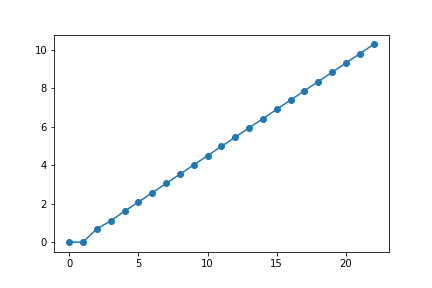

# Exercícios de treino, 2

**Bioquímica computacional 2019/2020 (Maio 2020)**

## Objetivo

**No programas seguintes, preencha os `??????` com expressões apropriadas de forma a garantir que o resultado da execução do programa seja aquele que está exibido**

## Numéricos, sobre comandos `for`, listas em compreensão e `numpy`

### Programa 1

<div class="python_box">
```python3
import math
from matplotlib import pyplot as plt

fibs = [0, 1, 1, 2, 3, 5, 8, 13, 21, 34, 55, 89, 144, 233, 377, 610, 987, 1597, 2584, 4181, 6765, 10946, 17711, 28657]

# logaritmos dos números com math.log()
# mas não pode dar erro...
logfibs = ??????

plt.plot(range(len(logfibs)), logfibs, 'o-')
plt.show()
```
</div>




??? info "Solução"
    <div class="python_box">
    ```python3
    import math
    from matplotlib import pyplot as plt

    fibs = [0, 1, 1, 2, 3, 5, 8, 13, 21, 34, 55, 89, 144, 233, 377, 610, 987, 1597, 2584, 4181, 6765, 10946, 17711, 28657]

    # logaritmos dos números com math.log()
    # mas não pode dar erro...
    logfibs = [math.log(x) for x in fibs if x != 0]

    plt.plot(range(len(logfibs)), logfibs, 'o-')
    plt.show()
    ```
    </div>

### Programa 2

<div class="python_box">
```python3
import numpy as np
from matplotlib import pyplot as plt

fibs = [0, 1, 1, 2, 3, 5, 8, 13, 21, 34, 55, 89, 144, 233, 377, 610, 987, 1597, 2584, 4181, 6765, 10946, 17711, 28657]
fibs = np.array(fibs)

# logaritmos dos números com np.log()
# mas não pode dar erro...
logfibs = ???????

plt.plot(np.arange(len(logfibs)), logfibs, 'o-')
plt.show()
```
</div>


??? info "Solução"

    <div class="python_box">
    ```python3
    import numpy as np
    from matplotlib import pyplot as plt

    fibs = [0, 1, 1, 2, 3, 5, 8, 13, 21, 34, 55, 89, 144, 233, 377, 610, 987, 1597, 2584, 4181, 6765, 10946, 17711, 28657]
    fibs = np.array(fibs)

    # logaritmos dos números com np.log()
    # mas não pode dar erro...
    logfibs = np.log(fibs[fibs!=0])

    plt.plot(np.arange(len(logfibs)), logfibs, 'o-')
    plt.show()
    ```
    </div>

### Programa 3

Sugestão: use a função `np.log10()` e a função `np.trunc()`

<div class="python_box">
```python3
fibs = [1, 1, 2, 3, 5, 8, 13, 21, 34, 55, 89, 144, 233, 377, 610, 987, 1597, 2584, 4181, 6765, 10946, 17711, 28657]
fibs = np.array(fibs)

ndigits = ??????

print('numero de dígitos:')
print(ndigits)
```
</div>

    numero de dígitos:
    [1. 1. 1. 1. 1. 1. 2. 2. 2. 2. 2. 3. 3. 3. 3. 3. 4. 4. 4. 4. 5. 5. 5.]
    

??? info "Solução"

    <div class="python_box">
    ```python3
    fibs = [1, 1, 2, 3, 5, 8, 13, 21, 34, 55, 89, 144, 233, 377, 610, 987, 1597, 2584, 4181, 6765, 10946, 17711, 28657]
    fibs = np.array(fibs)

    ndigits = np.trunc(1 + np.log10(fibs))

    print('numero de dígitos:')
    print(ndigits)
    ```
    </div>


## Sobre processamento de ficheiros de texto estruturados

### Preparação

Obtenha do moodle o ficheiro `uniprot_scerevisiae.fasta` e coloque na mesma pasta que o "programa 4".

### Programa 4

<div class="python_box">
```python3
with open('uniprot_scerevisiae.fasta') as f:
    records = f.read().split('>')
# clean empty records
records = [p for p in records if len(p) > 0]

print(len(records))

headers = ??????

descriptions = []
accs = []

# header example:
# sp|Q08641|AB140_YEAST tRNA(Thr) (cytosine(32)-N(3))-methyltransferase OS=Saccharomyces cerevisiae (strain ATCC 204508 / S288c) ...

for header in headers:
    sp, acc, rest = header.split('|')
    description = rest.split(??????)[0]
    
    accs.append(acc)
    descriptions.append(description)

print('first 5:')
for h, d in zip(accs[:5], descriptions[:5]):
    print(h, d)
```
</div>

    6049
    first 5:
    Q08641 AB140_YEAST tRNA(Thr) (cytosine(32)-N(3))-methyltransferase 
    P28240 ACEA_YEAST Isocitrate lyase 
    Q07622 ACK1_YEAST Activator of C kinase protein 1 
    Q03771 ACL4_YEAST Assembly chaperone of RPL4 
    Q02336 ADA2_YEAST Transcriptional adapter 2 

??? info "Solução"

    <div class="python_box">
    ```python3
    with open('uniprot_scerevisiae.fasta') as f:
        records = f.read().split('>')
    # clean empty records
    records = [p for p in records if p]

    print(len(records))

    headers = [record.splitlines()[0] for record in records]

    descriptions = []
    accs = []

    # header example:
    # sp|Q08641|AB140_YEAST tRNA(Thr) (cytosine(32)-N(3))-methyltransferase OS=Saccharomyces cerevisiae ...

    for header in headers:
        sp, acc, rest = header.split('|')
        description = rest.split('OS=')[0]
        
        accs.append(acc)
        descriptions.append(description)

    print('first 5:')
    for h, d in zip(accs[:5], descriptions[:5]):
        print(h, d)
    ```
    </div>

