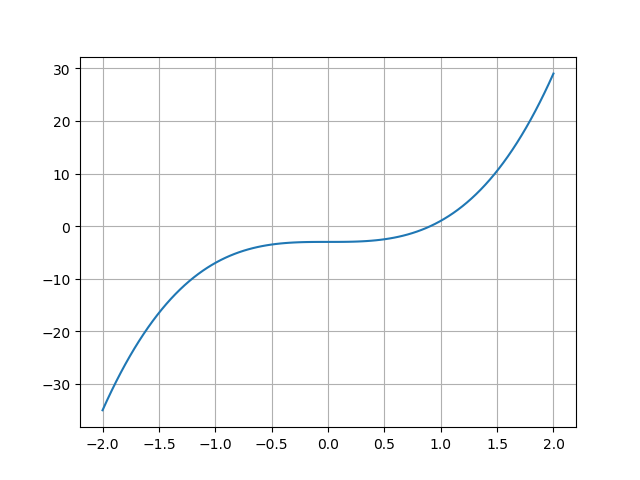
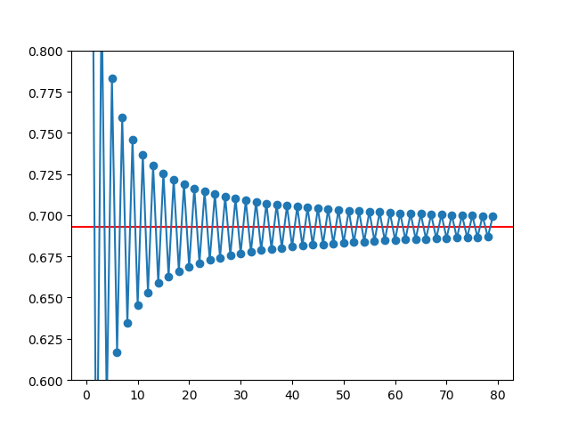
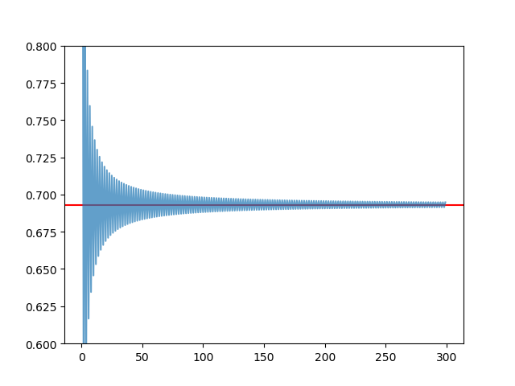
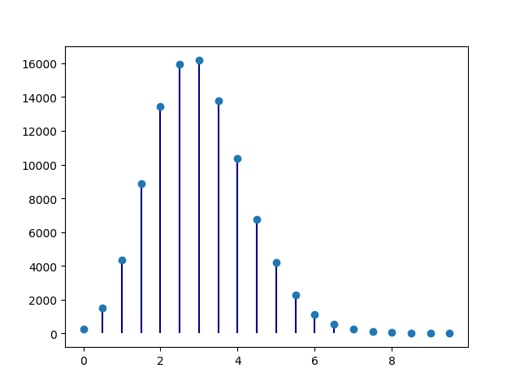
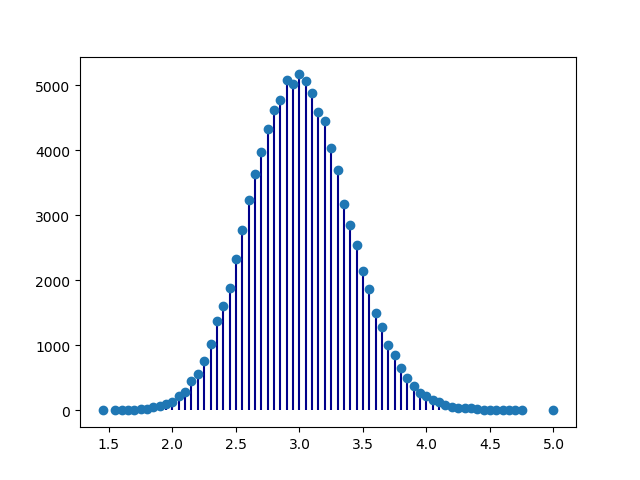

# Os principais módulos "científicos"

Embora não incluídas na distribuição oficial, disponibilizada em
<http://www.python.org>, as seguintes bibliotecas foram criadas para
adaptar (e aumentar) a linguagem Python com a funcionalidade necessária
em muitas aplicações de natureza científica.

Estas bibliotecas são:

-   numpy: objetos de tipo `array`, que suportam operações vetoriais
-   scipy: muitas funções de cálculo numérico
-   sympy: computação simbólica
-   ipython: deu origem ao projeto Jupyter, que contem a plataforma
    "Jupyter notebooks"
-   matplotlib: a principal biblioteca de gráficos científicos da linguagem
    Python
-   pandas: objetos adequados ao tratamento de dados em larga escala
    (`Series` e `DataFrame`)


## `numpy`

Esta é uma biblioteca fundamental na computação científica em Python e várias das outras bibliotecas dependem dela.

Apesar de introduzir muitas funcionalidades interessantes à linguagem, a principal característica da biblioteca é proporcionar **operações vetoriais** a partir da introdução na linguagem Python de um tipo novo de objetos: os _array_.

### Operações "vectoriais"

A funcionalidade do módulo `numpy` fica disponível após
`import`.

Por convenção, é usual criar um nome alternativo, mais abreviado: `np`:

<div class="python_box">
``` python3
# No princípio de um programa que use o numpy
import numpy as np
```
</div>

O que é uma operação vetorial?

O melhor é começar com um exemplo:

<div class="python_box">
``` python3
numbers = [0.0, 0.2, 0.5, 1.0, 1.1]

# transformar a lista num array
x = np.array(numbers)

print('x = ')
print(x)

# esta é uma operação vetorial
y = 4 * x

print('\ny = 4 * x =')
print(y)
```
</div>

```
x = 
[ 0.   0.2  0.5  1.   1.1]

y = 4 * x =
[ 0.   0.8  2.   4.   4.4]
```

A função `np.array()` transformou a lista num objeto do tipo *array*.

Estes objetos suportam operações aritméticas "vetoriais": na expressão
`y = 4 * x` a multiplicação por 4 é **aplicada a todos os elementos de
`x`**.

O resultado é também um *array*.

Por outro lado, as operações aritméticas entre dois *arrays*, por exemplo uma soma, são realizadas elemento a elemento, usando explicitamente o operador matemático da
operação, por exemplo, `+`:

<div class="python_box">
``` python3
a = np.array([0.0, 0.2, -0.5, 1.0, 1.1])
b = np.array([0.0, 0.1, -1.0, 1.0, 1.0])
print('a = ', a)
print('b = ', b)

y = a + b

print('\ny = a + b =')
print(y)
```
</div>

```
a =  [ 0.   0.2 -0.5  1.   1.1]
b =  [ 0.   0.1 -1.   1.   1. ]

y = a + b =
[ 0.   0.3 -1.5  2.   2.1]
```
Repare-se que a aplicação da mesma operação a todos os elementos de uma lista, um a um, é geralmente conseguida
através de operações num bloco de um comando `for` ou usando listas em compreensão.

Com *arrays* podemos não usar `for` ou listas em compreensão.

Consegue-se o mesmo efeito a partir de expressões que se assemelham muito à notação matemática aplicada a todos os elementos de um "vetor" simultaneamente.

Comparemos o uso de listas com o uso de *arrays*:

<div class="python_box">
``` python3
numbers = [0.0, 0.2, 0.5, 1.0, 1.1]

x = np.array(numbers)

# listas
ylist = [4 * n for n in numbers]

# array
y = 4 * x

print(ylist)
print(y)
```
</div>

```
[ 0.0, 0.8, 2.0, 4.0, 4.4]
[ 0.   0.8  2.   4.   4.4]
```

Este ganho na simplicidade da notação é muito poderoso,
já que podemos frequentemente exprimir operações numéricas
complexas e sucessivas de uma forma muito semelhante à notação algébrica, mas aplicando a conjuntos inteiros de
valores numéricos "em paralelo".

Mais tarde veremos um exemplo disso mesmo, em que fazemos a simulação das variações de carga de um aminoácido em solução com as variações de pH, aplicando expressões simples a toda a escala de pH, usando centenas de valores no intervalo [0, 14].

Mas os *arrays* foram criados para as operações numéricas:

os *arrays* são homogéneos: todos os seus elementos são números, ao contrário das listas, que são flexíveis e podem
ser constituídas por elementos de diversos tipos, por exemplo, podemos misturar *strings* com números numa lista, ou criar listas em que os elementos são "pares" de valores.

### Criação de *arrays* com as funções `.array()`, `.arange()` e `.linspace()`

Já vimos a função `array()` que não é mais do que uma função básica que tenta transformar o seu argumento (geralmente uma lista) num *array*:

<div class="python_box">
``` python3
x = np.array([1, 1.2, 3, 3.5])
print(x)
```
</div>

```
[ 1.   1.2  3.   3.5]
```

Mas há outras maneira de criar *arrays*.

Se pretendermos criar um *array* em que os elementos possuem uma certa regularidade, existem várias outras funções à nossa disposição:

A função `arange()` cria *arrays* de uma forma semelhente à
função `range()`.

O resultado é um *array* que varia entre um valor numérico inicial e um valor numérico final, mas dando um valor de espaçamento entre os números.

Mas, de uma forma mais flexível do que a função `range()`,
a função `arange()` não gera apenas números inteiros:

<div class="python_box">
``` python3
# array entre 1.5 e 2.0 com espaçamento de 0.1
x = np.arange(1.5, 2.0, 0.1)
print(x)
```
</div>

```
[ 1.5  1.6  1.7  1.8  1.9]
```

Como se pode ver, o valor final é *exclusivé*.

Muito semelhante à função `arange()` é a função
`linspace()`, que também gera um *array* de valores igualemnte espaçados, mas em que o terceiro argumento não
é o espaçamento, é o número de valores pretendidos no *array*.

Os extremos do intervalo, o valor inicial e o valor final estão incluídos:

<div class="python_box">
``` python3
# 5 números no intervalo 1 a 2
# extremos incluídos

x = np.linspace(1, 2, 5)
print(x)
```
</div>

```
[ 1.    1.25  1.5   1.75  2.  ]
```

Uma das várias aplicações da função `linspace()` é definir comodamente valores dentro de um intervalo a partir
dos quais possa calcular o resultado de uma transformação, como se estivesse a transformar x -> y:

<div class="python_box">
``` python3
x = np.linspace(1, 2, 6)
print('x')
print(x)

y = 4 * x**2 -3

print('\ny = 4 * x**2 -3')
print(y)
```
</div>

```
x
[ 1.   1.2  1.4  1.6  1.8  2. ]

y = 4 * x**2 -3
[  1.     2.76   4.84   7.24   9.96  13.  ]
```

As vantagens de `linspace()` sobre `arange()`é o facto de não ser necessário calcular o espaçamento entre
valores. Dando o número de pontos total, o espaçamento é calculado. Além disso os extremos estão incluídos.

É frequente ver a função `linspace()`ser usada para gerar valores das abcissas de um gráfico, aplicando uma expressão para gerar as ordenadas.

Vamos traçar a função $f(x) = 4 x^3 -3$ no intervalo entre -2 e 2:

<div class="python_box">
``` python3
# só necessário em Jupyter notebooks
%matplotlib inline
```
</div>

<div class="python_box">
``` python3
# import do módulo pyplot da biblioteca matplotlib
from matplotlib import pyplot as plt

x = np.linspace(-2, 2, 100)
y = 4 * x**3 -3

plt.grid()
plt.plot(x, y)

plt.show()
```
</div>



Este gráfico é feito com 100 pontos igualmente espaçados nas abcissas e traçado entre 
-2 e 2.

Gerar pontos neste intervalo é da responsabilidade da função `linspace()`.

Para gerar as ordenadas, basta aplicar a expressão `4 * x**3 -3` ao *array* `x` resultante da função `linspace()`.

A função `plot()` é aquela que desenha o gráfico da função.

Para usa-la precisamos de indicar um *array* para as abcissar e um *array* para as ordenadas.

Os cálculos vetoriais permitem exprimir de uma forma muito compacta as soluções de problemas numéricos sem escrever blocos `for` ou listas em comprensão.

Vejamos alguns exemplos:

!!! example "Problema"
    Somar os primeiros 1000 quadrados perfeitos

<div class="python_box">
``` python3
sq1000 = sum(np.arange(1000)**2)

print(sq1000)
```
</div>

```
332833500
```

Repare-se o que aconteceu: a função `arange(1000)` criou um *array* (não uma lista) com 1000 elementos.

Como é um *array*, podemos imediatamente elevar a 2 (fazendo `**2`) resultando daí um outro array já com os quadrados de 1000 números calculados.

A função `sum()`, disponível na linguagem Python para calcular a soma de elementos de coleções dá o resultado final.

Mas a funcionalidade do módulo `numpy` é extremamente vasta.
São introduzidas muitas funções associadas a conceitos matemáticos simples.

Uma pequena ilustração: a função `intersect1d()` que calcula
um *array* resultante da **interseção** de dois **arrays* entendidos como conjuntos.

!!! example "Problema"
    Encontrar os números pares até 200 que sejam também
    múltiplos de 17

<div class="python_box">
``` python3
even_nums = np.arange(2, 200, 2)
mult17 = np.arange(17, 200, 17)

common = np.intersect1d(even_nums, mult17)

print(common)
```
</div>

```
[ 34  68 102 136 170]
```

### Dimensões (`shape`)

Os *arrays* podem não ser "lineares" como uma lista.

Podem assemelhar-se a uma matriz, com duas (ou mais) dimensões.

Para isso, um *array* tem um atributo chamado `shape` que consiste na indicação do número de elementos em cada "dimensão".

No seguinte exemplo, um *array* "linear" é forçado a tomar a
forma de uma matriz 4 x 3:

<div class="python_box">
``` python3
x = np.arange(1, 13)
print(x)

x.shape = (4,3)
# significa 4 linhas e 3 colunas

print('\nApós mudar "shape" para (4,3)\nx =\n{}'.format(x))
```
</div>

```
[ 1  2  3  4  5  6  7  8  9 10 11 12]

Após mudar "shape" para (4,3)
x =
[[ 1  2  3]
 [ 4  5  6]
 [ 7  8  9]
 [10 11 12]]
```

Imagine-se as possibilidades! Operações com matrizes inteiras expressas de uma forma simples e semelhante à notação matemática.

Os *arrays* com mais de 1 dimensão podem ser criados de outra formas. Vamos ver algumas delas.

### Criação de *arrays* com `.array()`, `.ones()`, `.zeros()`, `.eye()`, `.diag()`

A função `array()` pode receber uma lista de listas como argumento. cada lista é usada para formar uma linha do *array* bidimensional:

<div class="python_box">
``` python3
# array a partir de lista de listas
x = np.array( [[1, 1.2, 3], [1.3,5.1,1.3]] )

print(x)

print('shape =', x.shape)
```
</div>

```
[[ 1.   1.2  3. ]
 [ 1.3  5.1  1.3]]
shape = (2, 3)
```

A função `ones()` cria um *array* todo preenchido com 1, com
determinadas dimensões:

<div class="python_box">
``` python3
x = np.ones((4,3))

print(x)
```
</div>

```
[[1. 1. 1.]
 [1. 1. 1.]
 [1. 1. 1.]
 [1. 1. 1.]]
```

O mesmo acontece para zeros:

<div class="python_box">
``` python3
x = np.zeros((3,2))
print(x)
```
</div>

```
[[ 0.  0.]
 [ 0.  0.]
 [ 0.  0.]]
```

Também podemos obter uma **matriz identidade** a partir
da função `eye()` em que se indica a dimensão da matriz:

<div class="python_box">
``` python3
x = np.eye(3)
print(x)
```
</div>

```
[[ 1.  0.  0.]
 [ 0.  1.  0.]
 [ 0.  0.  1.]]
```

E também podemos gerar uma matriz diagonal, através da
função `diag()`:

<div class="python_box">
``` python3
x = np.diag([1.2, 3.2, 4.1, 6.3])
print(x)
```
</div>

```
[[ 1.2  0.   0.   0. ]
 [ 0.   3.2  0.   0. ]
 [ 0.   0.   4.1  0. ]
 [ 0.   0.   0.   6.3]]
```

### Indexação a várias dimensões

Os *arrays* têm muitas características em comuns com as listas.

Em particular, um *array* linear pode ser indexado com `[]`
indicando uma posição ou fazendo um *slice* indicando duas posições, com números inteiros. O que obtemos é, por analogia com as listas, um elemento ou um "*subarray*".

Mas um *array* com mais do que uma dimensão também pode ser indexado. Usamos `[]`, como sempre, mas podemos indexar várias dimensões separadamente, separadas por `,`

Se as dimensões forem duas, a primeira dimensão são as linhas
e a segunda são as colunas:

Comecemos por criar um *array* 5 x 4:

<div class="python_box">
``` python3
x = np.linspace(1,20,20).reshape((5,4))
print(x)
```
</div>

```
[[  1.   2.   3.   4.]
 [  5.   6.   7.   8.]
 [  9.  10.  11.  12.]
 [ 13.  14.  15.  16.]
 [ 17.  18.  19.  20.]]
```

Podemos obter o elelemento da linha 3 e coluna 1 da seguinte forma:

<div class="python_box">
``` python3
a = x[3,1]

print(x)
print('\nx[3,1] =', a)
```
</div>

```
[[  1.   2.   3.   4.]
 [  5.   6.   7.   8.]
 [  9.  10.  11.  12.]
 [ 13.  14.  15.  16.]
 [ 17.  18.  19.  20.]]

x[3,1] = 14.0
```

Note-se que a numeração **começa em 0**, seja qual for a dimensão que está a ser indexada.

Se numa dimensão indicarmos `:` isto significa uma *slice*
do "princípio ao fim".

Isto significa que podemos obter, por exemplo, uma linha inteira:

<div class="python_box">
``` python3
# toda a linha 3
a = x[3, :]

print(x)
print('\nx[3, :] =', a)
```
</div>

```
[[  1.   2.   3.   4.]
 [  5.   6.   7.   8.]
 [  9.  10.  11.  12.]
 [ 13.  14.  15.  16.]
 [ 17.  18.  19.  20.]]

x[3, :] = [ 13.  14.  15.  16.]
```

Mas um slice mais restritivo pode servir para obter uma 
"submatriz".

No seguinte exemplo, obtemos o que está nas linhas de 1 a 3 e nas colunas de 1 a 3:

<div class="python_box">
``` python3
a = x[1:4, 1:4]

print(x)
print('\nx[1:4, 1:4] =')
print(a)
```
</div>

```
[[  1.   2.   3.   4.]
 [  5.   6.   7.   8.]
 [  9.  10.  11.  12.]
 [ 13.  14.  15.  16.]
 [ 17.  18.  19.  20.]]

x[1:4, 1:4] =
[[  6.   7.   8.]
 [ 10.  11.  12.]
 [ 14.  15.  16.]]
```

Mas os slices de `arrays` lineares são familiares, como
se tivessemos a trabalhar com uma lista:

<div class="python_box">
``` python3
x =np.arange(0, 1.1, 0.1)[2:]
print(x)
```
</div>

```
[ 0.2  0.3  0.4  0.5  0.6  0.7  0.8  0.9  1. ]
```

Mas o resultado de um *slice* continua a ser um *array*.

Podemos tirar partido disso com um exemplo que, parecendo complicado, pode ser resolvido de uma forma muito simples:
as diferenças sucessivas de elementos de um *array*:

!!! example "Problema"
    Mostrar que as diferenças entre os quadrados perfeitos sucessivos são os numeros ímpares

Gerar um *array* `a` com números ímpares será fácil, com `arange()`.

Mas como fazer as diferenças sucessivas $a_1 - a_0$ , $a_2 - a_1$, etc?

E sem usar `for`?

Basta que façamos a diferença entre um o *array* $[a_1, a_2, a_3, ..., a_n]$ e o array $[a_0, a_1, a_2, ..., a_{n-1}]$.

Como são *arrays* a diferença vai ser realizada elemento a elemento e obtemos diretamente as diferenças sucessivas.

*slices* adequadas criam os dois *arrays*:

<div class="python_box">
``` python3
quads = np.arange(20)**2

# diferença entre quads[1:], que não tem o
# primeiro elemento
# e quads[0:-1], que não tem o último
# elemento
difs = quads[1:] - quads[0:-1]

print(quads)
print(difs)
```
</div>

```
[  0   1   4   9  16  25  36  49  64  81 100 121 144 169 196 225 256 289 324 361]
[ 1  3  5  7  9 11 13 15 17 19 21 23 25 27 29 31 33 35 37]
```

### Indexação booleana

A flexibilidade da indexação de *arrays* não fica por aqui.

Se fizermos uma operação lógica com *arrays* criamos um
*array booleano* que contem `True`e `False` assinalando as posições em que a condição é verdadeira ou falsa:

<div class="python_box">
``` python3
x = np.linspace(1, 10, 6)
print('x =', x)

a = x < 7
print('\nx < 7')
print(a)
```
</div>

```
x = [  1.    2.8   4.6   6.4   8.2  10. ]

x < 7
[ True  True  True  True False False]
```

Aqui o *array booleano* indica as posições em que os elementos são menores do que 7.

Um *array booleano* pode indexar um outro *array*.

Ao faze-lo, retemos os elementos para os quais a posição é verdadeira e descartamos os outros:

<div class="python_box">
``` python3
x = np.linspace(1, 10, 6)
print('x =', x)

a = x < 7
print('\nx < 7')
print(a)

y = x[x < 7]
print('\nx[x < 7]')
print(y)
```
</div>

```
x = [  1.    2.8   4.6   6.4   8.2  10. ]

x < 7
[ True  True  True  True False False]

x[x < 7]
[ 1.   2.8  4.6  6.4]
```


!!! example "Problema"
    Encontra os números até 2000 que satisfaçam simultaneamente:

    - são números ímpares
    - o logaritmo base 2 esteja entre 3 e 5

<div class="python_box">
``` python3
nums = np.arange(2001)

restricted = nums[(np.log2(nums) < 5) & (np.log2(nums) > 3) & (nums%2==1)]


print(restricted)
```
</div>

```
[ 9 11 13 15 17 19 21 23 25 27 29 31]
```

Este exemplo demonstra a conjunção de várias condições para *arrays*.

Em vez de `and` e `or`, as operações lógicas booleanas elemento a elemento são realizadas pelos operadores `&` para a conjunção e `|` para a disjunção. Fizemos a conjunção de 3 condições e indexámos o *array*  `nums` com o *array booleano* daí resultante.


### Indexação com listas de inteiros ou outros *arrays*

Finalmente, uma lista de números inteiros ou um *array* de inteiros podem ser usados para indexar *arrays*.

O efeito é selecionar apenas os elementos que estão em determinadas posições:

<div class="python_box">
``` python3
x = np.linspace(5, 15, 6)
print('x =', x)

i = [1,4,5]
print('\ni =', i)

y = x[i]
print('\nx[i] =', y)
```
</div>

```
x = [  5.   7.   9.  11.  13.  15.]

i = [1, 4, 5]

x[i] = [  7.  13.  15.]
```

!!! example "Problema"
    Obter raízes quadradas dos números até 200, mas apenas de 3 em 3, começando da raíz de 0

<div class="python_box">
``` python3

roots = np.arange(201)**0.5

locs = range(0, len(roots), 3)

roots = roots[locs]

print(roots)
```
</div>

```
[ 0.          1.73205081  2.44948974  3.          3.46410162  3.87298335 
  4.24264069  4.58257569  4.89897949  5.19615242  5.47722558  5.74456265 
  6.          6.244998    6.4807407   6.70820393  6.92820323  7.14142843 
  7.34846923  7.54983444  7.74596669  7.93725393  8.1240384   8.30662386 
  8.48528137  8.66025404  8.83176087  9.          9.16515139  9.32737905 
  9.48683298  9.64365076  9.79795897  9.94987437 10.09950494 10.24695077 
 10.39230485 10.53565375 10.67707825 10.81665383 10.95445115 11.09053651 
 11.22497216 11.35781669 11.48912529 11.61895004 11.74734012 11.87434209 
 12.         12.12435565 12.24744871 12.36931688 12.489996   12.60952021 
 12.72792206 12.84523258 12.9614814  13.07669683 13.19090596 13.3041347  
 13.41640786 13.52774926 13.6381817  13.74772708 13.85640646 13.96424004 
 14.07124728]
```

### Funções associadas a *arrays*

Os objetos do tipo *array* possuem muitas funções associadas.

Estas funções são acedidas seguindo a notação

     array.função()

tal como vimos para muitas funções associadas a listas, dicionários e *strings*.

Algumas são:

-   `.sum()` que calcula a soma dos elementos
-   `.mean()` que calcula a média dos elementos
-   `.var()` que calcula a variância dos elementos
-   `.std()` que calcula o desvio padrão dos elementos
-   `.prod()` que calcula o produto dos elementos
-   `.ptp()` (*peak to peak*) que calcula o máximo - mínimo
-   `.cumsum()` que calcula a soma cumulativa dos elementos
-   `.cumprod()` que calcula o produto cumulativo dos elementos

Repare-se na utilidade das funções `.cumsum()` e `.cumprod()`, que podem ser usadas para calcular fatoriais e somas parciais de séries matemáticas:

!!! example "Problema"
    Mostrar (com *arrays*) que a soma dos inversos dos fatoriais
    converge (rapidamente) para $e$ = 2.7182818284...

<div class="python_box">
``` python3
nums = np.arange(1, 15)
facts = nums.cumprod()

invfacts = 1.0 / facts

series_invfacts = invfacts.cumsum()

print('Fatoriais:')
print(facts)

print('\nSérie dos inversos dos fatoriais:')
print(series_invfacts)
```
</div>

```
Fatoriais:
[         1          2          6         24        120        720
       5040      40320     362880    3628800   39916800  479001600
 1932053504 1278945280]

Série dos inversos dos fatoriais:
[1.         1.5        1.66666667 1.70833333 1.71666667 1.71805556
 1.71825397 1.71827877 1.71828153 1.7182818  1.71828183 1.71828183
 1.71828183 1.71828183]
```

No caso da aplicação destas funções a *arrays* multidimensionais,
podemos especificar um "eixo" para aplicar o cálculo.

Vejamos a aplicação da função `.sum()` a um *array* unidimensional:

<div class="python_box">
``` python3
a = np.linspace(1,20,20).sum()
print(a)
```
</div>

```
210.0
```

E agora 3 maneiras de aplicar a função `.sum()` a um array com duas dimensões, 5 x 4

<div class="python_box">
``` python3
# Como se fosse unidimensional
# aplicando a todos os elementos

x = np.linspace(1,20,20).reshape((5,4))
print(x)

s = x.sum()
print('\n', s)
```
</div>

```
[[  1.   2.   3.   4.]
 [  5.   6.   7.   8.]
 [  9.  10.  11.  12.]
 [ 13.  14.  15.  16.]
 [ 17.  18.  19.  20.]]

 210.0
```

<div class="python_box">
``` python3
# Ao longo do eixo 0, isto é, ao longo das colunas
x = np.linspace(1,20,20).reshape((5,4))
print(x)

s = x.sum(axis=0)
print('\n', s)
```
</div>

```
[[  1.   2.   3.   4.]
 [  5.   6.   7.   8.]
 [  9.  10.  11.  12.]
 [ 13.  14.  15.  16.]
 [ 17.  18.  19.  20.]]

 [ 45.  50.  55.  60.]
```

<div class="python_box">
``` python3
# Ao longo do eixo 1, isto é, ao longo das linhas
x = np.linspace(1,20,20).reshape((5,4))
print(x)

s = x.sum(axis=1)
print('\n', s)
```
</div>

```
[[  1.   2.   3.   4.]
 [  5.   6.   7.   8.]
 [  9.  10.  11.  12.]
 [ 13.  14.  15.  16.]
 [ 17.  18.  19.  20.]]

 [ 10.  26.  42.  58.  74.]
```

E agora mais um problema com séries, mas obtendo um gráfico:

!!! example "Problema"
    Mostrar que a série alternada dos inversos dos números

    $\sum_{n=1}^{\infty} \frac{(-1)^{n+1}}{n}$
    
    converge para log 2 (embora lentamente)

<div class="python_box">
``` python3
# começando com apenas 80 termos na série parcial
i = np.arange(1,80)

termos = (-1)**(i+1) * 1/i 
s = termos.cumsum()

# mostrar os últimos 4
print(s[:4])
```
</div>

```
[ 1.          0.5         0.83333333  0.58333333]
```

Parece que com 80 números ainda estamos longe da convergência...

É melhor ver num gráfico:

<div class="python_box">
``` python3
from matplotlib import pyplot as plt

i = np.arange(1,80)
termos = (-1)**(i+1) * 1/i 
s = termos.cumsum()

plt.ylim(0.6, 0.8)
# draw an horizontal line on log2
plt.axhline(np.log(2), color='red')
# plot the series
plt.plot(i,s, '-o')
plt.show()
```
</div>



<div class="python_box">
``` python3
from matplotlib import pyplot as plt

# Agora com 300 termos...
i = np.arange(1, 300)
termos = (-1)**(i+1) * 1/i 
s = termos.cumsum()

plt.ylim(0.6, 0.8)
# draw an horizontal line on log2
plt.axhline(np.log(2), color='red')
# plot the series
plt.plot(i,s , alpha=0.7)
plt.show()
```
</div>



### Geração de números aleatórios. (sub-módulo `numpy.random`)

O `numpy` é um módulo com alguma complexidade e contem sub-módulos dedicados
a certas funcionalidades mais específicas.

Dois exemplos são a geração de números aleatórios que seguem uma detrminada distribuição estatística e as operações com matrizes de acordo com a álgebra linear.

Como exemplo, vamos obter valores aleatórios das seguintes distribuições:

**Poisson** (usada como modelo do número de ocorrências durante um intervalo)

$p(x, \lambda) = \frac{e^{-x} \lambda^x}{x!}$ com $x = 0, 1, 2, ...$

**Normal (0,1)**

$f(x) = \frac{1}{\sqrt{2\pi}} e^{-x^2 / 2}$ com
$x \in [-\infty, \infty]$

<div class="python_box">
``` python3
print('20 valores aleatórios da dist. de Poisson')
print(' com lambda = 3')

x = np.random.poisson(3, 20)
print(x)
```
</div>

```
20 valores aleatórios da dist. de Poisson
 com lambda = 3
[6 2 0 4 1 9 1 4 2 5 0 3 4 7 7 2 3 5 1 4]
```

<div class="python_box">
``` python3
print('5 valores aleatórios da distribuição N(0,1)')
x = np.random.randn(5)
print(x)
```
</div>

```
5 valores aleatórios da distribuição N(0,1)
[ 1.04529894 -0.26523157  0.94498444  0.63413472 -1.38915953]
```

!!! example "Problema"
    "Provar" numericamente que a média e a variância da distribuição de
    Poisson são ambas iguais a $\lambda$.

<div class="python_box">
``` python3

# 100000 valores aleatórios da distribuição de
# Poisson com lambda = 3
sample = np.random.poisson(3, 100000)

print('Média = ', sample.mean())

print('Variância =', sample.var())
```
</div>

```
Média =  2.99868
Variância = 3.0185382576
```

Pode-se ver que ambos os valores são quase iguais a 3, o valor de $\lambda$.

!!! example "Problema" Mostar "numericamente" o **Teorema do Limite Central**
    para uma distribuição de Poisson.

<div class="python_box">
``` python3
# Distribuição de médias de amostras de 2

# 2 x 100 000 números aleatórios com distribuição de Poisson
# com lambda = 3
# isto simula 100000 amostras com 2 elementos cada uma
sample = np.random.poisson(3, (100000,2) )

# calcular as médias das 100000 amostras de 2
means = sample.mean(axis=1)

# a função unique faz contagens dos diferentes resultados
unique, counts = np.unique(means, return_counts=True)

from matplotlib import pyplot as plt
plt.vlines(unique, [0], counts, color='darkblue')
plt.plot(unique, counts, 'o')
plt.show()
```
</div>



<div class="python_box">
``` python3
# Distribuição de médias de amostras de 20

# 20 x 100 000 números aleatórios com distribuição de Poisson
# com lambda = 3
# isto simula 100000 amostras com 2 elementos cada uma
sample = np.random.poisson(3, (100000,20) )

# calcular as médias das 100000 amostras de 20
means = sample.mean(axis=1)

# a função unique faz contagens dos diferentes resultados
unique, counts = np.unique(means, return_counts=True)

from matplotlib import pyplot as plt
plt.vlines(unique, [0], counts, color='darkblue')
plt.plot(unique, counts, 'o')
plt.show()
```
</div>



Parece evidente a aproximação da distribuição por uma normal

### Matrizes e álgebra linear

O produto de *arrays* segue a regra das operações vetoriais e é feita elemento a elemento.

Mas, na álgebra linear, o produto de matrizes é feito de outra maneira.

O `numpy` admite uma versão modificada dos `arrays`, chamada `matrix` que
repeita a fórmula do produto de matrizes e também tem outras operações frequentes na
álgebra linear.

veja-se a multiplicação de matrizes e a sua transposição:

<div class="python_box">
``` python3
A = np.matrix([[1, 2, 3], [2, 1, 6], [1, 7, 4]])
print('A\n', A)
B = np.matrix([1,2,3]).T
print('B\n', B)

C = A * B
print('\nC = A * B\n', C)
```
</div>

```
A
 [[1 2 3]
 [2 1 6]
 [1 7 4]]
B
 [[1]
 [2]
 [3]]

C = A * B
 [[14]
 [22]
 [27]]
```

Podemos também resolver sistemas de equações lineares
expressos na forma A . X = B

<div class="python_box">
``` python3
A = np.matrix([[1.0, 2, 3], [2, 1, 6], [1, 7, 4]])
B = np.matrix([1,2,3]).T

X = np.linalg.solve(A, B)
print('Solução de A*X = B')
print(X)
```
</div>

```
Solução de A*X = B
[[-5.]
 [ 0.]
 [ 2.]]
```

Esta introdução ao módulo `numpy` foi muito superficial e uma seleção apenas dos aspetos mais importantes. Poderíamos continuar a explorar o módulo, mas a com a prática somos muitas vezes levados a procurar funções e sub-módulos que resolvem muitos problemas de natureza numérica de uma forma muito expressiva e simples.