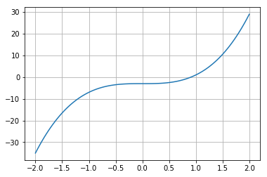
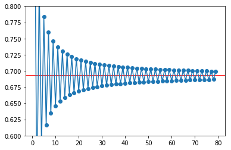
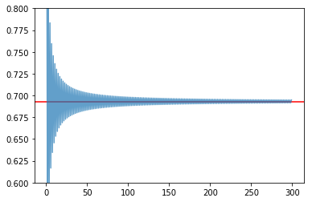
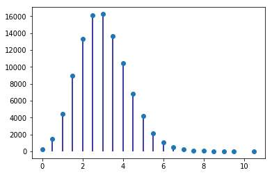
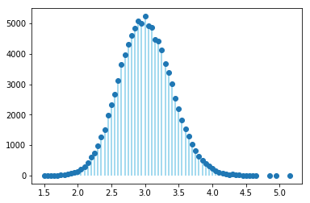

# Os principais módulos "científicos"

Embora não incluídas na distribuição oficial, disponibilizada em
<http://www.python.org>, as seguintes bibliotecas foram criadas para
adaptar (e aumentar) a linguagem Python com a funcionalidade necessária
em muitas aplicações de natureza científica.

Estas bibliotecas são:

-   numpy: objetos de tipo `array`, que suportam operações vetoriais
-   scipy: muitas funções de cálculo numérico
-   sympy: computação simbólica
-   ipython: deu origem ao projeto Jupyter, que contem a plataforma
    "Jupyter notebooks"
-   matplotlib: a principal biblioteca de gráficos científicos da linguagem
    Python
-   pandas: objetos adequados ao tratamento de dados em larga escala
    (`Series` e `DataFrame`)


## `numpy`

Esta é uma biblioteca fundamental na computação científica em Python e várias das outras bibliotecas dependem dela.

Apesar de introduzir muitas funcionalidades interessantes à linguagem, a principal característica da biblioteca é proporcionar **operações vetoriais** a partir da introdução na linguagem Python de um tipo novo de objetos: os _array_.

### Operações "vectoriais"

A funcionalidade do módulo `numpy` fica disponível após
`import`.

Por convenção, é usual criar um nome alternativo, mais abreviado: `np`:

<div class="python_box">
``` python3
# No princípio de um programa que use o numpy
import numpy as np
```
</div>

O que é uma operação vetorial?

O melhor é começar com um exemplo:

<div class="python_box">
``` python3
numbers = [0.0, 0.2, 0.5, 1.0, 1.1]

# transformar a lista num array
x = np.array(numbers)

print('x = ')
print(x)

# esta é uma operação vetorial
y = 4 * x

print('\ny = 4 * x =')
print(y)
```
</div>

```
x = 
[ 0.   0.2  0.5  1.   1.1]

y = 4 * x =
[ 0.   0.8  2.   4.   4.4]
```

A função `np.array()` transformou a lista num objeto do tipo *array*.

Estes objetos suportam operações aritméticas "vetoriais": na expressão
`y = 4 * x` a multiplicação por 4 é **aplicada a todos os elementos de
`x`**.

O resultado é também um *array*.

Por outro lado, as operações aritméticas entre dois *arrays*, por exemplo uma soma, são realizadas elemento a elemento, usando explicitamente o operador matemático da
operação, por exemplo, `+`:

<div class="python_box">
``` python3
a = np.array([0.0, 0.2, -0.5, 1.0, 1.1])
b = np.array([0.0, 0.1, -1.0, 1.0, 1.0])
print('a = ', a)
print('b = ', b)

y = a + b

print('\ny = a + b =')
print(y)
```
</div>

```
a =  [ 0.   0.2 -0.5  1.   1.1]
b =  [ 0.   0.1 -1.   1.   1. ]

y = a + b =
[ 0.   0.3 -1.5  2.   2.1]
```
Repare-se que a aplicação da mesma operação a todos os elementos de uma lista, um a um, é geralmente conseguida
através de operações num bloco de um comando `for` ou usando listas em compreensão.

Com *arrays* podemos não usar `for` ou listas em compreensão.

Consegue-se o mesmo efeito a partir de expressões que se assemelham muito à notação matemática aplicada a todos os elementos de um "vetor" simultaneamente.

Comparemos o uso de listas com o uso de *arrays*:

<div class="python_box">
``` python3
numbers = [0.0, 0.2, 0.5, 1.0, 1.1]

x = np.array(numbers)

# listas
ylist = [4 * n for n in numbers]

# array
y = 4 * x

print(ylist)
print(y)
```
</div>

```
[ 0.0, 0.8, 2.0, 4.0, 4.4]
[ 0.   0.8  2.   4.   4.4]
```

Este ganho na simplicidade da notação é muito poderoso,
já que podemos frequentemente exprimir operações numéricas
complexas e sucessivas de uma forma muito semelhante à notação algébrica, mas aplicando a conjuntos inteiros de
valores numéricos "em paralelo".

Mais tarde veremos um exemplo disso mesmo, em que fazemos a simulação das variações de carga de um aminoácido em solução com as variações de pH, aplicando expressões simples a toda a escala de pH, usando centenas de valores no intervalo [0, 14].

Mas os *arrays* foram criados para as operações numéricas:

os *arrays* são homogéneos: todos os seus elementos são números, ao contrário das listas, que são flexíveis e podem
ser constituídas por elementos de diversos tipos, por exemplo, podemos misturar *strings* com números numa lista, ou criar listas em que os elementos são "pares" de valores.

### Criação de *arrays* com as funções `.array()`, `.arange()` e `.linspace()`

Já vimos a função `array()` que não é mais do que uma função básica que tenta transformar o seu argumento (geralmente uma lista) num *array*:

<div class="python_box">
``` python3
x = np.array([1, 1.2, 3, 3.5])
print(x)
```
</div>

```
[ 1.   1.2  3.   3.5]
```

Mas há outras maneira de criar *arrays*.

Se pretendermos criar um *array* em que os elementos possuem uma certa regularidade, existem várias outras funções à nossa disposição:

A função `arange()` cria *arrays* de uma forma semelhente à
função `range()`.

O resultado é um *array* que varia entre um valor numérico inicial e um valor numérico final, mas dando um valor de espaçamento entre os números.

Mas, de uma forma mais flexível do que a função `range()`,
a função `arange()` não gera apenas números inteiros:

<div class="python_box">
``` python3
# array entre 1.5 e 2.0 com espaçamento de 0.1
x = np.arange(1.5, 2.0, 0.1)
print(x)
```
</div>

```
[ 1.5  1.6  1.7  1.8  1.9]
```

Como se pode ver, o valor final é *exclusivé*.

Muito semelhante à função `arange()` é a função
`linspace()`, que também gera um *array* de valores igualemnte espaçados, mas em que o terceiro argumento não
é o espaçamento, é o número de valores pretendidos no *array*.

Os extremos do intervalo, o valor inicial e o valor final estão incluídos:

<div class="python_box">
``` python3
# 5 números no intervalo 1 a 2
# extremos incluídos

x = np.linspace(1, 2, 5)
print(x)
```
</div>

```
[ 1.    1.25  1.5   1.75  2.  ]
```

<div class="python_box">
``` python3
x = np.linspace(1, 2, 6)
print('x')
print(x)

y = 4 * x**2 -3

print('\ny = 4 * x**2 -3')
print(y)
```
</div>

```
x
[ 1.   1.2  1.4  1.6  1.8  2. ]

y = 4 * x**2 -3
[  1.     2.76   4.84   7.24   9.96  13.  ]
```

<div class="python_box">
``` python3
# só necessário em Jupyter notebooks
%matplotlib inline

from matplotlib import pyplot as pl
```
</div>

<div class="python_box">
``` python3
x = np.linspace(-2, 2, 100)
y = 4 * x**3 -3

pl.grid()
g = pl.plot(x, y)
```
</div>



**Problema: somar os primeiros 1000 quadrados perfeitos**

<div class="python_box">
``` python3
print(sum(np.arange(1000)**2))
```
</div>

```
332833500
```

### Dimensões (`shape`)

<div class="python_box">
``` python3
x = np.arange(1, 13)
print(x)

x.shape = (4,3)
# significa 4 linhas e 3 colunas

print('\nApós mudar "shape" para (4,3)\nx =\n{}'.format(x))
```
</div>

```
[ 1  2  3  4  5  6  7  8  9 10 11 12]

Após mudar "shape" para (4,3)
x =
[[ 1  2  3]
 [ 4  5  6]
 [ 7  8  9]
 [10 11 12]]
```

### Criação de *arrays* com `.array()`, `.ones()`, `.zeros()`, `.eye()`, `.diag()`

<div class="python_box">
``` python3
x = np.array( [[1, 1.2, 3], [1.3,5.1,1.3]] )
print(x)
print('\nshape =', x.shape)
```
</div>

```
[[ 1.   1.2  3. ]
 [ 1.3  5.1  1.3]]

shape = (2, 3)
```

<div class="python_box">
``` python3
x = np.ones((3,2))
print(x)
```
</div>

```
[[ 1.  1.]
 [ 1.  1.]
 [ 1.  1.]]
```

<div class="python_box">
``` python3
x = np.zeros((3,2))
print(x)
```
</div>

```
[[ 0.  0.]
 [ 0.  0.]
 [ 0.  0.]]
```

<div class="python_box">
``` python3
x = np.eye(3)
print(x)
```
</div>

```
[[ 1.  0.  0.]
 [ 0.  1.  0.]
 [ 0.  0.  1.]]
```

<div class="python_box">
``` python3
x = np.diag([1.2, 3.2, 4.1, 6.3])
print(x)
```
</div>

```
[[ 1.2  0.   0.   0. ]
 [ 0.   3.2  0.   0. ]
 [ 0.   0.   4.1  0. ]
 [ 0.   0.   0.   6.3]]
```

### Indexação a várias dimensões

<div class="python_box">
``` python3
x = np.linspace(1,20,20).reshape((5,4))
print(x)
```
</div>

```
[[  1.   2.   3.   4.]
 [  5.   6.   7.   8.]
 [  9.  10.  11.  12.]
 [ 13.  14.  15.  16.]
 [ 17.  18.  19.  20.]]
```

<div class="python_box">
``` python3
a = x[3,1]

print(x)
print('\nx[3,1] =', a)
```
</div>

```
[[  1.   2.   3.   4.]
 [  5.   6.   7.   8.]
 [  9.  10.  11.  12.]
 [ 13.  14.  15.  16.]
 [ 17.  18.  19.  20.]]

x[3,1] = 14.0
```

<div class="python_box">
``` python3
a = x[3, :]

print(x)
print('\nx[3, :] =', a)
```
</div>

```
[[  1.   2.   3.   4.]
 [  5.   6.   7.   8.]
 [  9.  10.  11.  12.]
 [ 13.  14.  15.  16.]
 [ 17.  18.  19.  20.]]

x[3, :] = [ 13.  14.  15.  16.]
```

<div class="python_box">
``` python3
a = x[1:4, 1:4]

print(x)
print('\nx[1:4, 1:4] =')
print(a)
```
</div>

```
[[  1.   2.   3.   4.]
 [  5.   6.   7.   8.]
 [  9.  10.  11.  12.]
 [ 13.  14.  15.  16.]
 [ 17.  18.  19.  20.]]

x[1:4, 1:4] =
[[  6.   7.   8.]
 [ 10.  11.  12.]
 [ 14.  15.  16.]]
```

Mas os slices de `arrays` unidimensionais também existem, tal como nas
listas:

<div class="python_box">
``` python3
x =np.arange(0, 1.1, 0.1)[2:]
print(x)
```
</div>

```
[ 0.2  0.3  0.4  0.5  0.6  0.7  0.8  0.9  1. ]
```

**Problema: mostrar que as diferenças entre os quadrados perfeitos
sucessivos são os numeros ímpares**

<div class="python_box">
``` python3
quads = np.arange(12)**2
print(quads)

difs = quads[1:] - quads[0:-1]
print(difs)
```
</div>

```
[  0   1   4   9  16  25  36  49  64  81 100 121]
[ 1  3  5  7  9 11 13 15 17 19 21]
```

### Indexação booleana

<div class="python_box">
``` python3
x = np.linspace(1, 10, 6)
print('x =', x)

a = x < 7
print('\nx < 7')
print(a)

y = x[x < 7]
print('\nx[x < 7]')
print(y)
```
</div>

```
x = [  1.    2.8   4.6   6.4   8.2  10. ]

x < 7
[ True  True  True  True False False]

x[x < 7]
[ 1.   2.8  4.6  6.4]
```

**Problema: somar as raízes quadradas dos números inteiros até 100, mas
só as que sejam números inteiros**

<div class="python_box">
``` python3
roots = np.arange(0,101)**0.5

# usando a função np.trunc()
s = sum(roots[np.trunc(roots) == roots])

print(s)
```
</div>

```
55.0
```

### Indexação com listas de inteiros ou outros *arrays*

<div class="python_box">
``` python3
x = np.linspace(5, 15, 6)
print('x =', x)

i = [1,4,5]
print('\ni =', i)

y = x[i]
print('\nx[i] =', y)
```
</div>

```
x = [  5.   7.   9.  11.  13.  15.]

i = [1, 4, 5]

x[i] = [  7.  13.  15.]
```

### Funções associadas a *arrays*

Os objetos do tipo *array* possuem muitas funções associadas.

Algumas são:

-   `.sum()` que calcula a soma dos elementos
-   `.mean()` que calcula a média dos elementos
-   `.var()` que calcula a variância dos elementos
-   `.std()` que calcula o desvio padrão dos elementos
-   `.prod()` que calcula o produto dos elementos
-   `.ptp()` (*peak to peak*) que calcula o máximo - mínimo
-   `.cumsum()` que calcula a soma cumulativa dos elementos
-   `.cumprod()` que calcula o produto cumulativo dos elementos

No caso da aplicação destas funções a *arrays* multidimensionais,
podemos especifica um "eixo" para aplicar o cálculo.

Vejamos a aplicação da função `.sum()` a um *array* unidimensional:

<div class="python_box">
``` python3
a = np.linspace(1,20,20).sum()
print(a)
```
</div>

```
210.0
```

E agora 3 maneiras de aplicar a função `.sum()` a um array
multidimensional

<div class="python_box">
``` python3
# Como se fosse unidimensional
# aplicando a todos os elementos
x = np.linspace(1,20,20).reshape((5,4))
print(x)

s = x.sum()
print('\n', s)
```
</div>

```
[[  1.   2.   3.   4.]
 [  5.   6.   7.   8.]
 [  9.  10.  11.  12.]
 [ 13.  14.  15.  16.]
 [ 17.  18.  19.  20.]]

 210.0
```

<div class="python_box">
``` python3
# Ao longo do eixo 0
x = np.linspace(1,20,20).reshape((5,4))
print(x)

s = x.sum(axis=0)
print('\n', s)
```
</div>

```
[[  1.   2.   3.   4.]
 [  5.   6.   7.   8.]
 [  9.  10.  11.  12.]
 [ 13.  14.  15.  16.]
 [ 17.  18.  19.  20.]]

 [ 45.  50.  55.  60.]
```

<div class="python_box">
``` python3
# Ao longo do eixo 1
x = np.linspace(1,20,20).reshape((5,4))
print(x)

s = x.sum(axis=1)
print('\n', s)
```
</div>

```
[[  1.   2.   3.   4.]
 [  5.   6.   7.   8.]
 [  9.  10.  11.  12.]
 [ 13.  14.  15.  16.]
 [ 17.  18.  19.  20.]]

 [ 10.  26.  42.  58.  74.]
```

**Problema: mostrar que a série alternada dos inversos converge para log
2**

<div class="python_box">
``` python3
i = np.arange(1,80)
termos = (-1)**(i+1) * 1/i 
s = termos.cumsum()
print(s[:4])
```
</div>

```
[ 1.          0.5         0.83333333  0.58333333]
```

<div class="python_box">
``` python3
i = np.arange(1,80)
termos = (-1)**(i+1) * 1/i 
s = termos.cumsum()

pl.ylim(0.6, 0.8)
pl.axhline(np.log(2), color='red')
g = pl.plot(i,s, '-o')
```
</div>



<div class="python_box">
``` python3
# Agora com 300 termos
i = np.arange(1, 300)
termos = (-1)**(i+1) * 1/i 
s = termos.cumsum()

pl.ylim(0.6, 0.8)
pl.axhline(np.log(2), color='red')
g = pl.plot(i,s, alpha=0.7)
```
</div>



### Exemplos de algumas funcionalidade do `numpy`.

Geração de números aleatórios. (sub-módulo `numpy.random`)
----------------------------------------------------------

Obter valores aleatórios das seguintes distribuições:

**Poisson** (usada para número de ocorrências durante um intervalo)

$p(x, \lambda) = \frac{e^{-x} \lambda^x}{x!}$ com $x = 0, 1, 2, ...$

**Normal (0,1)**

$f(x) = \frac{1}{\sqrt{2\pi}} e^{-x^2 / 2}$ com
$x \in [-\infty, \infty]$

<div class="python_box">
``` python3
print('20 valores aleatórios da dist. de Poisson')
print(' com lambda = 3')

x = np.random.poisson(3, 20)
print(x)
```
</div>

```
20 valores aleatórios da dist. de Poisson
 com lambda = 3
[6 2 0 4 1 9 1 4 2 5 0 3 4 7 7 2 3 5 1 4]
```

<div class="python_box">
``` python3
print('5 valores aleatórios da distribuição N(0,1)')
x = np.random.randn(5)
print(x)
```
</div>

```
5 valores aleatórios da distribuição N(0,1)
[ 1.04529894 -0.26523157  0.94498444  0.63413472 -1.38915953]
```

**Problema**: "Provar" que a média e a variância da distribuição de
Poisson são ambas iguais a $\lambda$.

<div class="python_box">
``` python3
sample = np.random.poisson(3, 100000)

print('Média = ', sample.mean())

print('Variância =', sample.var())
```
</div>

```
Média =  2.99868
Variância = 3.0185382576
```

**Problema**: Mostar numericamente o *Teorema do Limite Central* para
uma distribuição de Poisson.

<div class="python_box">
``` python3
# Distribuição de médias de amostras de 2
sample = np.random.poisson(3, (100000,2) )

means = sample.mean(axis=1)

unique, counts = np.unique(means, return_counts=True)

pl.vlines(unique, [0], counts, color='darkblue')
g = pl.plot(unique, counts, 'o')
```
</div>



<div class="python_box">
``` python3
# Distribuição de médias de amostras de 20
sample = np.random.poisson(3, (100000,20) )
means = sample.mean(axis=1)
unique, counts = np.unique(means, return_counts=True)

pl.vlines(unique, [0], counts, color='skyblue')
g = pl.plot(unique, counts, 'o')
```
</div>



Matrizes e álgebra linear
-------------------------

<div class="python_box">
``` python3
A = np.matrix([[1, 2, 3], [2, 1, 6], [1, 7, 4]])
print('A\n', A)
B = np.matrix([1,2,3]).T
print('B\n', B)

C = A * B
print('\nC = A * B\n', C)
```
</div>

```
A
 [[1 2 3]
 [2 1 6]
 [1 7 4]]
B
 [[1]
 [2]
 [3]]

C = A * B
 [[14]
 [22]
 [27]]
```

<div class="python_box">
``` python3
A = np.matrix([[1.0, 2, 3], [2, 1, 6], [1, 7, 4]])
B = np.matrix([1,2,3]).T

X = np.linalg.solve(A, B)
print('Solução de A*X = B')
print(X)
```
</div>

```
Solução de A*X = B
[[-5.]
 [ 0.]
 [ 2.]]
```

