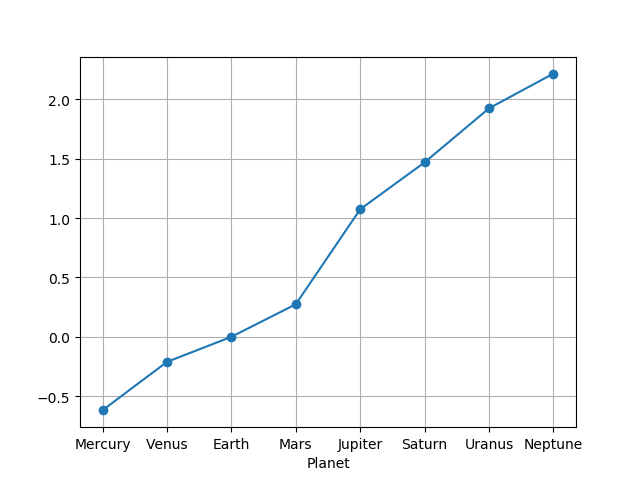
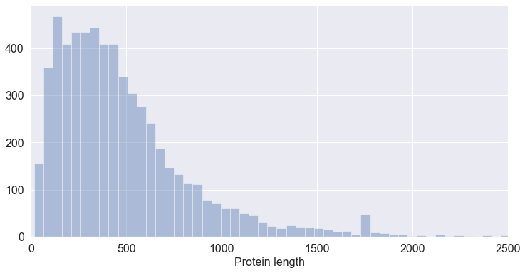
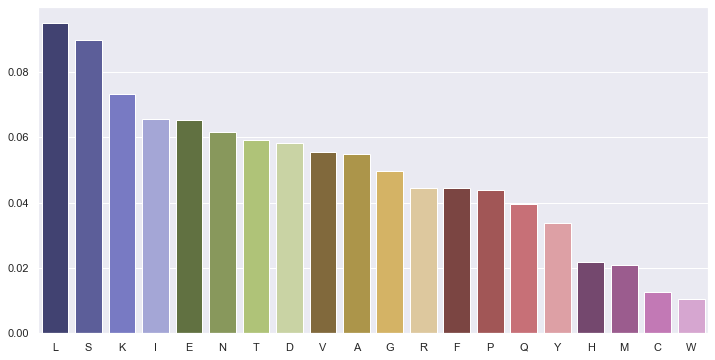
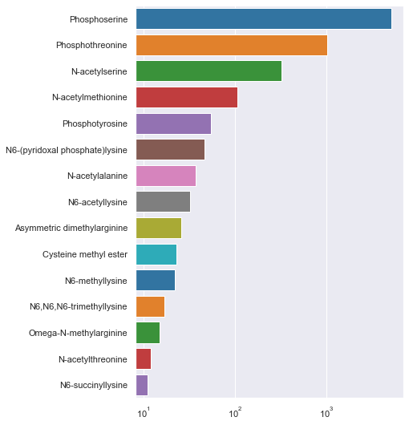

# pandas

[](https://pandas.pydata.org/)

O módulo `pandas` é um dos mais populares módulos da linguagem Python para
o tratamento de dados que não sejam de natureza exclusivamente numérica (como acontece com o módulo `numpy`).

É também considerado também um dos módulos principais do chamado **"ecossistema" de módulos científicos** que, não estando disponíveis na distribuição base da linguagem Python, são geralmente incluídos nas distribuições mais "científicas" da linguagem, por exemplo a distribuição Anaconda.

Tal como o módulo `numpy` introduz um tipo novo de objetos, os *arrays* com propriedades que as listas não têm (operações vetoriais e muitas funções associadas), o módulo `pandas` define outros dois tipos principais de objetos com novas propriedades (embora sejam grandes as semelhanças com os *arrays* do `numpy`):

- as *Series*
- as *DataFrames*

A documentação do módulo apresenta as seguintes definições:


> `Series` is a one-dimensional **labeled** array capable of holding any
> data type (integers, strings, floating point numbers, Python objects,
> etc.). The axis labels are collectively referred to as the **index**.


> `DataFrame` is a **2-dimensional labeled data structure** with columns
> of potentially different types. You can think of it like a spreadsheet
> or SQL table, or a **dict of Series objects**. It is generally the
> most commonly used pandas object.

Além das dimensões (uma *Series* é unidimensional e uma *DataFrame* é bidimensional, isto é, na forma de uma tabela), o que é de sublinhar nestes dois tipos novos de objetos é o facto dos dados serem acompanhados de *labels* (etiquetas)

Estes *labels* servem vários propósitos. Podendo ser basicamente entendidos como dados adicionais, eles são muito importantes na **indexação** da informação, tendo um papel análogo à chaves dos dicionários, mas com outras funcionalidades muito interessantes.

Estes conjuntos de *labels* constituem um **índice**.

Uma *Series* tem um único índice, chamado `index`.

Uma *DataFrame*, tem dois índices, um para as linhas, chamado `index` e outro para as colunas, chamado `columns`.

Comecemos pelas *Series*

## Series

### Construção e indexação

O módulo *pandas* tem de ser importado.

A convenção é importar comm a seguinte "abreviatura":

<div class="python_box">
``` python3
import pandas as pd
```
</div>

Uma Série (*Series*) é um conjunto (ordenado) de valores, mas cada valor
é associado a um *label*.

Ao conjunto dos *labels* é o `index` da *Series*

Uma *Series* pode ser construída, por exemplo, a partir de uma lista, usando a função `pd.Series()`:

<div class="python_box">
``` python3
ndias = [31, 28, 31, 30, 31, 30, 31, 31, 30, 31, 30, 31]

meses = pd.Series(ndias)

print(meses)
```
</div>

```
0     31
1     28
2     31
3     30
4     31
5     30
6     31
7     31
8     30
9     31
10    30
11    31
dtype: int64
```

Os números de 0 a 11 são o `index` da *Series*.

Se não indicarmos um índice, o conjunto dos inteiros sucessivos será o
índice.

Mas quando construímos uma Série, usando a função `pd.Series()`, podemos indicar o índice, explicitamente:

<div class="python_box">
``` python3
ndias = [31, 28, 31, 30, 31, 30, 31, 31, 30, 31, 30, 31]
ind = 'Jan Fev Mar Abr Mai Jun Jul Ago Set Out Nov Dez'.split()

meses = pd.Series(ndias, index=ind)

print(meses)
```
</div>

```
Jan    31
Fev    28
Mar    31
Abr    30
Mai    31
Jun    30
Jul    31
Ago    31
Set    30
Out    31
Nov    30
Dez    31
dtype: int64
```

Uma das principais razões de utilizarmos uma *Series* é que podemos
indexar de diferentes maneiras:

- usando um *label* para obter um elemento (como um dicionário)
- usando *slices* de posições
- usando **listas** de *labels*

<div class="python_box">
``` python3

# ...
# usando a Series meses criada acima...

só_out = meses['Out']
trimestre1 = meses[:3]
férias = meses[['Jul', 'Ago', 'Set']]

print(só_out)
print('--------------')
print(trimestre1)
print('--------------')
print(férias)
```
</div>

```
31
--------------
Jan    31
Fev    28
Mar    31
dtype: int64
--------------
Jul    31
Ago    31
Set    30
dtype: int64
```

Ou ainda, tal como os *arrays* do `numpy`, usar **condições lógicas** para indexar (no fundo usando *arrays booleanos*):

<div class="python_box">
``` python3

# ...
# usando a Series meses criada acima...

m31 = meses[meses==31]

print(m31)
```
</div>

```
Jan    31
Mar    31
Mai    31
Jul    31
Ago    31
Out    31
Dez    31
dtype: int64
```

Também existe a função `Series.reindex()` que transforma uma *Series*
noutra apenas com os elementos indicados e respeitando a ordem do "novo índice":

<div class="python_box">
``` python3
ndias = [31, 28, 31, 30, 31, 30, 31, 31, 30, 31, 30, 31]
ind = 'Jan Fev Mar Abr Mai Jun Jul Ago Set Out Nov Dez'.split()
meses = pd.Series(ndias, index=ind)

alguns_meses = meses.reindex(['Dez', 'Set', 'Abr'])

print(alguns_meses)
```
</div>

```
Dez    31
Set    30
Abr    30
dtype: int64
```

As Séries podem também ser construídas a partir de um dicionário,
usando `pd.Series()`. As chaves do dicionário passam a ser o `index`:

<div class="python_box">
``` python3
d = {'a' : 0, 'b' : 1, 'c' : 2}

s = pd.Series(d)
print(s)
```
</div>

```
a    0
b    1
c    2
dtype: int64
```

### Valores em falta

Quando contruímos uma *Series* a partie de um dicionário podemos indicar explicitamente os valores do índice.

Mas, neste caso, se índice tiver elementos que nãoo estejam nas chaves do dicionário, haverá **valores em falta** (em inglês *missing values*).

<div class="python_box">
``` python3
d = {'a' : 0, 'b' : 1, 'c' : 2}
s = pd.Series(d, index=['b', 'c', 'd', 'a'])
print(s)
```
</div>

```
b    1.0
c    2.0
d    NaN
a    0.0
dtype: float64
```

O `pandas` uso o marcador `NaN` para indicar **valores em falta**.

Esta representação do conceito de *valores em falta* (que também existe no `numpy`) é muito útil: frequentemente lidamos com tabelas de dados em que não existem valores atribuídos em certas linhas e será conveniente assinalar esses valores.

Mais importante ainda, muitas funções de análise disponíveis no `pandas` levam em conta a existência de *valores em falta* que são pura e simplesmente ignorados. Por exemplo, o cálculo do desvio padrão de uma série ignora as entradas com *valores em falta*.

Usando a função `Series.reindex()` podem aparecer valores *valores em falta*:

<div class="python_box">
``` python3
ndias = [31, 28, 31, 30, 31, 30, 31, 31, 30, 31, 30, 31]
ind = 'Jan Fev Mar Abr Mai Jun Jul Ago Set Out Nov Dez'.split()

meses = pd.Series(ndias, index=ind)

alguns_meses = meses.reindex(['Dez', 'Set', 'não vai dar', 'Abr'])

print(alguns_meses)
```
</div>

```
Dez            31.0
Set            30.0
não vai dar     NaN
Abr            30.0
dtype: float64
```

### Funções descritivas

As Séries têm muitas [funções descritivas](https://pandas.pydata.org/pandas-docs/stable/reference/api/pandas.Series.html) de grande utilidade.

Por exemplo, `sum()`, `mean()`, `std()` e `var()` calculam a soma, média, desvio padrão e variância dos valores da *Series*, respetivamente.

Note-se que, em geral, **os valores em falta são ignorados nos
cálculos**.

<div class="python_box">
``` python3
d = {'a' : 0., 'b' : 1., 'c' : 2.}
s = pd.Series(d, index=['b', 'c', 'd', 'a'])

print(s)

print('\nMédia =', s.mean())
```
</div>

```
b    1.0
c    2.0
d    NaN
a    0.0
dtype: float64

Média = 1.0
```

`Series.value_counts()` é outra função particularmente útil. O resultado é uma contagem dos valores diferentes da *Series*:

<div class="python_box">
``` python3
ndias = [31, 28, 31, 30, 31, 30, 31, 31, 30, 31, 30, 31]
ind = 'Jan Fev Mar Abr Mai Jun Jul Ago Set Out Nov Dez'.split()
meses = pd.Series(ndias, index=ind)

cont_dias = meses.value_counts()

print(cont_dias)
```
</div>

```
31    7
30    4
28    1
dtype: int64
```

Outra função interessante é a função `Series.describe()`:

<div class="python_box">
``` python3
ndias = [31, 28, 31, 30, 31, 30, 31, 31, 30, 31, 30, 31]
ind = 'Jan Fev Mar Abr Mai Jun Jul Ago Set Out Nov Dez'.split()
meses = pd.Series(ndias, index=ind)

stats = meses.describe()

print(stats)
```
</div>

```
count    12.000000
mean     30.416667
std       0.900337
min      28.000000
25%      30.000000
50%      31.000000
75%      31.000000
max      31.000000
dtype: float64
```

Outra função útil é a `Series.cumsum()`, a soma acumulada ao longo da *Series*:

<div class="python_box">
``` python3
ndias = [31, 28, 31, 30, 31, 30, 31, 31, 30, 31, 30, 31]
ind = 'Jan Fev Mar Abr Mai Jun Jul Ago Set Out Nov Dez'.split()
meses = pd.Series(ndias, index=ind)

totais = meses.cumsum()

print(totais)
```
</div>

```
Jan     31
Fev     59
Mar     90
Abr    120
Mai    151
Jun    181
Jul    212
Ago    243
Set    273
Out    304
Nov    334
Dez    365
dtype: int64
```

Repare-se num pormenor interessante: o resultado destas 3 últimas funções é
também uma *Series*.

Se quiser saber quantos dias do ano passaram no final de outubro podemos  simplesmente indexar a soma acumulada com `'Out'`

    meses.cumsum()['Out']

Finalmente, tal como se fossem dicionários, a função `len()`e o operador `in` também funcionam com *Series*.

### Operações vetoriais

As Séries comportam-se como *arrays* do módulo `numpy`: podemos executar operações vetoriais:

<div class="python_box">
``` python3
d = {'a' : 0.5, 'b' : 1.0, 'c' : 3.0, 'e': 1.8}
s = pd.Series(d, index=['b', 'c', 'd', 'e', 'a']) 

print(s)
print('-----------------')
print(s**2)
```
</div>

```
b    1.0
c    3.0
d    NaN
e    1.8
a    0.5
dtype: float64
-----------------
b    1.00
c    9.00
d     NaN
e    3.24
a    0.25
dtype: float64
```

Neste exemplo, elevámos a *Series* ao quadrado.

O *valor em falta* foi ignorado.

Também muito poderoso é o facto de que, quando aplicamos operações
vetoriais sobre *Series* (por exemplo, na soma de duas séries), os
valores são **alinhados** pelos respetivos *labels* antes da operação.

Vejamos esta soma de duas séries:

<div class="python_box">
``` python3
s1 = pd.Series({'a' : 0.5, 'b' : 1.0, 'e': 1.8})
s2 = pd.Series({'a' : 0.5, 'b' : 1.0, 'f': 1.8})

print('Soma')
print(s1 + s2)
```
</div>

```
Soma
a    1.0
b    2.0
e    NaN
f    NaN
dtype: float64
```

A soma das duas Séries resulta numa Série em que todas os *labels*
estão presentes (**união de conjuntos**).

As que só existirem numa das Séries ou as que, numa das Séries, têm o
valor `NaN`, terão o valor `NaN` no resultado final.

A função `.dropna()` permite eliminar os *valores em falta*.

<div class="python_box">
``` python3
s1 = pd.Series({'a' : 0.5, 'b' : 1.0, 'e': 1.8})
s2 = pd.Series({'a' : 0.5, 'b' : 1.0, 'f': 1.8})
s3 = s1 + s2

print(s3.dropna())
```
</div>

```
a    1.0
b    2.0
dtype: float64
```

## DataFrames

Numa definição muito simplificada:

Uma *DataFrame* é um quadro bidimensional, em que cada coluna se
comporta como uma Série, mas em que existe um índice comum a todas as
colunas.

Há muitas formas diferentes de criar uma *DataFrame*:

- a partir de listas de dicionários
- a partir de dicionários de listas
- a partir de *arrays*

Mas para ilustrar as possibilidades de criação de *DataFrames*, o primeiro exemplo mostra a criação
de uma *DataFrame* a partir de dados organizados em tabela num ficheiro de texto do tipo CSV:

<div class="python_box">
``` python3
import pandas as pd

pdata = pd.read_csv('planetdata.txt', sep='\t')

print(pdata)
```
</div>

```
    Planet  rotation_days  revolution_years
0  Mercury          58.60            0.2408
1    Venus         243.00            0.6150
2    Earth           0.99            1.0000
3     Mars           1.03            1.8800
4  Jupiter           0.41           11.8600
5   Saturn           0.45           29.4600
6   Uranus           0.72           84.0100
7  Neptune           0.67          164.7900
```

Esta *DataFrame* tem 3 colunas, cada uma delas funciona como uma *Series*. Mas, todas as *Series* partilham o mesmo `index`, neste caso os números de 0 a 8.

Muitas vezes faz muito sentido que uma das colunas seja o `index`. Podemos passar uma coluna para funcionar como `index` com a função `DataFrame.set_index()`:

<div class="python_box">
``` python3
pdata = pd.read_csv('planetdata.txt', sep='\t')

pdata = pdata.set_index('Planet')

print(pdata)
```
</div>

```
         rotation_days  revolution_years
Planet
Mercury          58.60            0.2408
Venus           243.00            0.6150
Earth             0.99            1.0000
Mars              1.03            1.8800
Jupiter           0.41           11.8600
Saturn            0.45           29.4600
Uranus            0.72           84.0100
Neptune           0.67          164.7900
```

Para obter uma das colunas, podemos indexar a *DataFrame* com
o nome da coluna:

<div class="python_box">
``` python3
pdata = pd.read_csv('planetdata.txt', sep='\t')
pdata = pdata.set_index('Planet')

rot_days = pdata['rotation_days']

print(rot_days)
```
</div>

```
Planet
Mercury     58.60
Venus      243.00
Earth        0.99
Mars         1.03
Jupiter      0.41
Saturn       0.45
Uranus       0.72
Neptune      0.67
Name: rotation_days, dtype: float64
```

ou, se o nome da coluna não tiver espaços, podemos simplesmente
usar o nome na forma `.nome`:

<div class="python_box">
``` python3
pdata = pd.read_csv('planetdata.txt', sep='\t')
pdata = pdata.set_index('Planet')

rot_days = pdata.rotation_days

print(rot_days)
```
</div>

```
Planet
Mercury     58.60
Venus      243.00
Earth        0.99
Mars         1.03
Jupiter      0.41
Saturn       0.45
Uranus       0.72
Neptune      0.67
Name: rotation_days, dtype: float64
```

Sendo as colunas *Series*, podemos usar toda a funcionalidade das *Series*:

<div class="python_box">
``` python3
import pandas as pd
import numpy as np
from matplotlib import pyplot as plt


pdata = pd.read_csv('planetdata.txt', sep='\t').set_index('Planet')

print('Rotation:')
rot_days = pdata.rotation_days

print(rot_days.describe())

logrev = np.log10(pdata.revolution_years)

logrev.plot(marker='o', grid=True)
plt.show()
```
</div>

```
Rotation:
count      8.000000
mean      38.233750
std       85.181975
min        0.410000
25%        0.615000
50%        0.855000
75%       15.422500
max      243.000000
Name: rotation_days, dtype: float64
```



Interessante que o log do período de revolução seja quase linear.

Podemos fazer indexação por condições de toda a *DataFrame*

Em que planetas o dia é maior do que um dia na Terra?

<div class="python_box">
``` python3
pdata = pd.read_csv('planetdata.txt', sep='\t').set_index('Planet')

rot_days = pdata.rotation_days

longer_than1 = rot_days[rot_days > 1]

print(longer_than1)
```
</div>

```
Planet
Mercury     58.60
Venus      243.00
Mars         1.03
Name: rotation_days, dtype: float64
```


## Exemplo: Tabela com informação Uniprot txt

Para ilustar o uso de uma `DataFrame` na organização e análise de dados, vamos ler a informação da UniProt sobre a levedura *S. cerevisiae* e realizar, algumas análises sobre os comprimentos das proteínas, a abundância de aminoácidos e a contagem de *modificações pós-traducionais*.

### Preparação

O ficheiro de partida é o mesmo usado num capítulo anterior, o ficheiro _Unitprot text_ com a informação sobre as proteínas da levedura _S. cerevisiae_.

Recorde-se que Para obter este ficheiro, deve-se proceder aos seguintes passos

- na UniProt procurar pelo "proteoma" da levedura _S. cerevisiae_ [www.uniprot.org/proteomes/UP000002311](https://www.uniprot.org/proteomes/UP000002311)
- Passar para resultados UniProtKB em "Map to Reviewed"
- Download -> Text
- Se o download tiver sido em modo "compressed", extraír o ficheiro do zip.
- Alterar o nome do ficheiro para `uniprot_scerevisiae.txt`

O ficheiro obtido deve estar na mesma pasta que os programas exibidos até ao final deste capítulo.


### Extração dos dados

<div class="python_box">
```python3
def read_Uniprot_text(filename):
    """Reads a UniProt text file and splits into a list of protein records."""
    
    with open(filename) as uniprot_file:
        whole_file = uniprot_file.read()

    records = whole_file.split('//\n')
    
    # remove empty records
    records = [p for p in records if len(p) != 0]
    # since we know that it is the last one only...
    # records.pop(-1)
    return records

data_filename = 'uniprot_scerevisiae.txt'
prots = read_Uniprot_text(data_filename)

print(f'The number of protein records in "{data_filename}" is {len(prots)}')

def extract_info(record):
    """Reads a UniProt text record and returns a dict with extrated information.
    
    The returned dict has the following fields:
    
    'ac': the UniProt Access Id,
    'n': the sequence length, 
    'PTMs': a dictionary that associates the location of PTMs (int, as keys)
               with the name of the PTM.
    'seq': a string with the protein sequence
    """
    
    IDline, ACline, *otherlines = record.splitlines()
      
    ac = ACline.split(';',1)[0].split()[1]
    n = int(IDline.split()[3])
       
    PTMs = []
    seqlines = []
    for i, line in enumerate(otherlines):

        if line.startswith('FT   MOD_RES'):
            FTcode, MOD_RES, loc, *rest = line.split()
            
            nextline = otherlines[i+1]
            PTMtype = nextline.split('/note=')[1]
            PTMtype = PTMtype.strip('"')
            PTMtype = PTMtype.split(';')[0]
            
            PTMs.append((loc, PTMtype))
        if line.startswith('  '): # two spaces
            seqlines.append(line)
    # build seq string from seqlines
    seq = ''.join([line.replace(' ', '') for line in seqlines])
        
    # Return dictionary of extracted information
    return {'ac': ac, 'n': n, 'PTMs': PTMs, 'seq': seq}

all_prots = [extract_info(p) for p in prots]
for p in all_prots[:4]:
    print('-----------------------------------')
    print(p)
```
</div>

```
The number of protein records in "uniprot_scerevisiae.txt" is 6049
-----------------------------------
{'ac': 'P38090', 'n': 596, 'PTMs': [], 'seq': 'MTKERMTIDYENDGDFEYDKNKYKTITTRIKSIEPSEGWLEPSGSVGHINTIPEAGDVHVDEHEDRGSSIDDDSRTYLLYFTETRRKLENRHVQLIAISGVIGTALFVAIGKALYRGGPASLLLAFALWCVPILCITVSTAEMVCFFPVSSPFLRLATKCVDDSLAVMASWNFWFLECVQIPFEIVSVNTIIHYWRDDYSAGIPLAVQVVLYLLISICAVKYYGEMEFWLASFKIILALGLFTFTFITMLGGNPEHDRYGFRNYGESPFKKYFPDGNDVGKSSGYFQGFLACLIQASFTIAGGEYISMLAGEVKRPRKVLPKAFKQVFVRLTFLFLGSCLCVGIVCSPNDPDLTAAINEARPGAGSSPYVIAMNNLKIRILPDIVNIALITAAFSAGNAYTYCSSRTFYGMALDGYAPKIFTRCNRHGVPIYSVAISLVWALVSLLQLNSNSAVVLNWLINLITASQLINFVVLCIVYLFFRRAYHVQQDSLPKLPFRSWGQPYTAIIGLVSCSAMILIQGYTVFFPKLWNTQDFLFSYLMVFINIGIYVGYKFIWKRGKDHFKNPHEIDFSKELTEIENHEIESSFEKFQYYSKA'}
-----------------------------------
{'ac': 'Q12001', 'n': 544, 'PTMs': [], 'seq': 'MAIGKRLLVNKPAEESFYASPMYDFLYPFRPVGNQWLPEYIIFVCAVILRCTIGLGPYSGKGSPPLYGDFEAQRHWMEITQHLPLSKWYWYDLQYWGLDYPPLTAFHSYLLGLIGSFFNPSWFALEKSRGFESPDNGLKTYMRSTVIISDILFYFPAVIYFTKWLGRYRNQSPIGQSIAASAILFQPSLMLIDHGHFQYNSVMLGLTAYAINNLLDEYYAMAAVCFVLSICFKQMALYYAPIFFAYLLSRSLLFPKFNIARLTVIAFATLATFAIIFAPLYFLGGGLKNIHQCIHRIFPFARGIFEDKVANFWCVTNVFVKYKERFTIQQLQLYSLIATVIGFLPAMIMTLLHPKKHLLPYVLIACSMSFFLFSFQVHEKTILIPLLPITLLYSSTDWNVLSLVSWINNVALFTLWPLLKKDGLHLQYAVSFLLSNWLIGNFSFITPRFLPKSLTPGPSISSINSDYRRRSLLPYNVVWKSFIIGTYIAMGFYHFLDQFVAPPSKYPDLWVLLNCAVGFICFSIFWLWSYYKIFTSGSKSMKDL'}
-----------------------------------
{'ac': 'P53309', 'n': 568, 'PTMs': [('449', 'Phosphothreonine')], 'seq': 'MSSLYTKLVKGATKIKMAPPKQKYVDPILSGTSSARGLQEITHALDIRLSDTAWTIVYKALIVLHLMIQQGEKDVTLRHYSHNLDVFQLRKISHTTKWSSNDMRALQRYDEYLKTRCEEYGRLGMDHLRDNYSSLKLGSKNQLSMDEELDHVESLEIQINALIRNKYSVSDLENHLLLYAFQLLVQDLLGLYNALNEGVITLLESFFELSIEHAKRTLDLYKDFVDMTEYVVRYLKIGKAVGLKIPVIKHITTKLINSLEEHLREETKRQRGEPSEPQQDRKPSTAISSTSSHNNNSNDKNKSIAQKKLEQIREQKRLLEQQLQNQQLLISPTVPQDAYNPFGSQQQDLNNDTFSFEPTQPQMTAQVPQPTANPFLIPQQQQQALQLTSASTMPQPSEIQITPNLNNQQTGMYASNLQYTPNFTGSGFGGYTTTENNAIMTGTLDPTKTGSNNPFSLENIAREQQQQNFQNSPNPFTLQQAQTTPILAHSQTGNPFQAQNVVTSPMGTYMTNPVAGQLQYASTGAQQQPQMMQGQQTGYVMVPTAFVPINQQQQQQQHQQENPNLIDI'}
-----------------------------------
{'ac': 'P40467', 'n': 964, 'PTMs': [('166', 'Phosphoserine'), ('186', 'Phosphoserine'), ('963', 'Phosphoserine')], 'seq': 'MPEQAQQGEQSVKRRRVTRACDECRKKKVKCDGQQPCIHCTVYSYECTYKKPTKRTQNSGNSGVLTLGNVTTGPSSSTVVAAAASNPNKLLSNIKTERAILPGASTIPASNNPSKPRKYKTKSTRLQSKIDRYKQIFDEVFPQLPDIDNLDIPVFLQIFHNFKRDSQSFLDDTVKEYTLIVNDSSSPIQPVLSSNSKNSTPDEFLPNMKSDSNSASSNREQDSVDTYSNIPVGREIKIILPPKAIALQFVKSTWEHCCVLLRFYHRPSFIRQLDELYETDPNNYTSKQMQFLPLCYAAIAVGALFSKSIVSNDSSREKFLQDEGYKYFIAARKLIDITNARDLNSIQAILMLIIFLQCSARLSTCYTYIGVAMRSALRAGFHRKLSPNSGFSPIEIEMRKRLFYTIYKLDVYINAMLGLPRSISPDDFDQTLPLDLSDENITEVAYLPENQHSVLSSTGISNEHTKLFLILNEIISELYPIKKTSNIISHETVTSLELKLRNWLDSLPKELIPNAENIDPEYERANRLLHLSFLHVQIILYRPFIHYLSRNMNAENVDPLCYRRARNSIAVARTVIKLAKEMVSNNLLTGSYWYACYTIFYSVAGLLFYIHEAQLPDKDSAREYYDILKDAETGRSVLIQLKDSSMAASRTYNLLNQIFEKLNSKTIQLTALHSSPSNESAFLVTNNSSALKPHLGDSLQPPVFFSSQDTKNSFSLAKSEESTNDYAMANYLNNTPISENPLNEAQQQDQVSQGTTNMSNERDPNNFLSIDIRLDNNGQSNILDATDDVFIRNDGDIPTNSAFDFSSSKSNASNNSNPDTINNNYNNVSGKNNNNNNITNNSNNNHNNNNNDNNNNNNNNNNNNNNNNNSGNSSNNNNNNNNNKNNNDFGIKIDNNSPSYEGFPQLQIPLSQDNLNIEDKEEMSPNIEIKNEQNMTDSNDILGVFDQLDAQLFGKYLPLNYPSE'}
```

### Transformação numa *DataFrame*


<div class="python_box">
```python3
prot_table = pd.DataFrame(all_prots)
prot_table
```
</div>


|    | ac     |   n | PTMs                                                                           | seq                      |
|:---|:-------|:----|:-------------------------------------------------------------------------------|:-------------------------|
|  0 | P38090 | 596 | []                                                                             | MTKERMTIDYENDGDFEYDKN... |
|  1 | Q12001 | 544 | []                                                                             | MAIGKRLLVNKPAEESFYASP... |
|  2 | P53309 | 568 | [('449', 'Phosphothreonine')]                                                  | MSSLYTKLVKGATKIKMAPPK... |
|  3 | P40467 | 964 | [('166', 'Phosphoserine'), ('186', 'Phosphoserine'), ('963', 'Phosphoserine')] | MPEQAQQGEQSVKRRRVTRAC... |
|  4 | P0CZ17 | 362 | []                                                                             | MRSLNTLLLSLFVAMSSGAPL... |
| ... |    |    |    |    |

6049 rows × 4 columns

<div class="python_box">
```python3
prot_table = prot_table.set_index('ac')
prot_table
```
</div>


|        | n   | PTMs                                                                           | seq                      |
|:-------|:----|:-------------------------------------------------------------------------------|:-------------------------|
| ac  |  |  | |
| P38090 | 596 | []                                                                             | MTKERMTIDYENDGDFEYDKN... |
| Q12001 | 544 | []                                                                             | MAIGKRLLVNKPAEESFYASP... |
| P53309 | 568 | [('449', 'Phosphothreonine')]                                                  | MSSLYTKLVKGATKIKMAPPK... |
| P40467 | 964 | [('166', 'Phosphoserine'), ('186', 'Phosphoserine'), ('963', 'Phosphoserine')] | MPEQAQQGEQSVKRRRVTRAC... |
| P0CZ17 | 362 | []                                                                             | MRSLNTLLLSLFVAMSSGAPL... |
| ... |    |    |      |

6049 rows × 3 columns

### Uso da DataFrame

#### Qual a proteína mais pequena. Qual a maior?

<div class="python_box">
```python3
# mais pequena

pos = prot_table.n.idxmin()
pos
```
</div>

```
'Q3E775'
```

<div class="python_box">
```python3
posmin = prot_table.n.idxmin()
posmax = prot_table.n.idxmax()
```
</div>

<div class="python_box">
```python3
prot_table.loc[posmin]
```
</div>


```
n                     16
PTMs                  []
seq     MLSLIFYLRFPSYIRG
Name: Q3E775, dtype: object
```


<div class="python_box">
```python3
prot_table.loc[posmax]
```
</div>

```
n                                                    4910
PTMs    [(1026, Phosphothreonine), (2971, Phosphoserin...
seq     MSQDRILLDLDVVNQRLILFNSAFPSDAIEAPFHFSNKESTSENLD...
Name: Q12019, dtype: object
```

Como obter a sequência da proteína maior de todas?

<div class="python_box">
```python3
prot_table.loc[posmax].seq
```
</div>


```
'MSQDRILLDLDVVNQRLILFNSAFPSDAIEAPFHFSNKESTSENLDNLAGTILHSRSITGHVFLYKHIFLEIVARWIKDSKKKDYVLVIEKLASIITIFPVAMPLIEDYLDKENDHFITILQNPSTQKDSDMFKILLAYYRLLYHNKEVFARFIQPDILYQLVDLLTKEQENQVVIFLALKVLSLYLDMGEKTLNDMLDTYIKSRDSLLGHFEGDSGIDYSFLELNEAKRCANFSKLPSVPECFTIEKKSSYFIIEPQDLSTKVASICGVIVPKVHTIHDKVFYPLTFVPTHKTVSSLRQLGRKIQNSTPIMLIGKAGSGKTFLINELSKYMGCHDSIVKIHLGEQTDAKLLIGTYTSGDKPGTFEWRAGVLATAVKEGRWVLIEDIDKAPTDVLSILLSLLEKRELTIPSRGETVKAANGFQLISTVRINEDHQKDSSNKIYNLNMIGMRIWNVIELEEPSEEDLTHILAQKFPILTNLIPKLIDSYKNVKSIYMNTKFISLNKGAHTRVVSVRDLIKLCERLDILFKNNGINKPDQLIQSSVYDSIFSEAADCFAGAIGEFKALEPIIQAIGESLDIASSRISLFLTQHVPTLENLDDSIKIGRAVLLKEKLNIQKKSMNSTLFAFTNHSLRLMEQISVCIQMTEPVLLVGETGTGKTTVVQQLAKMLAKKLTVINVSQQTETGDLLGGYKPVNSKTVAVPIQENFETLFNATFSLKKNEKFHKMLHRCFNKNQWKNVVKLWNEAYKMAQSILKITNTENENENAKKKKRRLNTHEKKLLLDKWADFNDSVKKFEAQSSSIENSFVFNFVEGSLVKTIRAGEWLLLDEVNLATADTLESISDLLTEPDSRSILLSEKGDAEPIKAHPDFRIFACMNPATDVGKRDLPMGIRSRFTEIYVHSPERDITDLLSIIDKYIGKYSVSDEWVGNDIAELYLEAKKLSDNNTIVDGSNQKPHFSIRTLTRTLLYVTDIIHIYGLRRSLYDGFCMSFLTLLDQKSEAILKPVIEKFTLGRLKNVKSIMSQTPPSPGPDYVQFKHYWMKKGPNTIQEQAHYIITPFVEKNMMNLVRATSGKRFPVLIQGPTSSGKTSMIKYLADITGHKFVRINNHEHTDLQEYLGTYVTDDTGKLSFKEGVLVEALRKGYWIVLDELNLAPTDVLEALNRLLDDNRELFIPETQEVVHPHPDFLLFATQNPPGIYGGRKILSRAFRNRFLELHFDDIPQDELEIILRERCQIAPSYAKKIVEVYRQLSIERSASRLFEQKNSFATLRDLFRWALRDAVGYEQLAASGYMLLAERCRTPQEKVTVKKTLEKVMKVKLDMDQYYASLEDKSLEAIGSVTWTKGMRRLSVLVSSCLKNKEPVLLVGETGCGKTTICQLLAQFMGRELITLNAHQNTETGDILGAQRPVRNRSEIQYKLIKSLKTALNIANDQDVDLKELLQLYSKSDNKNIAEDVQLEIQKLRDSLNVLFEWSDGPLIQAMRTGNFFLLDEISLADDSVLERLNSVLEPERSLLLAEQGSSDSLVTASENFQFFATMNPGGDYGKKELSPALRNRFTEIWVPSMEDFNDVNMIVSSRLLEDLKDLANPIVKFSEWFGKKLGGGNATSGVISLRDILAWVEFINKVFPKIQNKSTALIQGASMVFIDALGTNNTAYLAENENDLKSLRTECIIQLLKLCGDDLELQQIETNEIIVTQDELQVGMFKIPRFPDAQSSSFNLTAPTTASNLVRVVRAMQVHKPILLEGSPGVGKTSLITALANITGNKLTRINLSEQTDLVDLFGADAPGERSGEFLWHDAPFLRAMKKGEWVLLDEMNLASQSVLEGLNACLDHRGEAYIPELDISFSCHPNFLVFAAQNPQYQGGGRKGLPKSFVNRFSVVFIDMLTSDDLLLIAKHLYPSIEPDIIAKMIKLMSTLEDQVCKRKLWGNSGSPWEFNLRDTLRWLKLLNQYSICEDVDVFDFVDIIVKQRFRTISDKNKAQLLIEDIFGKFSTKENFFKLTEDYVQINNEVALRNPHYRYPITQNLFPLECNVAVYESVLKAINNNWPLVLVGPSNSGKTETIRFLASILGPRVDVFSMNSDIDSMDILGGYEQVDLTRQISYITEELTNIVREIISMNMKLSPNATAIMEGLNLLKYLLNNIVTPEKFQDFRNRFNRFFSHLEGHPLLKTMSMNIEKMTEIITKEASVKFEWFDGMLVKAVEKGHWLILDNANLCSPSVLDRLNSLLEIDGSLLINECSQEDGQPRVLKPHPNFRLFLTMDPKYGELSRAMRNRGVEIYIDELHSRSTAFDRLTLGFELGENIDFVSIDDGIKKIKLNEPDMSIPLKHYVPSYLSRPCIFAQVHDILLLSDEEPIEESLAAVIPISHLGEVGKWANNVLNCTEYSEKKIAERLYVFITFLTDMGVLEKINNLYKPANLKFQKALGLHDKQLTEETVSLTLNEYVLPTVSKYSDKIKSPESLYLLSSLRLLLNSLNALKLINEKSTHGKIDELTYIELSAAAFNGRHLKNIPRIPIFCILYNILTVMSENLKTESLFCGSNQYQYYWDLLVIVIAALETAVTKDEARLRVYKELIDSWIASVKSKSDIEITPFLNINLEFTDVLQLSRGHSITLLWDIFRKNYPTTSNSWLAFEKLINLSEKFDKVRLLQFSESYNSIKDLMDVFRLLNDDVLNNKLSEFNLLLSKLEDGINELELISNKFLNKRKHYFADEFDNLIRYTFSVDTAELIKELAPASSLATQKLTKLITNKYNYPPIFDVLWTEKNAKLTSFTSTIFSSQFLEDVVRKSNNLKSFSGNQIKQSISDAELLLSSTIKCSPNLLKSQMEYYKNMLLSWLRKVIDIHVGGDCLKLTLKELCSLIEEKTASETRVTFAEYIFPALDLAESSKSLEELGEAWITFGTGLLLLFVPDSPYDPAIHDYVLYDLFLKTKTFSQNLMKSWRNVRKVISGDEEIFTEKLINTISDDDAPQSPRVYRTGMSIDSLFDEWMAFLSSTMSSRQIKELVSSYKCNSDQSDRRLEMLQQNSAHFLNRLESGYSKFADLNDILAGYIYSINFGFDLLKLQKSKDRASFQISPLWSMDPINISCAENVLSAYHELSRFFKKGDMEDTSIEKVLMYFLTLFKFHKRDTNLLEIFEAALYTLYSRWSVRRFRQEQEENEKSNMFKFNDNSDDYEADFRKLFPDYEDTALVTNEKDISSPENLDDIYFKLADTYISVFDKDHDANFSSELKSGAIITTILSEDLKNTRIEELKSGSLSAVINTLDAETQSFKNTEVFGNIDFYHDFSIPEFQKAGDIIETVLKSVLKLLKQWPEHATLKELYRVSQEFLNYPIKTPLARQLQKIEQIYTYLAEWEKYASSEVSLNNTVKLITDLIVSWRKLELRTWKGLFNSEDAKTRKSIGKWWFYLYESIVISNFVSEKKETAPNATLLVSSLNLFFSKSTLGEFNARLDLVKAFYKHIQLIGLRSSKIAGLLHNTIKFYYQFKPLIDERITNGKKSLEKEIDDIILLASWKDVNVDALKQSSRKSHNNLYKIVRKYRDLLNGDAKTIIEAGLLYSNENKLKLPTLKQHFYEDPNLEASKNLVKEISTWSMRAAPLRNIDTVASNMDSYLEKISSQEFPNFADLASDFYAEAERLRKETPNVYTKENKKRLAYLKTQKSKLLGDALKELRRIGLKVNFREDIQKVQSSTTTILANIAPFNNEYLNSSDAFFFKILDLLPKLRSAASNPSDDIPVAAIERGMALAQSLMFSLITVRHPLSEFTNDYCKINGMMLDLEHFTCLKGDIVHSSLKANVDNVRLFEKWLPSLLDYAAQTLSVISKYSATSEQQKILLDAKSTLSSFFVHFNSSRIFDSSFIESYSRFELFINELLKKLENAKETGNAFVFDIIIEWIKANKGGPIKKEQKRGPSVEDVEQAFRRTFTSIILSFQKVIGDGIESISETDDNWLSASFKKVMVNVKLLRSSVVSKNIETALSLLKDFDFTTTESIYVKSVISFTLPVITRYYNAMTVVLERSRIYYTNTSRGMYILSTILHSLAKNGFCSPQPPSEEVDDKNLQEGTGLGDGEGAQNNNKDVEQDEDLTEDAQNENKEQQDKDERDDENEDDAVEMEGDMAGELEDLSNGEENDDEDTDSEEEELDEEIDDLNEDDPNAIDDKMWDDKASDNSKEKDTDQNLDGKNQEEDVQAAENDEQQRDNKEGGDEDPNAPEDGDEEIENDENAEEENDVGEQEDEVKDEEGEDLEANVPEIETLDLPEDMNLDSEHEESDEDVDMSDGMPDDLNKEEVGNEDEEVKQESGIESDNENDEPGPEEDAGETETALDEEEGAEEDVDMTNDEGKEDEENGPEEQAMSDEEELKQDAAMEENKEKGGEQNTEGLDGVEEKADTEDIDQEAAVQQDSGSKGAGADATDTQEQDDVGGSGTTQNTYEEDQEDVTKNNEESREEATAALKQLGDSMKEYHRRRQDIKEAQTNGEEDENLEKNNERPDEFEHVEGANTETDTQALGSATQDQLQTIDEDMAIDDDREEQEVDQKELVEDADDEKMDIDEEEMLSDIDAHDANNDVDSKKSGFIGKRKSEEDFENELSNEHFSADQEDDSEIQSLIENIEDNPPDASASLTPERSLEESRELWHKSEISTADLVSRLGEQLRLILEPTLATKLKGDYKTGKRLNMKRIIPYIASQFRKDKIWLRRTKPSKRQYQIMIALDDSKSMSESKCVKLAFDSLCLVSKTLTQLEAGGLSIVKFGENIKEVHSFDQQFSNESGARAFQWFGFQETKTDVKKLVAESTKIFERARAMVHNDQWQLEIVISDGICEDHETIQKLVRRARENKIMLVFVIIDGITSNESILDMSQVNYIPDQYGNPQLKITKYLDTFPFEFYVVVHDISELPEMLSLILRQYFTDLASS'
```


<div class="python_box">
```python3
prot_table.loc[posmax].PTMs
```
</div>


    [('1026', 'Phosphothreonine'),
     ('2971', 'Phosphoserine'),
     ('4353', 'Phosphoserine'),
     ('4388', 'Phosphothreonine'),
     ('4555', 'Phosphoserine')]


#### Quais as 20 proteínas mais pequenas de S.cerevisiae?

<div class="python_box">
```python3
ord_prot_table = prot_table.sort_values(by='n')
ord_prot_table.head(20)
```
</div>


|            |   n | PTMs   | seq                           |
|:-----------|:----|:-------|:------------------------------|
| ac         |     |        |                               |
| Q3E775     |  16 | []     | MLSLIFYLRFPSYIRG              |
| P08521     |  25 | []     | MFSLSNSQYTCQDYISDHIWKTSSH     |
| P0CX86     |  25 | []     | MRAKWRKKRTRRLKRKRRKVRARSK     |
| P0CX87     |  25 | []     | MRAKWRKKRTRRLKRKRRKVRARSK     |
| P0C5N4     |  26 | []     | MYFHSFLDTFSKYLGSTSCPLLRLSR    |
| P0C5S1     |  26 | []     | MVYVMSMVSLLKRLLTVTRWKLQITG    |
| Q8TGV0     |  26 | []     | MRLNYSRCYYSSQRRRQSLPKRFPLI    |
| Q3E7Z6     |  27 | []     | MTAFASLREPLVLANLKIKVHIYRMKR   |
| Q3E801     |  27 | []     | MTRCISKKMLLEVDALSLIYSPHLYMS   |
| P0C5K9     |  27 | []     | MWGLNRWLTFTMLILLITSHCCYWNKR   |
| Q8TGN3     |  28 | []     | MPGIAFKGKDMVKAIQFLEIVVPCHCTT  |
| A0A0B7P221 |  28 | []     | MIRQKIFVFIVKSRRNSICPAIRRKEDY  |
| Q8TGS7     |  28 | []     | MRKPSAFHACNIIFLPLVKCASATIMLN  |
| Q3E838     |  28 | []     | MLPRKYKPAYKKQAHRVKSNPQPAYTFQ  |
| Q8TGT8     |  28 | []     | MNLNAYFEAYQAIFPFLLEAFLRKEQKV  |
| Q8TGU0     |  28 | []     | MLPSISFDYIKRPNIVLFSNVLSLSSNI  |
| Q8TGT6     |  29 | []     | MKIKFSRGARFSATFSFDKYPFLLYEVVR |
| P0C5M8     |  29 | []     | MPLEVLGHLSKAFLFLARNNEHSHKKYNQ |
| Q8TGS6     |  29 | []     | MFKMKFGDTLPRSDFGTGGNKQAPGLELG |
| P0C1Z1     |  29 | []     | MKRSYKTLPTYFFSFFGPFKERAVFLLVL |

#### Quais as 20 proteínas maiores de S.cerevisiae?

<div class="python_box">
```python3
ord_prot_table.tail(20)
```
</div>


|        |    n | PTMs                                                                                                                                                                                                                                                                                                                                                                                                                                                                                                                         | seq                      |
|:-------|:-----|:-----------------------------------------------------------------------------------------------------------------------------------------------------------------------------------------------------------------------------------------------------------------------------------------------------------------------------------------------------------------------------------------------------------------------------------------------------------------------------------------------------------------------------|:-------------------------|
| ac |   |    |    |
| P34756 | 2278 | [('2', 'N-acetylserine'), ('186', 'Phosphoserine'), ('1627', 'Phosphoserine'), ('1630', 'Phosphoserine'), ('1938', 'Phosphoserine'), ('1953', 'Phosphothreonine')]                                                                                                                                                                                                                                                                                                                                                           | MSSEEPHASISFPDGSHVRSS... |
| P38111 | 2368 | []                                                                                                                                                                                                                                                                                                                                                                                                                                                                                                                           | MESHVKYLDELILAIKDLNSG... |
| P40468 | 2376 | [('141', 'Phosphoserine'), ('1144', 'Phosphoserine'), ('2264', 'Phosphothreonine'), ('2267', 'Phosphoserine'), ('2355', 'Phosphoserine')]                                                                                                                                                                                                                                                                                                                                                                                    | MASRFTFPPQRDQGIGFTFPP... |
| P33334 | 2413 | []                                                                                                                                                                                                                                                                                                                                                                                                                                                                                                                           | MSGLPPPPPGFEEDSDLALPP... |
| P35169 | 2470 | []                                                                                                                                                                                                                                                                                                                                                                                                                                                                                                                           | MEPHEEQIWKSKLLKAANNDM... |
| P32600 | 2474 | [('10', 'Phosphothreonine')]                                                                                                                                                                                                                                                                                                                                                                                                                                                                                                 | MNKYINKYTTPPNLLSLRQRA... |
| Q06116 | 2489 | [('2254', 'Phosphoserine'), ('2278', 'Phosphoserine')]                                                                                                                                                                                                                                                                                                                                                                                                                                                                       | MSMLPWSQIRDVSKLLLGFML... |
| P35194 | 2493 | []                                                                                                                                                                                                                                                                                                                                                                                                                                                                                                                           | MAKQRQTTKSSKRYRYSSFKA... |
| Q06179 | 2628 | []                                                                                                                                                                                                                                                                                                                                                                                                                                                                                                                           | MMFPINVLLYKWLIFAVTFLW... |
| P33892 | 2672 | []                                                                                                                                                                                                                                                                                                                                                                                                                                                                                                                           | MTAILNWEDISPVLEKGTRES... |
| Q00402 | 2748 | [('611', 'Phosphoserine'), ('675', 'Phosphoserine'), ('746', 'Phosphoserine'), ('881', 'Phosphoserine'), ('945', 'Phosphoserine'), ('1009', 'Phosphoserine'), ('1201', 'Phosphoserine'), ('1265', 'Phosphoserine'), ('1329', 'Phosphoserine'), ('2162', 'Phosphoserine'), ('2164', 'Phosphoserine'), ('2197', 'Phosphoserine'), ('2217', 'Phosphoserine'), ('2220', 'Phosphoserine'), ('2221', 'Phosphoserine'), ('2360', 'Phosphoserine'), ('2424', 'Phosphoserine'), ('2494', 'Phosphoserine'), ('2545', 'Phosphoserine')] | MSHNNRHKKNNDKDSSAGQYA... |
| P38110 | 2787 | []                                                                                                                                                                                                                                                                                                                                                                                                                                                                                                                           | MEDHGIVETLNFLSSTKIKER... |
| Q12150 | 2958 | []                                                                                                                                                                                                                                                                                                                                                                                                                                                                                                                           | MEAISQLRGVPLTHQKDFSWV... |
| P19158 | 3079 | [('635', 'Phosphothreonine')]                                                                                                                                                                                                                                                                                                                                                                                                                                                                                                | MSQPTKNKKKEHGTDSKSSRM... |
| P18963 | 3092 | [('497', 'Phosphoserine'), ('915', 'Phosphoserine'), ('1342', 'Phosphoserine'), ('1753', 'Phosphoserine'), ('3004', 'Phosphoserine')]                                                                                                                                                                                                                                                                                                                                                                                        | MNQSDPQDKKNFPMEYSLTKH... |
| Q07878 | 3144 | [('1364', 'Phosphoserine'), ('1382', 'Phosphoserine'), ('1715', 'Phosphoserine'), ('1729', 'Phosphoserine'), ('1731', 'Phosphoserine')]                                                                                                                                                                                                                                                                                                                                                                                      | MLESLAANLLNRLLGSYVENF... |
| Q03280 | 3268 | [('1890', 'Phosphoserine'), ('2096', 'Phosphothreonine'), ('2119', 'Phosphoserine'), ('2376', 'Phosphoserine'), ('2406', 'Phosphoserine'), ('2418', 'Phosphoserine')]                                                                                                                                                                                                                                                                                                                                                        | MVLFTRCEKARKEKLAAGYKP... |
| P38811 | 3744 | [('2', 'N-acetylserine'), ('172', 'Phosphoserine'), ('542', 'Phosphoserine')]                                                                                                                                                                                                                                                                                                                                                                                                                                                | MSLTEQIEQFASRFRDDDATL... |
| P36022 | 4092 | []                                                                                                                                                                                                                                                                                                                                                                                                                                                                                                                           | MCKNEARLANELIEFVAATVT... |
| Q12019 | 4910 | [('1026', 'Phosphothreonine'), ('2971', 'Phosphoserine'), ('4353', 'Phosphoserine'), ('4388', 'Phosphothreonine'), ('4555', 'Phosphoserine')]                                                                                                                                                                                                                                                                                                                                                                                | MSQDRILLDLDVVNQRLILFN... |

#### Histograma da distribuição de tamanhos

<div class="python_box">
```python3
from matplotlib import pyplot as plt
import seaborn as sns
f, ax = plt.subplots(figsize=(12,6))
sns.set()

sns.distplot(ord_prot_table.n, kde=False, bins=100)

plt.xlim(0,2500)
ax.tick_params(labelsize=16)

ax.set_xlabel('Protein length', fontsize=16)
plt.show()
```
</div>





#### Contagens e distribuição dos 20 aminoácidos nas proteínas

<div class="python_box">
```python3
all_aminoacids = prot_table.seq.str.cat()


from collections import Counter

aminoacid_counts = Counter(all_aminoacids)

aminoacid_counts = pd.Series(aminoacid_counts).sort_values(ascending=False)
aminoacid_counts = aminoacid_counts / aminoacid_counts.sum()

plt.subplots(figsize=(12,6))
barplot = sns.barplot(x=aminoacid_counts.index,
                      y=aminoacid_counts.values,
                      palette='tab20b')
```
</div>





#### Contagens globais das PTM

<div class="python_box">

```python3
PTM_locs = prot_table.PTMs.explode()
PTM_locs = PTM_locs.dropna()
PTM_locs.head(30)
```
</div>


```
ac
P53309    (449, Phosphothreonine)
P40467       (166, Phosphoserine)
P40467       (186, Phosphoserine)
P40467       (963, Phosphoserine)
P36076        (42, Phosphoserine)
P36076       (116, Phosphoserine)
P36076       (121, Phosphoserine)
P36076       (124, Phosphoserine)
P36076       (264, Phosphoserine)
P53388        (22, Phosphoserine)
P00431     (220, Phosphotyrosine)
P53968    (170, Phosphothreonine)
P53968       (175, Phosphoserine)
P53968       (245, Phosphoserine)
P53968       (385, Phosphoserine)
P89105      (1015, Phosphoserine)
P89105      (1017, Phosphoserine)
P07262        (2, N-acetylserine)
P38859      (4, Phosphothreonine)
P38859        (17, Phosphoserine)
P38859       (237, Phosphoserine)
P38859    (962, Phosphothreonine)
P54861       (629, Phosphoserine)
P14020        (2, N-acetylserine)
P14020       (141, Phosphoserine)
P32892       (208, Phosphoserine)
P43616       (451, Phosphoserine)
Q00684       (467, Phosphoserine)
Q06440       (441, Phosphoserine)
Q06440       (454, Phosphoserine)
Name: PTMs, dtype: object
```


<div class="python_box">
```python3
PTMs = PTM_locs.str.get(1)
PTMs
```
</div>


```
ac
P53309    Phosphothreonine
P40467       Phosphoserine
P40467       Phosphoserine
P40467       Phosphoserine
P36076       Phosphoserine
                ...       
Q04461       Phosphoserine
Q04461    Phosphothreonine
P38260       Phosphoserine
P42837       Phosphoserine
P32806       Phosphoserine
Name: PTMs, Length: 7070, dtype: object
```


<div class="python_box">
```python3
PTM_counts = PTMs.value_counts(ascending=False)
PTM_counts
```
</div>


```
Phosphoserine                                       5172
Phosphothreonine                                    1028
N-acetylserine                                       345
N-acetylmethionine                                   106
Phosphotyrosine                                       55
N6-(pyridoxal phosphate)lysine                        46
N6-acetyllysine                                       46
N-acetylalanine                                       37
Asymmetric dimethylarginine                           33
N6-methyllysine                                       24
Cysteine methyl ester                                 23
N6,N6,N6-trimethyllysine                              22
N6,N6-dimethyllysine                                  15
Omega-N-methylarginine                                15
N-acetylthreonine                                     12
N6-succinyllysine                                     11
N6-butyryllysine                                       8
N6-biotinyllysine                                      5
N,N-dimethylproline                                    4
Phosphohistidine                                       4
N5-methylglutamine                                     4
N6-lipoyllysine                                        4
N6-carboxylysine                                       4
Lysine derivative                                      3
Pyruvic acid (Ser)                                     3
N6-malonyllysine                                       3
S-glutathionyl cysteine                                3
O-(pantetheine 4'-phosphoryl)serine                    3
4-aspartylphosphate                                    3
3,4-dihydroxyproline                                   2
Tele-8alpha-FAD histidine                              2
N6-propionyllysine                                     2
Hypusine                                               2
N5-methylarginine                                      2
N-acetylvaline                                         2
Leucine methyl ester                                   2
Cysteine sulfinic acid (-SO2H)                         1
Thiazolidine linkage to a ring-opened DNA abasic       1
1-thioglycine                                          1
N6-crotonyllysine                                      1
N-formylmethionine                                     1
Pros-8alpha-FAD histidine                              1
Dimethylated arginine                                  1
Pros-methylhistidine                                   1
2,3-didehydroalanine (Cys)                             1
S-methylcysteine                                       1
S-(dipyrrolylmethanemethyl)cysteine                    1
N,N,N-trimethylglycine                                 1
Lysine methyl ester                                    1
Diphthamide                                            1
N6-glutaryllysine                                      1
Name: PTMs, dtype: int64
```


<div class="python_box">
```python3
more_than10 = PTM_counts[PTM_counts >= 10]
more_than10
```
</div>


```
Phosphoserine                     5172
Phosphothreonine                  1028
N-acetylserine                     345
N-acetylmethionine                 106
Phosphotyrosine                     55
N6-(pyridoxal phosphate)lysine      46
N6-acetyllysine                     46
N-acetylalanine                     37
Asymmetric dimethylarginine         33
N6-methyllysine                     24
Cysteine methyl ester               23
N6,N6,N6-trimethyllysine            22
N6,N6-dimethyllysine                15
Omega-N-methylarginine              15
N-acetylthreonine                   12
N6-succinyllysine                   11
Name: PTMs, dtype: int64
```


<div class="python_box">
```python3
f, ax = plt.subplots(figsize=(8,12))

bp = sns.barplot(x=more_than10.values, y=more_than10.index, palette='tab20', orient='h', log=True)
ax.tick_params(labelsize=16)
plt.show()
```
</div>




