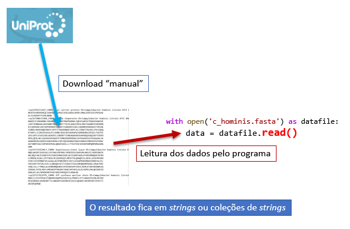
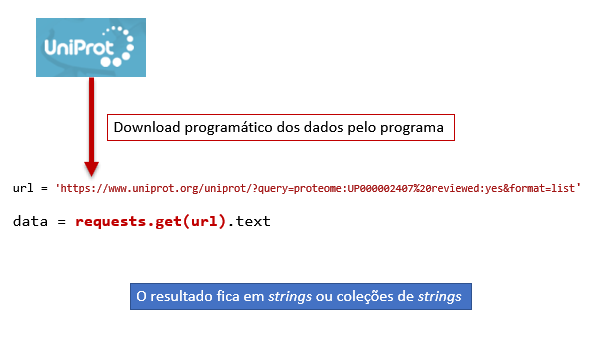

#  _Strings_ e textos

## Textos estruturados

Existem muitos formatos de texto estruturado usados na representação de
informação de caráter biológico.

Os portais de bioinformática, por exemplo a [UniProt](https://www.uniprot.org/)
oferecem, muitas vezes, a possibilidade de transferir a informação contida em
bases de dados na forma de textos. Esses textos são estruturados, seguindo formatos
e regras específicos.

Exemplos:

- Sequências de ácidos nucleicos e proteínas em formato FASTA
- Alinhamentos múltiplos em formatos CLUSTAL, PIR, HSSP
- Resultados de busca na UniProt em FASTA, "Tab delimited", "Text", GFF
- ...

## Obtenção de textos estruturados para processamento

### Download manual e leitura




<div class="python_box">
``` python3
with open('c_hominis.fasta') as datafile:
    data = datafile.read()

print(data)
```
</div>

    >sp|A7HZZ5|ACP_CAMHC Acyl carrier protein OS=Campylobacter hominis (strain ATCC BAA-381 / LMG 19568 / NCTC 13146 / CH001A) OX=360107 GN=acpP PE=3 SV=1
    MEVFEEVRDVVVEQLSVAPDAVKIDSKIIEDLGADSLDVVELVMALEEKFGIEIPDSEAE
    KLISIKDVVTYIENLNKNK
    >sp|A7I0W5|CH60_CAMHC 60 kDa chaperonin OS=Campylobacter hominis (strain ATCC BAA-381 / LMG 19568 / NCTC 13146 / CH001A) OX=360107 GN=groL PE=3 SV=1
    MAKDIIFSDDARNRLYDGVKKLNDTVKVTMGPRGRNVLIQKSFGAPAITKDGVSVAKEVE
    LKDTIENMGAALVKEVANKTNDQAGDGTTTATVLAHAIFKEGLRNITAGANPIEVKRGMD
    KICADVVAELKKISKPVKDKKEIAQVATISANSDESIGKLIADAMEKVGKDGVITVEEAK
    SINDELNVVEGMQFDRGYLSPYFITDAEKMQVELNSPLVLLFDKKITNLKDLLPVLEQVQ
    KTGKPLLIIAEDIEGEALATLVVNKLRGVLNISAVKAPGFGDRRKAMLEDIAILTGGTVI
    SEELGRTLESASIADLGKAERILIDKDNTTIVNGAGKKDDIKARVDQIKAQIAVTSSDYD
    REKLQERLAKLSGGVAVIKVGAATETEMKEKKDRVDDALSATKAAVEEGIVIGGGAALIK
    AGNAVKENLKGDEKIGADIVKRALFAPLRQIAENAGFDAGVIANAVSINKEKAYGFDAAC
    GEFVNMFEAGIIDPVKVERVALQNAVSVASLLLTTEATVSEIKEDKPAMPQMPDMGGGMG
    GMM
    
    ...
    muitas outras sequências ...
    ...
    
    >sp|A7I1M8|LGT_CAMHC Phosphatidylglycerol--prolipoprotein diacylglyceryl transferase OS=Campylobacter hominis (strain ATCC BAA-381 / LMG 19568 / NCTC 13146 / CH001A) OX=360107 GN=lgt PE=3 SV=1
    MTFWNEIYAHFDPVAFSIFGLKVHWYGLMYVLALLVALYMAKFFVKKDRLKFSNQVLENY
    FIWVEIGVILGARFGYILIYSNAQIFYLTHPWEIFNPFYNGKFVGISGMSYHGAVIGFII
    ATILFCRKKRQNLWSLLDLCALSIPLGYFFGRIGNFLNQELFGRITDVSWGILVNGELRH
    PSQLYEACLEGITIFLILYFYRKYKKFDGELICVYVILYAIFRFLTEFLREADVQIGYFS
    FGLSLGQILSVFMLILGFSAYIKLLKNSQTEQKFNQNKS
    
    

### Download programático




<div class="python_box">
``` python3
import requests

url = 'https://www.uniprot.org/uniprot/?query=proteome:UP000002407%20reviewed:yes&format=list'

data = requests.get(url).text

print(data)
```
</div>

    A7HZZ5
    A7I0W5
    
    ...
    muitos outros identificadores ...
    ...
    
    A7I0N8
    A7I1M8
    
    
## _Strings_

### Definição literal, iteração e indexação


As *strings* são um dos tipos de objetos mais usados na linguagem
Python. É comum um programa lidar com texto, seja porque o objetivo do
programa é precisamente o processamento de informação na forma textual,
seja simplesmente para que os resultados de um programa sejam
apresentados com pequenos textos destinados a descrever esses
resultados.

Como vimos anteriormente, uma _string_ é uma coleção de caracteres.

Uma maneira de criarmos _strings_ num programa é defini-las
literalmente, como um **texto entre aspas**.

Na **definição literal** de *strings* podemos delimita-las usando
**3 tipos diferentes de aspas**: 

- `"`
- `'`
- `"""`

As *aspas triplas* (`"""`) permitem delimitar uma *string* contendo várias
linhas.

<div class="python_box">
``` python3
a = "O Neo tomou o comprimido vermelho"

b ='What is the matrix?'

c ="There's no spoon"

d = """ Um pequeno texto que até
ocupa várias linhas

algumas das linhas estão em branco"""
```
</div>

### operador `+`. Função `len()`

O operador `+` serve para "juntar" várias *strings*, uma operação
designada por *concatenação*.

<div class="python_box">
``` python3
c = "There's no spoon"

s = c + ', really, ' + 'none' + '.'

print(f'c = {c}')
print(f's = {s}')
```
</div>

```
c =  There's no spoon
c =  There's no spoon, really, none.
```

A função `len()` é uma função universal que calcula o número de elementos de qualquer coleção.
No caso das _strings_, o resultado é o **número de caracteres**.

<div class="python_box">
``` python3
c = "There's no spoon"

n = len(c)

print(f'\n"{c}" tem {n} caracteres')
```
</div>
    
    "There's no spoon" tem 16 caracteres

Aliás, as _strings_ têm muitas funções em comum com as listas:

-   `len()`, `count()`, `in`, `not in`
-   Indexação: `a[i]`
-   Iteração: `for i in a:`

Isto acontece porque as *strings* se comportam como uma **sequência de
caracteres**, tal como uma lista é uma sequência de quaisquer objetos.

### Iteração e indexação.

Na iteração de uma _string_ com `for` percorre-se os caracteres da _string_, um a um.

<div class="python_box">
``` python3
frase = "There's no spoon"

for c in frase:
    print(c, c, c)
```
</div>

    T T T
    h h h
    e e e
    r r r
    e e e
    ' ' '
    s s s
         
    n n n
    o o o
         
    s s s
    p p p
    o o o
    o o o
    n n n
    

Na indexação, cada caractere tem uma posição (a começar do zero).

<div class="python_box">
``` python3
frase = "There's no spoon"

print(frase[0])
print(frase[5])
print(frase[-1])
```
</div>

    T
    '
    n
    

## Funções associadas a *strings*

Existem muitas funções associadas a *strings*

Consultar a documentação oficial em
[docs.python.org](https://docs.python.org/3/library/stdtypes.html#string-methods)


**São cerca de 40!**

Vamos ver (apenas) as seguintes:

- `in`, `.startswith()`, `.endswith()`
- `.strip()`
- `.count()`, `.replace()`
- `.upper()`, `.lower()`
- `.split()`, `.splitlines()`, `.join()`


###  `in`, `.startswith()` , `.endswith()`.


<div class="python_box">
``` python3
frase = "There's no spoon"

if 're' in frase:
    print('"re" existe na frase')
else:
    print('"re" não existe na frase')    
```
</div>

    "re" existe na frase
    


<div class="python_box">
``` python3
seq = "AUGUUCAAGGAGUAAUGCCCCCGACUA"

if seq.startswith('AUG'):
    print('O primeiro codão é de iniciação')

if seq.endswith('UAG') or seq.endswith('UAA') or seq.endswith('UGA'):
    print('O último codão é um codão stop')
```
</div>

    O primeiro codão é de iniciação
    

### `.strip()`.


<div class="python_box">
``` python3
c = """    
           There's no spoon      

"""

s = c.strip()

print(c)
print('------------------------------------')
print(s)
```
</div>

        
               There's no spoon      
    
    
    ------------------------------------
    There's no spoon
    

### `.upper()`, `.lower()`.


<div class="python_box">
``` python3
c = "    There's no spoon      "

c_upper = c.upper()
print('c.upper():',c_upper)

c_lower = c.lower()
print('c.lower():',c_lower)
```
</div>

    c.upper():     THERE'S NO SPOON      
    c.lower():     there's no spoon      
    

### `.count()`.

<div class="python_box">
``` python3
seq = "ATGTTCAAGGAGTAATGCCCCCGACTA"

nG = seq.count('G')
nA = seq.count('A')
nC = seq.count('C')
nT = seq.count('T')

print(f'A razão (G+C) / (A+T) é {(nG + nC)/(nA + nC)}')
```
</div>

    A razão (G+C) / (A+T) é 0.8666666666666667


### `.replace()`.


<div class="python_box">
``` python3
seq = "AUGUUCAAGGAGUAAUGCCCCCGACUA"

seq2 = seq.replace('U', 'T')

print(seq)
print(seq2)
```
</div>

    AUGUUCAAGGAGUAAUGCCCCCGACUA
    ATGTTCAAGGAGTAATGCCCCCGACTA
    


<div class="python_box">
``` python3
frase = "There's no spoon"

frase2 = frase.replace(' ', '')

print(frase)
print(frase2)
```
</div>

    There's no spoon
    There'snospoon
    

### `.split()`, `splitlines()` e `.join()`

A partir de uma _string_, a função `.split()` **gera uma lista de partes**,
encontrando um separador que divida a _string_ em várias partes.

O separador a encontrar é o argumento da função.

Se não se usar um argumento, considera-se que as partes são separadas
por espaços, tabs ou mudanças de linha (no inglês genericamente
designados por *white space*)

Alguns exemplos:

<div class="python_box">
``` python3
frase = "There's no spoon"

x = frase.split()

print(x)
```
</div>

    ["There's", 'no', 'spoon']
    


<div class="python_box">
``` python3
frase = "There's no spoon"

x = frase.split('s')

print(x)
```
</div>

    ["There'", ' no ', 'poon']
    


<div class="python_box">
``` python3
frase = "There's no spoon"

x = frase.split('o')

print(x)
```
</div>

    ["There's n", ' sp', '', 'n']
    


<div class="python_box">
``` python3
frase = "There's no spoon"

x = frase.split('n')

print(x)
```
</div>

    ["There's ", 'o spoo', '']


A função `.join()` é uma espécie de inversa de `.split()`: transforma
**uma lista** de *strings* **numa única** *string*, interpondo um
separador:

<div class="python_box">
``` python3
aas = ['Arg', 'Tyr', 'Gly', 'Asp']

print(" ".join(aas))
print("-".join(aas))
print("".join(aas))
print("+".join(aas))
print("-CONH-".join(aas))
```
</div>

```
Arg Tyr Gly Asp
Arg-Tyr-Gly-Asp
ArgTyrGlyAsp
Arg+Tyr+Gly+Asp
Arg-CONH-Tyr-CONH-Gly-CONH-Asp
```

**Problema: transformar** `AUGUUCAAGGAGUAAUGCCCCCGACUA` **em**
`AUG-UUC-AAG-GAG-UAA-UGC-CCC-CGA-CUA`

<div class="python_box">
``` python3
s = "AUGUUCAAGGAGUAAUGCCCCCGACUA"
print(s)

starts = range(0, len(s), 3)

codoes = []
for i in starts:
    # i é o início de cada codão (c)
    c = s[i] + s[i+1] + s[i+2]
    codoes.append(c)

print(codoes)

final = "-".join(codoes)
print(final)
```
</div>

```
AUGUUCAAGGAGUAAUGCCCCCGACUA
['AUG', 'UUC', 'AAG', 'GAG', 'UAA', 'UGC', 'CCC', 'CGA', 'CUA']
AUG-UUC-AAG-GAG-UAA-UGC-CCC-CGA-CUA
```

Ou, usando uma **lista em compreensão**:

<div class="python_box">
``` python3
s = "AUGUUCAAGGAGUAAUGCCCCCGACUA"

cods = [s[i] + s[i+1] + s[i+2] for i in range(0, len(s), 3)]

print(s)
print(cods)

print( "-".join(cods) )
```
</div>

```
AUGUUCAAGGAGUAAUGCCCCCGACUA
['AUG', 'UUC', 'AAG', 'GAG', 'UAA', 'UGC', 'CCC', 'CGA', 'CUA']
AUG-UUC-AAG-GAG-UAA-UGC-CCC-CGA-CUA
```

Tem de haver uma maneira mais sucinta de de juntar vários caracteres
consecutivos!

A função `.splitlines()` é equivalente a `.split('\n')`:

<div class="python_box">
``` python3
seq = """>sp|A7I178|ATPE_CAMHC ATP synthase epsilon chain
MDKLFLEIVTPEGEIFANDVKSVQVPGCEGEFGILPRHATLVTTLNAGVIEVINLDGTKD
MIAIDDGGCIKVAEDKTTILANGAVYIGGSNESEIAISLQKAKELVKSMSSNTIVYATTI
AKIDEQVRQK"""

lines = seq.splitlines()

print(lines)
```
</div>

    ['>sp|A7I178|ATPE_CAMHC ATP synthase epsilon chain', 'MDKLFLEIVTPEGEIFANDVKSVQVPGCEGEFGILPRHATLVTTLNAGVIEVINLDGTKD', 'MIAIDDGGCIKVAEDKTTILANGAVYIGGSNESEIAISLQKAKELVKSMSSNTIVYATTI', 'AKIDEQVRQK']
  

É muito interessante o facto de podermos usar funções de *strings* em
conjunção com listas em compreensão:

**Problema: num texto com várias linhas, obter numa lista as linhas que
começam por uma vogal e têm menos de 20 caracteres**

<div class="python_box">
``` python3
txt = """ 
 Um pequeno texto que até
ocupa várias
linhas

mas haverá
Algumas em branco"""

a = [s.strip() for s in txt.splitlines()]
print(a)
a = [s for s in a if 0 < len(s) < 20]
print(a)
a = [s for s in a if s[0].lower() in 'aeiou']
print(a)
```
</div>

```
['', 'Um pequeno texto que até', 'ocupa várias', 'linhas', '', 'mas haverá', 'Algumas em branco']
['ocupa várias', 'linhas', 'mas haverá', 'Algumas em branco']
['ocupa várias', 'Algumas em branco']
```

## _Slices_ 

Já vimos que podemos indexar listas e *strings*, usando `[]` e a posição
do elemento.

Os `[]` podem ser usados para um outro tipo de indexação de listas ou
_strings_: os **slices** (em português: "fatias").

Os *slices* extraem uma parte de uma lista ou *string* que podem ter
mais de um elemento.

A forma geral é `[início : fim(exclusivé) : passo]`. O `passo` é
opcional.

<div class="python_box">
``` python3
a = "O Neo tomou o comprimido vermelho"
#    012345678901234567890123456789012

print(a[2:5])
print(a[0:5])
print(a[6:-1])
```
</div>

```
Neo
O Neo
tomou o comprimido vermelh
```

<div class="python_box">
``` python3
a = "O Neo tomou o comprimido vermelho"
#    012345678901234567890123456789012

print(a[ :5])
print(a[6: ])
print(a[ : ])
print(a[0:12:2])
```
</div>

```
O Neo
tomou o comprimido vermelho
O Neo tomou o comprimido vermelho
ONotmu
```

<div class="python_box">
``` python3
seq = "AUGUUCAAGGAGUAAUGCCCCCGACUA"

c = seq[  :3]
d = seq[-3: ]

print('O primeiro codão é', c)
print('O último codão é', d)
```
</div>

    O primeiro codão é AUG
    O último codão é CUA
    

**Problema: transformar** `AUGUUCAAGGAGUAAUGCCCCCGACUA`

**em**

`AUG-UUC-AAG-GAG-UAA-UGC-CCC-CGA-CUA`

<div class="python_box">
``` python3
s = "AUGUUCAAGGAGUAAUGCCCCCGACUA"
starts = range(0, len(s), 3)

# na versão anterior:
# cods = [s[i] + s[i+1] + s[i+2] for i in starts]

# usando um slice
cods = [s[i:i+3] for i in starts]

print(s)
print(cods)

print( "-".join(cods) )

```
</div>

```
AUGUUCAAGGAGUAAUGCCCCCGACUA
AUG-UUC-AAG-GAG-UAA-UGC-CCC-CGA-CUA
```

Usando uma lista em compreensão como argumento da função `.join()` o
programa pode ficar mais compacto:

<div class="python_box">
``` python3
s = "AUGTTCAAGGAGUAAUGCCCCCGACUA"
sf = "-".join([s[i:i+3] for i in range(0,len(s),3)])

print(s)
print(sf)
```
</div>

```
AUGTTCAAGGAGUAAUGCCCCCGACUA
AUG-TTC-AAG-GAG-UAA-UGC-CCC-CGA-CUA
```

**Os** *slices* **também funcionam com listas**

<div class="python_box">
``` python3
aas = ['Arg', 'Tyr', 'Gly', 'Asp']

s1 = aas[ :2]
s2 = aas[-2: ]
s3 = aas[ : :2]

print(s1)
print(s2)
print(s3)
```
</div>

```
['Arg', 'Tyr']
['Gly', 'Asp']
['Arg', 'Gly']
```

!!! info "Importante"
    Os *slices* produzem sempre **novos** objetos

No caso de uma **lista**, podemos **atribuír valores a um** *slice* **da
lista**, mudando alguns elementos de uma só vez:

<div class="python_box">
``` python3
nums = [1, 2, 2, 3, 3, 3, 4, 4, 4, 4]
#       0  1  2  3  4  5  6  7  8  9

print(nums)

nums[3:8] = range(10, 15)

print(nums)
```
</div>

    [1, 2, 2, 3, 3, 3, 4, 4, 4, 4]
    [1, 2, 2, 10, 11, 12, 13, 14, 4, 4]
   

**Problema: Converter uma sequência com códigos de uma letra de
aminoácidos para códigos de 3 letras, usando um dicionário para a
conversão.**

<div class="python_box">
``` python3
trans = {'A': 'Ala', 'C': 'Cys', 'E': 'Glu', 'D': 'Asp', 'G': 'Gly',
         'F': 'Phe', 'I': 'Ile', 'H': 'His', 'K': 'Lys', 'M': 'Met',
         'L': 'Leu', 'N': 'Asn', 'Q': 'Gln', 'P': 'Pro', 'S': 'Ser',
         'R': 'Arg', 'T': 'Thr', 'W': 'Trp', 'V': 'Val', 'Y': 'Tyr'}

s1 = 'ADKLITCWFHHWE'

s3 = '-'.join([trans[aa] for aa in s1])

print(s1, 'é o mesmo que', s3)
```
</div>

```
ADKLITCWFHHWE é o mesmo que Ala-Asp-Lys-Leu-Ile-Thr-Cys-Trp-Phe-His-His-Trp-Glu
```

**Problema: calcular o complemento reverso de uma sequência**. Apresentar a
sequência de partida e o complemento reverso no formato em que os codões são
separados por um hífen.

Para resolver este problema podemos usar a função `reversed()`. Esta função
aplica-se a qualquer coleção e "gera" os elementos da coleção pela ordem inversa.

Aplicando depois a função `''.join()`, com o **separador "vazio"**, ao resultado
da função `reversed()`podemos inverter uma _string_.

<div class="python_box">
``` python3
trans = {'A':'T', 'T':'A', 'C':'G', 'G':'C'}

seq = "ATGGTTACCTAGTATTTAGGATTA"

# inverter a sequência
seq_rev = ''.join(reversed(seq))

# traduzir para a sequência complementar
comp = ''.join([trans[b] for b in seq_rev])

# Apresentar com os codões separados por hífen
print("Seq:")
print('-'.join([seq[i:i+3] for i in range(0,len(seq),3)]))

print("\nComplemento reverso:")
print('-'.join([comp[i:i+3] for i in range(0,len(comp),3)]))
```
</div>

```
Seq:
ATG-GTT-ACC-TAG-TAT-TTA-GGA-TTA

Complemento reverso:
TAA-TCC-TAA-ATA-CTA-GGT-AAC-CAT
```

**Problema: separar uma sequência em FASTA em 2 strings: o "header" e a sequência**


<div class="python_box">
``` python3
seqFASTA = """>sp|A7I178|ATPE_CAMHC ATP synthase epsilon chain
MDKLFLEIVTPEGEIFANDVKSVQVPGCEGEFGILPRHATLVTTLNAGVIEVINLDGTKD
MIAIDDGGCIKVAEDKTTILANGAVYIGGSNESEIAISLQKAKELVKSMSSNTIVYATTI
AKIDEQVRQK"""

lines = seqFASTA.splitlines()

header = lines[0]

seq = ''.join(lines[1:])

print('header -----------------------------------')
print(header)
print('seq --------------------------------------')
print(seq)
```
</div>

```
header -----------------------------------
>sp|A7I178|ATPE_CAMHC ATP synthase epsilon chain
seq --------------------------------------
MDKLFLEIVTPEGEIFANDVKSVQVPGCEGEFGILPRHATLVTTLNAGVIEVINLDGTKDMIAIDDGGCIKVAEDKTTILANGAVYIGGSNESEIAISLQKAKELVKSMSSNTIVYATTIAKIDEQVRQK
```

## Exemplo: ficheiros FASTA

Um dos tipos de texto estruturado mais populares quando estamos interessados
em sequências de macromoléculas biológicas são os ficheiros de tipo FASTA.

Os próximos exemplos ilustram a extração de informação a partir deste tipo de ficheiros.

Para estes exemplos funcionarem, na mesma pasta que os programas deve estar um
ficheiro com todas as sequências de proteínas da levedura _S. cerevisiae_ (o "proteoma previsto"
para este organismo).

A partir da UniProt e procurando por _S. cerevisiae_ em proteomas de referência,
deve ser feito o _download_ do proteoma de _S. cerevisiae_ **estruturado em FASTA**.

!!! info "Importante:"
    Para os exemplos seguintes, o ficheiro obtido da UniProt deve chamar-se `uniprot_scerevisiae_reviewed.fasta`

Um exemplo de uma pequena fração deste ficheiro é o seguinte:

```
>sp|Q08641|AB140_YEAST tRNA(Thr) (cytosine(32)-N(3))-methyltransferase OS=Saccharomyces cerevisiae (strain ATCC 204508 / S288c) OX=559292 GN=ABP140 PE=1 SV=3
MGVADLIKKFESISKEEGDATVDTNSSSKPLKSNDETKELHQQESTAVPQEVDVNEEFEN
EPETINSSRTAEKPLETNLPKPETNEEDEEEGSMSENKIYSKGENADINVNDFQEYKEME
NTGAEVLASSVEESDAIQEGVAEETEGIATPKQKENEKNDESEEESANNASEPAEEYSQS
EEDADIEQSNGKETENAENASQQANDGSTSTTTSKNKKKKNKKKNKKKRNGNVNTNANVD
DSTKTGENDDTTGDTTSSTTSAIQEVNDLEVVDDSCLGIDQQHNREHLKALTQDVKEETL
ENIAHEGRGDNTGDQNAVEKSDFEKSDTEGSRIGRDLPFEFGKRNLTEESDVWDHNAWDN
VEWGEEQVQQAEEKIKEQFKHPVPEFDKKLYNENPARYWDIFYKNNKENFFKDRKWLQIE
FPILYASTRKDAEPVTIFEIGCGAGNTFFPILKDNENENLRIIAADFAPRAVELVKNSEQ
FNPKYGHATVWDLANPDGNLPDGVEPHSVDIAVMIFVFSALAPNQWDQAMDNLHKILKPG
GKIIFRDYGAYDLTQVRFKKNRILEENFYVRGDGTRVYFFSEEKLREIFTKKYFLENKIG
TDRRLLVNRKRQLKMYRCWVQAVFDVPQ
>sp|P28240|ACEA_YEAST Isocitrate lyase OS=Saccharomyces cerevisiae (strain ATCC 204508 / S288c) OX=559292 GN=ICL1 PE=1 SV=1
MPIPVGNTKNDFAALQAKLDADAAEIEKWWSDSRWSKTKRNYSARDIAVRRGTFPPIEYP
SSVMARKLFKVLEKHHNEGTVSKTFGALDPVQISQMAKYLDTIYISGWQCSSTASTSNEP
GPDLADYPMDTVPNKVEHLFKAQLFHDRKQLEARSKAKSQEELDEMGAPIDYLTPIVADA
DAGHGGLTAVFKLTKMFIERGAAGIHMEDQTSTNKKCGHMAGRCVIPVQEHVNRLVTIRM
CADIMHSDLIVVARTDSEAATLISSTIDTRDHYFIVGATNPNIEPFAEVLNDAIMSGASG
QELADIEQKWCRDAGLKLFHEAVIDEIERSALSNKQELIKKFTSKVGPLTETSHREAKKL
AKEILGHEIFFDWELPRVREGLYRYRGGTQCSIMRARAFAPYADLVWMESNYPDFQQAKE
FAEGVKEKFPDQWLAYNLSPSFNWPKAMSVDEQHTFIQRLGDLGYIWQFITLAGLHTNAL
AVHNFSRDFAKDGMKAYAQNVQQREMDDGVDVLKHQKWSGAEYIDGLLKLAQGGVSATAA
MGTGVTEDQFKENGVKK
>sp|Q07622|ACK1_YEAST Activator of C kinase protein 1 OS=Saccharomyces cerevisiae (strain ATCC 204508 / S288c) OX=559292 GN=ACK1 PE=1 SV=1
MVNQGQPQPNLYDKHINMFPPARARESSHKLGNANSDRHGLPAQNIVPAPYPVDDSIVEL
TPAIPFTSPSSSSSLSLPLSALNFTDGNADGGQLGTPVTINSNNGMDIFNSKPTGEIGYA
NNGTNSTGSRYELPFNFSSTKESLGSPAVQDASISSGNRISESVRDNSAPPPYEESESRI
LQEKVYRTEEKAPIRPLNNNPVPPQKINQPPTGSAKTDDNGSSGGEDKLSSYSPEALAFY
QVYKKTITDSSKFTPEIQMQWCETLLTYAFNEDFISQYNINAEKLKRSLKPEEMLKNQKV
ILEHSFKVLTKLITLKWPPAMYLMGTLYSHQPYLPIKNKNIVIKNDEKALEYYCKAAKLN
NSDACYRAGVCFEYQRGTSSLDP
....
....
```

Como se pode ver, cada sequência, que pode ocupar várias linhas, é precedida de um _header_
(em português "cabeçalho") que ocupa uma única linha começada por `>`. Esta linha
contem algumas anotações sobre a proteína, em particular o **Número UniProt de Acesso** que
está contido entre dois `|` em cada _header_.

    >sp|A7HZZ5|ACP_CAMHC Acyl carrier protein OS=Campylobacter hominis
    

**Problema: Contar as sequências contidas num ficheiro FASTA**

A estratégia é simples: as linhas começadas por `>` são os _headers_ e o
número de sequências é igual ao número de _headers_.


<div class="python_box">
``` python3
# ler o ficheiro para uma grande string
with open('uniprot_scerevisiae_reviewed.fasta') as datafile:
    data = datafile.read()

# dividir em linhas
lines = data.splitlines()

# filtrar as linhas começadas por >
headers = []
for line in lines:
    if line.startswith('>'):
        headers.append(line)

print(f'O proteoma tem {len(headers)} proteínas')
```
</div>

    O proteoma tem 6049 proteínas
    

Usando uma lista em compreensão:

<div class="python_box">
``` python3
with open('uniprot_scerevisiae_reviewed.fasta') as datafile:
    data = datafile.read()

headers = [i for i in data.splitlines() if i.startswith('>')]

print(f'O proteoma tem {len(headers)} proteínas')
```
</div>

    O proteoma tem 6049 proteínas
    

**Problema:**

**Construír uma lista de headers e uma lista de sequências contidos num ficheiro FASTA.**

Este problema já não é tão simples, mas a estratégia geral é:

1. Ler todo o ficheiro
2. Separar por `>`, obtendo-se blocos de header + seq para cada proteína
3. Processar cada bloco, separando o _hearder_ da _seq_ como num exemplo já visto
4. Acrescentar a informação no fim de duas listas, uma para os _headers_ outra para as _seqs_

Repare-se no formato do ficheiro, com os headers destacados:

``` hl_lines="1 4"
>sp|A7HZZ5|ACP_CAMHC Acyl carrier protein OS=Campylobacter hominis
MEVFEEVRDVVVEQLSVAPDAVKIDSKIIEDLGADSLDVVELVMALEEKFGIEIPDSEAE
KLISIKDVVTYIENLNKNK
>sp|A7I0W5|CH60_CAMHC 60 kDa chaperonin OS=Campylobacter hominis
MAKDIIFSDDARNRLYDGVKKLNDTVKVTMGPRGRNVLIQKSFGAPAITKDGVSVAKEVE
LKDTIENMGAALVKEVANKTNDQAGDGTTTATVLAHAIFKEGLRNITAGANPIEVKRGMD
KICADVVAELKKISKPVKDKKEIAQVATIS

....
....
```

O programa que implementa esta estratégia poderá ser


<div class="python_box">
``` python3
with open('uniprot_scerevisiae_reviewed.fasta') as datafile:
    data = datafile.read()

blocks = data.split('>')

headers = []
seqs = []

for b in blocks:
    if b != '':
        lines = b.splitlines()
        headers.append(lines[0])
        seqs.append(''.join(lines[1:]))

print(f'O proteoma tem {len(headers)} proteínas')

print('\nA última proteína no ficheiro: ---------------')
print(headers[-1])
print(seqs[-1])
```
</div>

    O proteoma tem 6049 proteínas
    
    A última proteína no ficheiro: ---------------
    sp|P36084|MUD2_YEAST Splicing factor MUD2 OS=Saccharomyces cerevisiae (strain ATCC 204508 / S288c) OX=559292 GN=MUD2 PE=1 SV=3
    MADEKRLEDLRSKIMESIGKSEKDVVPIENKRFNTDNAVIDTHFKRQKSDGELPKAPKSRNVSHSNNRGPSSIITMSTNRTTYEQTRAGPHRQSYRDASGRSYNRENRYSSHNTGPQWNNNPYNRQRDERRGRNERFDRRGRNGNGNYDRFNYQRKNEGSKFNGDRDKRQLQTNKYDMNYNSQNVMYPGSSFDSPAYYNMASSKANSRLVISGLSQSSDPSIVARLKDLLENFISGLQKTESNAEDFKISNFYIGEGRPDHIIVEFSSQICSTMVLACRSFFNAKLGTFDLKWRRPNDYVQQLDHLVDFCRGTVIALENLENIGEGEDYRMKELFSSLNVTNGTAKPLFYKCSSNTNNTGKESEFTKCILLSFEVVTQDILDKLKPYKWFKPNDGKISQVTSWITFQSLPNLVTQSVRVESRVLLLLNCLDPLDLKDETFITEIKETLKYSIAGADTIKICQPGVDYRLNFENLASGAGNIYIKFKTLEAAKHAMEELPGTQFNDRTVLCTYIDEDDFDMMEATQLS
    

Para teste, é mostrada a última proteína contida no ficheiro.

Uma linha não parece necessária. Porquê o teste

<div class="python_box">
``` python3
    if b != '':

```
</div>

que parece desnecessário?

Devido ao ficheiro começar por `>`, o efeito da função `.split('>')` é criar uma lista de blocos,
mas o primeiro bloco é uma _string_ vazia! Devemos ignorar estes blocos vazios!

**Problema:**

**Construír um dicionário qua faça corresponder o _Número de acesso UniProt_ a cada sequência**

Aumentando o programa anterior, podemos processar os _headers_ par extraír cada _Número UniProt de Acesso_.

Recorde-se que o _Número UniProt de Acesso_ está entre `|` em cada _header_


<div class="python_box">
``` python3
with open('uniprot_scerevisiae_reviewed.fasta') as datafile:
    data = datafile.read()

blocks = data.split('>')

headers = []
seqs = []

for b in blocks:
    if b != '':
        lines = b.splitlines()
        headers.append(lines[0])
        seqs.append(''.join(lines[1:]))

dictseqs = {}

for header, seq in zip(headers, seqs):
    parts = header.split('|')
    ac = parts[1]
    
    dictseqs[ac] = seq

for ac in ['P28240','P38832','P36084']:
    print(f'{ac}: {dictseqs[ac]}\n')
```
</div>

    P28240: MPIPVGNTKNDFAALQAKLDADAAEIEKWWSDSRWSKTKRNYSARDIAVRRGTFPPIEYPSSVMARKLFKVLEKHHNEGTVSKTFGALDPVQISQMAKYLDTIYISGWQCSSTASTSNEPGPDLADYPMDTVPNKVEHLFKAQLFHDRKQLEARSKAKSQEELDEMGAPIDYLTPIVADADAGHGGLTAVFKLTKMFIERGAAGIHMEDQTSTNKKCGHMAGRCVIPVQEHVNRLVTIRMCADIMHSDLIVVARTDSEAATLISSTIDTRDHYFIVGATNPNIEPFAEVLNDAIMSGASGQELADIEQKWCRDAGLKLFHEAVIDEIERSALSNKQELIKKFTSKVGPLTETSHREAKKLAKEILGHEIFFDWELPRVREGLYRYRGGTQCSIMRARAFAPYADLVWMESNYPDFQQAKEFAEGVKEKFPDQWLAYNLSPSFNWPKAMSVDEQHTFIQRLGDLGYIWQFITLAGLHTNALAVHNFSRDFAKDGMKAYAQNVQQREMDDGVDVLKHQKWSGAEYIDGLLKLAQGGVSATAAMGTGVTEDQFKENGVKK
    
    P38832: MKCTLVSTLFAITNILVAHAQVSNSSDTLDVQFANSTNSYIEGKFNSTDEAFNSSASWSLAAQQKKISNAAVYDVGGWNGSLYRSNRSAVADHQPGKKQDAAISQISDGQIQATASGPETTAATTPSSTANVSVYEGAGMKVESKNMGYIVGVAALLFL
    
    P36084: MADEKRLEDLRSKIMESIGKSEKDVVPIENKRFNTDNAVIDTHFKRQKSDGELPKAPKSRNVSHSNNRGPSSIITMSTNRTTYEQTRAGPHRQSYRDASGRSYNRENRYSSHNTGPQWNNNPYNRQRDERRGRNERFDRRGRNGNGNYDRFNYQRKNEGSKFNGDRDKRQLQTNKYDMNYNSQNVMYPGSSFDSPAYYNMASSKANSRLVISGLSQSSDPSIVARLKDLLENFISGLQKTESNAEDFKISNFYIGEGRPDHIIVEFSSQICSTMVLACRSFFNAKLGTFDLKWRRPNDYVQQLDHLVDFCRGTVIALENLENIGEGEDYRMKELFSSLNVTNGTAKPLFYKCSSNTNNTGKESEFTKCILLSFEVVTQDILDKLKPYKWFKPNDGKISQVTSWITFQSLPNLVTQSVRVESRVLLLLNCLDPLDLKDETFITEIKETLKYSIAGADTIKICQPGVDYRLNFENLASGAGNIYIKFKTLEAAKHAMEELPGTQFNDRTVLCTYIDEDDFDMMEATQLS
    
    


<div class="python_box">
``` python3
with open('uniprot_scerevisiae_reviewed.fasta') as datafile:
    data = datafile.read()

blocks = data.split('>')

headers = []
seqs = []

for b in blocks:
    if b != '':
        lines = b.splitlines()
        headers.append(lines[0])
        seqs.append(''.join(lines[1:]))

# com um dicionário em compreensão:

dictseqs = {header.split('|')[1] : seq for header,seq in zip(headers, seqs)}

for ac in ['P28240','P38832','P36084']:
    print(f'{ac}: {dictseqs[ac]}\n')
```
</div>

    P28240: MPIPVGNTKNDFAALQAKLDADAAEIEKWWSDSRWSKTKRNYSARDIAVRRGTFPPIEYPSSVMARKLFKVLEKHHNEGTVSKTFGALDPVQISQMAKYLDTIYISGWQCSSTASTSNEPGPDLADYPMDTVPNKVEHLFKAQLFHDRKQLEARSKAKSQEELDEMGAPIDYLTPIVADADAGHGGLTAVFKLTKMFIERGAAGIHMEDQTSTNKKCGHMAGRCVIPVQEHVNRLVTIRMCADIMHSDLIVVARTDSEAATLISSTIDTRDHYFIVGATNPNIEPFAEVLNDAIMSGASGQELADIEQKWCRDAGLKLFHEAVIDEIERSALSNKQELIKKFTSKVGPLTETSHREAKKLAKEILGHEIFFDWELPRVREGLYRYRGGTQCSIMRARAFAPYADLVWMESNYPDFQQAKEFAEGVKEKFPDQWLAYNLSPSFNWPKAMSVDEQHTFIQRLGDLGYIWQFITLAGLHTNALAVHNFSRDFAKDGMKAYAQNVQQREMDDGVDVLKHQKWSGAEYIDGLLKLAQGGVSATAAMGTGVTEDQFKENGVKK
    
    P38832: MKCTLVSTLFAITNILVAHAQVSNSSDTLDVQFANSTNSYIEGKFNSTDEAFNSSASWSLAAQQKKISNAAVYDVGGWNGSLYRSNRSAVADHQPGKKQDAAISQISDGQIQATASGPETTAATTPSSTANVSVYEGAGMKVESKNMGYIVGVAALLFL
    
    P36084: MADEKRLEDLRSKIMESIGKSEKDVVPIENKRFNTDNAVIDTHFKRQKSDGELPKAPKSRNVSHSNNRGPSSIITMSTNRTTYEQTRAGPHRQSYRDASGRSYNRENRYSSHNTGPQWNNNPYNRQRDERRGRNERFDRRGRNGNGNYDRFNYQRKNEGSKFNGDRDKRQLQTNKYDMNYNSQNVMYPGSSFDSPAYYNMASSKANSRLVISGLSQSSDPSIVARLKDLLENFISGLQKTESNAEDFKISNFYIGEGRPDHIIVEFSSQICSTMVLACRSFFNAKLGTFDLKWRRPNDYVQQLDHLVDFCRGTVIALENLENIGEGEDYRMKELFSSLNVTNGTAKPLFYKCSSNTNNTGKESEFTKCILLSFEVVTQDILDKLKPYKWFKPNDGKISQVTSWITFQSLPNLVTQSVRVESRVLLLLNCLDPLDLKDETFITEIKETLKYSIAGADTIKICQPGVDYRLNFENLASGAGNIYIKFKTLEAAKHAMEELPGTQFNDRTVLCTYIDEDDFDMMEATQLS
    
    

Podíamos não ter criado as listas intermédias contendo todos os _headers_ e as
sequências. Bastaria processar diretamente cada bloco.

Assim, uma versão muito mais compacta seria:


<div class="python_box">
``` python3
dictseqs = {}

with open('uniprot_scerevisiae_reviewed.fasta') as datafile:
    blocks = datafile.read().split('>')

for b in blocks:
    if b == '':
        continue
    lines = b.splitlines()
    ac = lines[0].split('|')[1]
    seq = ''.join(lines[1:])
    
    dictseqs[ac] = seq

for ac in ['P28240','P38832','P36084']:
    print(f'{ac}: {dictseqs[ac]}\n')
```
</div>

    P28240: MPIPVGNTKNDFAALQAKLDADAAEIEKWWSDSRWSKTKRNYSARDIAVRRGTFPPIEYPSSVMARKLFKVLEKHHNEGTVSKTFGALDPVQISQMAKYLDTIYISGWQCSSTASTSNEPGPDLADYPMDTVPNKVEHLFKAQLFHDRKQLEARSKAKSQEELDEMGAPIDYLTPIVADADAGHGGLTAVFKLTKMFIERGAAGIHMEDQTSTNKKCGHMAGRCVIPVQEHVNRLVTIRMCADIMHSDLIVVARTDSEAATLISSTIDTRDHYFIVGATNPNIEPFAEVLNDAIMSGASGQELADIEQKWCRDAGLKLFHEAVIDEIERSALSNKQELIKKFTSKVGPLTETSHREAKKLAKEILGHEIFFDWELPRVREGLYRYRGGTQCSIMRARAFAPYADLVWMESNYPDFQQAKEFAEGVKEKFPDQWLAYNLSPSFNWPKAMSVDEQHTFIQRLGDLGYIWQFITLAGLHTNALAVHNFSRDFAKDGMKAYAQNVQQREMDDGVDVLKHQKWSGAEYIDGLLKLAQGGVSATAAMGTGVTEDQFKENGVKK
    
    P38832: MKCTLVSTLFAITNILVAHAQVSNSSDTLDVQFANSTNSYIEGKFNSTDEAFNSSASWSLAAQQKKISNAAVYDVGGWNGSLYRSNRSAVADHQPGKKQDAAISQISDGQIQATASGPETTAATTPSSTANVSVYEGAGMKVESKNMGYIVGVAALLFL
    
    P36084: MADEKRLEDLRSKIMESIGKSEKDVVPIENKRFNTDNAVIDTHFKRQKSDGELPKAPKSRNVSHSNNRGPSSIITMSTNRTTYEQTRAGPHRQSYRDASGRSYNRENRYSSHNTGPQWNNNPYNRQRDERRGRNERFDRRGRNGNGNYDRFNYQRKNEGSKFNGDRDKRQLQTNKYDMNYNSQNVMYPGSSFDSPAYYNMASSKANSRLVISGLSQSSDPSIVARLKDLLENFISGLQKTESNAEDFKISNFYIGEGRPDHIIVEFSSQICSTMVLACRSFFNAKLGTFDLKWRRPNDYVQQLDHLVDFCRGTVIALENLENIGEGEDYRMKELFSSLNVTNGTAKPLFYKCSSNTNNTGKESEFTKCILLSFEVVTQDILDKLKPYKWFKPNDGKISQVTSWITFQSLPNLVTQSVRVESRVLLLLNCLDPLDLKDETFITEIKETLKYSIAGADTIKICQPGVDYRLNFENLASGAGNIYIKFKTLEAAKHAMEELPGTQFNDRTVLCTYIDEDDFDMMEATQLS
    


## "Imutabilidade" das _strings_

As *strings* são **imutáveis**.

Isto significa que (ao contrário das listas e dicionários) **não existem
funções para modificar uma** *string*.

**Não existe**, por exemplo, `s.append('a')`.

**Todas as operações com** *strings* **resultam numa** *string*
**nova**, à qual é, geralmente, atribuído um nome (mesmo que seja o
mesmo nome da *string* original)

Podemos, por isso, usar `s = s + 'a'`


## Formatação de *strings* com `.format()`

<div class="python_box">
``` python3
x = 11
y = 20
z = 3

print('x = {}, y = {}, z = {}'.format(x, y, z))
```
</div>

```
x = 11, y = 20, z = 3
```

<div class="python_box">
``` python3
d = {'H':1, 'Li':3, 'Na':11, 'K':19}

for k, v in d.items():
    print('O elemento com n = {1} é o {0}'.format(k, v))
```
</div>

```
O elemento com n = 1 é o H
O elemento com n = 3 é o Li
O elemento com n = 11 é o Na
O elemento com n = 19 é o K
```

<div class="python_box">
``` python3
d = {'H':1, 'Li':3, 'Na':11, 'K':19}

for k, v in d.items():
    print('O elemento com  n = {1:2} é o {0}'.format(k, v))
```
</div>

```
O elemento com  n =  1 é o H
O elemento com  n =  3 é o Li
O elemento com  n = 11 é o Na
O elemento com  n = 19 é o K
```

<div class="python_box">
``` python3
d = {'H':1, 'Li':3, 'Na':11, 'K':19}

for k, v in d.items():
    print('O elemento com  n = {1:<2} é o {0}'.format(k, v))
```
</div>

```
O elemento com  n = 1  é o H
O elemento com  n = 3  é o Li
O elemento com  n = 11 é o Na
O elemento com  n = 19 é o K
```

<div class="python_box">
``` python3
import math
log2 = math.log(2)

soma = 0.0 # acumula a soma parcial da série

for i in range(1, 21):
    soma = soma + (-1)**(i+1) / i
    dif = abs(soma - log2)
    print(i , soma , dif)
```
</div>

```
1 1.0 0.3068528194400547
2 0.5 0.1931471805599453
3 0.8333333333333333 0.14018615277338797
4 0.5833333333333333 0.10981384722661203
5 0.7833333333333332 0.09018615277338793
6 0.6166666666666666 0.0764805138932787
7 0.7595238095238095 0.0663766289638642
8 0.6345238095238095 0.058623371036135796
9 0.7456349206349207 0.052487740074975364
10 0.6456349206349207 0.047512259925024614
11 0.7365440115440116 0.043396830984066326
12 0.6532106782106782 0.039936502349267045
13 0.7301337551337552 0.03698657457380994
14 0.6587051837051838 0.03444199685476146
15 0.7253718503718505 0.03222466981190519
16 0.6628718503718505 0.030275330188094807
17 0.7216953797836152 0.028548199223669912
18 0.6661398242280596 0.027007356331885668
19 0.718771403175428 0.025624222615482695
20 0.6687714031754279 0.02437577738451735
```

<div class="python_box">
``` python3
import math
log2 = math.log(2)

soma = 0.0 # acumula a soma parcial da série

print('{:>4} {:^9} {:^9}'.format('n' , 'S' , 'dif'))
for i in range(1, 21):
    soma = soma + (-1)**(i+1) / i
    dif = abs(soma - log2)
    print('{:4d} {:9.6f} {:9.6f}'.format(i,soma,dif))
```
</div>

```
n     S        dif   
1  1.000000  0.306853
2  0.500000  0.193147
3  0.833333  0.140186
4  0.583333  0.109814
5  0.783333  0.090186
6  0.616667  0.076481
7  0.759524  0.066377
8  0.634524  0.058623
9  0.745635  0.052488
10 0.645635  0.047512
11 0.736544  0.043397
12 0.653211  0.039937
13 0.730134  0.036987 
14 0.658705  0.034442
15 0.725372  0.032225
16 0.662872  0.030275
17 0.721695  0.028548
18 0.666140  0.027007
19 0.718771  0.025624
20 0.668771  0.024376
```

Consultar a documentação da [Format Specification
Mini-Language](https://docs.python.org/3/library/string.html#formatspec)
